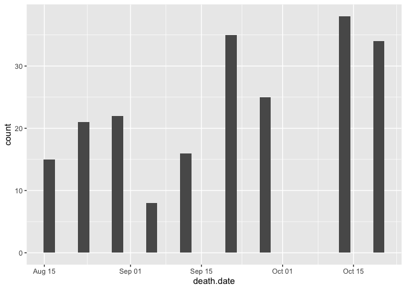
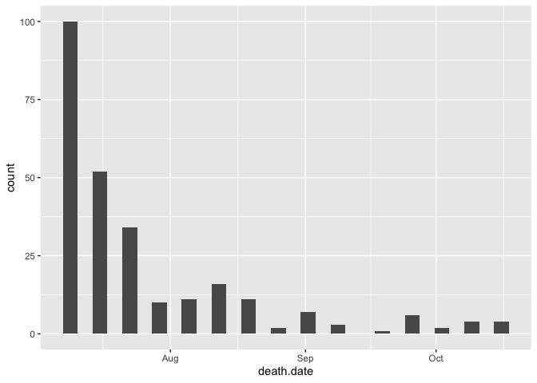
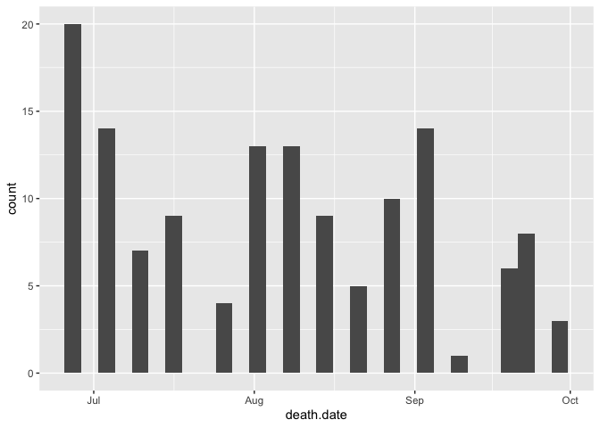
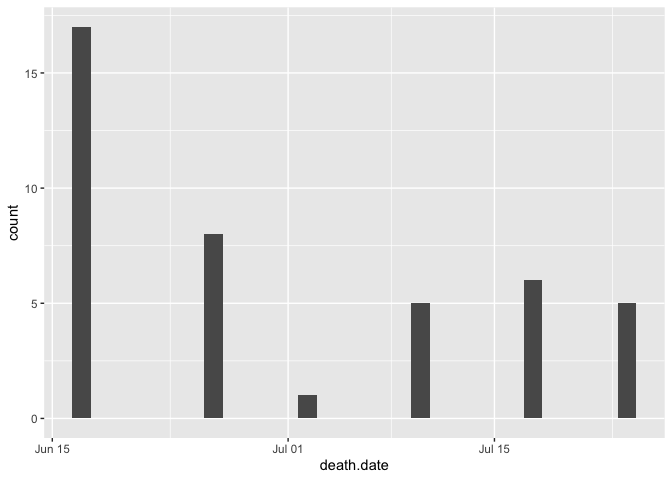
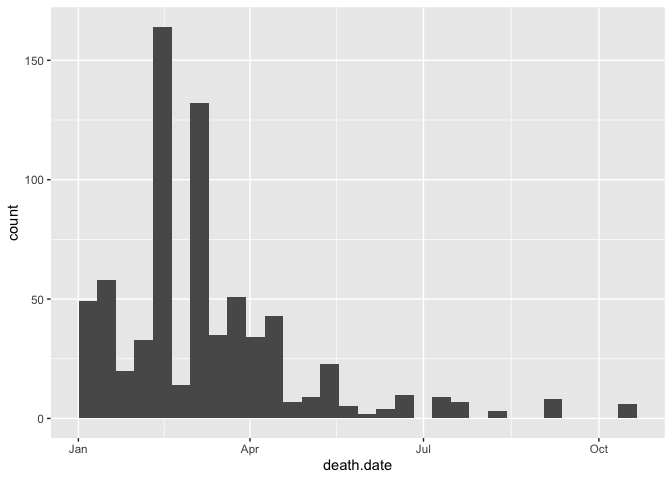
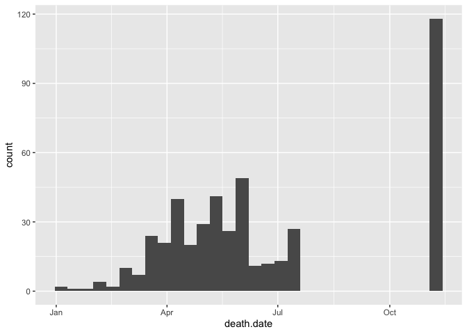

# Figuring out sample sizes for potential plasticity analysis

Potential Analyses:

-   Size post-establishment

-   Size at rep

-   Growth rate

-   Physiology?

-   Changes in above traits (plasticity) --\>/correspond with diffs in fitness?

## Libraries


``` r
library(tidyverse)
```

```
## ── Attaching core tidyverse packages ──────────────────────── tidyverse 2.0.0 ──
## ✔ dplyr     1.2.1     ✔ readr     2.2.0
## ✔ forcats   1.0.1     ✔ stringr   1.6.0
## ✔ ggplot2   4.0.2     ✔ tibble    3.3.1
## ✔ lubridate 1.9.5     ✔ tidyr     1.3.2
## ✔ purrr     1.2.2     
## ── Conflicts ────────────────────────────────────────── tidyverse_conflicts() ──
## ✖ dplyr::filter() masks stats::filter()
## ✖ dplyr::lag()    masks stats::lag()
## ℹ Use the conflicted package (<http://conflicted.r-lib.org/>) to force all conflicts to become errors
```

## WL2 data

### 2023

``` r
wl2_mortpheno_2023 <- read_csv("../../parent_pops_common-gardens/input/WL2_Data/CorrectedCSVs/WL2_mort_pheno_20231020_corrected.csv")
```

```
## Rows: 1826 Columns: 14
## ── Column specification ────────────────────────────────────────────────────────
## Delimiter: ","
## chr (12): block, bed, bed.col, pop, mf, rep, bud.date, flower.date, fruit.da...
## dbl  (1): bed.row
## lgl  (1): last.fruit.date
## 
## ℹ Use `spec()` to retrieve the full column specification for this data.
## ℹ Specify the column types or set `show_col_types = FALSE` to quiet this message.
```

``` r
wl2_mortpheno_2023_pops <- wl2_mortpheno_2023 %>% 
  select(block:rep, death.date) %>% 
  filter(pop!="buffer") %>% 
  filter(!str_detect(pop, "\\*")) %>% 
  mutate(pop=str_replace(pop, "0", "O")) %>% 
  mutate(mf=as.numeric(mf))

wl2_2023_est <- wl2_mortpheno_2023_pops %>% 
  mutate(death.date=mdy(death.date)) %>% 
  filter(death.date > "2023-08-10" | is.na(death.date)) #only keep indivs that established

wl2_2023_est %>% 
  ggplot(aes(death.date)) +
  geom_histogram()
```

```
## `stat_bin()` using `bins = 30`. Pick better value `binwidth`.
```

```
## Warning: Removed 515 rows containing non-finite outside the scale range
## (`stat_bin()`).
```

<!-- -->

### 2024

``` r
wl2_mortpheno_2024 <- read_csv("../input/WL2_2024_Data/CorrectedCSVs/WL2_mort_pheno_20241023_corrected.csv")
```

```
## Rows: 1217 Columns: 13
## ── Column specification ────────────────────────────────────────────────────────
## Delimiter: ","
## chr (12): block, bed, col, unique.ID, bud.date, flower.date, fruit.date, las...
## dbl  (1): row
## 
## ℹ Use `spec()` to retrieve the full column specification for this data.
## ℹ Specify the column types or set `show_col_types = FALSE` to quiet this message.
```

``` r
wl2_pop_info_2024 <- read_csv("../input/WL2_2024_Data/Final_2023_2024_Pop_Loc_Info.csv") %>% 
  select(Pop.Type:unique.ID) %>% 
  rename(row=bedrow, col=bedcol)
```

```
## Rows: 1217 Columns: 15
## ── Column specification ────────────────────────────────────────────────────────
## Delimiter: ","
## chr (8): Pop.Type, status, block, loc, bed, bedcol, pop, unique.ID
## dbl (7): bed.block.order, bed.order, AB.CD.order, column.order, bedrow, mf, rep
## 
## ℹ Use `spec()` to retrieve the full column specification for this data.
## ℹ Specify the column types or set `show_col_types = FALSE` to quiet this message.
```

``` r
wl2_mortpheno_2024_pops <- wl2_mortpheno_2024 %>% 
  select(bed:unique.ID, death.date, missing.date) %>% 
  left_join(wl2_pop_info_2024) %>% 
  filter(unique.ID!="buffer") %>% 
  filter(Pop.Type!="2023-TM2-fruit", Pop.Type!="2023-survivor") #keep only 2024 plants 
```

```
## Joining with `by = join_by(bed, row, col, unique.ID)`
```

``` r
wl2_2024_est <- wl2_mortpheno_2024_pops %>% 
  mutate(death.date=mdy(death.date), missing.date=mdy(missing.date)) %>% 
  filter(death.date > "2024-07-06" | is.na(death.date))

wl2_2024_est %>% 
  ggplot(aes(death.date)) +
  geom_histogram()
```

```
## `stat_bin()` using `bins = 30`. Pick better value `binwidth`.
```

```
## Warning: Removed 122 rows containing non-finite outside the scale range
## (`stat_bin()`).
```

<!-- -->

### 2025

``` r
wl2_mortpheno_2025 <- read_csv("../input/WL2_2025_Data/CorrectedCSVs/WL2_mort_pheno_20250929_corrected.csv")
```

```
## New names:
## Rows: 972 Columns: 13
## ── Column specification
## ──────────────────────────────────────────────────────── Delimiter: "," chr
## (12): bed, col, Unique.ID, bud.date, flower.date, fruit.date, last.FL.da... dbl
## (1): row
## ℹ Use `spec()` to retrieve the full column specification for this data. ℹ
## Specify the column types or set `show_col_types = FALSE` to quiet this message.
## • `` -> `...13`
```

``` r
wl2_pop_info_2025 <- read_csv("../input/WL2_2025_Data/2025_Pop_Loc_Info Updated.csv") %>% 
  select(status:Unique.ID)
```

```
## Rows: 976 Columns: 16
## ── Column specification ────────────────────────────────────────────────────────
## Delimiter: ","
## chr (10): status, block, bed, col, pop.id, mf, dame_mf, sire_mf, Unique.ID, ...
## dbl  (6): bed.block.order, bed.order, AB.CD.order, column.order, row, rep
## 
## ℹ Use `spec()` to retrieve the full column specification for this data.
## ℹ Specify the column types or set `show_col_types = FALSE` to quiet this message.
```

``` r
wl2_mortpheno_2025_pops <- wl2_mortpheno_2025 %>% 
  select(bed:Unique.ID, bud.date, death.date, survey.notes) %>% 
  left_join(wl2_pop_info_2025) %>% 
  filter(Unique.ID!="buffer", !is.na(Unique.ID)) %>% 
  filter(status=="available") %>% #only keep plants planted in 2025
  mutate(Pop.Type=if_else(str_detect(pop.id, "\\) x"), "F2",
                          if_else(str_detect(pop.id, "x"), "F1",
                                  "Parent"
                          ))) #define different pop types 
```

```
## Joining with `by = join_by(bed, row, col, Unique.ID)`
```

``` r
wl2_2025_est <- wl2_mortpheno_2025_pops %>% 
  mutate(deadatplanting = if_else(is.na(survey.notes), NA,
                                  if_else(survey.notes=="dead pre-planting" | 
                                            survey.notes=="dead at planting",
                                          "Yes", NA))) %>% 
  filter(is.na(deadatplanting)) %>% #remove plants that were dead at planting 
  select(-status, -deadatplanting, -survey.notes) %>% #remove unnecessary cols 
  mutate(death.date=mdy(death.date)) %>% #convert to date format 
  filter(death.date > "2025-06-21" | is.na(death.date))

wl2_2025_est %>% 
  ggplot(aes(death.date)) +
  geom_histogram()
```

```
## `stat_bin()` using `bins = 30`. Pick better value `binwidth`.
```

```
## Warning: Removed 479 rows containing non-finite outside the scale range
## (`stat_bin()`).
```

<!-- -->

### 2026

``` r
wl2_mortpheno_2026 <- read_csv("../input/WL2_2026_Data/CorrectedCSVs/WL2_mort_pheno_20260724_corrected.csv") %>% filter(Unique.ID!="buffer")
```

```
## New names:
## Rows: 838 Columns: 12
## ── Column specification
## ──────────────────────────────────────────────────────── Delimiter: "," chr
## (11): bed, col, Unique.ID, bud.date, flower.date, fruit.date, last.FL.da... dbl
## (1): row
## ℹ Use `spec()` to retrieve the full column specification for this data. ℹ
## Specify the column types or set `show_col_types = FALSE` to quiet this message.
## • `` -> `...12`
```

``` r
wl2_pop_info_2026 <- read_csv("../input/WL2_2026_Data/Buffer New Bed Map_Corrected.csv") %>% 
  select(pop.id:Rep, status, Type, Unique.ID) %>% filter(Unique.ID!="buffer")
```

```
## Rows: 838 Columns: 13
## ── Column specification ────────────────────────────────────────────────────────
## Delimiter: ","
## chr (11): pop.id, mf, dame_mf, sire_mf, bed, col, status, Type, block_2025, ...
## dbl  (2): Rep, row
## 
## ℹ Use `spec()` to retrieve the full column specification for this data.
## ℹ Specify the column types or set `show_col_types = FALSE` to quiet this message.
```

``` r
wl2_mortpheno_2026_pops <- wl2_mortpheno_2026 %>% 
  select(Unique.ID, death.date, survey.notes) %>% 
  left_join(wl2_pop_info_2026) %>% 
  filter(!is.na(Unique.ID)) %>% 
  filter(status=="available") %>%  #only keep plants planted in 2026
  mutate(Type=if_else(Unique.ID=="3755", "BC1", Type)) #add missing type info
```

```
## Joining with `by = join_by(Unique.ID)`
```

``` r
wl2_2026_est <- wl2_mortpheno_2026_pops %>% 
  filter(!str_detect(survey.notes, "dead at planting")) %>% 
  select(-survey.notes, -status) %>% 
  mutate(death.date=mdy(death.date)) %>% 
  filter(death.date > "2026-06-12" | is.na(death.date))

wl2_2026_est %>% 
  ggplot(aes(death.date)) +
  geom_histogram()
```

```
## `stat_bin()` using `bins = 30`. Pick better value `binwidth`.
```

```
## Warning: Removed 11 rows containing non-finite outside the scale range
## (`stat_bin()`).
```

<!-- -->

## UCD data

### 2023

``` r
ucd_mortpheno_2023 <- read_csv("../../parent_pops_common-gardens/input/UCD_Data/CorrectedCSVs/UCD_transplants_pheno_mort_20231016_corrected.csv") 
```

```
## Rows: 858 Columns: 13
## ── Column specification ────────────────────────────────────────────────────────
## Delimiter: ","
## chr (10): block, col, pop, Date First Bud, Date First Flower, Date First Fru...
## dbl  (3): row, mf, rep
## 
## ℹ Use `spec()` to retrieve the full column specification for this data.
## ℹ Specify the column types or set `show_col_types = FALSE` to quiet this message.
```

``` r
ucd_mortpheno_2023_pops <- ucd_mortpheno_2023 %>% 
  select(block:rep, death.date=`Death Date`) %>% 
  filter(pop!="buffer") %>% 
  filter(rep != 100) #get rid of individuals that germinated in the field  

ucd_2023_est <- ucd_mortpheno_2023_pops %>% 
  mutate(death.date=mdy(death.date)) %>% 
  filter(death.date > "2022-12-24" | is.na(death.date)) #keep indivs that established

ucd_2023_est %>% 
  ggplot(aes(death.date)) +
  geom_histogram()
```

```
## `stat_bin()` using `bins = 30`. Pick better value `binwidth`.
```

```
## Warning: Removed 9 rows containing non-finite outside the scale range
## (`stat_bin()`).
```

<!-- -->

### 2024

``` r
ucd_mortpheno_2024 <- read_csv("../input/UCD2023_2024_Data/CorrectedCSVs/UCD_mort_pheno_20241108_corrected.csv") 
```

```
## Rows: 1104 Columns: 13
## ── Column specification ────────────────────────────────────────────────────────
## Delimiter: ","
## chr (12): bed, col, unique.ID, bud.date, flower.date, fruit.date, last.FL.da...
## dbl  (1): row
## 
## ℹ Use `spec()` to retrieve the full column specification for this data.
## ℹ Specify the column types or set `show_col_types = FALSE` to quiet this message.
```

``` r
ucd_pop_info_2024 <- read_csv("../input/UCD2023_2024_Data/Genotypes_2023_2024.csv") %>%
  rename(col=column)
```

```
## Rows: 1104 Columns: 10
## ── Column specification ────────────────────────────────────────────────────────
## Delimiter: ","
## chr (5): Plant Type, pop.id, bed, block, column
## dbl (5): mf, rep, rack, unique.ID, row
## 
## ℹ Use `spec()` to retrieve the full column specification for this data.
## ℹ Specify the column types or set `show_col_types = FALSE` to quiet this message.
```

``` r
ucd_mortpheno_2024_pops <- ucd_mortpheno_2024 %>% 
  mutate(unique.ID=as.numeric(unique.ID)) %>% 
  select(bed:unique.ID, death.date, missing.date) %>% 
  left_join(ucd_pop_info_2024) %>% 
  filter(unique.ID!="buffer") %>% 
  filter(unique.ID!=2032) %>%  #REMOVE PLANT 2032 (BED F-39-A) - MULTIPLE PLANTS WERE GROWING IN THAT SPOT. 
  mutate(pop.id=if_else(str_detect(pop.id, "WL2-"), "WL2",
                        if_else(str_detect(pop.id, "TM2-"), "TM2",
                                pop.id))) #remove mf from pop name of WL2 and TM2 plants 
```

```
## Warning: There was 1 warning in `mutate()`.
## ℹ In argument: `unique.ID = as.numeric(unique.ID)`.
## Caused by warning:
## ! NAs introduced by coercion
```

```
## Joining with `by = join_by(bed, row, col, unique.ID)`
```

``` r
ucd_2024_est <- ucd_mortpheno_2024_pops %>% 
  mutate(death.date=mdy(death.date), missing.date=mdy(missing.date)) %>% 
  filter(death.date > "2023-12-29" | is.na(death.date))

ucd_2024_est %>% 
  ggplot(aes(death.date)) +
  geom_histogram()
```

```
## `stat_bin()` using `bins = 30`. Pick better value `binwidth`.
```

```
## Warning: Removed 555 rows containing non-finite outside the scale range
## (`stat_bin()`).
```

<!-- -->

## Summaries

``` r
wl2_2023_popmfs <- wl2_2023_est %>% 
  group_by(pop, mf) %>% 
  summarise(WL2_2023=n()) %>% 
  filter(WL2_2023>2) #remove pop-mf combos with few indivs
```

```
## `summarise()` has regrouped the output.
## ℹ Summaries were computed grouped by pop and mf.
## ℹ Output is grouped by pop.
## ℹ Use `summarise(.groups = "drop_last")` to silence this message.
## ℹ Use `summarise(.by = c(pop, mf))` for per-operation grouping
##   (`?dplyr::dplyr_by`) instead.
```

``` r
unique(wl2_2023_est$pop) #22 pops with establishment 
```

```
##  [1] "TM2"   "CC"    "CP2"   "IH"    "CP3"   "SQ2"   "YO11"  "BH"    "LVTR1"
## [10] "SQ3"   "WL2"   "FR"    "WL1"   "YO4"   "SC"    "DPR"   "YO7"   "LV1"  
## [19] "LV3"   "YO8"   "SQ1"   "WR"
```

``` r
wl2_2024_pops <- wl2_2024_est %>% 
  group_by(Pop.Type, pop) %>% 
  summarise(WL2_2024=n()) %>% 
  filter(WL2_2024>2) #remove pops/crosses with few indivs
```

```
## `summarise()` has regrouped the output.
## ℹ Summaries were computed grouped by Pop.Type and pop.
## ℹ Output is grouped by Pop.Type.
## ℹ Use `summarise(.groups = "drop_last")` to silence this message.
## ℹ Use `summarise(.by = c(Pop.Type, pop))` for per-operation grouping
##   (`?dplyr::dplyr_by`) instead.
```

``` r
wl2_2024_est %>% filter(Pop.Type=="Parent") %>% select(pop) %>% distinct() %>% pull() #10 parent pops with establishment (only planted 10 starting this year)
```

```
##  [1] "BH"   "CC"   "TM2"  "WV"   "WL2"  "LV1"  "WL1"  "DPR"  "SQ3"  "YO11"
```

``` r
wl2_2025_popmfs <- wl2_2025_est %>% 
  rename(pop=pop.id) %>% 
  group_by(Pop.Type, pop, mf) %>% 
  summarise(WL2_2025=n()) %>% 
  filter(WL2_2025>2) #remove pop-mf combos with few indivs
```

```
## `summarise()` has regrouped the output.
## ℹ Summaries were computed grouped by Pop.Type, pop, and mf.
## ℹ Output is grouped by Pop.Type and pop.
## ℹ Use `summarise(.groups = "drop_last")` to silence this message.
## ℹ Use `summarise(.by = c(Pop.Type, pop, mf))` for per-operation grouping
##   (`?dplyr::dplyr_by`) instead.
```

``` r
wl2_2025_est %>% filter(Pop.Type=="Parent") %>% select(pop.id) %>% distinct() %>% pull() #10 parent pops with establishment
```

```
##  [1] "TM2"  "WL1"  "WL2"  "SQ3"  "DPR"  "WV"   "BH"   "CC"   "YO11" "LV1"
```

``` r
wl2_2026_popmfs <- wl2_2026_est %>% 
  rename(pop=pop.id, Pop.Type=Type) %>% 
  group_by(Pop.Type, pop, mf) %>% 
  summarise(WL2_2026=n()) %>% 
  filter(WL2_2026>2) #remove pop-mf combos with few indivs
```

```
## `summarise()` has regrouped the output.
## ℹ Summaries were computed grouped by Pop.Type, pop, and mf.
## ℹ Output is grouped by Pop.Type and pop.
## ℹ Use `summarise(.groups = "drop_last")` to silence this message.
## ℹ Use `summarise(.by = c(Pop.Type, pop, mf))` for per-operation grouping
##   (`?dplyr::dplyr_by`) instead.
```

``` r
#above only leaves 3 BC1s and no parents so just summarize by pop instead
wl2_2026_pops <- wl2_2026_est %>% 
  rename(pop=pop.id, Pop.Type=Type) %>% 
  group_by(Pop.Type, pop) %>% 
  summarise(WL2_2026=n()) %>% 
  filter(WL2_2026>2) 
```

```
## `summarise()` has regrouped the output.
## ℹ Summaries were computed grouped by Pop.Type and pop.
## ℹ Output is grouped by Pop.Type.
## ℹ Use `summarise(.groups = "drop_last")` to silence this message.
## ℹ Use `summarise(.by = c(Pop.Type, pop))` for per-operation grouping
##   (`?dplyr::dplyr_by`) instead.
```

``` r
wl2_2026_est %>% filter(Type=="Parent") %>% select(pop.id) %>% distinct() %>% pull() #7 parent pops with establishment
```

```
## [1] "WL2" "DPR" "TM2" "WL1" "BH"  "LV1" "SQ3"
```

``` r
ucd_2023_popmfs <- ucd_2023_est %>% 
  group_by(pop, mf) %>% 
  summarise(UCD_2023=n()) %>% 
  filter(UCD_2023>2) #remove pop-mf combos with few indivs
```

```
## `summarise()` has regrouped the output.
## ℹ Summaries were computed grouped by pop and mf.
## ℹ Output is grouped by pop.
## ℹ Use `summarise(.groups = "drop_last")` to silence this message.
## ℹ Use `summarise(.by = c(pop, mf))` for per-operation grouping
##   (`?dplyr::dplyr_by`) instead.
```

``` r
unique(ucd_2023_est$pop) #23 pops with establishment 
```

```
##  [1] "WL2"   "CP2"   "YO11"  "CC"    "FR"    "BH"    "IH"    "LV3"   "SC"   
## [10] "LVTR1" "SQ3"   "TM2"   "WL1"   "YO7"   "DPR"   "SQ2"   "SQ1"   "YO8"  
## [19] "YO4"   "WR"    "WV"    "CP3"   "LV1"
```

``` r
ucd_2024_popmfs <- ucd_2024_est %>% 
  rename(pop=pop.id, Pop.Type=`Plant Type`) %>% 
  group_by(Pop.Type, pop, mf) %>% 
  summarise(UCD_2024=n()) %>% 
  filter(UCD_2024>2) #remove pop-mf combos with few indivs
```

```
## `summarise()` has regrouped the output.
## ℹ Summaries were computed grouped by Pop.Type, pop, and mf.
## ℹ Output is grouped by Pop.Type and pop.
## ℹ Use `summarise(.groups = "drop_last")` to silence this message.
## ℹ Use `summarise(.by = c(Pop.Type, pop, mf))` for per-operation grouping
##   (`?dplyr::dplyr_by`) instead.
```

``` r
ucd_2024_est %>% filter(str_detect(`Plant Type`, "Parent")) %>% select(pop.id) %>% distinct() %>% pull() #10 parent pops with establishment
```

```
##  [1] "WL2"  "WV"   "LV1"  "WL1"  "TM2"  "CC"   "DPR"  "YO11" "BH"   "SQ3"
```

## Spatial Plasticity

### 2023 WL2 vs. 2023 UCD (Pops and mfs)


``` r
wl2_ucd_2023 <- wl2_2023_popmfs %>% 
  left_join(ucd_2023_popmfs) %>% 
  filter(!is.na(UCD_2023)) #only keep pop/mfs with match at UCD
```

```
## Joining with `by = join_by(pop, mf)`
```

``` r
dim(wl2_ucd_2023) #52 pop/mfs
```

```
## [1] 52  4
```

``` r
unique(wl2_ucd_2023$pop) #19 pops 
```

```
##  [1] "BH"    "CC"    "CP2"   "DPR"   "FR"    "IH"    "LV3"   "LVTR1" "SC"   
## [10] "SQ1"   "SQ2"   "SQ3"   "TM2"   "WL1"   "WL2"   "WR"    "YO11"  "YO7"  
## [19] "YO8"
```

``` r
wl2_ucd_2023 %>% 
  group_by(pop) %>% 
  summarise(TotalMfs=n()) %>% 
  arrange(TotalMfs)
```

```
## # A tibble: 19 × 2
##    pop   TotalMfs
##    <chr>    <int>
##  1 FR           1
##  2 LV3          1
##  3 SQ1          1
##  4 WR           1
##  5 YO7          1
##  6 YO8          1
##  7 DPR          2
##  8 LVTR1        2
##  9 SQ2          2
## 10 SQ3          2
## 11 YO11         2
## 12 WL1          3
## 13 WL2          3
## 14 IH           4
## 15 SC           4
## 16 CC           5
## 17 CP2          5
## 18 TM2          5
## 19 BH           7
```

### 2023 WL2 vs. 2024 UCD (Pops and mfs)


``` r
wl2_2023_ucd_2024 <- wl2_2023_popmfs %>% 
  left_join(ucd_2024_popmfs) %>% 
  filter(!is.na(UCD_2024)) %>% 
  select(-Pop.Type)
```

```
## Joining with `by = join_by(pop, mf)`
```

``` r
dim(wl2_2023_ucd_2024) #24 pop/mfs
```

```
## [1] 24  4
```

``` r
unique(wl2_2023_ucd_2024$pop) #7 pops 
```

```
## [1] "BH"   "CC"   "DPR"  "TM2"  "WL1"  "WL2"  "YO11"
```

``` r
wl2_2023_ucd_2024 %>% 
  group_by(pop) %>% 
  summarise(TotalMfs=n()) %>% 
  arrange(TotalMfs)
```

```
## # A tibble: 7 × 2
##   pop   TotalMfs
##   <chr>    <int>
## 1 CC           1
## 2 YO11         1
## 3 WL1          2
## 4 WL2          3
## 5 DPR          4
## 6 TM2          6
## 7 BH           7
```

### 2024 WL2 vs. 2024 UCD (Pops only)


``` r
ucd_2024_popmfs_prep <- ucd_2024_est %>% 
  rename(pop=pop.id, Pop.Type=`Plant Type`) %>% 
  mutate(Pop.Type=if_else(str_detect(Pop.Type, "Parent"), "Parent", 
                          Pop.Type)) %>% #change to match wl2_2024
  group_by(Pop.Type, pop) %>% #don't group by mf since no mf for wl2_2024 
  summarise(UCD_2024=n()) %>% 
  filter(UCD_2024>2) 
```

```
## `summarise()` has regrouped the output.
## ℹ Summaries were computed grouped by Pop.Type and pop.
## ℹ Output is grouped by Pop.Type.
## ℹ Use `summarise(.groups = "drop_last")` to silence this message.
## ℹ Use `summarise(.by = c(Pop.Type, pop))` for per-operation grouping
##   (`?dplyr::dplyr_by`) instead.
```

``` r
wl2_ucd_2024 <- wl2_2024_pops %>% 
  left_join(ucd_2024_popmfs_prep) %>% 
  filter(!is.na(UCD_2024)) 
```

```
## Joining with `by = join_by(Pop.Type, pop)`
```

``` r
dim(wl2_ucd_2024) #45 pops/cross types 
```

```
## [1] 16  4
```

``` r
wl2_ucd_2024 %>% 
  group_by(Pop.Type) %>% 
  summarise(Total=n()) #7 parent pops, 6 F1s, 3 F2s 
```

```
## # A tibble: 3 × 2
##   Pop.Type Total
##   <chr>    <int>
## 1 F1           6
## 2 F2           3
## 3 Parent       7
```

### 2025 WL2 vs. 2024 UCD (Pops and mfs)


``` r
wl2_2025_popmfs_prep <- 
  wl2_2025_est %>% 
  rename(pop=pop.id) %>% 
  mutate(mf=if_else(Pop.Type=="Parent", mf, 
                    NA)) %>% #only keep mfs for parents since that's the mf info we have for ucd_2024
  group_by(Pop.Type, pop, mf) %>% 
  summarise(WL2_2025=n()) %>% 
  filter(WL2_2025>2) %>% 
  mutate(mf=as.numeric(mf))
```

```
## `summarise()` has regrouped the output.
## ℹ Summaries were computed grouped by Pop.Type, pop, and mf.
## ℹ Output is grouped by Pop.Type and pop.
## ℹ Use `summarise(.groups = "drop_last")` to silence this message.
## ℹ Use `summarise(.by = c(Pop.Type, pop, mf))` for per-operation grouping
##   (`?dplyr::dplyr_by`) instead.
```

``` r
wl2_2025_ucd_2024 <- wl2_2025_popmfs_prep %>% 
  left_join(ucd_2024_popmfs, join_by(pop,mf)) %>% 
  filter(!is.na(UCD_2024)) %>% 
  select(Pop.Type=Pop.Type.x, pop:WL2_2025, UCD_2024)
dim(wl2_2025_ucd_2024) #20 pops/cross types 
```

```
## [1] 20  5
```

``` r
wl2_2025_ucd_2024 %>% 
  group_by(Pop.Type) %>% 
  summarise(Total=n()) #9 F1s 
```

```
## # A tibble: 2 × 2
##   Pop.Type Total
##   <chr>    <int>
## 1 F1           9
## 2 Parent      11
```

``` r
wl2_2025_ucd_2024 %>% filter(Pop.Type=="Parent") %>% select(pop) %>% distinct() %>% pull() #4 parent pops 
```

```
## [1] "BH"  "TM2" "WL1" "WL2"
```

### 2026 WL2 vs. 2024 UCD (Pops and mfs)


``` r
wl2_2026_ucd_2024 <- wl2_2026_pops %>% 
  left_join(ucd_2024_popmfs_prep) %>% 
  filter(!is.na(UCD_2024))
```

```
## Joining with `by = join_by(Pop.Type, pop)`
```

``` r
dim(wl2_2026_ucd_2024) #only 3 pops
```

```
## [1] 3 4
```

``` r
unique(wl2_2026_ucd_2024$pop) 
```

```
## [1] "SQ3" "TM2" "WL2"
```

## Temporal Plasticity

### UCD: 2023, 2024 (Pops and mfs)


``` r
ucd_temporal <- ucd_2023_popmfs %>% 
  left_join(ucd_2024_popmfs) %>% 
  filter(!is.na(UCD_2024))
```

```
## Joining with `by = join_by(pop, mf)`
```

``` r
dim(ucd_temporal) #22 pop/mfs
```

```
## [1] 22  5
```

``` r
unique(ucd_temporal$pop) #6 pops 
```

```
## [1] "BH"  "CC"  "DPR" "TM2" "WL1" "WL2"
```

``` r
ucd_temporal %>% 
  group_by(pop) %>% 
  summarise(TotalMfs=n()) %>% 
  arrange(TotalMfs)
```

```
## # A tibble: 6 × 2
##   pop   TotalMfs
##   <chr>    <int>
## 1 CC           1
## 2 WL2          2
## 3 DPR          3
## 4 WL1          3
## 5 TM2          6
## 6 BH           7
```

### WL2: 2023, 2024 (pops only), 2025, 2026 (pops only)


``` r
wl2_2023_2025_popmfs <- wl2_2023_popmfs %>% 
  mutate(mf=as.character(mf)) %>% 
  left_join(wl2_2025_popmfs) %>% 
  filter(!is.na(WL2_2025))
```

```
## Joining with `by = join_by(pop, mf)`
```

``` r
dim(wl2_2023_2025_popmfs) #13 pop/mfs 
```

```
## [1] 13  5
```

``` r
unique(wl2_2023_2025_popmfs$pop) #5 pops 
```

```
## [1] "BH"   "CC"   "TM2"  "WL2"  "YO11"
```

``` r
wl2_2023_2025_popmfs %>% 
  group_by(pop) %>% 
  summarise(TotalMfs=n()) %>% 
  arrange(TotalMfs)
```

```
## # A tibble: 5 × 2
##   pop   TotalMfs
##   <chr>    <int>
## 1 CC           1
## 2 YO11         1
## 3 BH           2
## 4 TM2          2
## 5 WL2          7
```


``` r
wl2_2023_popmfs_prep <- wl2_2023_est %>% 
  group_by(pop) %>% 
  summarise(WL2_2023=n()) %>% 
  filter(WL2_2023>2) 
wl2_2025_popmfs_prep <- wl2_2025_est %>%
  rename(pop=pop.id) %>% 
  group_by(pop) %>% 
  summarise(WL2_2025=n()) %>% 
  filter(WL2_2025>2)

wl2_temporal_pops <- wl2_2023_popmfs_prep %>% 
  left_join(wl2_2024_pops) %>% 
  select(-Pop.Type) %>% 
  left_join(wl2_2025_popmfs_prep) %>% 
  left_join(wl2_2026_pops) %>% 
  select(-Pop.Type) %>% 
  filter(pop=="BH" | pop=="CC" | pop=="DPR" | pop=="LV1" | 
         pop=="SQ3" | pop=="TM2" | pop=="WL1" | pop=="WL2" | pop=="YO11") #remove pops that aren't in any of the 2024, 2025, or 2026 gardens 
```

```
## Joining with `by = join_by(pop)`
## Joining with `by = join_by(pop)`
## Joining with `by = join_by(pop)`
```

``` r
wl2_temporal_pops
```

```
## # A tibble: 9 × 5
##   pop   WL2_2023 WL2_2024 WL2_2025 WL2_2026
##   <chr>    <int>    <int>    <int>    <int>
## 1 BH          56       15        8       NA
## 2 CC          60       NA        4       NA
## 3 DPR         43        5        9       NA
## 4 LV1         24        3       NA       NA
## 5 SQ3         13       NA       14        3
## 6 TM2         43       38       45        8
## 7 WL1         31       10       20       NA
## 8 WL2         52       31       46        7
## 9 YO11        35       NA        3       NA
```


``` r
wl2_temporal_cross_gardens <- wl2_2024_pops %>% 
  full_join(wl2_2025_popmfs_prep) %>% 
  full_join(wl2_2026_pops)
```

```
## Joining with `by = join_by(pop)`
## Joining with `by = join_by(Pop.Type, pop)`
```

``` r
wl2_temporal_cross_gardens %>% filter(!is.na(WL2_2025)) %>% filter(!is.na(WL2_2024)) #18 pops/cross types overlap b/t 2024 and 2025 
```

```
## # A tibble: 18 × 5
## # Groups:   Pop.Type [3]
##    Pop.Type pop                        WL2_2024 WL2_2025 WL2_2026
##    <chr>    <chr>                         <int>    <int>    <int>
##  1 F1       LV1 x WL2                         8        9       NA
##  2 F1       SQ3 x WL2                         4        5       NA
##  3 F1       TM2 x WL2                         3       13       NA
##  4 F2       (LV1 x WL2) x (WL2)              12        6       NA
##  5 F2       (LV1 x WL2) x (YO11 x WL2)        4        4       NA
##  6 F2       (SQ3 x WL2) x (WL2)               5       25       NA
##  7 F2       (TM2 x WL2) x (TM2)               5       19       NA
##  8 F2       (WL2 x BH) x (WL2 x TM2)          6       15       NA
##  9 F2       (WL2 x TM2) x (CC x TM2)          8        8       NA
## 10 F2       (WV x WL2) x (WV)                 8        9       NA
## 11 F2       (WV) x (WV x WL2)                11        9       NA
## 12 F2       (YO11 x WL2) x (WL2)              3        3       NA
## 13 Parent   BH                               15        8       NA
## 14 Parent   DPR                               5        9       NA
## 15 Parent   TM2                              38       45        8
## 16 Parent   WL1                              10       20       NA
## 17 Parent   WL2                              31       46        7
## 18 Parent   WV                                3       15       NA
```

``` r
#3 F1s, 9 F2s, 6 parents

wl2_temporal_cross_gardens %>% filter(!is.na(WL2_2026)) #only 2026 overlap is with WL2 and TM2 for 2024 and 2025
```

```
## # A tibble: 8 × 5
## # Groups:   Pop.Type [2]
##   Pop.Type pop               WL2_2024 WL2_2025 WL2_2026
##   <chr>    <chr>                <int>    <int>    <int>
## 1 Parent   TM2                     38       45        8
## 2 Parent   WL2                     31       46        7
## 3 BC1      (DPR X WL2) X WL2       NA       NA        3
## 4 BC1      (WL1 X WL2) X WL2       NA       NA        5
## 5 BC1      (WL2 X CC) X WL2        NA       NA        4
## 6 BC1      (WL2 X DPR) X WL2       NA       NA        3
## 7 BC1      (WL2 X WL1) X WL2       NA       NA        5
## 8 Parent   SQ3                     NA       NA        3
```

