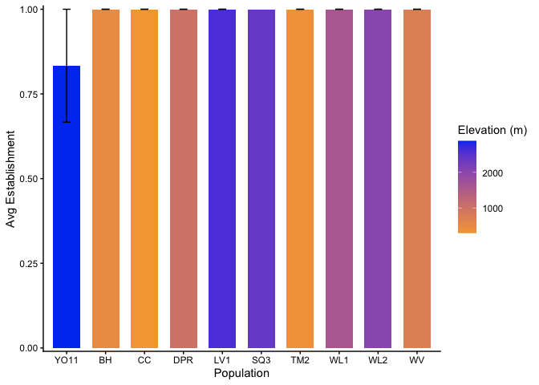
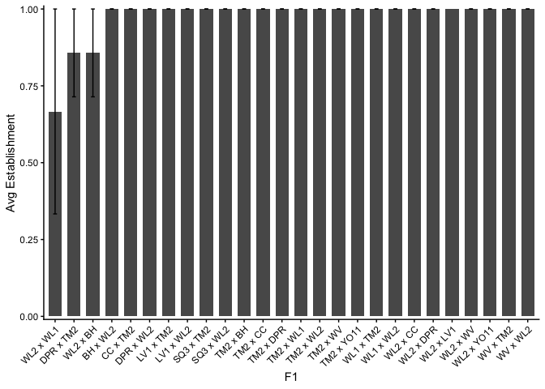
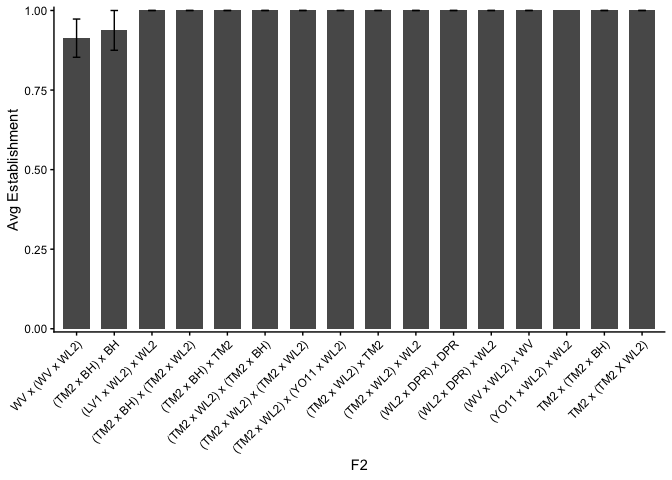
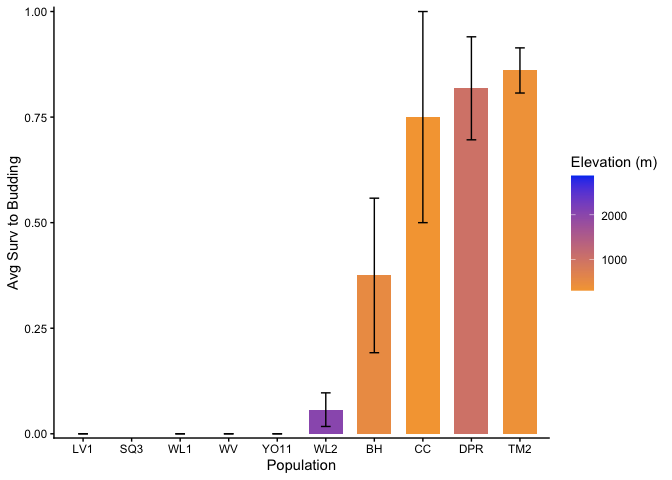
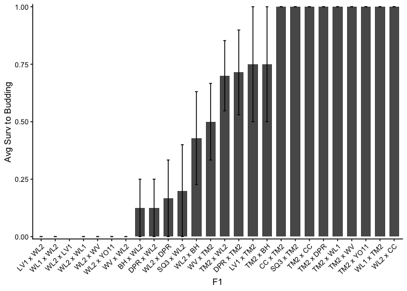
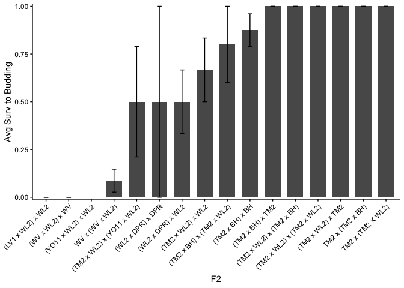
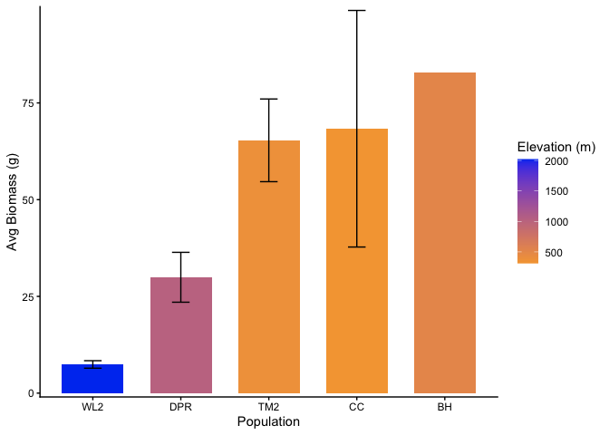
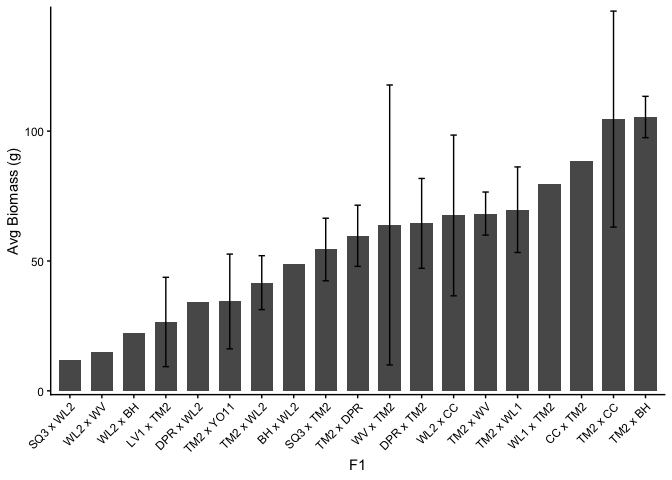
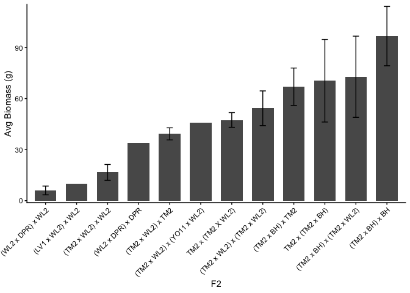

# Total Fitness for UCD 2023-2024 Garden

Will need to add fruit+seed mass once it's measured for all plants

## Libraries


``` r
library(tidyverse)
```

```
## ── Attaching core tidyverse packages ──────────────────────── tidyverse 2.0.0 ──
## ✔ dplyr     1.2.1     ✔ readr     2.2.0
## ✔ forcats   1.0.1     ✔ stringr   1.6.0
## ✔ ggplot2   4.0.2     ✔ tibble    3.3.1
## ✔ lubridate 1.9.5     ✔ tidyr     1.3.2
## ✔ purrr     1.2.2     
## ── Conflicts ────────────────────────────────────────── tidyverse_conflicts() ──
## ✖ dplyr::filter() masks stats::filter()
## ✖ dplyr::lag()    masks stats::lag()
## ℹ Use the conflicted package (<http://conflicted.r-lib.org/>) to force all conflicts to become errors
```

``` r
sem <- function(x, na.rm=FALSE) {  #for calculating standard error
  sd(x,na.rm=na.rm)/sqrt(length(na.omit(x)))
} 
```

## Read in data

``` r
ucd_surv <- read_csv("../input/UCD2023_2024_Data/CorrectedCSVs/UCD_mort_pheno_20241108_corrected.csv")
```

```
## Rows: 1104 Columns: 13
## ── Column specification ────────────────────────────────────────────────────────
## Delimiter: ","
## chr (12): bed, col, unique.ID, bud.date, flower.date, fruit.date, last.FL.da...
## dbl  (1): row
## 
## ℹ Use `spec()` to retrieve the full column specification for this data.
## ℹ Specify the column types or set `show_col_types = FALSE` to quiet this message.
```

``` r
ucd_biomass <- read_csv("../input/UCD2023_2024_Data/CorrectedCSVs/UCD_Biomass_20250723_corrected.csv") %>% 
  mutate(unique.ID=as.character(unique.ID))
```

```
## Rows: 537 Columns: 7
## ── Column specification ────────────────────────────────────────────────────────
## Delimiter: ","
## chr (4): date.collected, person.meas, date.meas, survey.notes
## dbl (3): unique.ID, total.biomass_g, total.seed.mass_g
## 
## ℹ Use `spec()` to retrieve the full column specification for this data.
## ℹ Specify the column types or set `show_col_types = FALSE` to quiet this message.
```

## Pop Info

``` r
ucd_popinfo <- read_csv("../input/UCD2023_2024_Data/Genotypes_2023_2024.csv") %>% 
  mutate(unique.ID=as.character(unique.ID))
```

```
## Rows: 1104 Columns: 10
## ── Column specification ────────────────────────────────────────────────────────
## Delimiter: ","
## chr (5): Plant Type, pop.id, bed, block, column
## dbl (5): mf, rep, rack, unique.ID, row
## 
## ℹ Use `spec()` to retrieve the full column specification for this data.
## ℹ Specify the column types or set `show_col_types = FALSE` to quiet this message.
```

## Elevation Info / Climate distance

``` r
ucd_clim_dist <- read_csv("../output/Climate/UCD_2024_Clim_Dist.csv") %>% select(-conf.low, -conf.high)
```

```
## Rows: 20 Columns: 14
## ── Column specification ────────────────────────────────────────────────────────
## Delimiter: ","
## chr  (4): parent.pop, elevation.group, timeframe, Season
## dbl (10): elev_m, Lat, Long, Year, Gowers_Dist, conf.low, conf.high, UCD_Lat...
## 
## ℹ Use `spec()` to retrieve the full column specification for this data.
## ℹ Specify the column types or set `show_col_types = FALSE` to quiet this message.
```

``` r
head(ucd_clim_dist)
```

```
## # A tibble: 6 × 12
##   parent.pop elevation.group elev_m   Lat  Long timeframe Season      Year
##   <chr>      <chr>            <dbl> <dbl> <dbl> <chr>     <chr>      <dbl>
## 1 BH         low               511.  37.4 -120. Recent    Water Year  2024
## 2 CC         low               313   39.6 -121. Recent    Water Year  2024
## 3 TM2        low               379.  39.6 -122. Recent    Water Year  2024
## 4 DPR        mid              1019.  39.2 -121. Recent    Water Year  2024
## 5 WV         mid               749.  40.7 -123. Recent    Water Year  2024
## 6 WL1        mid              1614.  38.8 -120. Recent    Water Year  2024
## # ℹ 4 more variables: Gowers_Dist <dbl>, UCD_Lat <dbl>, UCD_Long <dbl>,
## #   Geographic_Dist <dbl>
```

``` r
ucd_clim_dist_wide <- ucd_clim_dist %>% 
  pivot_wider(names_from = timeframe, values_from = Gowers_Dist, names_prefix = "GD_") %>% 
  rename(pop.id=parent.pop)
```

## Combine all fitness metrics

``` r
ucd_totalfit <- ucd_surv %>% 
  filter(!is.na(unique.ID), unique.ID!="buffer") %>% 
  filter(is.na(missing.date)) %>% #remove plants that went missing (usually caused by crows)
  filter(survey.notes!="dead at planting") %>% #remove plants that were dead at planting 
  mutate(death.date=mdy(death.date), bud.date=mdy(bud.date)) %>% 
  mutate(Establishment = if_else(is.na(death.date), 1, 
                                 if_else(death.date < "2023-12-29", 0, 1)),
         SurvtoBud = if_else(!is.na(bud.date), 1, 0)) %>% 
  select(bed:bud.date, death.date, Establishment, SurvtoBud) %>% 
  left_join(ucd_biomass) %>% 
  select(-date.collected, -person.meas, -date.meas, -total.seed.mass_g, -survey.notes) %>% 
  left_join(ucd_popinfo) %>% 
  select(-rack, -column) %>% 
  rename(Pop.Type=`Plant Type`) %>% 
  mutate(Pop.Type=if_else(str_detect(Pop.Type, "Parent"), "Parent", Pop.Type)) %>% 
  mutate(pop.id=if_else(str_detect(pop.id, "WL2-"), "WL2",
                        if_else(str_detect(pop.id, "TM2-"), "TM2",
                                pop.id))) #remove mf from pop name of WL2 and TM2 plants 
```

```
## Joining with `by = join_by(unique.ID)`
## Joining with `by = join_by(bed, row, unique.ID)`
```

## Means

``` r
ucd_totalfit_summary <- ucd_totalfit %>% 
  group_by(Pop.Type, pop.id) %>% 
  summarise(meanEst=mean(Establishment, na.rm=TRUE), semEst=sem(Establishment, na.rm = TRUE),
            meanSurvtoBud=mean(SurvtoBud, na.rm=TRUE), semSurvtoBud=sem(SurvtoBud, na.rm = TRUE),
            meanBiomass=mean(total.biomass_g, na.rm=TRUE), semBiomass=sem(total.biomass_g, na.rm = TRUE))
```

```
## `summarise()` has regrouped the output.
## ℹ Summaries were computed grouped by Pop.Type and pop.id.
## ℹ Output is grouped by Pop.Type.
## ℹ Use `summarise(.groups = "drop_last")` to silence this message.
## ℹ Use `summarise(.by = c(Pop.Type, pop.id))` for per-operation grouping
##   (`?dplyr::dplyr_by`) instead.
```

``` r
ucd_totalfit_summary
```

```
## # A tibble: 52 × 8
## # Groups:   Pop.Type [3]
##    Pop.Type pop.id    meanEst semEst meanSurvtoBud semSurvtoBud meanBiomass
##    <chr>    <chr>       <dbl>  <dbl>         <dbl>        <dbl>       <dbl>
##  1 F1       BH x WL2    1      0             0.125        0.125        48.9
##  2 F1       CC x TM2    1      0             1            0            88.5
##  3 F1       DPR x TM2   0.857  0.143         0.714        0.184        64.5
##  4 F1       DPR x WL2   1      0             0.125        0.125        34.0
##  5 F1       LV1 x TM2   1      0             0.75         0.25         26.5
##  6 F1       LV1 x WL2   1      0             0            0           NaN  
##  7 F1       SQ3 x TM2   1      0             1            0            54.4
##  8 F1       SQ3 x WL2   1      0             0.2          0.2          12.0
##  9 F1       TM2 x BH    1      0             0.75         0.25        105. 
## 10 F1       TM2 x CC    1      0             1            0           105. 
## # ℹ 42 more rows
## # ℹ 1 more variable: semBiomass <dbl>
```

``` r
#uniqueID - date collected
#200 - 7/18
#206 - 6/28 (we have biomass for this one)
#210 - 7/11
#216 - vegetative - 6/10
#212 - vegetative - no date
#208 - vegetative - no date 
#214 - vegetative - no date 
#207 - went missing?
```

## Quick Figures

### Establishment

``` r
ucd_totalfit_summary %>% 
  filter(Pop.Type=="Parent") %>% 
  left_join(ucd_clim_dist_wide) %>% 
  ggplot(aes(x=fct_reorder(pop.id, meanEst), y=meanEst, fill=elev_m)) +
  geom_col(width = 0.7,position = position_dodge(0.75)) +
  geom_errorbar(aes(ymin=meanEst-semEst,
                    ymax=meanEst+semEst),width=.2, 
                position =position_dodge(0.75)) +
  labs(x="Population", y="Avg Establishment", fill="Elevation (m)") +
  scale_y_continuous(expand = c(0.01, 0)) +
  scale_fill_gradient(low = "#F5A540", high = "#0043F0") +
  theme_classic()
```

```
## Joining with `by = join_by(pop.id)`
```

<!-- -->

``` r
ucd_totalfit_summary %>% 
  filter(Pop.Type=="F1") %>% 
  ggplot(aes(x=fct_reorder(pop.id, meanEst), y=meanEst)) +
  geom_col(width = 0.7,position = position_dodge(0.75)) +
  geom_errorbar(aes(ymin=meanEst-semEst,
                    ymax=meanEst+semEst),
                width=.2, position =position_dodge(0.75)) +
  theme_classic() +
  scale_y_continuous(expand = c(0.01, 0)) +
  theme(axis.text.x = element_text(angle = 45, hjust = 1)) + 
  labs(x="F1", y="Avg Establishment")
```

<!-- -->

``` r
ucd_totalfit_summary %>% 
  filter(Pop.Type=="F2") %>% 
  ggplot(aes(x=fct_reorder(pop.id, meanEst), y=meanEst)) +
  geom_col(width = 0.7,position = position_dodge(0.75)) +
  geom_errorbar(aes(ymin=meanEst-semEst,
                    ymax=meanEst+semEst),
                width=.2, position =position_dodge(0.75)) +
  theme_classic() +
  scale_y_continuous(expand = c(0.01, 0)) +
  theme(axis.text.x = element_text(angle = 45, hjust = 1)) + 
  labs(x="F2", y="Avg Establishment")
```

<!-- -->
Establishment was pretty high overall

### Surv to Bud

``` r
ucd_totalfit_summary %>% 
  filter(Pop.Type=="Parent") %>% 
  left_join(ucd_clim_dist_wide) %>% 
  ggplot(aes(x=fct_reorder(pop.id, meanSurvtoBud), y=meanSurvtoBud, fill=elev_m)) +
  geom_col(width = 0.7,position = position_dodge(0.75)) +
  geom_errorbar(aes(ymin=meanSurvtoBud-semSurvtoBud,
                    ymax=meanSurvtoBud+semSurvtoBud),width=.2, 
                position =position_dodge(0.75)) +
  labs(x="Population", y="Avg Surv to Budding", fill="Elevation (m)") +
  scale_y_continuous(expand = c(0.01, 0)) +
  scale_fill_gradient(low = "#F5A540", high = "#0043F0") +
  theme_classic()
```

```
## Joining with `by = join_by(pop.id)`
```

<!-- -->

``` r
ucd_totalfit_summary %>% 
  filter(Pop.Type=="F1") %>% 
  ggplot(aes(x=fct_reorder(pop.id, meanSurvtoBud), y=meanSurvtoBud)) +
  geom_col(width = 0.7,position = position_dodge(0.75)) +
  geom_errorbar(aes(ymin=meanSurvtoBud-semSurvtoBud,
                    ymax=meanSurvtoBud+semSurvtoBud),
                width=.2, position =position_dodge(0.75)) +
  theme_classic() +
  scale_y_continuous(expand = c(0.01, 0)) +
  theme(axis.text.x = element_text(angle = 45, hjust = 1)) + 
  labs(x="F1", y="Avg Surv to Budding")
```

<!-- -->

``` r
ucd_totalfit_summary %>% 
  filter(Pop.Type=="F2") %>% 
  ggplot(aes(x=fct_reorder(pop.id, meanSurvtoBud), y=meanSurvtoBud)) +
  geom_col(width = 0.7,position = position_dodge(0.75)) +
  geom_errorbar(aes(ymin=meanSurvtoBud-semSurvtoBud,
                    ymax=meanSurvtoBud+semSurvtoBud),
                width=.2, position =position_dodge(0.75)) +
  theme_classic() +
  scale_y_continuous(expand = c(0.01, 0)) +
  theme(axis.text.x = element_text(angle = 45, hjust = 1)) + 
  labs(x="F2", y="Avg Surv to Budding")
```

<!-- -->
Potentially some hybrid vigor in both F1s and F2s? Seem to have higher survival to rep than parent pops (esp high elev parent pops)

### Biomass 

``` r
ucd_totalfit_summary %>% 
  filter(Pop.Type=="Parent") %>% 
  filter(!is.na(meanBiomass)) %>% 
  left_join(ucd_clim_dist_wide) %>% 
  ggplot(aes(x=fct_reorder(pop.id, meanBiomass), y=meanBiomass, fill=elev_m)) +
  geom_col(width = 0.7,position = position_dodge(0.75)) +
  geom_errorbar(aes(ymin=meanBiomass-semBiomass,
                    ymax=meanBiomass+semBiomass),width=.2, 
                position =position_dodge(0.75)) +
  labs(x="Population", y="Avg Biomass (g)", fill="Elevation (m)") +
  scale_y_continuous(expand = c(0.01, 0)) +
  scale_fill_gradient(low = "#F5A540", high = "#0043F0") +
  theme_classic()
```

```
## Joining with `by = join_by(pop.id)`
```

<!-- -->

``` r
ucd_totalfit %>% filter(pop.id=="BH") #3 BH survived to budding, but we only have biomass for one of them...
```

```
## # A tibble: 8 × 14
##   bed     row col   unique.ID bud.date   death.date Establishment SurvtoBud
##   <chr> <dbl> <chr> <chr>     <date>     <date>             <dbl>     <dbl>
## 1 A        45 A     212       NA         NA                     1         0
## 2 A        31 C     200       2024-04-05 NA                     1         1
## 3 B        16 B     216       NA         2024-11-08             1         0
## 4 C        21 B     207       NA         2024-05-30             1         0
## 5 D        27 A     208       NA         NA                     1         0
## 6 E        21 A     206       2024-04-26 NA                     1         1
## 7 E        34 B     210       2024-04-26 NA                     1         1
## 8 F         7 B     214       NA         NA                     1         0
## # ℹ 6 more variables: total.biomass_g <dbl>, Pop.Type <chr>, pop.id <chr>,
## #   mf <dbl>, rep <dbl>, block <chr>
```

``` r
ucd_totalfit_summary %>% 
  filter(Pop.Type=="F1") %>% 
  filter(!is.na(meanBiomass)) %>% 
  ggplot(aes(x=fct_reorder(pop.id, meanBiomass), y=meanBiomass)) +
  geom_col(width = 0.7,position = position_dodge(0.75)) +
  geom_errorbar(aes(ymin=meanBiomass-semBiomass,
                    ymax=meanBiomass+semBiomass),
                width=.2, position =position_dodge(0.75)) +
  theme_classic() +
  scale_y_continuous(expand = c(0.01, 0)) +
  theme(axis.text.x = element_text(angle = 45, hjust = 1)) + 
  labs(x="F1", y="Avg Biomass (g)")
```

<!-- -->

``` r
ucd_totalfit_summary %>% 
  filter(Pop.Type=="F2") %>% 
  filter(!is.na(meanBiomass)) %>% 
  ggplot(aes(x=fct_reorder(pop.id, meanBiomass), y=meanBiomass)) +
  geom_col(width = 0.7,position = position_dodge(0.75)) +
  geom_errorbar(aes(ymin=meanBiomass-semBiomass,
                    ymax=meanBiomass+semBiomass),
                width=.2, position =position_dodge(0.75)) +
  theme_classic() +
  scale_y_continuous(expand = c(0.01, 0)) +
  theme(axis.text.x = element_text(angle = 45, hjust = 1)) + 
  labs(x="F2", y="Avg Biomass (g)")
```

<!-- -->
