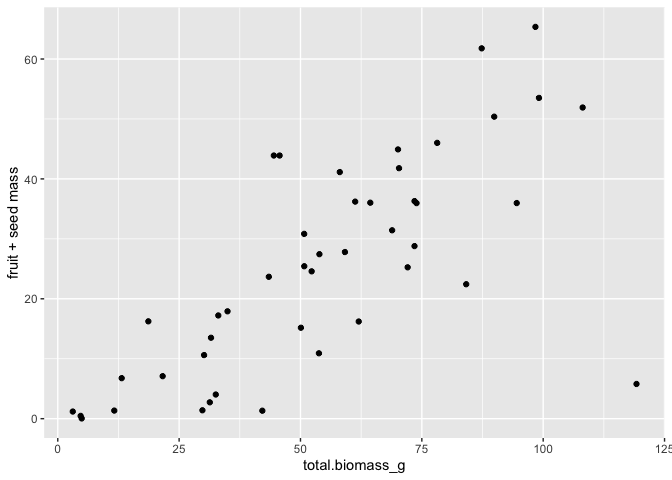
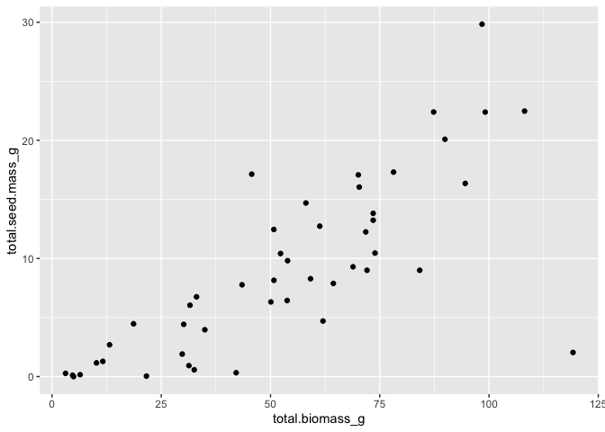
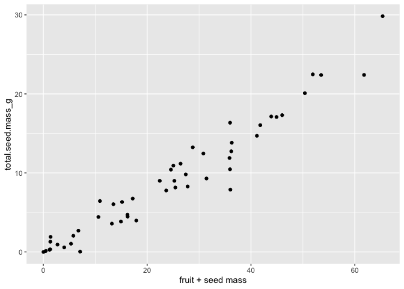
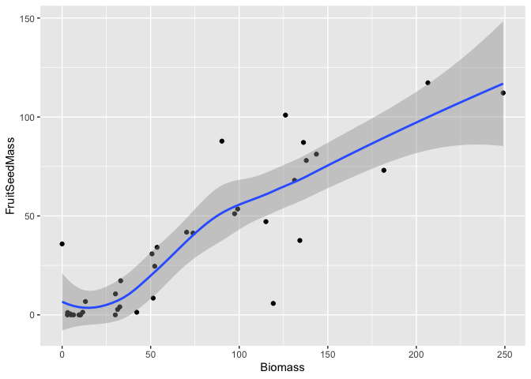
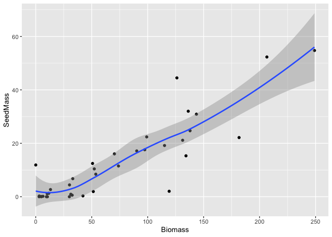
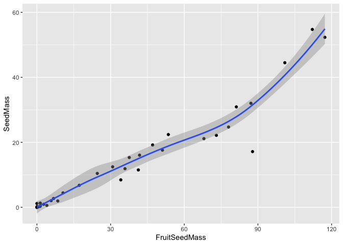
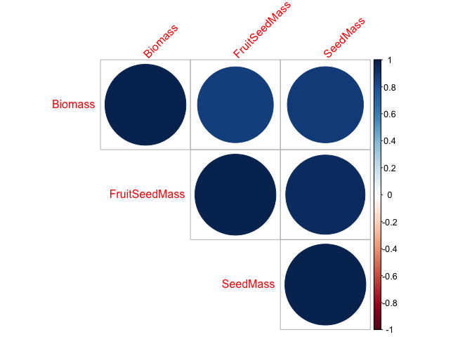

## Load Libraries

``` r
library(tidyverse)
```

```
## ── Attaching core tidyverse packages ──────────────────────── tidyverse 2.0.0 ──
## ✔ dplyr     1.2.1     ✔ readr     2.2.0
## ✔ forcats   1.0.1     ✔ stringr   1.6.0
## ✔ ggplot2   4.0.2     ✔ tibble    3.3.1
## ✔ lubridate 1.9.5     ✔ tidyr     1.3.2
## ✔ purrr     1.2.2     
## ── Conflicts ────────────────────────────────────────── tidyverse_conflicts() ──
## ✖ dplyr::filter() masks stats::filter()
## ✖ dplyr::lag()    masks stats::lag()
## ℹ Use the conflicted package (<http://conflicted.r-lib.org/>) to force all conflicts to become errors
```

``` r
library(corrplot) #plotting correlations 
```

```
## corrplot 0.95 loaded
```

## Load Seed Mass Data

``` r
seedmass_a1 <- read_csv("../input/UCD2023_2024_Data/CorrectedCSVs/UCD_2024_SeedMass_A1_corrected.csv") #note this is only for block A1
```

```
## Rows: 58 Columns: 8
## ── Column specification ────────────────────────────────────────────────────────
## Delimiter: ","
## chr (4): block, date.collected, date.meas, survey.notes
## dbl (4): unique.ID, total.biomass_g, fruit + seed mass, total.seed.mass_g
## 
## ℹ Use `spec()` to retrieve the full column specification for this data.
## ℹ Specify the column types or set `show_col_types = FALSE` to quiet this message.
```

``` r
head(seedmass_a1) 
```

```
## # A tibble: 6 × 8
##   block unique.ID date.collected date.meas total.biomass_g `fruit + seed mass`
##   <chr>     <dbl> <chr>          <chr>               <dbl>               <dbl>
## 1 A1            6 6/6/24         5/14/25             99.1                53.5 
## 2 A1           32 6/6/24         5/28/25             52.3                24.6 
## 3 A1           48 5/30/24        4/30/25             70.3                41.8 
## 4 A1           62 5/30/24        4/16/25             11.6                 1.35
## 5 A1           78 6/6/24         5/23/25             50.8                30.8 
## 6 A1          131 5/23/24        5/28/25              6.44               NA   
## # ℹ 2 more variables: total.seed.mass_g <dbl>, survey.notes <chr>
```

``` r
summary(seedmass_a1)
```

```
##     block             unique.ID    date.collected      date.meas        
##  Length:58          Min.   :   6   Length:58          Length:58         
##  Class :character   1st Qu.: 432   Class :character   Class :character  
##  Mode  :character   Median : 670   Mode  :character   Mode  :character  
##                     Mean   : 681                                        
##                     3rd Qu.: 999                                        
##                     Max.   :1252                                        
##                                                                         
##  total.biomass_g  fruit + seed mass total.seed.mass_g   survey.notes      
##  Min.   :  3.01   Min.   : 0.04     Min.   : 0.000391   Length:58         
##  1st Qu.: 29.98   1st Qu.:10.76     1st Qu.: 2.692400   Class :character  
##  Median : 50.77   Median :25.05     Median : 8.150170   Mode  :character  
##  Mean   : 49.93   Mean   :24.77     Mean   : 8.820723                     
##  3rd Qu.: 71.86   3rd Qu.:36.12     3rd Qu.:12.734620                     
##  Max.   :119.22   Max.   :65.36     Max.   :29.834710                     
##  NA's   :6        NA's   :7         NA's   :5
```

## Quick plots

``` r
seedmass_a1 %>% 
  ggplot(aes(total.biomass_g, `fruit + seed mass`)) +
  geom_point() 
```

```
## Warning: Removed 13 rows containing missing values or values outside the scale range
## (`geom_point()`).
```

<!-- -->

``` r
seedmass_a1 %>% 
  ggplot(aes(total.biomass_g, total.seed.mass_g)) +
  geom_point() 
```

```
## Warning: Removed 11 rows containing missing values or values outside the scale range
## (`geom_point()`).
```

<!-- -->

``` r
seedmass_a1 %>% 
  ggplot(aes(`fruit + seed mass`, total.seed.mass_g)) +
  geom_point() #looks great!
```

```
## Warning: Removed 8 rows containing missing values or values outside the scale range
## (`geom_point()`).
```

<!-- -->

## Group measurements by individual

``` r
seedmass_a1_indivs <- seedmass_a1 %>% 
  group_by(unique.ID) %>% 
  summarise(Biomass=sum(total.biomass_g, na.rm = TRUE),
            FruitSeedMass=sum(`fruit + seed mass`, na.rm=TRUE), 
            SeedMass=sum(total.seed.mass_g, na.rm=TRUE))
```

### Quick plots 

``` r
seedmass_a1_indivs %>% 
  ggplot(aes(Biomass, FruitSeedMass)) +
  geom_point() + geom_smooth()
```

```
## `geom_smooth()` using method = 'loess' and formula = 'y ~ x'
```

<!-- -->

``` r
seedmass_a1_indivs %>% 
  ggplot(aes(Biomass, SeedMass)) +
  geom_point() + geom_smooth()
```

```
## `geom_smooth()` using method = 'loess' and formula = 'y ~ x'
```

<!-- -->

``` r
seedmass_a1_indivs %>% 
  ggplot(aes(FruitSeedMass, SeedMass)) +
  geom_point() + #looks great!
  geom_smooth()
```

```
## `geom_smooth()` using method = 'loess' and formula = 'y ~ x'
```

<!-- -->

## Correlations

``` r
#normalize the data
seedmass_a1_indivs_norm <- seedmass_a1_indivs %>% ungroup() %>% 
  select(Biomass:SeedMass) %>% scale() 

#test correlations among the traits
cor.norm = cor(seedmass_a1_indivs_norm) 
cor.sig <- cor.mtest(seedmass_a1_indivs_norm, method = "pearson")

cor.norm
```

```
##                 Biomass FruitSeedMass  SeedMass
## Biomass       1.0000000     0.8777653 0.8834004
## FruitSeedMass 0.8777653     1.0000000 0.9593364
## SeedMass      0.8834004     0.9593364 1.0000000
```

``` r
cor.sig
```

```
## $p
##                    Biomass FruitSeedMass     SeedMass
## Biomass       0.000000e+00  9.876944e-13 4.529980e-13
## FruitSeedMass 9.876944e-13  0.000000e+00 8.257336e-21
## SeedMass      4.529980e-13  8.257336e-21 0.000000e+00
## 
## $lowCI
##                 Biomass FruitSeedMass  SeedMass
## Biomass       1.0000000     0.7738346 0.7837091
## FruitSeedMass 0.7738346     1.0000000 0.9218764
## SeedMass      0.7837091     0.9218764 1.0000000
## 
## $uppCI
##                 Biomass FruitSeedMass  SeedMass
## Biomass       1.0000000     0.9356684 0.9387212
## FruitSeedMass 0.9356684     1.0000000 0.9790304
## SeedMass      0.9387212     0.9790304 1.0000000
```

``` r
corrplot(cor.norm, type="upper",
         tl.srt = 45, p.mat = cor.sig$p, 
         sig.level = 0.05, insig="blank")
```

<!-- -->

## Linear Regression between fruit+seed and just seed

``` r
fruitseed_test <- lm(SeedMass~FruitSeedMass, data=seedmass_a1_indivs)
summary(fruitseed_test)
```

```
## 
## Call:
## lm(formula = SeedMass ~ FruitSeedMass, data = seedmass_a1_indivs)
## 
## Residuals:
##      Min       1Q   Median       3Q      Max 
## -16.3910  -0.6940   0.6491   1.1131  11.7268 
## 
## Coefficients:
##               Estimate Std. Error t value Pr(>|t|)    
## (Intercept)   -0.66431    0.96391  -0.689    0.495    
## FruitSeedMass  0.38945    0.01937  20.107   <2e-16 ***
## ---
## Signif. codes:  0 '***' 0.001 '**' 0.01 '*' 0.05 '.' 0.1 ' ' 1
## 
## Residual standard error: 4.265 on 35 degrees of freedom
## Multiple R-squared:  0.9203,	Adjusted R-squared:  0.918 
## F-statistic: 404.3 on 1 and 35 DF,  p-value: < 2.2e-16
```
