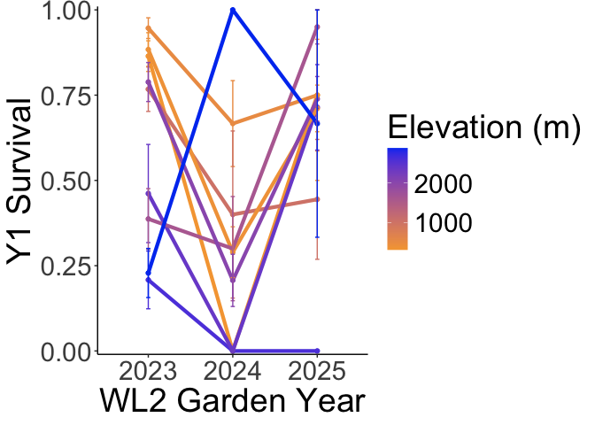
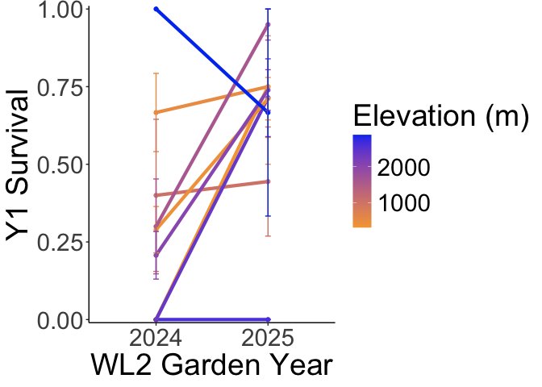
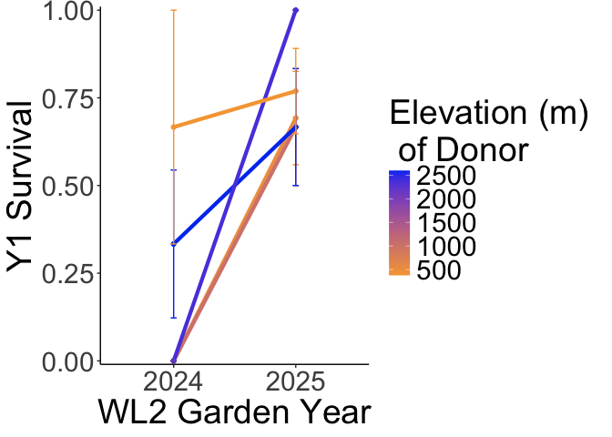
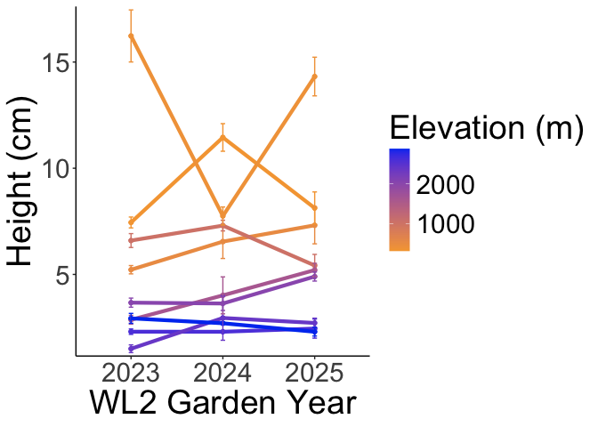
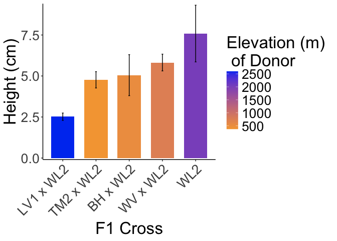

# Reaction Norms comparing differences between 2024 and 2025 at WL2

## Libraries

``` r
library(tidyverse)
```

```
## ── Attaching core tidyverse packages ──────────────────────── tidyverse 2.0.0 ──
## ✔ dplyr     1.1.4     ✔ readr     2.1.5
## ✔ forcats   1.0.0     ✔ stringr   1.5.1
## ✔ ggplot2   3.5.1     ✔ tibble    3.2.1
## ✔ lubridate 1.9.3     ✔ tidyr     1.3.1
## ✔ purrr     1.0.2     
## ── Conflicts ────────────────────────────────────────── tidyverse_conflicts() ──
## ✖ dplyr::filter() masks stats::filter()
## ✖ dplyr::lag()    masks stats::lag()
## ℹ Use the conflicted package (<http://conflicted.r-lib.org/>) to force all conflicts to become errors
```

``` r
sem <- function(x, na.rm=FALSE) {  #for calculating standard error
  sd(x,na.rm=na.rm)/sqrt(length(na.omit(x)))
} 
```

## Survival Data

``` r
year1surv_2023 <- read_csv("../../WL2.ClimDist/Processed.Data/WL2_Y1Surv.csv")
```

```
## Rows: 728 Columns: 55
## ── Column specification ────────────────────────────────────────────────────────
## Delimiter: ","
## chr   (8): block, BedLoc, bed, bed.col, Genotype, pop, bud.date, elevation.g...
## dbl  (46): bed.row, mf, rep, elev_m, Lat, Long, GD_Recent_Wtr_Year_2023, GD_...
## date  (1): death.date
## 
## ℹ Use `spec()` to retrieve the full column specification for this data.
## ℹ Specify the column types or set `show_col_types = FALSE` to quiet this message.
```

``` r
wintsurv_2024 <- read_csv("../input/WL2_2025_Data/CorrectedCSVs/WL2_overwinter_survival_20250523_corrected.csv") #contains all year 1 info too
```

```
## Rows: 1217 Columns: 13
## ── Column specification ────────────────────────────────────────────────────────
## Delimiter: ","
## chr (12): block, bed, col, unique.ID, bud.date, flower.date, fruit.date, las...
## dbl  (1): row
## 
## ℹ Use `spec()` to retrieve the full column specification for this data.
## ℹ Specify the column types or set `show_col_types = FALSE` to quiet this message.
```

``` r
mort_pheno_2025 <- read_csv("../input/WL2_2025_Data/CorrectedCSVs/WL2_mort_pheno_20250929_corrected.csv")
```

```
## New names:
## Rows: 972 Columns: 13
## ── Column specification
## ──────────────────────────────────────────────────────── Delimiter: "," chr
## (12): bed, col, Unique.ID, bud.date, flower.date, fruit.date, last.FL.da... dbl
## (1): row
## ℹ Use `spec()` to retrieve the full column specification for this data. ℹ
## Specify the column types or set `show_col_types = FALSE` to quiet this message.
## • `` -> `...13`
```

``` r
mort_pheno_2025 %>% filter(!is.na(...13)) #additional notes 
```

```
## # A tibble: 4 × 13
##   bed     row col   Unique.ID bud.date flower.date fruit.date last.FL.date
##   <chr> <dbl> <chr> <chr>     <chr>    <chr>       <chr>      <chr>       
## 1 C        10 B     2302      <NA>     <NA>        <NA>       <NA>        
## 2 C        14 B     1915      <NA>     <NA>        <NA>       <NA>        
## 3 C        20 A     2592      <NA>     <NA>        <NA>       <NA>        
## 4 C        29 D     2269      6/27/25  7/10/25     7/18/25    8/7/25      
## # ℹ 5 more variables: last.FR.date <chr>, death.date <chr>,
## #   round2.rep.dates <chr>, survey.notes <chr>, ...13 <chr>
```

``` r
mort_pheno_2025 %>% filter(str_detect(survey.notes, "planting")) #some dead pre or at planting 
```

```
## # A tibble: 10 × 13
##    bed     row col   Unique.ID bud.date flower.date fruit.date last.FL.date
##    <chr> <dbl> <chr> <chr>     <chr>    <chr>       <chr>      <chr>       
##  1 C        11 B     2605      <NA>     <NA>        <NA>       <NA>        
##  2 C        14 C     1950      <NA>     <NA>        <NA>       <NA>        
##  3 C        52 D     1701      <NA>     <NA>        <NA>       <NA>        
##  4 D        37 A     1675      <NA>     <NA>        <NA>       <NA>        
##  5 D        37 B     2364      <NA>     <NA>        <NA>       <NA>        
##  6 D        37 D     1882      <NA>     <NA>        <NA>       <NA>        
##  7 E        20 A     1684      <NA>     <NA>        <NA>       <NA>        
##  8 E         9 C     2636      <NA>     <NA>        <NA>       <NA>        
##  9 G         5 A     1812      <NA>     <NA>        <NA>       <NA>        
## 10 G        11 A     2232      <NA>     <NA>        <NA>       <NA>        
## # ℹ 5 more variables: last.FR.date <chr>, death.date <chr>,
## #   round2.rep.dates <chr>, survey.notes <chr>, ...13 <chr>
```

## Pop Info 

``` r
pop_info_2024 <- read_csv("../input/WL2_2024_Data/Final_2023_2024_Pop_Loc_Info.csv") %>% 
  select(Pop.Type:unique.ID) %>% 
  rename(row=bedrow, col=bedcol)
```

```
## Rows: 1217 Columns: 15
## ── Column specification ────────────────────────────────────────────────────────
## Delimiter: ","
## chr (8): Pop.Type, status, block, loc, bed, bedcol, pop, unique.ID
## dbl (7): bed.block.order, bed.order, AB.CD.order, column.order, bedrow, mf, rep
## 
## ℹ Use `spec()` to retrieve the full column specification for this data.
## ℹ Specify the column types or set `show_col_types = FALSE` to quiet this message.
```

``` r
pop_info_2025 <- read_csv("../input/WL2_2025_Data/2025_Pop_Loc_Info Updated.csv") %>% 
  select(status:Unique.ID)
```

```
## Rows: 976 Columns: 16
## ── Column specification ────────────────────────────────────────────────────────
## Delimiter: ","
## chr (10): status, block, bed, col, pop.id, mf, dame_mf, sire_mf, Unique.ID, ...
## dbl  (6): bed.block.order, bed.order, AB.CD.order, column.order, row, rep
## 
## ℹ Use `spec()` to retrieve the full column specification for this data.
## ℹ Specify the column types or set `show_col_types = FALSE` to quiet this message.
```

## Elevation Info

``` r
elev_info <- read_csv("../input/Strep_tort_locs.csv")
```

```
## Rows: 54 Columns: 7
## ── Column specification ────────────────────────────────────────────────────────
## Delimiter: ","
## chr (6): Species epithet, Species Code, Site, Site code, Lat, Long
## dbl (1): Elevation (m)
## 
## ℹ Use `spec()` to retrieve the full column specification for this data.
## ℹ Specify the column types or set `show_col_types = FALSE` to quiet this message.
```

``` r
elev_info_yo <- elev_info %>% 
  mutate(pop = str_replace(`Site code`, "YOSE(\\d+)", "YO\\1")) %>% select(Lat, Long, elev_m=`Elevation (m)`, pop)
head(elev_info_yo)
```

```
## # A tibble: 6 × 4
##   Lat      Long       elev_m pop  
##   <chr>    <chr>       <dbl> <chr>
## 1 37.40985 -119.96458   511. BH   
## 2 39.55355 -121.4329    283. BB   
## 3 39.58597 -121.43311   313  CC   
## 4 38.6382  -120.1422   2422. CP1  
## 5 38.66169 -120.13065  2244. CP2  
## 6 38.70649 -120.08797  2266. CP3
```

``` r
unique(elev_info_yo$pop)
```

```
##  [1] "BH"    "BB"    "CC"    "CP1"   "CP2"   "CP3"   "DP"    "DPR"   "FR"   
## [10] NA      "HH"    "IH"    "KC1"   "KC2"   "KC3"   "LV1"   "LV2"   "LV3"  
## [19] "LVTR1" "LVTR2" "LVTR3" "SQ1"   "SQ2"   "SQ3"   "SHA"   "SC"    "TM1"  
## [28] "TM2"   "WR"    "WV"    "WL1"   "WL2"   "WL3"   "WL4"   "YO1"   "YO10" 
## [37] "YO11"  "YO12"  "YO13"  "YO2"   "YO3"   "YO4"   "YO5"   "YO6"   "YO7"  
## [46] "YO8"   "YO9"
```

## Year 1 Survival for Parents

### 2023

``` r
y1surv_2023_summary <- year1surv_2023 %>% 
  group_by(pop) %>% 
  summarise(meanSurv=mean(Y1Survival, na.rm=TRUE), 
            semSurv=sem(Y1Survival, na.rm=TRUE),
            N=sum(!is.na(Y1Survival))) %>% 
  left_join(elev_info_yo) %>% 
  mutate(Garden_Year = "2023")
```

```
## Joining with `by = join_by(pop)`
```

### 2024

``` r
y1surv_2024 <- wintsurv_2024 %>% 
  select(bed:unique.ID, death.date, missing.date, survey.notes) %>% 
  left_join(pop_info_2024) %>% 
  filter(unique.ID != "buffer") %>% #remove buffers
  filter(Pop.Type=="Parent") %>%  #keep only parents planted in 2024
  select(loc, bed:unique.ID, Pop.Type, pop:rep, death.date:survey.notes) %>% 
  mutate(deadatplanting = if_else(is.na(survey.notes), NA,
                                  if_else(survey.notes=="Dead at planting", "Yes", NA))) %>% 
  filter(is.na(deadatplanting)) %>% #remove plants that were dead at planting 
  filter(is.na(missing.date)) %>% #remove plants that went missing 
  select(-deadatplanting, -missing.date, -survey.notes) %>% #remove unnecessary cols 
  mutate(death.date=mdy(death.date)) %>% #convert to date format 
  mutate(Establishment = if_else(is.na(death.date), 1, 
                                 if_else(death.date < "2024-07-06", 0, 1)), #establishment = first 3 weeks post-transplant 
         Y1Surv = if_else(Establishment==0, NA, #can't survive year 1 if you didn't establish 
                          if_else(is.na(death.date), 1, 
                                        if_else(death.date < "2024-11-01", 0, 1)))) #year 1 ended in Oct
```

```
## Joining with `by = join_by(bed, row, col, unique.ID)`
```

``` r
y1surv_2024_summary <- y1surv_2024 %>% 
  group_by(pop) %>% 
  summarise(meanSurv=mean(Y1Surv, na.rm=TRUE), 
            semSurv=sem(Y1Surv, na.rm=TRUE),
            N=sum(!is.na(Y1Surv))) %>% 
  left_join(elev_info_yo) %>% 
  mutate(Garden_Year = "2024")
```

```
## Joining with `by = join_by(pop)`
```

### 2025

``` r
y1surv_2025 <- mort_pheno_2025 %>% 
  select(bed:Unique.ID, bud.date, death.date, survey.notes) %>% 
  left_join(pop_info_2025) %>% 
  filter(Unique.ID!="buffer", !is.na(Unique.ID)) %>% 
  filter(status=="available") %>% #only keep plants planted in 2025
  mutate(Pop.Type=if_else(str_detect(pop.id, "\\) x"), "F2",
                          if_else(str_detect(pop.id, "x"), "F1",
                                  "Parent"
                          ))) %>% #define different pop types 
  filter(Pop.Type=="Parent") %>%  #keep only parents 
  mutate(deadatplanting = if_else(is.na(survey.notes), NA,
                                  if_else(survey.notes=="dead pre-planting" | 
                                            survey.notes=="dead at planting",
                                          "Yes", NA))) %>% 
  filter(is.na(deadatplanting)) %>% #remove plants that were dead at planting 
  select(-status, -deadatplanting, -survey.notes) %>% #remove unnecessary cols 
  mutate(death.date=mdy(death.date)) %>% #convert to date format 
  mutate(Establishment = if_else(is.na(death.date) | !is.na(bud.date), 1, 
                                 if_else(death.date < "2025-06-21", 0, 1)), #establishment = first 3 weeks post-transplant 
         Y1Surv = if_else(Establishment==0, NA, #can't survive year 1 if you didn't establish 
                          if_else(!is.na(bud.date), 1, #if you reproduced you survived 
                      if_else(is.na(death.date), 1, 0)))) 
```

```
## Joining with `by = join_by(bed, row, col, Unique.ID)`
```

``` r
y1surv_2025_summary <- y1surv_2025 %>% 
  rename(pop=pop.id) %>% 
  group_by(pop) %>% 
  summarise(meanSurv=mean(Y1Surv, na.rm=TRUE), 
            semSurv=sem(Y1Surv, na.rm=TRUE),
            N=sum(!is.na(Y1Surv))) %>% 
  left_join(elev_info_yo) %>% 
  mutate(Garden_Year = "2025")
```

```
## Joining with `by = join_by(pop)`
```

### Reaction Norms

``` r
y1surv_all <- y1surv_2023_summary %>% 
  bind_rows(y1surv_2024_summary) %>% 
  bind_rows(y1surv_2025_summary)
  
y1surv_all_wide <- y1surv_all %>% 
  select(pop, Garden_Year, N) %>% 
  pivot_wider(names_from = Garden_Year, values_from = N) %>% 
  mutate(All.Years=if_else(!is.na(`2025`) & !is.na(`2024`) & !is.na(`2023`), TRUE, FALSE)) %>% 
  filter(All.Years != "FALSE")

y1surv_all_years <- y1surv_all_wide %>% 
  left_join(y1surv_all) %>% 
  select(pop, meanSurv:Garden_Year)
```

```
## Joining with `by = join_by(pop)`
```

``` r
y1surv_all_years %>% 
  ggplot(aes(x=Garden_Year, y=meanSurv, group=pop, color=elev_m)) +
  geom_point(size=1.5) + 
  geom_line(linewidth=1.5) +
  geom_errorbar(aes(ymin=meanSurv-semSurv,ymax=meanSurv+semSurv),width=.05) +
  theme_classic() + 
  scale_colour_gradient(low = "#F5A540", high = "#0043F0")  +
  labs(y="Y1 Survival", color="Elevation (m)", x="WL2 Garden Year") +
  scale_y_continuous(expand = c(0.01, 0.00)) +
  theme(text=element_text(size=28))
```

<!-- -->

``` r
ggsave("../output/WL2_Traits/WL2_Y1Surv_RxNm_Parents.png", width = 14, height = 6, units = "in")

y1surv_all_years %>% 
  filter(Garden_Year!=2023) %>% 
  ggplot(aes(x=Garden_Year, y=meanSurv, group=pop, color=elev_m)) +
  geom_point(size=1.5) + 
  geom_line(linewidth=1.5) +
  geom_errorbar(aes(ymin=meanSurv-semSurv,ymax=meanSurv+semSurv),width=.05) +
  theme_classic() + 
  scale_colour_gradient(low = "#F5A540", high = "#0043F0")  +
  labs(y="Y1 Survival", color="Elevation (m)", x="WL2 Garden Year") +
  scale_y_continuous(expand = c(0.01, 0.00)) +
  theme(text=element_text(size=28))
```

<!-- -->

``` r
ggsave("../output/WL2_Traits/WL2_Y1Surv_RxNm_Parents_2425.png", width = 12, height = 6, units = "in")
```

## Year 1 Survival for F1s
### 2024

``` r
y1surv_2024_F1s <- wintsurv_2024 %>% 
  select(bed:unique.ID, death.date, missing.date, survey.notes) %>% 
  left_join(pop_info_2024) %>% 
  filter(unique.ID != "buffer") %>% #remove buffers
  filter(Pop.Type=="F1") %>%  #keep only F1s planted in 2024
  select(loc, bed:unique.ID, Pop.Type, pop:rep, death.date:survey.notes) %>% 
  mutate(deadatplanting = if_else(is.na(survey.notes), NA,
                                  if_else(survey.notes=="Dead at planting", "Yes", NA))) %>% 
  filter(is.na(deadatplanting)) %>% #remove plants that were dead at planting 
  filter(is.na(missing.date)) %>% #remove plants that went missing 
  select(-deadatplanting, -missing.date, -survey.notes) %>% #remove unnecessary cols 
  mutate(death.date=mdy(death.date)) %>% #convert to date format 
  mutate(Establishment = if_else(is.na(death.date), 1, 
                                 if_else(death.date < "2024-07-06", 0, 1)), #establishment = first 3 weeks post-transplant 
         Y1Surv = if_else(Establishment==0, NA, #can't survive year 1 if you didn't establish 
                          if_else(is.na(death.date), 1, 
                                        if_else(death.date < "2024-11-01", 0, 1)))) #year 1 ended in Oct
```

```
## Joining with `by = join_by(bed, row, col, unique.ID)`
```

``` r
y1surv_2024_F1s_summary <- y1surv_2024_F1s %>% 
  group_by(pop) %>% 
  summarise(meanSurv=mean(Y1Surv, na.rm=TRUE), 
            semSurv=sem(Y1Surv, na.rm=TRUE),
            N=sum(!is.na(Y1Surv))) %>% 
  mutate(Garden_Year = "2024")
```

### 2025

``` r
y1surv_2025_F1s <- mort_pheno_2025 %>% 
  select(bed:Unique.ID, bud.date, death.date, survey.notes) %>% 
  left_join(pop_info_2025) %>% 
  filter(Unique.ID!="buffer", !is.na(Unique.ID)) %>% 
  filter(status=="available") %>% #only keep plants planted in 2025
  mutate(Pop.Type=if_else(str_detect(pop.id, "\\) x"), "F2",
                          if_else(str_detect(pop.id, "x"), "F1",
                                  "Parent"
                          ))) %>% #define different pop types 
  filter(Pop.Type=="F1") %>%  #keep only F1s 
  mutate(deadatplanting = if_else(is.na(survey.notes), NA,
                                  if_else(survey.notes=="dead pre-planting" | 
                                            survey.notes=="dead at planting",
                                          "Yes", NA))) %>% 
  filter(is.na(deadatplanting)) %>% #remove plants that were dead at planting 
  select(-status, -deadatplanting, -survey.notes) %>% #remove unnecessary cols 
  mutate(death.date=mdy(death.date)) %>% #convert to date format 
  mutate(Establishment = if_else(is.na(death.date) | !is.na(bud.date), 1, 
                                 if_else(death.date < "2025-06-21", 0, 1)), #establishment = first 3 weeks post-transplant 
         Y1Surv = if_else(Establishment==0, NA, #can't survive year 1 if you didn't establish 
                          if_else(!is.na(bud.date), 1, #if you reproduced you survived 
                      if_else(is.na(death.date), 1, 0)))) 
```

```
## Joining with `by = join_by(bed, row, col, Unique.ID)`
```

``` r
y1surv_2025_F1s_summary <- y1surv_2025_F1s %>% 
  rename(pop=pop.id) %>% 
  group_by(pop) %>% 
  summarise(meanSurv=mean(Y1Surv, na.rm=TRUE), 
            semSurv=sem(Y1Surv, na.rm=TRUE),
            N=sum(!is.na(Y1Surv))) %>% 
  mutate(Garden_Year = "2025")
```

### Reaction Norm

``` r
y1surv_all_F1s <- y1surv_2024_F1s_summary %>% 
  bind_rows(y1surv_2025_F1s_summary) 
  
y1surv_all_F1s_wide <- y1surv_all_F1s %>% 
  select(pop, Garden_Year, N) %>% 
  pivot_wider(names_from = Garden_Year, values_from = N) %>% 
  mutate(All.Years=if_else(!is.na(`2025`) & !is.na(`2024`), TRUE, FALSE)) %>% 
  filter(All.Years != "FALSE") 
dim(y1surv_all_F1s_wide) #only 5 F1s
```

```
## [1] 5 4
```

``` r
y1surv_all_F1s_years <- y1surv_all_F1s_wide %>% 
  left_join(y1surv_all_F1s) %>% 
  select(pop, meanSurv:Garden_Year) %>% 
  separate(pop, c("Pop1", "Pop2"), sep = " x ", remove = FALSE) %>% 
  left_join(elev_info_yo, by=join_by(Pop1==pop))
```

```
## Joining with `by = join_by(pop)`
```

``` r
y1surv_all_F1s_years
```

```
## # A tibble: 10 × 10
##    pop       Pop1  Pop2  meanSurv semSurv     N Garden_Year Lat     Long  elev_m
##    <chr>     <chr> <chr>    <dbl>   <dbl> <int> <chr>       <chr>   <chr>  <dbl>
##  1 BH x WL2  BH    WL2      0       0         2 2024        37.409… -119…   511.
##  2 BH x WL2  BH    WL2      0.692   0.133    13 2025        37.409… -119…   511.
##  3 DPR x WL2 DPR   WL2      0       0         2 2024        39.228… -120…  1019.
##  4 DPR x WL2 DPR   WL2      0.667   0.167     9 2025        39.228… -120…  1019.
##  5 LV1 x WL2 LV1   WL2      0.333   0.211     6 2024        40.474… -121…  2593.
##  6 LV1 x WL2 LV1   WL2      0.667   0.167     9 2025        40.474… -121…  2593.
##  7 SQ3 x WL2 SQ3   WL2      0       0         3 2024        36.721… -118…  2373.
##  8 SQ3 x WL2 SQ3   WL2      1       0         5 2025        36.721… -118…  2373.
##  9 TM2 x WL2 TM2   WL2      0.667   0.333     3 2024        39.592… -121…   379.
## 10 TM2 x WL2 TM2   WL2      0.769   0.122    13 2025        39.592… -121…   379.
```

``` r
y1surv_all_F1s_years %>% 
  ggplot(aes(x=Garden_Year, y=meanSurv, group=pop, color=elev_m)) +
  geom_point(size=1.5) + 
  geom_line(linewidth=1.5) +
  geom_errorbar(aes(ymin=meanSurv-semSurv,ymax=meanSurv+semSurv),width=.05) +
  theme_classic() + 
  scale_colour_gradient(low = "#F5A540", high = "#0043F0")  +
  labs(y="Y1 Survival", color="Elevation (m) \n of Donor", x="WL2 Garden Year") +
  scale_y_continuous(expand = c(0.01, 0.00)) +
  theme(text=element_text(size=28))
```

<!-- -->

``` r
ggsave("../output/WL2_Traits/WL2_Y1Surv_RxNm_F1s.png", width = 14, height = 6, units = "in")
```

## Size Post-Establishment

``` r
size_2023 <- read_csv("../../parent_pops_common-gardens/input/WL2_Data/CorrectedCSVs/WL2_size_survey_20230816_corrected.csv") %>% 
  select(pop:height.cm) %>% 
  filter(pop!="buffer", 
         !str_detect(pop, "\\*"))
```

```
## New names:
## Rows: 1824 Columns: 14
## ── Column specification
## ──────────────────────────────────────────────────────── Delimiter: "," chr
## (11): Date, block, bed, bed. col, pop, mf, rep, height.cm, herbiv.y.n, s... dbl
## (2): bed. row, long.leaf.c m lgl (1): ...14
## ℹ Use `spec()` to retrieve the full column specification for this data. ℹ
## Specify the column types or set `show_col_types = FALSE` to quiet this message.
## • `` -> `...14`
```

``` r
size_2024 <- read_csv("../input/WL2_2024_Data/CorrectedCSVs/WL2_size_survey_20240709_corrected.csv") %>% 
  filter(unique.ID != "buffer") %>% #remove buffers
  select(unique.ID:height.cm) %>% 
  left_join(pop_info_2024) %>% 
  filter(Pop.Type=="Parent")  #keep only parents planted in 2024
```

```
## New names:
## Rows: 1215 Columns: 10
## ── Column specification
## ──────────────────────────────────────────────────────── Delimiter: "," chr
## (7): block, bed, col, unique.ID, herbiv.y.n, survey.notes, ...10 dbl (3): row,
## height.cm, long.leaf.cm
## ℹ Use `spec()` to retrieve the full column specification for this data. ℹ
## Specify the column types or set `show_col_types = FALSE` to quiet this message.
## Joining with `by = join_by(unique.ID)`
## • `` -> `...10`
```

``` r
size_2025 <- read_csv("../input/WL2_2025_Data/CorrectedCSVs/WL2_size_survey_20250627_corrected.csv") %>% 
  filter(Unique.ID != "buffer") %>% #remove buffers
  select(Unique.ID:height.cm) %>% 
  left_join(pop_info_2025) %>% 
  filter(status=="available") %>% #only keep plants planted in 2025
  mutate(Pop.Type=if_else(str_detect(pop.id, "\\) x"), "F2",
                          if_else(str_detect(pop.id, "x"), "F1",
                                  "Parent"
                          ))) %>% #define different pop types 
  filter(Pop.Type=="Parent") #keep only parents 
```

```
## Rows: 972 Columns: 10
## ── Column specification ────────────────────────────────────────────────────────
## Delimiter: ","
## chr (5): bed, col, Unique.ID, survey.notes, survey date
## dbl (5): row, height.cm, overhd.diam, overhd.perp, herbv.scale
## 
## ℹ Use `spec()` to retrieve the full column specification for this data.
## ℹ Specify the column types or set `show_col_types = FALSE` to quiet this message.
## Joining with `by = join_by(Unique.ID)`
```

### Pop Summaries

``` r
size_2023_summary <- size_2023 %>% 
  mutate(height.cm=as.numeric(height.cm)) %>% 
  group_by(pop) %>% 
  summarise(meanHeight=mean(height.cm, na.rm=TRUE),
            semHeight=sem(height.cm, na.rm = TRUE),
            nHeight=sum(!is.na(height.cm))) %>% 
  mutate(Garden_Year = "2023")
```

```
## Warning: There was 1 warning in `mutate()`.
## ℹ In argument: `height.cm = as.numeric(height.cm)`.
## Caused by warning:
## ! NAs introduced by coercion
```

``` r
size_2024_summary <- size_2024 %>% 
  group_by(pop) %>% 
  summarise(meanHeight=mean(height.cm, na.rm=TRUE),
            semHeight=sem(height.cm, na.rm = TRUE),
            nHeight=sum(!is.na(height.cm))) %>% 
  mutate(Garden_Year = "2024")

size_2025_summary <- size_2025 %>% 
  rename(pop=pop.id) %>% 
  group_by(pop) %>% 
  summarise(meanHeight=mean(height.cm, na.rm=TRUE),
            semHeight=sem(height.cm, na.rm = TRUE),
            nHeight=sum(!is.na(height.cm))) %>% 
  mutate(Garden_Year = "2025")

all_size <- size_2023_summary %>% 
  bind_rows(size_2024_summary) %>% 
  bind_rows(size_2025_summary) %>% 
  right_join(y1surv_all_wide) %>% 
  select(pop:nHeight, Garden_Year) %>% 
  left_join(elev_info_yo)
```

```
## Joining with `by = join_by(pop)`
## Joining with `by = join_by(pop)`
```

### Reaction Norms

``` r
all_size %>% 
  ggplot(aes(x=Garden_Year, y=meanHeight, group=pop, color=elev_m)) +
  geom_point(size=1.5) + 
  geom_line(linewidth=1.5) +
  geom_errorbar(aes(ymin=meanHeight-semHeight,ymax=meanHeight+semHeight),width=.05) +
  theme_classic() + 
  scale_colour_gradient(low = "#F5A540", high = "#0043F0")  +
  labs(y="Height (cm)", color="Elevation (m)", x="WL2 Garden Year") +
  scale_y_continuous(expand = c(0.01, 0.00)) +
  theme(text=element_text(size=28))
```

<!-- -->

``` r
ggsave("../output/WL2_Traits/WL2_Height_RxNm_Parents.png", width = 14, height = 6, units = "in")
```

### F1s Height

``` r
size_2024_F1s <- read_csv("../input/WL2_2024_Data/CorrectedCSVs/WL2_size_survey_20240709_corrected.csv") %>% 
  filter(unique.ID != "buffer") %>% #remove buffers
  select(unique.ID:height.cm) %>% 
  left_join(pop_info_2024) %>% 
  filter(Pop.Type=="F1" | pop=="WL2")  #keep only parents planted in 2024
```

```
## New names:
## Rows: 1215 Columns: 10
## ── Column specification
## ──────────────────────────────────────────────────────── Delimiter: "," chr
## (7): block, bed, col, unique.ID, herbiv.y.n, survey.notes, ...10 dbl (3): row,
## height.cm, long.leaf.cm
## ℹ Use `spec()` to retrieve the full column specification for this data. ℹ
## Specify the column types or set `show_col_types = FALSE` to quiet this message.
## Joining with `by = join_by(unique.ID)`
## • `` -> `...10`
```

``` r
size_2025_F1s <- read_csv("../input/WL2_2025_Data/CorrectedCSVs/WL2_size_survey_20250627_corrected.csv") %>% 
  filter(Unique.ID != "buffer") %>% #remove buffers
  select(Unique.ID:height.cm) %>% 
  left_join(pop_info_2025) %>% 
  filter(status=="available") %>% #only keep plants planted in 2025
  mutate(Pop.Type=if_else(str_detect(pop.id, "\\) x"), "F2",
                          if_else(str_detect(pop.id, "x"), "F1",
                                  "Parent"
                          ))) %>% #define different pop types 
  filter(Pop.Type=="F1" | pop.id=="WL2") #keep only parents
```

```
## Rows: 972 Columns: 10
## ── Column specification ────────────────────────────────────────────────────────
## Delimiter: ","
## chr (5): bed, col, Unique.ID, survey.notes, survey date
## dbl (5): row, height.cm, overhd.diam, overhd.perp, herbv.scale
## 
## ℹ Use `spec()` to retrieve the full column specification for this data.
## ℹ Specify the column types or set `show_col_types = FALSE` to quiet this message.
## Joining with `by = join_by(Unique.ID)`
```


``` r
size_2024_F1s_summary <- size_2024_F1s %>% 
  group_by(pop) %>% 
  summarise(meanHeight=mean(height.cm, na.rm=TRUE),
            semHeight=sem(height.cm, na.rm = TRUE),
            nHeight=sum(!is.na(height.cm))) %>% 
  separate(pop, c("Pop1", "Pop2"), sep = " x ", remove = FALSE) %>% 
  filter(Pop2=="WL2" | is.na(Pop2)) %>% 
  left_join(elev_info_yo, by=join_by(Pop1==pop))
```

```
## Warning: Expected 2 pieces. Missing pieces filled with `NA` in 1 rows [10].
```

``` r
size_2025_F1s_summary <- size_2025_F1s %>% 
  rename(pop=pop.id) %>% 
  group_by(pop) %>% 
  summarise(meanHeight=mean(height.cm, na.rm=TRUE),
            semHeight=sem(height.cm, na.rm = TRUE),
            nHeight=sum(!is.na(height.cm))) %>% 
  separate(pop, c("Pop1", "Pop2"), sep = " x ", remove = FALSE) %>% 
  mutate(other_Parent=if_else(is.na(Pop2), "WL2",
                              if_else(Pop1=="WL2", Pop2, Pop1))) %>% 
  left_join(elev_info_yo, by=join_by(other_Parent==pop))
```

```
## Warning: Expected 2 pieces. Missing pieces filled with `NA` in 1 rows [7].
```


``` r
size_2024_F1s_summary %>% 
  filter(nHeight>1) %>% 
  ggplot(aes(x=fct_reorder(pop, meanHeight), y=meanHeight, group = pop, fill=elev_m)) +
  geom_col(width = 0.7,position = position_dodge(0.75)) + 
  geom_errorbar(aes(ymin=meanHeight-semHeight,ymax=meanHeight+semHeight),
                width=.05, position = position_dodge(0.75)) +
  theme_classic() + 
  scale_fill_gradient(low = "#F5A540", high = "#0043F0")  +
  labs(y="Height (cm)", fill="Elevation (m) \n of Donor", x="F1 Cross") +
  scale_y_continuous(expand = c(0.01, 0.00)) +
  theme(text=element_text(size=25), axis.text.x = element_text(angle = 45, hjust = 1))
```

<!-- -->

``` r
ggsave("../output/WL2_Traits/WL22024_Height_WL2F1s.png", width = 14, height = 8, units = "in")
```


``` r
size_2025_F1s_summary %>% 
  filter(nHeight>1) %>% 
  ggplot(aes(x=fct_reorder(pop, meanHeight), y=meanHeight, group = pop, fill=elev_m)) +
  geom_col(width = 0.7,position = position_dodge(0.75)) + 
  geom_errorbar(aes(ymin=meanHeight-semHeight,ymax=meanHeight+semHeight),
                width=.05, position = position_dodge(0.75)) +
  theme_classic() + 
  scale_fill_gradient(low = "#F5A540", high = "#0043F0")  +
  labs(y="Height (cm)", fill="Elevation (m) \n of Donor", x="F1 Cross") +
  scale_y_continuous(expand = c(0.01, 0.00)) +
  theme(text=element_text(size=25), axis.text.x = element_text(angle = 45, hjust = 1))
```

<!-- -->

``` r
ggsave("../output/WL2_Traits/WL22025_Height_WL2F1s.png", width = 14, height = 6, units = "in")
```

