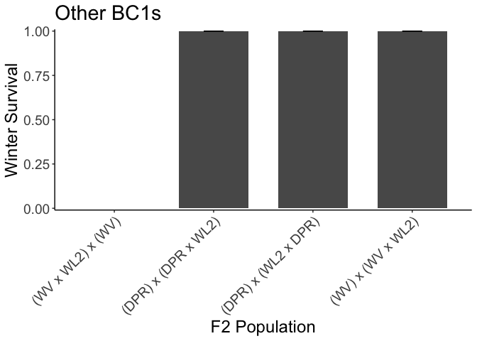

# Checking over-winter survival for the winter of 2024-2025

## Libraries

``` r
library(tidyverse)
```

```
## ── Attaching core tidyverse packages ──────────────────────── tidyverse 2.0.0 ──
## ✔ dplyr     1.1.4     ✔ readr     2.1.5
## ✔ forcats   1.0.0     ✔ stringr   1.5.1
## ✔ ggplot2   3.5.1     ✔ tibble    3.2.1
## ✔ lubridate 1.9.3     ✔ tidyr     1.3.1
## ✔ purrr     1.0.2     
## ── Conflicts ────────────────────────────────────────── tidyverse_conflicts() ──
## ✖ dplyr::filter() masks stats::filter()
## ✖ dplyr::lag()    masks stats::lag()
## ℹ Use the conflicted package (<http://conflicted.r-lib.org/>) to force all conflicts to become errors
```

``` r
sem <- function(x, na.rm=FALSE) {           #for caclulating standard error
  sd(x,na.rm=na.rm)/sqrt(length(na.omit(x)))
} 
```

## Load data

### Mort/pheno info

``` r
wintmortpheno <- read_csv("../input/WL2_2025_Data/CorrectedCSVs/WL2_overwinter_survival_20250523_corrected.csv")
```

```
## Rows: 1217 Columns: 13
## ── Column specification ────────────────────────────────────────────────────────
## Delimiter: ","
## chr (12): block, bed, col, unique.ID, bud.date, flower.date, fruit.date, las...
## dbl  (1): row
## 
## ℹ Use `spec()` to retrieve the full column specification for this data.
## ℹ Specify the column types or set `show_col_types = FALSE` to quiet this message.
```

## Pop Info 

``` r
pop_info <- read_csv("../input/WL2_2024_Data/Final_2023_2024_Pop_Loc_Info.csv") %>% 
  select(Pop.Type:unique.ID) %>% 
  rename(row=bedrow, col=bedcol)
```

```
## Rows: 1217 Columns: 15
## ── Column specification ────────────────────────────────────────────────────────
## Delimiter: ","
## chr (8): Pop.Type, status, block, loc, bed, bedcol, pop, unique.ID
## dbl (7): bed.block.order, bed.order, AB.CD.order, column.order, bedrow, mf, rep
## 
## ℹ Use `spec()` to retrieve the full column specification for this data.
## ℹ Specify the column types or set `show_col_types = FALSE` to quiet this message.
```

### Elevation Info

``` r
elev_info <- read_csv("../input/Strep_tort_locs.csv")
```

```
## Rows: 54 Columns: 7
## ── Column specification ────────────────────────────────────────────────────────
## Delimiter: ","
## chr (6): Species epithet, Species Code, Site, Site code, Lat, Long
## dbl (1): Elevation (m)
## 
## ℹ Use `spec()` to retrieve the full column specification for this data.
## ℹ Specify the column types or set `show_col_types = FALSE` to quiet this message.
```

``` r
elev_info_yo <- elev_info %>% mutate(pop = str_replace(`Site code`, "YOSE(\\d+)", "YO\\1")) %>% select(Lat, Long, elev_m=`Elevation (m)`, pop)
unique(elev_info_yo$pop)
```

```
##  [1] "BH"    "BB"    "CC"    "CP1"   "CP2"   "CP3"   "DP"    "DPR"   "FR"   
## [10] NA      "HH"    "IH"    "KC1"   "KC2"   "KC3"   "LV1"   "LV2"   "LV3"  
## [19] "LVTR1" "LVTR2" "LVTR3" "SQ1"   "SQ2"   "SQ3"   "SHA"   "SC"    "TM1"  
## [28] "TM2"   "WR"    "WV"    "WL1"   "WL2"   "WL3"   "WL4"   "YO1"   "YO10" 
## [37] "YO11"  "YO12"  "YO13"  "YO2"   "YO3"   "YO4"   "YO5"   "YO6"   "YO7"  
## [46] "YO8"   "YO9"
```

### Merge 

``` r
wintmortpheno_pops <- wintmortpheno %>% 
  select(bed:unique.ID, last.FR.date, death.date, missing.date, survey.notes) %>% 
  left_join(pop_info) %>% 
  filter(unique.ID != "buffer") %>% #remove buffers
  filter(Pop.Type!="2023-TM2-fruit") #remove 2023 TM2 fruiting plants
```

```
## Joining with `by = join_by(bed, row, col, unique.ID)`
```

## Alive in Oct 2024

``` r
alive_oct <- wintmortpheno_pops %>% 
  filter(death.date=="5/23/25" | is.na(death.date)) %>% #keep only plants that died on 5/23 or don't have a death date yet 
  filter(is.na(missing.date)) %>%  #keep only plants without a missing date
  mutate(deadatplanting = if_else(is.na(survey.notes), NA,
                                  if_else(survey.notes=="Dead at planting", "Yes", NA))) %>% 
  filter(is.na(deadatplanting))
alive_oct 
```

```
## # A tibble: 132 × 16
##    bed     row col   unique.ID last.FR.date death.date missing.date survey.notes
##    <chr> <dbl> <chr> <chr>     <chr>        <chr>      <chr>        <chr>       
##  1 A        15 C     CC_1_3    9/24/24      5/23/25    <NA>         10/9 new fl…
##  2 A        17 D     BH_2_3    9/10/24      5/23/25    <NA>         8/27 main s…
##  3 A        22 D     SC_8_3    9/17/24      5/23/25    <NA>         7/16 some b…
##  4 A        46 D     SQ1_5_10  9/10/24      5/23/25    <NA>         7/16 some b…
##  5 B        22 A     IH_3_5    10/16/24     5/23/25    <NA>         10/9 still …
##  6 B        25 A     IH_6_5    10/23/24     5/23/25    <NA>         7/30 buds d…
##  7 C         5 B     317       <NA>         5/23/25    <NA>         <NA>        
##  8 C        20 B     698       <NA>         <NA>       <NA>         <NA>        
##  9 C        21 B     407       <NA>         5/23/25    <NA>         <NA>        
## 10 C        23 B     118       <NA>         <NA>       <NA>         <NA>        
## # ℹ 122 more rows
## # ℹ 8 more variables: Pop.Type <chr>, status <chr>, block <chr>, loc <chr>,
## #   pop <chr>, mf <dbl>, rep <dbl>, deadatplanting <chr>
```

``` r
xtabs(~Pop.Type, data=alive_oct)
```

```
## Pop.Type
## 2023-survivor            F1            F2        Parent 
##            25            16            58            33
```

## Winter Survival 

``` r
wintersurv <- alive_oct %>% 
  select(Pop.Type:loc, bed:col, pop:rep, unique.ID:death.date) %>% 
  mutate(WintSurv=if_else(is.na(death.date), 1, 0)) #1 = surv; 0 = mort
wintersurv
```

```
## # A tibble: 132 × 14
##    Pop.Type     status block loc   bed     row col   pop      mf   rep unique.ID
##    <chr>        <chr>  <chr> <chr> <chr> <dbl> <chr> <chr> <dbl> <dbl> <chr>    
##  1 2023-surviv… 2023-… <NA>  A_15… A        15 C     CC        1     3 CC_1_3   
##  2 2023-surviv… 2023-… <NA>  A_17… A        17 D     BH        2     3 BH_2_3   
##  3 2023-surviv… 2023-… <NA>  A_22… A        22 D     SC        8     3 SC_8_3   
##  4 2023-surviv… 2023-… <NA>  A_46… A        46 D     SQ1       5    10 SQ1_5_10 
##  5 2023-surviv… 2023-… <NA>  B_22… B        22 A     IH        3     5 IH_3_5   
##  6 2023-surviv… 2023-… <NA>  B_25… B        25 A     IH        6     5 IH_6_5   
##  7 F2           avail… A     C_5_B C         5 B     (TM2…    NA    13 317      
##  8 F2           avail… B     C_20… C        20 B     (DPR…    NA     4 698      
##  9 Parent       avail… B     C_21… C        21 B     BH       NA    21 407      
## 10 Parent       avail… B     C_23… C        23 B     WL2      NA    23 118      
## # ℹ 122 more rows
## # ℹ 3 more variables: last.FR.date <chr>, death.date <chr>, WintSurv <dbl>
```

``` r
xtabs(~Pop.Type+WintSurv, data=wintersurv)
```

```
##                WintSurv
## Pop.Type         0  1
##   2023-survivor 24  1
##   F1             4 12
##   F2            12 46
##   Parent        12 21
```

``` r
#1/25 2023 plants survived = 4%
#12/16 F1s = 75%
#46/58 F2s = 79%
#21/33 2024 parents = 64% 
```

## Plot by pop type 

``` r
wintersurv %>% 
  group_by(Pop.Type) %>% 
  summarise(meanSurv=mean(WintSurv), semSurv=sem(WintSurv)) %>% 
  ggplot(aes(x=Pop.Type, y=meanSurv)) +
  geom_col(width = 0.7,position = position_dodge(0.75)) + 
  geom_errorbar(aes(ymin=meanSurv-semSurv,ymax=meanSurv+semSurv),width=.2, position = 
                  position_dodge(0.75)) +
  theme_classic() + 
  scale_y_continuous(expand = c(0.01, 0), limits = c(-0.01, 1)) +
  labs(y="Winter Survival", x="Population Type", , title="Population Categories") +
  annotate("text", x = 1, y= 0.18, label = "25 in Oct") +
  annotate("text", x = 2, y= 0.9, label = "16 in Oct") +
  annotate("text", x = 3, y= 0.9, label = "58 in Oct") +
  annotate("text", x = 4, y= 0.8, label = "33 in Oct") +
  theme(text=element_text(size=25))
```

<!-- -->

``` r
ggsave("../output/WL2_Traits/WL2_WINTSURV_24-25_PopType.png", width = 10, height = 8, units = "in")
```

## Means by pop

``` r
by_pop_surv <- wintersurv %>% 
  group_by(pop, Pop.Type) %>% 
  summarise(N_Surv = sum(!is.na(WintSurv)), mean_Surv = mean(WintSurv,na.rm=(TRUE)), 
            sem_surv=sem(WintSurv, na.rm=(TRUE)))
```

```
## `summarise()` has grouped output by 'pop'. You can override using the `.groups`
## argument.
```

## Plot by pops 

### Parents

``` r
by_pop_parents_surv <- by_pop_surv %>% 
  filter(Pop.Type == "Parent")
by_pop_parents_surv
```

```
## # A tibble: 6 × 5
## # Groups:   pop [6]
##   pop   Pop.Type N_Surv mean_Surv sem_surv
##   <chr> <chr>     <int>     <dbl>    <dbl>
## 1 BH    Parent       10     0.7      0.153
## 2 DPR   Parent        2     0.5      0.5  
## 3 TM2   Parent       11     0.455    0.157
## 4 WL1   Parent        3     0.333    0.333
## 5 WL2   Parent        6     1        0    
## 6 YO11  Parent        1     1       NA
```

``` r
by_pop_parents_elev_surv <- left_join(by_pop_parents_surv, elev_info_yo)
```

```
## Joining with `by = join_by(pop)`
```

``` r
head(by_pop_parents_elev_surv)
```

```
## # A tibble: 6 × 8
## # Groups:   pop [6]
##   pop   Pop.Type N_Surv mean_Surv sem_surv Lat      Long       elev_m
##   <chr> <chr>     <int>     <dbl>    <dbl> <chr>    <chr>       <dbl>
## 1 BH    Parent       10     0.7      0.153 37.40985 -119.96458   511.
## 2 DPR   Parent        2     0.5      0.5   39.22846 -120.81518  1019.
## 3 TM2   Parent       11     0.455    0.157 39.59255 -121.55072   379.
## 4 WL1   Parent        3     0.333    0.333 38.78608 -120.2143   1614.
## 5 WL2   Parent        6     1        0     38.8263  -120.25242  2020.
## 6 YO11  Parent        1     1       NA     37.93844 -119.23157  2872.
```

``` r
by_pop_parents_elev_surv %>% 
  ggplot(aes(x=fct_reorder(pop, mean_Surv), y=mean_Surv, fill=elev_m)) + 
  geom_col(width = 0.7,position = position_dodge(0.75)) +
  geom_errorbar(aes(ymin=mean_Surv-sem_surv,ymax=mean_Surv+sem_surv),width=.2, position = 
                  position_dodge(0.75)) +
  labs(x="Parent Population", y="Winter Survival", fill="Elevation (m)", title="2024 Parents") +
  theme_classic() + 
  scale_y_continuous(expand = c(0, 0)) +
  scale_fill_gradient(low = "#F5A540", high = "#0043F0") +
  theme(text=element_text(size=25), axis.text.x = element_text(angle = 45, hjust = 1))
```

<!-- -->

``` r
ggsave("../output/WL2_Traits/WL2_WINTSURV_24-25_Parents.png", width = 14, height = 8, units = "in")
```

### F1s

``` r
by_pop_surv %>% 
  filter(Pop.Type == "F1") %>% 
  ggplot(aes(x=fct_reorder(pop, mean_Surv), y=mean_Surv)) + 
  geom_col(width = 0.7,position = position_dodge(0.75)) + 
  geom_errorbar(aes(ymin=mean_Surv-sem_surv,ymax=mean_Surv+sem_surv),width=.2, position = 
                  position_dodge(0.75)) +
  theme_classic() + 
  scale_y_continuous(expand = c(0.01, 0)) +
  labs(x="F1 Population", y="Winter Survival", title="F1s") +
  theme(text=element_text(size=25), axis.text.x = element_text(angle = 45, hjust = 1))
```

<!-- -->

``` r
ggsave("../output/WL2_Traits/WL2_WINTSURV_24-25_F1s.png", width = 14, height = 8, units = "in")
```

### F2s

``` r
by_pop_surv %>% 
  filter(Pop.Type == "F2") %>% 
  ggplot(aes(x=fct_reorder(pop, mean_Surv), y=mean_Surv)) + 
  geom_col(width = 0.7,position = position_dodge(0.75)) + 
  geom_errorbar(aes(ymin=mean_Surv-sem_surv,ymax=mean_Surv+sem_surv),width=.2, position = 
                  position_dodge(0.75)) +
  theme_classic() + 
  scale_y_continuous(expand = c(0.01, 0)) +
  labs(x="F2 Population", y="Winter Survival") +
  theme(axis.text.x = element_text(angle = 45, hjust = 1))
```

<!-- -->

``` r
#try to split these up 

by_pop_surv %>% 
  filter(Pop.Type == "F2") %>% 
  filter(str_detect(pop, "x \\(WL2\\)") | str_detect(pop, "\\(WL2\\) x")) %>% #WL2 BC1s
  ggplot(aes(x=fct_reorder(pop, mean_Surv), y=mean_Surv)) + 
  geom_col(width = 0.7,position = position_dodge(0.75)) + 
  geom_errorbar(aes(ymin=mean_Surv-sem_surv,ymax=mean_Surv+sem_surv),width=.2, position = 
                  position_dodge(0.75)) +
  theme_classic() + 
  scale_y_continuous(expand = c(0.01, 0)) +
  labs(x="F2 Population", y="Winter Survival", title="WL2 BC1s") +
  theme(text=element_text(size=18), axis.text.x = element_text(angle = 45, hjust = 1))
```

<!-- -->

``` r
ggsave("../output/WL2_Traits/WL2_WINTSURV_24-25_WL2BC1s.png", width = 12, height = 8, units = "in")

by_pop_surv %>% 
  filter(Pop.Type == "F2") %>% 
  filter(!str_detect(pop, "x \\(WL2\\)"), !str_detect(pop, "\\(WL2\\) x")) %>% # F2s that aren't WL2 BC1s
  filter(!str_detect(pop, "x \\(WV\\)"), !str_detect(pop, "\\(WV\\) x")) %>% #NOT WV BC1s
  filter(!str_detect(pop, "x \\(DPR\\)"), !str_detect(pop, "\\(DPR\\) x")) %>% #NOT DPR BC1s
  ggplot(aes(x=fct_reorder(pop, mean_Surv), y=mean_Surv)) + 
  geom_col(width = 0.7,position = position_dodge(0.75)) + 
  geom_errorbar(aes(ymin=mean_Surv-sem_surv,ymax=mean_Surv+sem_surv),width=.2, position = 
                  position_dodge(0.75)) +
  theme_classic() + 
  scale_y_continuous(expand = c(0.01, 0)) +
  labs(x="F2 Population", y="Winter Survival", title="F2s with 4 Parents") +
  theme(text=element_text(size=12), axis.text.x = element_text(angle = 45, hjust = 1))
```

<!-- -->

``` r
ggsave("../output/WL2_Traits/WL2_WINTSURV_24-25_4PF2s.png", width = 18, height = 8, units = "in")

by_pop_surv %>% 
  filter(Pop.Type == "F2") %>% 
  filter(str_detect(pop, "x \\(WV\\)") | str_detect(pop, "\\(WV\\) x") |
           str_detect(pop, "x \\(DPR\\)") | str_detect(pop, "\\(DPR\\) x")) %>% #Other BC1s
  ggplot(aes(x=fct_reorder(pop, mean_Surv), y=mean_Surv)) + 
  geom_col(width = 0.7,position = position_dodge(0.75)) + 
  geom_errorbar(aes(ymin=mean_Surv-sem_surv,ymax=mean_Surv+sem_surv),width=.2, position = 
                  position_dodge(0.75)) +
  theme_classic() + 
  scale_y_continuous(expand = c(0.01, 0)) +
  labs(x="F2 Population", y="Winter Survival", title="Other BC1s") +
  theme(text=element_text(size=18), axis.text.x = element_text(angle = 45, hjust = 1))
```

<!-- -->

``` r
ggsave("../output/WL2_Traits/WL2_WINTSURV_24-25_OtherBC1s.png", width = 10, height = 8, units = "in")
```

