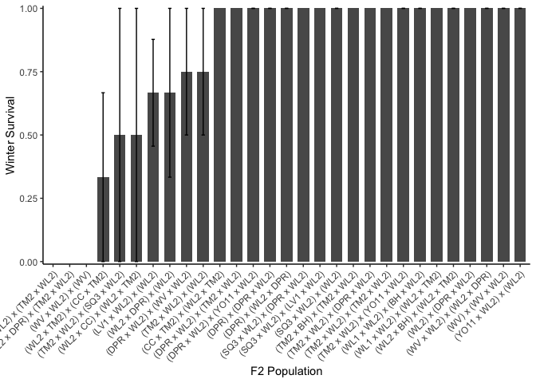

# Checking over-winter survival for the winter of 2024-2025

## Libraries

``` r
library(tidyverse)
```

```
## ── Attaching core tidyverse packages ──────────────────────── tidyverse 2.0.0 ──
## ✔ dplyr     1.1.4     ✔ readr     2.1.5
## ✔ forcats   1.0.0     ✔ stringr   1.5.1
## ✔ ggplot2   3.5.1     ✔ tibble    3.2.1
## ✔ lubridate 1.9.3     ✔ tidyr     1.3.1
## ✔ purrr     1.0.2     
## ── Conflicts ────────────────────────────────────────── tidyverse_conflicts() ──
## ✖ dplyr::filter() masks stats::filter()
## ✖ dplyr::lag()    masks stats::lag()
## ℹ Use the conflicted package (<http://conflicted.r-lib.org/>) to force all conflicts to become errors
```

``` r
sem <- function(x, na.rm=FALSE) {           #for calculating standard error
  sd(x,na.rm=na.rm)/sqrt(length(na.omit(x)))
} 
```

## Load data

### Mort/pheno info

``` r
wintmortpheno <- read_csv("../input/WL2_2025_Data/CorrectedCSVs/WL2_overwinter_survival_20250523_corrected.csv")
```

```
## Rows: 1217 Columns: 13
## ── Column specification ────────────────────────────────────────────────────────
## Delimiter: ","
## chr (12): block, bed, col, unique.ID, bud.date, flower.date, fruit.date, las...
## dbl  (1): row
## 
## ℹ Use `spec()` to retrieve the full column specification for this data.
## ℹ Specify the column types or set `show_col_types = FALSE` to quiet this message.
```

## Pop Info 

``` r
pop_info <- read_csv("../input/WL2_2024_Data/Final_2023_2024_Pop_Loc_Info.csv") %>% 
  select(Pop.Type:unique.ID) %>% 
  rename(row=bedrow, col=bedcol)
```

```
## Rows: 1217 Columns: 15
## ── Column specification ────────────────────────────────────────────────────────
## Delimiter: ","
## chr (8): Pop.Type, status, block, loc, bed, bedcol, pop, unique.ID
## dbl (7): bed.block.order, bed.order, AB.CD.order, column.order, bedrow, mf, rep
## 
## ℹ Use `spec()` to retrieve the full column specification for this data.
## ℹ Specify the column types or set `show_col_types = FALSE` to quiet this message.
```

## Elevation Info / Climate distance

``` r
clim_dist_2024 <- read_csv("../output/Climate/WL2_2024_Clim_Dist.csv") %>% select(-conf.low, -conf.high)
```

```
## Rows: 20 Columns: 11
## ── Column specification ────────────────────────────────────────────────────────
## Delimiter: ","
## chr (4): parent.pop, elevation.group, timeframe, Season
## dbl (7): elev_m, Lat, Long, Year, Gowers_Dist, conf.low, conf.high
## 
## ℹ Use `spec()` to retrieve the full column specification for this data.
## ℹ Specify the column types or set `show_col_types = FALSE` to quiet this message.
```

``` r
head(clim_dist_2024)
```

```
## # A tibble: 6 × 9
##   parent.pop elevation.group elev_m   Lat  Long timeframe Season      Year
##   <chr>      <chr>            <dbl> <dbl> <dbl> <chr>     <chr>      <dbl>
## 1 WL2        high             2020.  38.8 -120. Recent    Water Year  2024
## 2 SQ3        high             2373.  36.7 -119. Recent    Water Year  2024
## 3 WL1        mid              1614.  38.8 -120. Recent    Water Year  2024
## 4 WV         mid               749.  40.7 -123. Recent    Water Year  2024
## 5 YO11       high             2872.  37.9 -119. Recent    Water Year  2024
## 6 LV1        high             2593.  40.5 -122. Recent    Water Year  2024
## # ℹ 1 more variable: Gowers_Dist <dbl>
```

``` r
clim_dist_2024_wide <- clim_dist_2024 %>% 
  pivot_wider(names_from = timeframe, values_from = Gowers_Dist, names_prefix = "GD_") %>% 
  rename(pop=parent.pop)
```

### Merge 

``` r
wintmortpheno_pops <- wintmortpheno %>% 
  select(bed:unique.ID, last.FR.date, death.date, missing.date, survey.notes) %>% 
  left_join(pop_info) %>% 
  filter(unique.ID != "buffer") %>% #remove buffers
  filter(Pop.Type!="2023-TM2-fruit") #remove 2023 TM2 fruiting plants
```

```
## Joining with `by = join_by(bed, row, col, unique.ID)`
```

``` r
head(wintmortpheno_pops)
```

```
## # A tibble: 6 × 15
##   bed     row col   unique.ID last.FR.date death.date missing.date survey.notes 
##   <chr> <dbl> <chr> <chr>     <chr>        <chr>      <chr>        <chr>        
## 1 A         6 B     CC_3_3    <NA>         6/18/24    <NA>         <NA>         
## 2 A        16 B     BH_3_3    <NA>         6/18/24    <NA>         6/18/24 No t…
## 3 A        17 A     BH_7_3    8/20/24      10/2/24    <NA>         <NA>         
## 4 A        18 A     BH_4_3    <NA>         8/20/24    <NA>         6/18/24 No t…
## 5 A        24 A     WL2_7_9   8/27/24      10/2/24    <NA>         <NA>         
## 6 A        32 B     IH_7_4    8/27/24      10/2/24    <NA>         8/20 tape fr…
## # ℹ 7 more variables: Pop.Type <chr>, status <chr>, block <chr>, loc <chr>,
## #   pop <chr>, mf <dbl>, rep <dbl>
```

## Alive in Oct 2024

``` r
alive_oct <- wintmortpheno_pops %>% 
  filter(death.date=="5/23/25" | is.na(death.date)) %>% #keep only plants that died on 5/23 or don't have a death date yet 
  filter(is.na(missing.date)) %>%  #keep only plants without a missing date
  mutate(deadatplanting = if_else(is.na(survey.notes), NA,
                                  if_else(survey.notes=="Dead at planting", "Yes", NA))) %>% 
  filter(is.na(deadatplanting))
dim(alive_oct) #132 plants alive in Oct (correct number)
```

```
## [1] 132  16
```

## Winter Survival 

``` r
wintersurv <- alive_oct %>% 
  select(Pop.Type:loc, bed:col, pop:rep, unique.ID:death.date) %>% 
  mutate(WintSurv=if_else(is.na(death.date), 1, 0)) #1 = surv; 0 = mort
head(wintersurv)
```

```
## # A tibble: 6 × 14
##   Pop.Type      status block loc   bed     row col   pop      mf   rep unique.ID
##   <chr>         <chr>  <chr> <chr> <chr> <dbl> <chr> <chr> <dbl> <dbl> <chr>    
## 1 2023-survivor 2023-… <NA>  A_15… A        15 C     CC        1     3 CC_1_3   
## 2 2023-survivor 2023-… <NA>  A_17… A        17 D     BH        2     3 BH_2_3   
## 3 2023-survivor 2023-… <NA>  A_22… A        22 D     SC        8     3 SC_8_3   
## 4 2023-survivor 2023-… <NA>  A_46… A        46 D     SQ1       5    10 SQ1_5_10 
## 5 2023-survivor 2023-… <NA>  B_22… B        22 A     IH        3     5 IH_3_5   
## 6 2023-survivor 2023-… <NA>  B_25… B        25 A     IH        6     5 IH_6_5   
## # ℹ 3 more variables: last.FR.date <chr>, death.date <chr>, WintSurv <dbl>
```

``` r
xtabs(~Pop.Type+WintSurv, data=wintersurv)
```

```
##                WintSurv
## Pop.Type         0  1
##   2023-survivor 24  1
##   F1             4 12
##   F2            12 46
##   Parent        12 21
```

``` r
#1/25 2023 plants survived = 4%
#12/16 F1s = 75%
#46/58 F2s = 79%
#21/33 2024 parents = 64% 
```

## Plot by pop type 

``` r
wintersurv %>% 
  group_by(Pop.Type) %>% 
  summarise(meanSurv=mean(WintSurv), semSurv=sem(WintSurv)) %>% 
  ggplot(aes(x=Pop.Type, y=meanSurv)) +
  geom_col(width = 0.7,position = position_dodge(0.75)) + 
  geom_errorbar(aes(ymin=meanSurv-semSurv,ymax=meanSurv+semSurv),width=.2, position = 
                  position_dodge(0.75)) +
  theme_classic() + 
  scale_y_continuous(expand = c(0.01, 0), limits = c(-0.01, 1)) +
  labs(y="Winter Survival", x="Population Type", , title="Population Categories") +
  annotate("text", x = 1, y= 0.18, label = "25 in Oct") +
  annotate("text", x = 2, y= 0.9, label = "16 in Oct") +
  annotate("text", x = 3, y= 0.9, label = "58 in Oct") +
  annotate("text", x = 4, y= 0.8, label = "33 in Oct") +
  theme(text=element_text(size=25))
```

<!-- -->

``` r
ggsave("../output/WL2_Traits/WL2_WINTSURV_24-25_PopType.png", width = 10, height = 8, units = "in")
```

## Means by pop

``` r
by_pop_surv <- wintersurv %>% 
  group_by(pop, Pop.Type) %>% 
  summarise(N_Surv = sum(!is.na(WintSurv)), mean_Surv = mean(WintSurv,na.rm=(TRUE)), 
            sem_surv=sem(WintSurv, na.rm=(TRUE)))
```

```
## `summarise()` has grouped output by 'pop'. You can override using the `.groups`
## argument.
```

## Plot by pops 

### Parents

``` r
by_pop_parents_surv <- by_pop_surv %>% 
  filter(Pop.Type == "Parent") %>% 
  left_join(clim_dist_2024_wide)
```

```
## Joining with `by = join_by(pop)`
```

``` r
head(by_pop_parents_surv)
```

```
## # A tibble: 6 × 13
## # Groups:   pop [6]
##   pop   Pop.Type N_Surv mean_Surv sem_surv elevation.group elev_m   Lat  Long
##   <chr> <chr>     <int>     <dbl>    <dbl> <chr>            <dbl> <dbl> <dbl>
## 1 BH    Parent       10     0.7      0.153 low               511.  37.4 -120.
## 2 DPR   Parent        2     0.5      0.5   mid              1019.  39.2 -121.
## 3 TM2   Parent       11     0.455    0.157 low               379.  39.6 -122.
## 4 WL1   Parent        3     0.333    0.333 mid              1614.  38.8 -120.
## 5 WL2   Parent        6     1        0     high             2020.  38.8 -120.
## 6 YO11  Parent        1     1       NA     high             2872.  37.9 -119.
## # ℹ 4 more variables: Season <chr>, Year <dbl>, GD_Recent <dbl>,
## #   GD_Historic <dbl>
```

``` r
by_pop_parents_surv %>% 
  filter(N_Surv>1) %>% 
  ggplot(aes(x=fct_reorder(pop, mean_Surv), y=mean_Surv, fill=elev_m)) + 
  geom_col(width = 0.7,position = position_dodge(0.75)) +
  geom_errorbar(aes(ymin=mean_Surv-sem_surv,ymax=mean_Surv+sem_surv),width=.2, position = 
                  position_dodge(0.75)) +
  labs(x="Parent Population", y="Winter Survival", fill="Elevation (m)", title="2024 Parents") +
  theme_classic() + 
  scale_y_continuous(expand = c(0, 0)) +
  scale_fill_gradient(low = "#F5A540", high = "#0043F0") +
  theme(text=element_text(size=25), axis.text.x = element_text(angle = 45, hjust = 1))
```

<!-- -->

``` r
ggsave("../output/WL2_Traits/WL2_WINTSURV_24-25_Parents.png", width = 14, height = 8, units = "in")

by_pop_parents_surv %>% 
  filter(N_Surv>1) %>%
  ggplot(aes(x=GD_Recent, y=mean_Surv, group=pop, colour=elev_m)) + 
  geom_point(size=6) + 
  geom_errorbar(aes(ymin=mean_Surv-sem_surv,ymax=mean_Surv+sem_surv),width=.02, linewidth = 2) +
  theme_classic() + 
  scale_colour_gradient(low = "#F5A540", high = "#0043F0") +
  scale_y_continuous(expand = c(0.01, 0.02)) +
  labs(x="Recent Water Year Climate Dist", y="Winter Survival") +
  theme(text=element_text(size=25), axis.text.x = element_text(angle = 45, hjust = 1))
```

<!-- -->

``` r
ggsave("../output/WL2_Traits/WL2_WINTSURV_24-25_Parents_RecentCD.png", width = 14, height = 8, units = "in")

by_pop_parents_surv %>% 
  filter(N_Surv>1) %>%
  ggplot(aes(x=GD_Historic, y=mean_Surv, group=pop, colour=elev_m)) + 
  geom_point(size=6) + 
  geom_errorbar(aes(ymin=mean_Surv-sem_surv,ymax=mean_Surv+sem_surv),width=.02, linewidth = 2) +
  theme_classic() + 
  scale_colour_gradient(low = "#F5A540", high = "#0043F0") +
  scale_y_continuous(expand = c(0.01, 0.02)) +
  labs(x="Historic Water Year Climate Dist", y="Winter Survival") +
  theme(text=element_text(size=25), axis.text.x = element_text(angle = 45, hjust = 1))
```

<!-- -->

``` r
ggsave("../output/WL2_Traits/WL2_WINTSURV_24-25_Parents_HistoricCD.png", width = 14, height = 8, units = "in")
```

### F1s

``` r
by_pop_surv_F1 <- by_pop_surv %>% 
  filter(Pop.Type == "F1") %>% 
  separate(pop, c("dame_pop",NA, "sire_pop"), remove = FALSE) %>% 
  left_join(clim_dist_2024_wide, by=join_by(dame_pop==pop)) %>% 
  select(-elevation.group, -Season, -Year) %>% 
  rename(dame_elev=elev_m, dame_Lat=Lat, dame_Long=Long, dame_GD_Recent=GD_Recent, dame_GD_Historic=GD_Historic) %>% 
  left_join(clim_dist_2024_wide, by=join_by(sire_pop==pop)) %>% 
  select(-elevation.group, -Season, -Year) %>% 
  rename(sire_elev=elev_m, sire_Lat=Lat, sire_Long=Long, sire_GD_Recent=GD_Recent, sire_GD_Historic=GD_Historic) %>% 
  mutate(meanElev=(dame_elev+sire_elev)/2, 
         mean_GD_Recent=(dame_GD_Recent+sire_GD_Recent)/2, 
         mean_GD_Historic=(dame_GD_Historic+sire_GD_Historic)/2)
head(by_pop_surv_F1)
```

```
## # A tibble: 6 × 20
## # Groups:   pop [6]
##   pop    dame_pop sire_pop Pop.Type N_Surv mean_Surv sem_surv dame_elev dame_Lat
##   <chr>  <chr>    <chr>    <chr>     <int>     <dbl>    <dbl>     <dbl>    <dbl>
## 1 BH x … BH       TM2      F1            1      0      NA          511.     37.4
## 2 LV1 x… LV1      TM2      F1            3      1       0         2593.     40.5
## 3 LV1 x… LV1      WL2      F1            2      1       0         2593.     40.5
## 4 TM2 x… TM2      WL2      F1            2      1       0          379.     39.6
## 5 WV x … WV       TM2      F1            4      0.5     0.289      749.     40.7
## 6 WV x … WV       WL2      F1            4      0.75    0.25       749.     40.7
## # ℹ 11 more variables: dame_Long <dbl>, dame_GD_Recent <dbl>,
## #   dame_GD_Historic <dbl>, sire_elev <dbl>, sire_Lat <dbl>, sire_Long <dbl>,
## #   sire_GD_Recent <dbl>, sire_GD_Historic <dbl>, meanElev <dbl>,
## #   mean_GD_Recent <dbl>, mean_GD_Historic <dbl>
```

``` r
by_pop_surv_F1 %>% 
  filter(N_Surv>1) %>%
  ggplot(aes(x=fct_reorder(pop, mean_Surv), y=mean_Surv)) + 
  geom_col(width = 0.7,position = position_dodge(0.75)) + 
  geom_errorbar(aes(ymin=mean_Surv-sem_surv,ymax=mean_Surv+sem_surv),width=.2, position = 
                  position_dodge(0.75)) +
  theme_classic() + 
  scale_y_continuous(expand = c(0.01, 0)) +
  labs(x="F1 Population", y="Winter Survival", title="F1s") +
  theme(text=element_text(size=25), axis.text.x = element_text(angle = 45, hjust = 1))
```

<!-- -->

``` r
ggsave("../output/WL2_Traits/WL2_WINTSURV_24-25_F1s.png", width = 14, height = 8, units = "in")

by_pop_surv_F1 %>% 
  filter(N_Surv>1) %>% 
  ggplot(aes(x=fct_reorder(pop, mean_Surv), y=mean_Surv, fill=dame_elev)) + 
  geom_col(width = 0.7,position = position_dodge(0.75)) + 
  geom_errorbar(aes(ymin=mean_Surv-sem_surv,ymax=mean_Surv+sem_surv),width=.2, position = 
                  position_dodge(0.75)) +
  theme_classic() + 
  scale_fill_gradient(low = "#F5A540", high = "#0043F0") +
  scale_y_continuous(expand = c(0.01, 0)) +
  labs(x="F1 Population", y="Winter Survival") +
  theme(text=element_text(size=25), axis.text.x = element_text(angle = 45, hjust = 1))
```

<!-- -->

``` r
by_pop_surv_F1 %>% 
  filter(N_Surv>1) %>% 
  ggplot(aes(x=fct_reorder(pop, mean_Surv), y=mean_Surv, fill=meanElev)) + 
  geom_col(width = 0.7,position = position_dodge(0.75)) + 
  geom_errorbar(aes(ymin=mean_Surv-sem_surv,ymax=mean_Surv+sem_surv),width=.2, position = 
                  position_dodge(0.75)) +
  theme_classic() + 
  scale_fill_gradient(low = "#F5A540", high = "#0043F0") +
  scale_y_continuous(expand = c(0.01, 0)) +
  labs(x="F1 Population", y="Winter Survival") +
  theme(text=element_text(size=25), axis.text.x = element_text(angle = 45, hjust = 1))
```

<!-- -->

``` r
by_pop_surv_F1 %>% 
  filter(N_Surv>1) %>% 
  ggplot(aes(x=mean_GD_Recent, y=mean_Surv, group=pop, colour=meanElev)) + 
  geom_point(size=6) + 
  geom_errorbar(aes(ymin=mean_Surv-sem_surv,ymax=mean_Surv+sem_surv),width=.02, linewidth = 2) +
  theme_classic() + 
  scale_colour_gradient(low = "#F5A540", high = "#0043F0") +
  scale_y_continuous(expand = c(0.01, 0.02)) +
  labs(x="Parental Avg \n Recent Water Year Climate Dist", y="Winter Survival") +
  theme(text=element_text(size=25), axis.text.x = element_text(angle = 45, hjust = 1))
```

<!-- -->

``` r
ggsave("../output/WL2_Traits/WL2_WINTSURV_24-25_F1s_RecentCD.png", width = 14, height = 8, units = "in")

by_pop_surv_F1 %>% 
  filter(N_Surv>1) %>% 
  ggplot(aes(x=mean_GD_Historic, y=mean_Surv, group=pop, colour=meanElev)) + 
  geom_point(size=6) + 
  geom_errorbar(aes(ymin=mean_Surv-sem_surv,ymax=mean_Surv+sem_surv),width=.02, linewidth = 2) +
  theme_classic() + 
  scale_colour_gradient(low = "#F5A540", high = "#0043F0") +
  scale_y_continuous(expand = c(0.01, 0.02)) +
  labs(x="Parental Avg \n Historic Water Year Climate Dist", y="Winter Survival") +
  theme(text=element_text(size=25), axis.text.x = element_text(angle = 45, hjust = 1))
```

<!-- -->

``` r
ggsave("../output/WL2_Traits/WL2_WINTSURV_24-25_F1s_HistoricCD.png", width = 14, height = 8, units = "in")
```

### F1s + Parents

``` r
parents_F1s_combined <- by_pop_parents_surv %>% 
  rename(meanElev=elev_m, mean_GD_Recent=GD_Recent, mean_GD_Historic=GD_Historic) %>% 
  bind_rows(by_pop_surv_F1)

parents_F1s_combined %>%  
  filter(N_Surv>1) %>% 
  ggplot(aes(x=fct_reorder(pop, mean_Surv), y=mean_Surv, fill=meanElev)) + 
  geom_col(width = 0.7,position = position_dodge(0.75)) + 
  geom_errorbar(aes(ymin=mean_Surv-sem_surv,ymax=mean_Surv+sem_surv),width=.2, position = 
                  position_dodge(0.75)) +
  theme_classic() + 
  scale_fill_gradient(low = "#F5A540", high = "#0043F0") +
  scale_y_continuous(expand = c(0.01, 0)) +
  labs(x="Population", y="Winter Survival", fill="Elevation (m)") +
  theme(text=element_text(size=25), axis.text.x = element_text(angle = 45, hjust = 1))
```

<!-- -->

``` r
ggsave("../output/WL2_Traits/WL2_WINTSURV_24-25_F1s_Parents.png", width = 14, height = 8, units = "in")

parents_F1s_combined %>% 
  filter(N_Surv>1) %>% 
  ggplot(aes(x=mean_GD_Recent, y=mean_Surv, group=pop, colour=meanElev)) + 
  geom_point(aes(shape=Pop.Type), size=6) + 
  geom_errorbar(aes(ymin=mean_Surv-sem_surv,ymax=mean_Surv+sem_surv),width=.02, linewidth = 2) +
  theme_classic() + 
  scale_colour_gradient(low = "#F5A540", high = "#0043F0") +
  scale_y_continuous(expand = c(0.01, 0.02)) +
  labs(x="Parental Avg \n Recent Water Year Climate Dist", y="Winter Survival") +
  theme(text=element_text(size=25), axis.text.x = element_text(angle = 45, hjust = 1))
```

<!-- -->

``` r
ggsave("../output/WL2_Traits/WL2_WINTSURV_24-25_F1s_Parents_RecentCD.png", width = 14, height = 8, units = "in")

parents_F1s_combined %>% 
  filter(N_Surv>1) %>% 
  ggplot(aes(x=mean_GD_Historic, y=mean_Surv, group=pop, colour=meanElev)) + 
  geom_point(aes(shape=Pop.Type), size=6) + 
  geom_errorbar(aes(ymin=mean_Surv-sem_surv,ymax=mean_Surv+sem_surv),width=.02, linewidth = 2) +
  theme_classic() + 
  scale_colour_gradient(low = "#F5A540", high = "#0043F0") +
  scale_y_continuous(expand = c(0.01, 0.02)) +
  labs(x="Parental Avg \n Historic Water Year Climate Dist", y="Winter Survival") +
  theme(text=element_text(size=25), axis.text.x = element_text(angle = 45, hjust = 1))
```

<!-- -->

``` r
ggsave("../output/WL2_Traits/WL2_WINTSURV_24-25_F1s_Parents_HistoricCD.png", width = 14, height = 8, units = "in")
```

### F2s

``` r
by_pop_surv %>% 
  filter(Pop.Type == "F2") %>% 
  ggplot(aes(x=fct_reorder(pop, mean_Surv), y=mean_Surv)) + 
  geom_col(width = 0.7,position = position_dodge(0.75)) + 
  geom_errorbar(aes(ymin=mean_Surv-sem_surv,ymax=mean_Surv+sem_surv),width=.2, position = 
                  position_dodge(0.75)) +
  theme_classic() + 
  scale_y_continuous(expand = c(0.01, 0)) +
  labs(x="F2 Population", y="Winter Survival") +
  theme(axis.text.x = element_text(angle = 45, hjust = 1))
```

<!-- -->

``` r
#try to split these up 

by_pop_surv %>% 
  filter(Pop.Type == "F2") %>% 
  filter(str_detect(pop, "x \\(WL2\\)") | str_detect(pop, "\\(WL2\\) x")) %>% #WL2 BC1s
  ggplot(aes(x=fct_reorder(pop, mean_Surv), y=mean_Surv)) + 
  geom_col(width = 0.7,position = position_dodge(0.75)) + 
  geom_errorbar(aes(ymin=mean_Surv-sem_surv,ymax=mean_Surv+sem_surv),width=.2, position = 
                  position_dodge(0.75)) +
  theme_classic() + 
  scale_y_continuous(expand = c(0.01, 0)) +
  labs(x="F2 Population", y="Winter Survival", title="WL2 BC1s") +
  theme(text=element_text(size=18), axis.text.x = element_text(angle = 45, hjust = 1))
```

<!-- -->

``` r
ggsave("../output/WL2_Traits/WL2_WINTSURV_24-25_WL2BC1s.png", width = 12, height = 8, units = "in")

by_pop_surv %>% 
  filter(Pop.Type == "F2") %>% 
  filter(!str_detect(pop, "x \\(WL2\\)"), !str_detect(pop, "\\(WL2\\) x")) %>% # F2s that aren't WL2 BC1s
  filter(!str_detect(pop, "x \\(WV\\)"), !str_detect(pop, "\\(WV\\) x")) %>% #NOT WV BC1s
  filter(!str_detect(pop, "x \\(DPR\\)"), !str_detect(pop, "\\(DPR\\) x")) %>% #NOT DPR BC1s
  ggplot(aes(x=fct_reorder(pop, mean_Surv), y=mean_Surv)) + 
  geom_col(width = 0.7,position = position_dodge(0.75)) + 
  geom_errorbar(aes(ymin=mean_Surv-sem_surv,ymax=mean_Surv+sem_surv),width=.2, position = 
                  position_dodge(0.75)) +
  theme_classic() + 
  scale_y_continuous(expand = c(0.01, 0)) +
  labs(x="F2 Population", y="Winter Survival", title="F2s with 4 Parents") +
  theme(text=element_text(size=12), axis.text.x = element_text(angle = 45, hjust = 1))
```

<!-- -->

``` r
ggsave("../output/WL2_Traits/WL2_WINTSURV_24-25_4PF2s.png", width = 18, height = 8, units = "in")

by_pop_surv %>% 
  filter(Pop.Type == "F2") %>% 
  filter(str_detect(pop, "x \\(WV\\)") | str_detect(pop, "\\(WV\\) x") |
           str_detect(pop, "x \\(DPR\\)") | str_detect(pop, "\\(DPR\\) x")) %>% #Other BC1s
  ggplot(aes(x=fct_reorder(pop, mean_Surv), y=mean_Surv)) + 
  geom_col(width = 0.7,position = position_dodge(0.75)) + 
  geom_errorbar(aes(ymin=mean_Surv-sem_surv,ymax=mean_Surv+sem_surv),width=.2, position = 
                  position_dodge(0.75)) +
  theme_classic() + 
  scale_y_continuous(expand = c(0.01, 0)) +
  labs(x="F2 Population", y="Winter Survival", title="Other BC1s") +
  theme(text=element_text(size=18), axis.text.x = element_text(angle = 45, hjust = 1))
```

<!-- -->

``` r
ggsave("../output/WL2_Traits/WL2_WINTSURV_24-25_OtherBC1s.png", width = 10, height = 8, units = "in")
```

