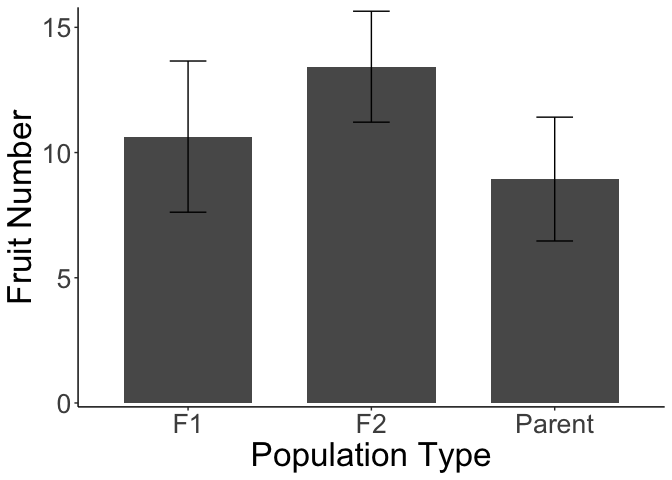
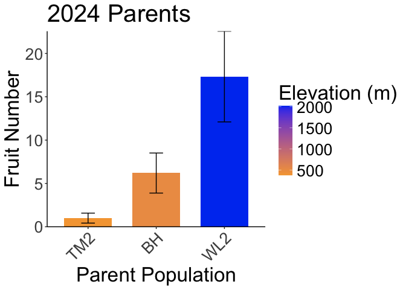
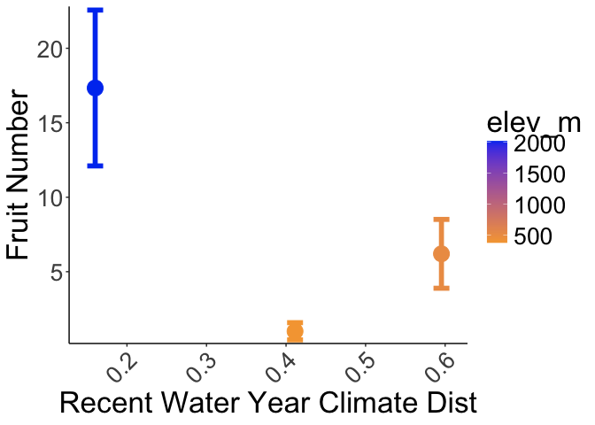
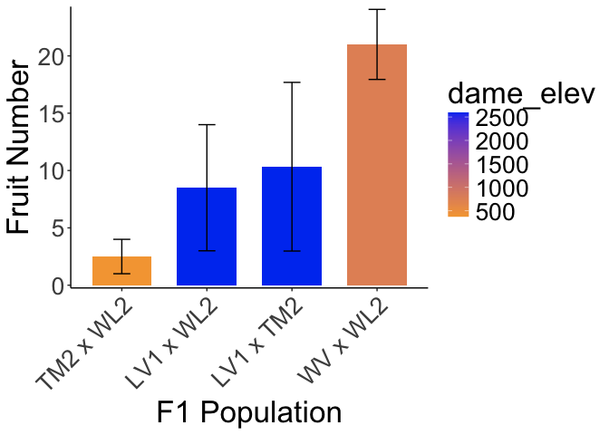
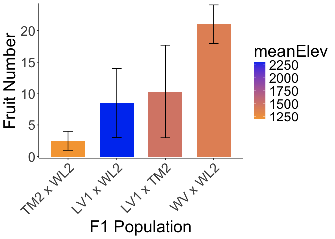
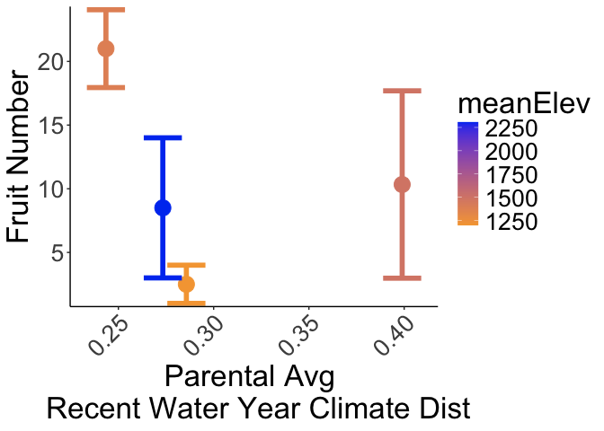
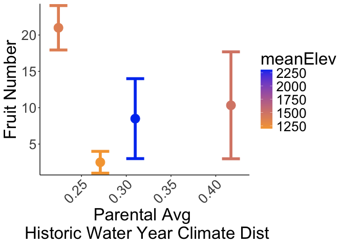
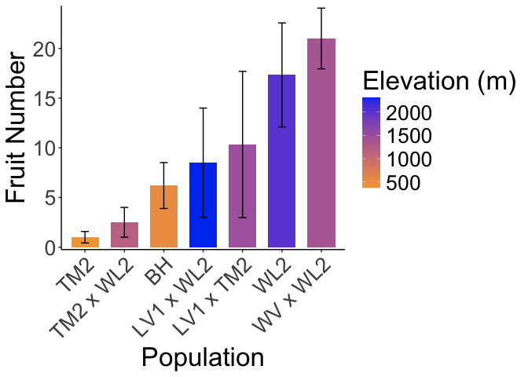
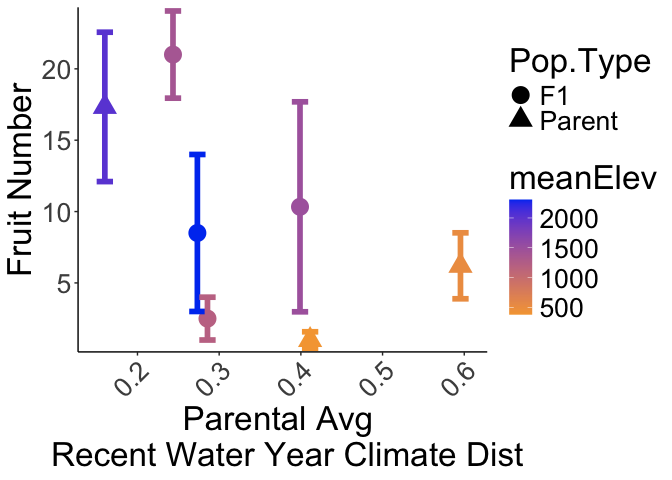

# Fruit production of plants planted in 2024

## Libraries

``` r
library(tidyverse)
```

```
## ── Attaching core tidyverse packages ──────────────────────── tidyverse 2.0.0 ──
## ✔ dplyr     1.1.4     ✔ readr     2.1.5
## ✔ forcats   1.0.0     ✔ stringr   1.5.1
## ✔ ggplot2   3.5.1     ✔ tibble    3.2.1
## ✔ lubridate 1.9.3     ✔ tidyr     1.3.1
## ✔ purrr     1.0.2     
## ── Conflicts ────────────────────────────────────────── tidyverse_conflicts() ──
## ✖ dplyr::filter() masks stats::filter()
## ✖ dplyr::lag()    masks stats::lag()
## ℹ Use the conflicted package (<http://conflicted.r-lib.org/>) to force all conflicts to become errors
```

``` r
sem <- function(x, na.rm=FALSE) {           #for calculating standard error
  sd(x,na.rm=na.rm)/sqrt(length(na.omit(x)))
} 
```

## Load data

### Annual census

``` r
ann_cens_2025 <- read_csv("../input/WL2_2025_Data/CorrectedCSVs/WL2_ann_cens_20251006_corrected.csv") 
```

```
## New names:
## Rows: 972 Columns: 14
## ── Column specification
## ──────────────────────────────────────────────────────── Delimiter: "," chr
## (8): bed, col, Unique.ID, phen, survey.date, collected.date, survey.note... dbl
## (6): row, total.branch, diam.mm, num.flw, num.fruit, long.fruit.cm
## ℹ Use `spec()` to retrieve the full column specification for this data. ℹ
## Specify the column types or set `show_col_types = FALSE` to quiet this message.
## • `` -> `...14`
```

``` r
ann_cens_2025 %>% filter(!is.na(Unique.ID), Unique.ID!="buffer") %>% filter(is.na(as.numeric(Unique.ID))) #only non-numeric ID is yose plant from 2023
```

```
## Warning: There was 1 warning in `filter()`.
## ℹ In argument: `is.na(as.numeric(Unique.ID))`.
## Caused by warning:
## ! NAs introduced by coercion
```

```
## # A tibble: 1 × 14
##   bed     row col   Unique.ID phen  total.branch diam.mm num.flw num.fruit
##   <chr> <dbl> <chr> <chr>     <chr>        <dbl>   <dbl>   <dbl>     <dbl>
## 1 G         5 D     YO7_5_7   P                1    1.22       0         3
## # ℹ 5 more variables: long.fruit.cm <dbl>, survey.date <chr>,
## #   collected.date <chr>, survey.notes <chr>, ...14 <chr>
```

``` r
ann_cens_2025 %>% filter(!is.na(...14)) #carry over notes 
```

```
## # A tibble: 2 × 14
##   bed     row col   Unique.ID phen  total.branch diam.mm num.flw num.fruit
##   <chr> <dbl> <chr> <chr>     <chr>        <dbl>   <dbl>   <dbl>     <dbl>
## 1 D        43 C     363       P                1    1.63       0         4
## 2 F        19 B     2341      P                1    2.5        0         3
## # ℹ 5 more variables: long.fruit.cm <dbl>, survey.date <chr>,
## #   collected.date <chr>, survey.notes <chr>, ...14 <chr>
```

``` r
ann_cens_2025 %>% filter(!is.na(survey.date)) #92 plants with annual census data 
```

```
## # A tibble: 92 × 14
##    bed     row col   Unique.ID phen  total.branch diam.mm num.flw num.fruit
##    <chr> <dbl> <chr> <chr>     <chr>        <dbl>   <dbl>   <dbl>     <dbl>
##  1 C        21 B     698       P                1    2.89       0        30
##  2 C        24 B     118       P                1    1.78       0        27
##  3 C        25 B     1459      P                1    3.1        0        24
##  4 C        28 B     2557      P                1    1.72       0         1
##  5 C        30 B     341       P                1    3.4        0        20
##  6 C        31 A     1228      P                1    2.38       0        25
##  7 C        33 B     183       P                1    1.81       0         1
##  8 C        37 B     1289      P                1    1.72       0         4
##  9 C        43 A     73        P                1    1.58       0        12
## 10 C        50 B     404       P                1    2.57       0        12
## # ℹ 82 more rows
## # ℹ 5 more variables: long.fruit.cm <dbl>, survey.date <chr>,
## #   collected.date <chr>, survey.notes <chr>, ...14 <chr>
```

``` r
ann_cens_2025 %>% filter(is.na(survey.date)) %>% filter(!is.na(num.fruit)) #no rows with fruit number but no survey date 
```

```
## # A tibble: 0 × 14
## # ℹ 14 variables: bed <chr>, row <dbl>, col <chr>, Unique.ID <chr>, phen <chr>,
## #   total.branch <dbl>, diam.mm <dbl>, num.flw <dbl>, num.fruit <dbl>,
## #   long.fruit.cm <dbl>, survey.date <chr>, collected.date <chr>,
## #   survey.notes <chr>, ...14 <chr>
```

``` r
names(ann_cens_2025)
```

```
##  [1] "bed"            "row"            "col"            "Unique.ID"     
##  [5] "phen"           "total.branch"   "diam.mm"        "num.flw"       
##  [9] "num.fruit"      "long.fruit.cm"  "survey.date"    "collected.date"
## [13] "survey.notes"   "...14"
```

## Pop Info 

``` r
pop_info_2025 <- read_csv("../input/WL2_2025_Data/2025_Pop_Loc_Info Updated.csv") %>% 
  select(status:Unique.ID)
```

```
## Rows: 976 Columns: 16
## ── Column specification ────────────────────────────────────────────────────────
## Delimiter: ","
## chr (10): status, block, bed, col, pop.id, mf, dame_mf, sire_mf, Unique.ID, ...
## dbl  (6): bed.block.order, bed.order, AB.CD.order, column.order, row, rep
## 
## ℹ Use `spec()` to retrieve the full column specification for this data.
## ℹ Specify the column types or set `show_col_types = FALSE` to quiet this message.
```

## Elevation Info / Climate distance

``` r
clim_dist_2024 <- read_csv("../output/Climate/WL2_2024_Clim_Dist.csv") %>% select(-conf.low, -conf.high)
```

```
## Rows: 20 Columns: 11
## ── Column specification ────────────────────────────────────────────────────────
## Delimiter: ","
## chr (4): parent.pop, elevation.group, timeframe, Season
## dbl (7): elev_m, Lat, Long, Year, Gowers_Dist, conf.low, conf.high
## 
## ℹ Use `spec()` to retrieve the full column specification for this data.
## ℹ Specify the column types or set `show_col_types = FALSE` to quiet this message.
```

``` r
head(clim_dist_2024)
```

```
## # A tibble: 6 × 9
##   parent.pop elevation.group elev_m   Lat  Long timeframe Season      Year
##   <chr>      <chr>            <dbl> <dbl> <dbl> <chr>     <chr>      <dbl>
## 1 WL2        high             2020.  38.8 -120. Recent    Water Year  2024
## 2 SQ3        high             2373.  36.7 -119. Recent    Water Year  2024
## 3 WL1        mid              1614.  38.8 -120. Recent    Water Year  2024
## 4 WV         mid               749.  40.7 -123. Recent    Water Year  2024
## 5 YO11       high             2872.  37.9 -119. Recent    Water Year  2024
## 6 LV1        high             2593.  40.5 -122. Recent    Water Year  2024
## # ℹ 1 more variable: Gowers_Dist <dbl>
```

``` r
clim_dist_2024_wide <- clim_dist_2024 %>% 
  pivot_wider(names_from = timeframe, values_from = Gowers_Dist, names_prefix = "GD_") %>% 
  rename(pop.id=parent.pop)
```

## Merge

``` r
ann_cens_2025_pops <- ann_cens_2025 %>% 
  select(bed:Unique.ID, phen, num.flw, num.fruit, survey.date) %>% 
  left_join(pop_info_2025) %>% 
  filter(Unique.ID!="buffer", !is.na(Unique.ID))
```

```
## Joining with `by = join_by(bed, row, col, Unique.ID)`
```

## 2024 Plants with Rep Only

``` r
fruitn_2024plants <- ann_cens_2025_pops %>% 
  filter(status=="2024-survivor") %>% 
  mutate(Pop.Type=if_else(str_detect(pop.id, "\\) x"), "F2",
                          if_else(str_detect(pop.id, "x"), "F1",
                                  "Parent"
                          ))) %>% 
  filter(!is.na(num.fruit))
dim(fruitn_2024plants) #70 plants 
```

```
## [1] 70 16
```

## Plot by pop type 

``` r
fruitn_2024plants %>% 
  group_by(Pop.Type) %>% 
  summarise(meanFruits=mean(num.fruit), semFruits=sem(num.fruit)) %>% 
  ggplot(aes(x=Pop.Type, y=meanFruits)) +
  geom_col(width = 0.7,position = position_dodge(0.75)) + 
  geom_errorbar(aes(ymin=meanFruits-semFruits,ymax=meanFruits+semFruits),width=.2, position = 
                  position_dodge(0.75)) +
  theme_classic() + 
  scale_y_continuous(expand = c(0.01, 0.00)) +
  labs(y="Fruit Number", x="Population Type") +
  theme(text=element_text(size=25))
```

<!-- -->

``` r
ggsave("../output/WL2_Traits/WL2_FruitN_2024Plants_PopType.png", width = 10, height = 8, units = "in")
```

## Means by pop

``` r
by_pop_fruits <- fruitn_2024plants %>% 
  group_by(pop.id, Pop.Type) %>% 
  summarise(N_Fruits = sum(!is.na(num.fruit)), mean_Fruits = mean(num.fruit,na.rm=(TRUE)), 
            sem_fruits=sem(num.fruit, na.rm=(TRUE)))
```

```
## `summarise()` has grouped output by 'pop.id'. You can override using the
## `.groups` argument.
```

## Plot by pops 

### Parents

``` r
by_pop_parents_fruits <- by_pop_fruits %>% 
  filter(Pop.Type == "Parent") %>% 
  left_join(clim_dist_2024_wide)
```

```
## Joining with `by = join_by(pop.id)`
```

``` r
head(by_pop_parents_fruits)
```

```
## # A tibble: 6 × 13
## # Groups:   pop.id [6]
##   pop.id Pop.Type N_Fruits mean_Fruits sem_fruits elevation.group elev_m   Lat
##   <chr>  <chr>       <int>       <dbl>      <dbl> <chr>            <dbl> <dbl>
## 1 BH     Parent          5         6.2      2.31  low               511.  37.4
## 2 DPR    Parent          1         2       NA     mid              1019.  39.2
## 3 TM2    Parent          3         1        0.577 low               379.  39.6
## 4 WL1    Parent          1         9       NA     mid              1614.  38.8
## 5 WL2    Parent          6        17.3      5.23  high             2020.  38.8
## 6 YO11   Parent          1         3       NA     high             2872.  37.9
## # ℹ 5 more variables: Long <dbl>, Season <chr>, Year <dbl>, GD_Recent <dbl>,
## #   GD_Historic <dbl>
```

``` r
by_pop_parents_fruits %>% 
  filter(N_Fruits>1) %>% 
  ggplot(aes(x=fct_reorder(pop.id, mean_Fruits), y=mean_Fruits, fill=elev_m)) + 
  geom_col(width = 0.7,position = position_dodge(0.75)) +
  geom_errorbar(aes(ymin=mean_Fruits-sem_fruits,ymax=mean_Fruits+sem_fruits),width=.2, position = 
                  position_dodge(0.75)) +
  labs(x="Parent Population", y="Fruit Number", fill="Elevation (m)", title="2024 Parents") +
  theme_classic() + 
  scale_y_continuous(expand = c(0, 0)) +
  scale_fill_gradient(low = "#F5A540", high = "#0043F0") +
  theme(text=element_text(size=25), axis.text.x = element_text(angle = 45, hjust = 1))
```

<!-- -->

``` r
ggsave("../output/WL2_Traits/WL2_Fruits_2024Plants_Parents.png", width = 14, height = 8, units = "in")

by_pop_parents_fruits %>% 
  filter(N_Fruits>1) %>%
  ggplot(aes(x=GD_Recent, y=mean_Fruits, group=pop.id, colour=elev_m)) + 
  geom_point(size=6) + 
  geom_errorbar(aes(ymin=mean_Fruits-sem_fruits,ymax=mean_Fruits+sem_fruits),width=.02, linewidth = 2) +
  theme_classic() + 
  scale_colour_gradient(low = "#F5A540", high = "#0043F0") +
  scale_y_continuous(expand = c(0.01, 0.02)) +
  labs(x="Recent Water Year Climate Dist", y="Fruit Number") +
  theme(text=element_text(size=25), axis.text.x = element_text(angle = 45, hjust = 1))
```

<!-- -->

``` r
ggsave("../output/WL2_Traits/WL2_Fruits_2024Plants_Parents_RecentCD.png", width = 14, height = 8, units = "in")

by_pop_parents_fruits %>% 
  filter(N_Fruits>1) %>%
  ggplot(aes(x=GD_Historic, y=mean_Fruits, group=pop.id, colour=elev_m)) + 
  geom_point(size=6) + 
  geom_errorbar(aes(ymin=mean_Fruits-sem_fruits,ymax=mean_Fruits+sem_fruits),width=.02, linewidth = 2) +
  theme_classic() + 
  scale_colour_gradient(low = "#F5A540", high = "#0043F0") +
  scale_y_continuous(expand = c(0.01, 0.02)) +
  labs(x="Historic Water Year Climate Dist", y="Fruit Number") +
  theme(text=element_text(size=25), axis.text.x = element_text(angle = 45, hjust = 1))
```

<!-- -->

``` r
ggsave("../output/WL2_Traits/WL2_Fruits_2024Plants_Parents_HistoricCD.png", width = 14, height = 8, units = "in")
```

### F1s

``` r
by_pop_fruits_F1 <- by_pop_fruits %>% 
  filter(Pop.Type == "F1") %>% 
  separate(pop.id, c("dame_pop",NA, "sire_pop"), remove = FALSE) %>% 
  left_join(clim_dist_2024_wide, by=join_by(dame_pop==pop.id)) %>% 
  select(-elevation.group, -Season, -Year) %>% 
  rename(dame_elev=elev_m, dame_Lat=Lat, dame_Long=Long, dame_GD_Recent=GD_Recent, dame_GD_Historic=GD_Historic) %>% 
  left_join(clim_dist_2024_wide, by=join_by(sire_pop==pop.id)) %>% 
  select(-elevation.group, -Season, -Year) %>% 
  rename(sire_elev=elev_m, sire_Lat=Lat, sire_Long=Long, sire_GD_Recent=GD_Recent, sire_GD_Historic=GD_Historic) %>% 
  mutate(meanElev=(dame_elev+sire_elev)/2, 
         mean_GD_Recent=(dame_GD_Recent+sire_GD_Recent)/2, 
         mean_GD_Historic=(dame_GD_Historic+sire_GD_Historic)/2)
head(by_pop_fruits_F1)
```

```
## # A tibble: 5 × 20
## # Groups:   pop.id [5]
##   pop.id    dame_pop sire_pop Pop.Type N_Fruits mean_Fruits sem_fruits dame_elev
##   <chr>     <chr>    <chr>    <chr>       <int>       <dbl>      <dbl>     <dbl>
## 1 LV1 x TM2 LV1      TM2      F1              3        10.3       7.36     2593.
## 2 LV1 x WL2 LV1      WL2      F1              2         8.5       5.5      2593.
## 3 TM2 x WL2 TM2      WL2      F1              2         2.5       1.5       379.
## 4 WV x TM2  WV       TM2      F1              1         1        NA         749.
## 5 WV x WL2  WV       WL2      F1              3        21         3.06      749.
## # ℹ 12 more variables: dame_Lat <dbl>, dame_Long <dbl>, dame_GD_Recent <dbl>,
## #   dame_GD_Historic <dbl>, sire_elev <dbl>, sire_Lat <dbl>, sire_Long <dbl>,
## #   sire_GD_Recent <dbl>, sire_GD_Historic <dbl>, meanElev <dbl>,
## #   mean_GD_Recent <dbl>, mean_GD_Historic <dbl>
```

``` r
by_pop_fruits_F1 %>% 
  filter(N_Fruits>1) %>% 
  ggplot(aes(x=fct_reorder(pop.id, mean_Fruits), y=mean_Fruits, fill=dame_elev)) + 
  geom_col(width = 0.7,position = position_dodge(0.75)) + 
  geom_errorbar(aes(ymin=mean_Fruits-sem_fruits,ymax=mean_Fruits+sem_fruits),width=.2, position = 
                  position_dodge(0.75)) +
  theme_classic() + 
  scale_fill_gradient(low = "#F5A540", high = "#0043F0") +
  scale_y_continuous(expand = c(0.01, 0)) +
  labs(x="F1 Population", y="Fruit Number") +
  theme(text=element_text(size=25), axis.text.x = element_text(angle = 45, hjust = 1))
```

<!-- -->

``` r
by_pop_fruits_F1 %>% 
  filter(N_Fruits>1) %>% 
  ggplot(aes(x=fct_reorder(pop.id, mean_Fruits), y=mean_Fruits, fill=meanElev)) + 
  geom_col(width = 0.7,position = position_dodge(0.75)) + 
  geom_errorbar(aes(ymin=mean_Fruits-sem_fruits,ymax=mean_Fruits+sem_fruits),width=.2, position = 
                  position_dodge(0.75)) +
  theme_classic() + 
  scale_fill_gradient(low = "#F5A540", high = "#0043F0") +
  scale_y_continuous(expand = c(0.01, 0)) +
  labs(x="F1 Population", y="Fruit Number") +
  theme(text=element_text(size=25), axis.text.x = element_text(angle = 45, hjust = 1))
```

<!-- -->

``` r
ggsave("../output/WL2_Traits/WL2_Fruits_2024Plants_F1s.png", width = 14, height = 8, units = "in")

by_pop_fruits_F1 %>% 
  filter(N_Fruits>1) %>% 
  ggplot(aes(x=mean_GD_Recent, y=mean_Fruits, group=pop.id, colour=meanElev)) + 
  geom_point(size=6) + 
  geom_errorbar(aes(ymin=mean_Fruits-sem_fruits,ymax=mean_Fruits+sem_fruits),width=.02, linewidth = 2) +
  theme_classic() + 
  scale_colour_gradient(low = "#F5A540", high = "#0043F0") +
  scale_y_continuous(expand = c(0.01, 0.02)) +
  labs(x="Parental Avg \n Recent Water Year Climate Dist", y="Fruit Number") +
  theme(text=element_text(size=25), axis.text.x = element_text(angle = 45, hjust = 1))
```

<!-- -->

``` r
ggsave("../output/WL2_Traits/WL2_Fruits_2024Plants_F1s_RecentCD.png", width = 14, height = 8, units = "in")

by_pop_fruits_F1 %>% 
  filter(N_Fruits>1) %>% 
  ggplot(aes(x=mean_GD_Historic, y=mean_Fruits, group=pop.id, colour=meanElev)) + 
  geom_point(size=6) + 
  geom_errorbar(aes(ymin=mean_Fruits-sem_fruits,ymax=mean_Fruits+sem_fruits),width=.02, linewidth = 2) +
  theme_classic() + 
  scale_colour_gradient(low = "#F5A540", high = "#0043F0") +
  scale_y_continuous(expand = c(0.01, 0.02)) +
  labs(x="Parental Avg \n Historic Water Year Climate Dist", y="Fruit Number") +
  theme(text=element_text(size=25), axis.text.x = element_text(angle = 45, hjust = 1))
```

<!-- -->

``` r
ggsave("../output/WL2_Traits/WL2_Fruits_2024Plants_F1s_HistoricCD.png", width = 14, height = 8, units = "in")
```

### F1s + Parents

``` r
parents_F1s_combined <- by_pop_parents_fruits %>% 
  rename(meanElev=elev_m, mean_GD_Recent=GD_Recent, mean_GD_Historic=GD_Historic) %>% 
  bind_rows(by_pop_fruits_F1)

parents_F1s_combined %>%  
  filter(N_Fruits>1) %>% 
  ggplot(aes(x=fct_reorder(pop.id, mean_Fruits), y=mean_Fruits, fill=meanElev)) + 
  geom_col(width = 0.7,position = position_dodge(0.75)) + 
  geom_errorbar(aes(ymin=mean_Fruits-sem_fruits,ymax=mean_Fruits+sem_fruits),width=.2, position = 
                  position_dodge(0.75)) +
  theme_classic() + 
  scale_fill_gradient(low = "#F5A540", high = "#0043F0") +
  scale_y_continuous(expand = c(0.01, 0)) +
  labs(x="Population", y="Fruit Number", fill="Elevation (m)") +
  theme(text=element_text(size=25), axis.text.x = element_text(angle = 45, hjust = 1))
```

<!-- -->

``` r
ggsave("../output/WL2_Traits/WL2_Fruits_2024Plants_F1s_Parents.png", width = 14, height = 8, units = "in")

parents_F1s_combined %>% 
  filter(N_Fruits>1) %>% 
  ggplot(aes(x=mean_GD_Recent, y=mean_Fruits, group=pop.id, colour=meanElev)) + 
  geom_point(aes(shape=Pop.Type), size=6) + 
  geom_errorbar(aes(ymin=mean_Fruits-sem_fruits,ymax=mean_Fruits+sem_fruits),width=.02, linewidth = 2) +
  theme_classic() + 
  scale_colour_gradient(low = "#F5A540", high = "#0043F0") +
  scale_y_continuous(expand = c(0.01, 0.02)) +
  labs(x="Parental Avg \n Recent Water Year Climate Dist", y="Fruit Number") +
  theme(text=element_text(size=25), axis.text.x = element_text(angle = 45, hjust = 1))
```

<!-- -->

``` r
ggsave("../output/WL2_Traits/WL2_Fruits_2024Plants_F1s_Parents_RecentCD.png", width = 14, height = 8, units = "in")

parents_F1s_combined %>% 
  filter(N_Fruits>1) %>% 
  ggplot(aes(x=mean_GD_Historic, y=mean_Fruits, group=pop.id, colour=meanElev)) + 
  geom_point(aes(shape=Pop.Type), size=6) + 
  geom_errorbar(aes(ymin=mean_Fruits-sem_fruits,ymax=mean_Fruits+sem_fruits),width=.02, linewidth = 2) +
  theme_classic() + 
  scale_colour_gradient(low = "#F5A540", high = "#0043F0") +
  scale_y_continuous(expand = c(0.01, 0.02)) +
  labs(x="Parental Avg \n Historic Water Year Climate Dist", y="Fruit Number") +
  theme(text=element_text(size=25), axis.text.x = element_text(angle = 45, hjust = 1))
```

<!-- -->

``` r
ggsave("../output/WL2_Traits/WL2_Fruits_2024Plants_F1s_Parents_HistoricCD.png", width = 14, height = 8, units = "in")
```
