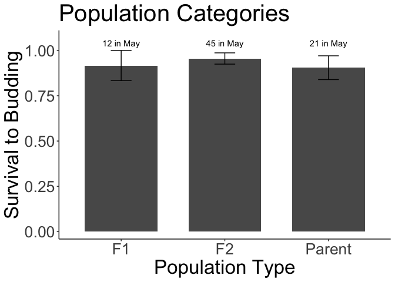

# Survival to Rep of plants planted in 2024 

## Libraries

``` r
library(tidyverse)
```

```
## ── Attaching core tidyverse packages ──────────────────────── tidyverse 2.0.0 ──
## ✔ dplyr     1.1.4     ✔ readr     2.1.5
## ✔ forcats   1.0.0     ✔ stringr   1.5.1
## ✔ ggplot2   3.5.1     ✔ tibble    3.2.1
## ✔ lubridate 1.9.3     ✔ tidyr     1.3.1
## ✔ purrr     1.0.2     
## ── Conflicts ────────────────────────────────────────── tidyverse_conflicts() ──
## ✖ dplyr::filter() masks stats::filter()
## ✖ dplyr::lag()    masks stats::lag()
## ℹ Use the conflicted package (<http://conflicted.r-lib.org/>) to force all conflicts to become errors
```

``` r
sem <- function(x, na.rm=FALSE) {           #for calculating standard error
  sd(x,na.rm=na.rm)/sqrt(length(na.omit(x)))
} 
```

## Load data

## Mort/pheno

``` r
mort_pheno_2025 <- read_csv("../input/WL2_2025_Data/CorrectedCSVs/WL2_mort_pheno_20250929_corrected.csv")
```

```
## New names:
## Rows: 972 Columns: 13
## ── Column specification
## ──────────────────────────────────────────────────────── Delimiter: "," chr
## (12): bed, col, Unique.ID, bud.date, flower.date, fruit.date, last.FL.da... dbl
## (1): row
## ℹ Use `spec()` to retrieve the full column specification for this data. ℹ
## Specify the column types or set `show_col_types = FALSE` to quiet this message.
## • `` -> `...13`
```

``` r
mort_pheno_2025 %>% filter(!is.na(Unique.ID), Unique.ID!="buffer") %>% filter(is.na(as.numeric(Unique.ID))) #only non-numeric ID is yose plant from 2023
```

```
## Warning: There was 1 warning in `filter()`.
## ℹ In argument: `is.na(as.numeric(Unique.ID))`.
## Caused by warning:
## ! NAs introduced by coercion
```

```
## # A tibble: 1 × 13
##   bed     row col   Unique.ID bud.date flower.date fruit.date last.FL.date
##   <chr> <dbl> <chr> <chr>     <chr>    <chr>       <chr>      <chr>       
## 1 G         5 D     YO7_5_7   6/27/25  7/3/25      7/18/25    7/25/25     
## # ℹ 5 more variables: last.FR.date <chr>, death.date <chr>,
## #   round2.rep.dates <chr>, survey.notes <chr>, ...13 <chr>
```

## Pop Info 

``` r
pop_info_2025 <- read_csv("../input/WL2_2025_Data/2025_Pop_Loc_Info Updated.csv") %>% 
  select(status:Unique.ID)
```

```
## Rows: 976 Columns: 16
## ── Column specification ────────────────────────────────────────────────────────
## Delimiter: ","
## chr (10): status, block, bed, col, pop.id, mf, dame_mf, sire_mf, Unique.ID, ...
## dbl  (6): bed.block.order, bed.order, AB.CD.order, column.order, row, rep
## 
## ℹ Use `spec()` to retrieve the full column specification for this data.
## ℹ Specify the column types or set `show_col_types = FALSE` to quiet this message.
```

## Elevation Info / Climate distance

``` r
clim_dist_2024 <- read_csv("../output/Climate/WL2_2024_Clim_Dist.csv") %>% select(-conf.low, -conf.high)
```

```
## Rows: 20 Columns: 11
## ── Column specification ────────────────────────────────────────────────────────
## Delimiter: ","
## chr (4): parent.pop, elevation.group, timeframe, Season
## dbl (7): elev_m, Lat, Long, Year, Gowers_Dist, conf.low, conf.high
## 
## ℹ Use `spec()` to retrieve the full column specification for this data.
## ℹ Specify the column types or set `show_col_types = FALSE` to quiet this message.
```

``` r
head(clim_dist_2024)
```

```
## # A tibble: 6 × 9
##   parent.pop elevation.group elev_m   Lat  Long timeframe Season      Year
##   <chr>      <chr>            <dbl> <dbl> <dbl> <chr>     <chr>      <dbl>
## 1 WL2        high             2020.  38.8 -120. Recent    Water Year  2024
## 2 SQ3        high             2373.  36.7 -119. Recent    Water Year  2024
## 3 WL1        mid              1614.  38.8 -120. Recent    Water Year  2024
## 4 WV         mid               749.  40.7 -123. Recent    Water Year  2024
## 5 YO11       high             2872.  37.9 -119. Recent    Water Year  2024
## 6 LV1        high             2593.  40.5 -122. Recent    Water Year  2024
## # ℹ 1 more variable: Gowers_Dist <dbl>
```

``` r
clim_dist_2024_wide <- clim_dist_2024 %>% 
  pivot_wider(names_from = timeframe, values_from = Gowers_Dist, names_prefix = "GD_") %>% 
  rename(pop=parent.pop)
```

## Merge

``` r
mort_pheno_2025_pops <- mort_pheno_2025 %>% 
  select(bed:Unique.ID, bud.date, death.date) %>% 
  left_join(pop_info_2025) %>% 
  filter(Unique.ID!="buffer", !is.na(Unique.ID))
```

```
## Joining with `by = join_by(bed, row, col, Unique.ID)`
```

## 2024 Plants Only

``` r
mort_pheno_2025_pops_2024plants <- mort_pheno_2025_pops %>% 
  filter(status=="2024-survivor") %>% 
  mutate(Pop.Type=if_else(str_detect(pop.id, "\\) x"), "F2",
                          if_else(str_detect(pop.id, "x"), "F1",
                                  "Parent"
                          )))
dim(mort_pheno_2025_pops_2024plants) #only 78 plants - lost one?
```

```
## [1] 78 14
```

``` r
xtabs(~Pop.Type, data=mort_pheno_2025_pops_2024plants) #one F2 missing - INVESTIGATE THIS LATER!!
```

```
## Pop.Type
##     F1     F2 Parent 
##     12     45     21
```

``` r
mort_pheno_2025_pops_2024plants %>% filter(is.na(bud.date)) #only 5 plants did not initiate rep 
```

```
## # A tibble: 5 × 14
##   bed     row col   Unique.ID bud.date death.date status      block pop.id mf   
##   <chr> <dbl> <chr> <chr>     <chr>    <chr>      <chr>       <chr> <chr>  <chr>
## 1 C        32 A     939       <NA>     6/9/25     2024-survi… <NA>  (YO11… <NA> 
## 2 C        58 A     395       <NA>     7/3/25     2024-survi… <NA>  BH     <NA> 
## 3 D        17 B     403       <NA>     7/18/25    2024-survi… <NA>  BH     <NA> 
## 4 D        35 C     204       <NA>     6/27/25    2024-survi… <NA>  WV x … <NA> 
## 5 E        43 A     369       <NA>     6/3/25     2024-survi… <NA>  (TM2 … <NA> 
## # ℹ 4 more variables: dame_mf <chr>, sire_mf <chr>, rep <dbl>, Pop.Type <chr>
```

``` r
#2 BH  
#2 WL2 BC1s (with TM2 and YO11)
#1 F1 (WV x TM2)
```

## Surv to Budding of 2024 Plants

``` r
repsurv_2024plants <- mort_pheno_2025_pops_2024plants %>% 
  select(Pop.Type, bed:col, pop.id:rep, Unique.ID:death.date) %>% 
  mutate(Surv_to_Rep = if_else(is.na(bud.date), 0, 1)) 
```

## Plot by pop type 

``` r
repsurv_2024plants %>% 
  group_by(Pop.Type) %>% 
  summarise(meanSurv=mean(Surv_to_Rep), semSurv=sem(Surv_to_Rep)) %>% 
  ggplot(aes(x=Pop.Type, y=meanSurv)) +
  geom_col(width = 0.7,position = position_dodge(0.75)) + 
  geom_errorbar(aes(ymin=meanSurv-semSurv,ymax=meanSurv+semSurv),width=.2, position = 
                  position_dodge(0.75)) +
  theme_classic() + 
  scale_y_continuous(expand = c(0.01, 0.02), limits = c(-0.01, 1.08)) +
  labs(y="Survival to Budding", x="Population Type", , title="Population Categories") +
  annotate("text", x = 1, y= 1.04, label = "12 in May") +
  annotate("text", x = 2, y= 1.04, label = "45 in May") +
  annotate("text", x = 3, y= 1.04, label = "21 in May") +
  theme(text=element_text(size=25))
```

<!-- -->

``` r
ggsave("../output/WL2_Traits/WL2_RepSurv_2024Plants_PopType.png", width = 10, height = 8, units = "in")
```
