# Checking the effects of initial size on establishment probability

Establishment = survival first 3 weeks post transplant

To Do:

-   Plot the model predictions - easier to interpret than population averages

-   Analyze parent pops, F1s (put the two parents as random effects), F2s separately

    -   First try one pool is parents and the others is crosses

-   What fraction of the plants are at the “good” size at week 3?


## Libraries


``` r
library(tidyverse)
```

```
## ── Attaching core tidyverse packages ──────────────────────── tidyverse 2.0.0 ──
## ✔ dplyr     1.1.4     ✔ readr     2.1.5
## ✔ forcats   1.0.0     ✔ stringr   1.5.1
## ✔ ggplot2   3.5.1     ✔ tibble    3.2.1
## ✔ lubridate 1.9.3     ✔ tidyr     1.3.1
## ✔ purrr     1.0.2     
## ── Conflicts ────────────────────────────────────────── tidyverse_conflicts() ──
## ✖ dplyr::filter() masks stats::filter()
## ✖ dplyr::lag()    masks stats::lag()
## ℹ Use the conflicted package (<http://conflicted.r-lib.org/>) to force all conflicts to become errors
```

``` r
library(lme4)
```

```
## Loading required package: Matrix
## 
## Attaching package: 'Matrix'
## 
## The following objects are masked from 'package:tidyr':
## 
##     expand, pack, unpack
```

## Load Initial Size


``` r
initial_size <- read_csv("../input/WL2_2024_Data/CorrectedCSVs/WL2_Initial_DNA_size_survey_20240607_corrected.csv") %>% 
  mutate(unique.ID=as.character(unique.ID)) %>% 
  select(unique.ID:long.leaf.cm)
```

```
## Rows: 1515 Columns: 9
## ── Column specification ────────────────────────────────────────────────────────
## Delimiter: ","
## chr (4): cryo.box, cryo.pos, DNA.y.n, notes
## dbl (5): rack, unique.ID, height.cm, hypocotyl. length.cm, long.leaf.cm
## 
## ℹ Use `spec()` to retrieve the full column specification for this data.
## ℹ Specify the column types or set `show_col_types = FALSE` to quiet this message.
```

``` r
head(initial_size)
```

```
## # A tibble: 6 × 4
##   unique.ID height.cm `hypocotyl. length.cm` long.leaf.cm
##   <chr>         <dbl>                  <dbl>        <dbl>
## 1 1               1.4                    0.8          0.6
## 2 2               0.8                    0.4          0.5
## 3 3               1.2                    0.5          0.6
## 4 4               1.3                    0.6          1  
## 5 5               1.7                    0.9          1.5
## 6 6               1.7                    1.2          1.2
```

## Load Survival


``` r
wl2_surv <- read_csv("../input/WL2_2024_Data/CorrectedCSVs/WL2_mort_pheno_20241023_corrected.csv") %>% 
  select(block:unique.ID, death.date, missing.date, survey.notes)
```

```
## Rows: 1217 Columns: 13
## ── Column specification ────────────────────────────────────────────────────────
## Delimiter: ","
## chr (12): block, bed, col, unique.ID, bud.date, flower.date, fruit.date, las...
## dbl  (1): row
## 
## ℹ Use `spec()` to retrieve the full column specification for this data.
## ℹ Specify the column types or set `show_col_types = FALSE` to quiet this message.
```

``` r
head(wl2_surv)
```

```
## # A tibble: 6 × 8
##   block bed     row col   unique.ID death.date missing.date survey.notes        
##   <chr> <chr> <dbl> <chr> <chr>     <chr>      <chr>        <chr>               
## 1 <NA>  A         1 A     TM2_6_11  <NA>       <NA>         TM2 fruiting from 2…
## 2 <NA>  A         6 B     CC_3_3    6/18/24    <NA>         <NA>                
## 3 <NA>  A        16 B     BH_3_3    6/18/24    <NA>         6/18/24 No tag      
## 4 <NA>  A        17 A     BH_7_3    10/2/24    <NA>         <NA>                
## 5 <NA>  A        18 A     BH_4_3    8/20/24    <NA>         6/18/24 No tag /mis…
## 6 <NA>  A        24 A     WL2_7_9   10/2/24    <NA>         <NA>
```

## Load pop info


``` r
pop_info <- read_csv("../input/WL2_2024_Data/Final_2023_2024_Pop_Loc_Info.csv") %>% 
  select(Pop.Type:bed, row=bedrow, col=bedcol, pop:unique.ID)
```

```
## Rows: 1217 Columns: 15
## ── Column specification ────────────────────────────────────────────────────────
## Delimiter: ","
## chr (8): Pop.Type, status, block, loc, bed, bedcol, pop, unique.ID
## dbl (7): bed.block.order, bed.order, AB.CD.order, column.order, bedrow, mf, rep
## 
## ℹ Use `spec()` to retrieve the full column specification for this data.
## ℹ Specify the column types or set `show_col_types = FALSE` to quiet this message.
```

``` r
unique(pop_info$Pop.Type)
```

```
## [1] "2023-TM2-fruit" "2023-survivor"  NA               "F2"            
## [5] "Parent"         "F1"
```

``` r
unique(pop_info$status)
```

```
## [1] "2023-TM2-fruit" "2023-survivor"  "buffer"         "available"     
## [5] NA
```

## Merge


``` r
size_surv <- left_join(wl2_surv, initial_size)
```

```
## Joining with `by = join_by(unique.ID)`
```

``` r
size_surv_pops <- left_join(pop_info, size_surv)
```

```
## Joining with `by = join_by(block, bed, row, col, unique.ID)`
```

``` r
size_surv_2024pops <- size_surv_pops %>% filter(Pop.Type != "2023-TM2-fruit", Pop.Type != "2023-survivor")
unique(size_surv_2024pops$death.date)
```

```
##  [1] "7/2/24"   "7/23/24"  NA         "7/9/24"   "7/16/24"  "6/25/24" 
##  [7] "6/18/24"  "9/3/24"   "8/13/24"  "7/30/24"  "8/6/24"   "10/9/24" 
## [13] "8/20/24"  "9/24/24"  "10/16/24" "9/17/24"  "8/27/24"  "10/2/24" 
## [19] "9/10/24"
```

``` r
unique(size_surv_2024pops$missing.date)
```

```
## [1] NA         "10/16/24" "7/9/24"   "10/23/24"
```

## Establishment


``` r
establishment <- size_surv_2024pops %>% 
  mutate(Est_Surv=if_else(is.na(death.date), 1, 
                          if_else(death.date=="6/18/24" | death.date=="6/25/24" | death.date=="7/2/24", 0,
                                       1))) %>% 
  mutate(Est_Surv = if_else(is.na(missing.date), Est_Surv, 
                            if_else(missing.date=="6/25/24", 0, Est_Surv)))

head(establishment)
```

```
## # A tibble: 6 × 18
##   Pop.Type status    block loc   bed     row col   pop        mf   rep unique.ID
##   <chr>    <chr>     <chr> <chr> <chr> <dbl> <chr> <chr>   <dbl> <dbl> <chr>    
## 1 F2       available A     C_4_A C         4 A     (WV x …    NA    13 280      
## 2 F2       available A     C_4_B C         4 B     (LV1 x…    NA     7 949      
## 3 Parent   available A     C_5_A C         5 A     TM2        NA    70 540      
## 4 F2       available A     C_5_B C         5 B     (TM2 x…    NA    13 317      
## 5 F2       available A     C_6_B C         6 B     (WL2 x…    NA    14 1175     
## 6 F2       available A     C_7_A C         7 A     (TM2 x…    NA    10 1091     
## # ℹ 7 more variables: death.date <chr>, missing.date <chr>, survey.notes <chr>,
## #   height.cm <dbl>, `hypocotyl. length.cm` <dbl>, long.leaf.cm <dbl>,
## #   Est_Surv <dbl>
```

``` r
establishment %>% filter(missing.date=="6/25/24") #double check it gave 0s to ones that went missing 
```

```
## # A tibble: 0 × 18
## # ℹ 18 variables: Pop.Type <chr>, status <chr>, block <chr>, loc <chr>,
## #   bed <chr>, row <dbl>, col <chr>, pop <chr>, mf <dbl>, rep <dbl>,
## #   unique.ID <chr>, death.date <chr>, missing.date <chr>, survey.notes <chr>,
## #   height.cm <dbl>, hypocotyl. length.cm <dbl>, long.leaf.cm <dbl>,
## #   Est_Surv <dbl>
```

## Quick Plots


``` r
establishment %>% 
  ggplot(aes(`hypocotyl. length.cm`, Est_Surv)) +
  geom_point()
```

```
## Warning: Removed 7 rows containing missing values or values outside the scale range
## (`geom_point()`).
```

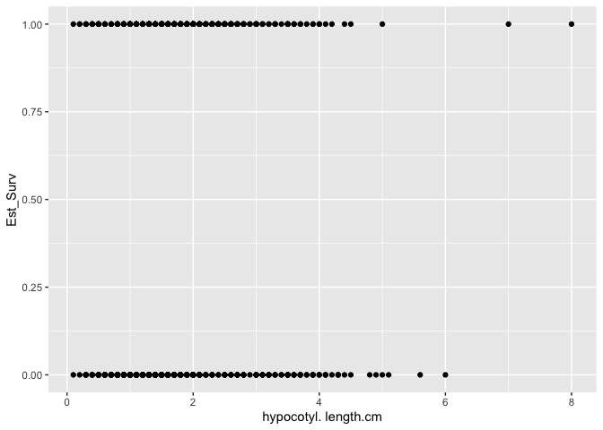<!-- -->

``` r
establishment %>% 
  ggplot(aes(height.cm, Est_Surv)) +
  geom_point()
```

```
## Warning: Removed 6 rows containing missing values or values outside the scale range
## (`geom_point()`).
```

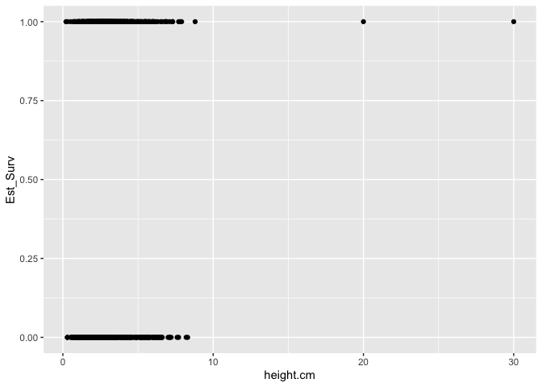<!-- -->

``` r
establishment %>% 
  ggplot(aes(long.leaf.cm, Est_Surv)) +
  geom_point()
```

```
## Warning: Removed 9 rows containing missing values or values outside the scale range
## (`geom_point()`).
```

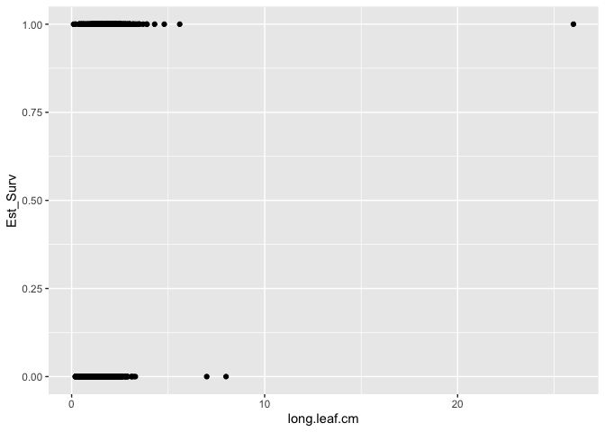<!-- -->

## PopType Averages


``` r
est_summary <- establishment %>% 
  group_by(Pop.Type) %>% 
  summarise(meanEst=mean(Est_Surv, na.rm=TRUE), 
            meanHyp = mean(`hypocotyl. length.cm`, na.rm=TRUE),
            meanHeight = mean(height.cm, na.rm=TRUE), 
            meanLength = mean(long.leaf.cm, na.rm=TRUE))
est_summary
```

```
## # A tibble: 3 × 5
##   Pop.Type meanEst meanHyp meanHeight meanLength
##   <chr>      <dbl>   <dbl>      <dbl>      <dbl>
## 1 F1         0.532    1.79       3.12       1.67
## 2 F2         0.5      1.72       2.95       1.79
## 3 Parent     0.392    1.92       3.31       1.43
```

``` r
#F1s had the highest establishment success, parents the lowest 
#parents had largest hypocotyl lengths and F2s had the lowest
#parents were tallest, F2s the shortest
#F2s had longest leaves, parents had the shortest 
```

## Pop Averages


``` r
est_summary_pops <- establishment %>% 
  group_by(Pop.Type, pop) %>% 
  summarise(meanEst=mean(Est_Surv, na.rm=TRUE), 
            meanHyp = mean(`hypocotyl. length.cm`, na.rm=TRUE),
            meanHeight = mean(height.cm, na.rm=TRUE), 
            meanLength = mean(long.leaf.cm, na.rm=TRUE))
```

```
## `summarise()` has grouped output by 'Pop.Type'. You can override using the
## `.groups` argument.
```

``` r
est_summary_pops %>% 
  ggplot(aes(x=meanHyp, y=meanEst)) +
  geom_point() 
```

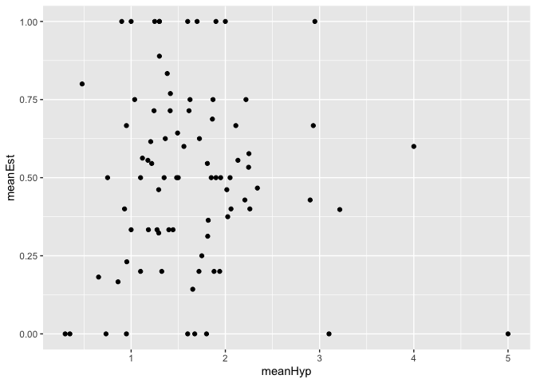<!-- -->

``` r
est_summary_pops %>% 
  ggplot(aes(x=meanHyp, y=meanEst)) +
  geom_point() + 
  facet_wrap(~Pop.Type)
```

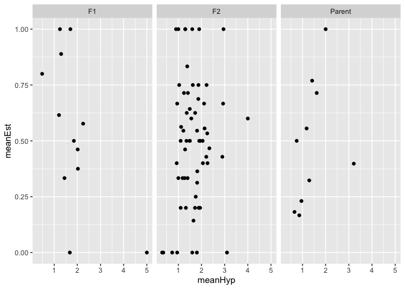<!-- -->

``` r
est_summary_pops %>% 
  ggplot(aes(x=meanHeight, y=meanEst)) +
  geom_point() 
```

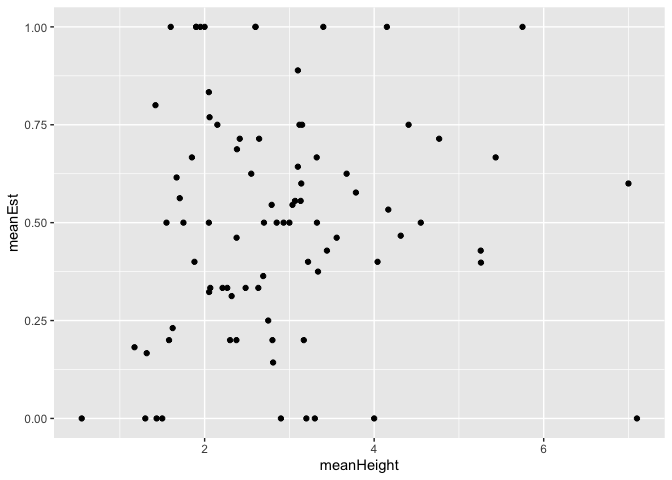<!-- -->

``` r
est_summary_pops %>% 
  ggplot(aes(x=meanHeight, y=meanEst)) +
  geom_point() + 
  facet_wrap(~Pop.Type)
```

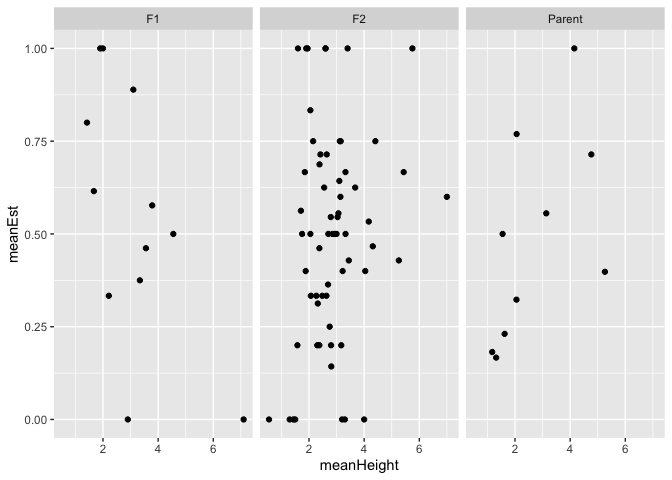<!-- -->

``` r
est_summary_pops %>% 
  ggplot(aes(x=meanLength, y=meanEst)) +
  geom_point() 
```

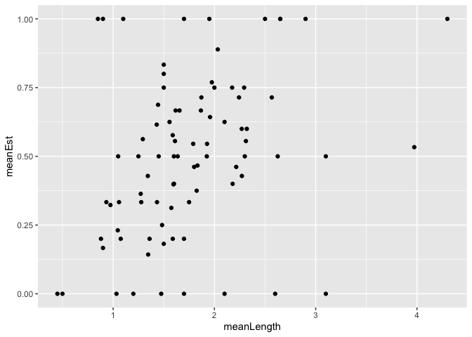<!-- -->

``` r
est_summary_pops %>% 
  ggplot(aes(x=meanLength, y=meanEst)) +
  geom_point() + 
  facet_wrap(~Pop.Type)
```

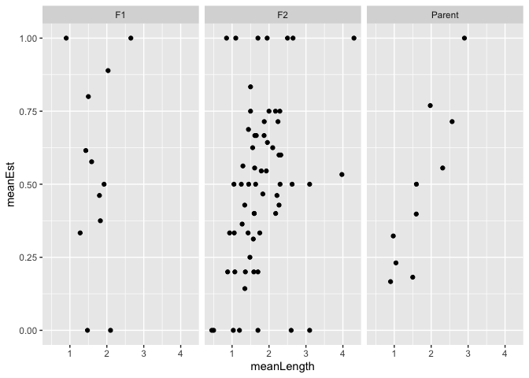<!-- -->

## Quick Models


``` r
hyp_for_models <- establishment %>% filter(!is.na(`hypocotyl. length.cm`))

hyp_est_model1 <- glm(Est_Surv ~ `hypocotyl. length.cm`, family=binomial, data=hyp_for_models)
summary(hyp_est_model1)
```

```
## 
## Call:
## glm(formula = Est_Surv ~ `hypocotyl. length.cm`, family = binomial, 
##     data = hyp_for_models)
## 
## Coefficients:
##                         Estimate Std. Error z value Pr(>|z|)
## (Intercept)            -0.150995   0.144428  -1.045    0.296
## `hypocotyl. length.cm`  0.004108   0.070433   0.058    0.953
## 
## (Dispersion parameter for binomial family taken to be 1)
## 
##     Null deviance: 1136.7  on 822  degrees of freedom
## Residual deviance: 1136.7  on 821  degrees of freedom
## AIC: 1140.7
## 
## Number of Fisher Scoring iterations: 3
```

``` r
hyp_est_model2 <- glmer(Est_Surv ~ `hypocotyl. length.cm` + (1|Pop.Type), family=binomial, data=hyp_for_models)
summary(hyp_est_model2) #no significant relationship with hypocotyl length 
```

```
## Generalized linear mixed model fit by maximum likelihood (Laplace
##   Approximation) [glmerMod]
##  Family: binomial  ( logit )
## Formula: Est_Surv ~ `hypocotyl. length.cm` + (1 | Pop.Type)
##    Data: hyp_for_models
## 
##      AIC      BIC   logLik deviance df.resid 
##   1138.5   1152.6   -566.3   1132.5      820 
## 
## Scaled residuals: 
##     Min      1Q  Median      3Q     Max 
## -1.0436 -0.9784 -0.8168  1.0181  1.2313 
## 
## Random effects:
##  Groups   Name        Variance Std.Dev.
##  Pop.Type (Intercept) 0.04608  0.2147  
## Number of obs: 823, groups:  Pop.Type, 3
## 
## Fixed effects:
##                        Estimate Std. Error z value Pr(>|z|)
## (Intercept)            -0.16621    0.19517  -0.852    0.394
## `hypocotyl. length.cm`  0.01927    0.07129   0.270    0.787
## 
## Correlation of Fixed Effects:
##             (Intr)
## `hypcty.l.` -0.657
```


``` r
height_for_models <- establishment %>% filter(!is.na(height.cm))

height_est_model1 <- glm(Est_Surv ~ height.cm, family=binomial, data=height_for_models)
summary(height_est_model1)
```

```
## 
## Call:
## glm(formula = Est_Surv ~ height.cm, family = binomial, data = height_for_models)
## 
## Coefficients:
##             Estimate Std. Error z value Pr(>|z|)   
## (Intercept) -0.47771    0.14839  -3.219  0.00129 **
## height.cm    0.10912    0.04262   2.560  0.01046 * 
## ---
## Signif. codes:  0 '***' 0.001 '**' 0.01 '*' 0.05 '.' 0.1 ' ' 1
## 
## (Dispersion parameter for binomial family taken to be 1)
## 
##     Null deviance: 1138.2  on 823  degrees of freedom
## Residual deviance: 1130.8  on 822  degrees of freedom
## AIC: 1134.8
## 
## Number of Fisher Scoring iterations: 3
```

``` r
height_est_model2 <- glmer(Est_Surv ~ height.cm + (1|Pop.Type), family=binomial, data=height_for_models)
summary(height_est_model2) #sig pos relationship with height (taller survived better)
```

```
## Generalized linear mixed model fit by maximum likelihood (Laplace
##   Approximation) [glmerMod]
##  Family: binomial  ( logit )
## Formula: Est_Surv ~ height.cm + (1 | Pop.Type)
##    Data: height_for_models
## 
##      AIC      BIC   logLik deviance df.resid 
##   1131.8   1146.0   -562.9   1125.8      821 
## 
## Scaled residuals: 
##     Min      1Q  Median      3Q     Max 
## -1.3463 -0.9408 -0.7403  1.0322  1.4411 
## 
## Random effects:
##  Groups   Name        Variance Std.Dev.
##  Pop.Type (Intercept) 0.05141  0.2267  
## Number of obs: 824, groups:  Pop.Type, 3
## 
## Fixed effects:
##             Estimate Std. Error z value Pr(>|z|)   
## (Intercept) -0.49358    0.20266  -2.435  0.01487 * 
## height.cm    0.11751    0.04287   2.741  0.00613 **
## ---
## Signif. codes:  0 '***' 0.001 '**' 0.01 '*' 0.05 '.' 0.1 ' ' 1
## 
## Correlation of Fixed Effects:
##           (Intr)
## height.cm -0.654
```


``` r
length_for_models <- establishment %>% filter(!is.na(long.leaf.cm))

length_est_model1 <- glm(Est_Surv ~ long.leaf.cm, family=binomial, data=length_for_models)
summary(length_est_model1)
```

```
## 
## Call:
## glm(formula = Est_Surv ~ long.leaf.cm, family = binomial, data = length_for_models)
## 
## Coefficients:
##              Estimate Std. Error z value Pr(>|z|)    
## (Intercept)   -1.3808     0.1883  -7.334 2.23e-13 ***
## long.leaf.cm   0.7653     0.1077   7.105 1.20e-12 ***
## ---
## Signif. codes:  0 '***' 0.001 '**' 0.01 '*' 0.05 '.' 0.1 ' ' 1
## 
## (Dispersion parameter for binomial family taken to be 1)
## 
##     Null deviance: 1134.2  on 820  degrees of freedom
## Residual deviance: 1074.2  on 819  degrees of freedom
## AIC: 1078.2
## 
## Number of Fisher Scoring iterations: 4
```

``` r
length_est_model2 <- glmer(Est_Surv ~ long.leaf.cm + (1|Pop.Type), family=binomial, data=length_for_models)
summary(length_est_model2) #sig pos relationship with height (longer survived better)
```

```
## Generalized linear mixed model fit by maximum likelihood (Laplace
##   Approximation) [glmerMod]
##  Family: binomial  ( logit )
## Formula: Est_Surv ~ long.leaf.cm + (1 | Pop.Type)
##    Data: length_for_models
## 
##      AIC      BIC   logLik deviance df.resid 
##   1080.2   1094.3   -537.1   1074.2      818 
## 
## Scaled residuals: 
##      Min       1Q   Median       3Q      Max 
## -10.4304  -0.8613  -0.6117   0.9600   1.9034 
## 
## Random effects:
##  Groups   Name        Variance Std.Dev.
##  Pop.Type (Intercept) 0.002199 0.04689 
## Number of obs: 821, groups:  Pop.Type, 3
## 
## Fixed effects:
##              Estimate Std. Error z value Pr(>|z|)    
## (Intercept)   -1.3724     0.2024  -6.781 1.19e-11 ***
## long.leaf.cm   0.7606     0.1139   6.678 2.43e-11 ***
## ---
## Signif. codes:  0 '***' 0.001 '**' 0.01 '*' 0.05 '.' 0.1 ' ' 1
## 
## Correlation of Fixed Effects:
##             (Intr)
## long.lef.cm -0.921
```

## Models by Pop type 

### Parents 

``` r
parents_est <- establishment %>% 
  filter(Pop.Type=="Parent") %>% 
  filter(!is.na(height.cm)) %>% 
  filter(!is.na(long.leaf.cm))
unique(parents_est$pop)
```

```
##  [1] "TM2"  "BH"   "WL2"  "CC"   "WV"   "LV1"  "SQ3"  "WL1"  "DPR"  "YO11"
```

``` r
height_est_model3 <- glmer(Est_Surv ~ height.cm + (1|pop), family=binomial, data=parents_est)
summary(height_est_model3)
```

```
## Generalized linear mixed model fit by maximum likelihood (Laplace
##   Approximation) [glmerMod]
##  Family: binomial  ( logit )
## Formula: Est_Surv ~ height.cm + (1 | pop)
##    Data: parents_est
## 
##      AIC      BIC   logLik deviance df.resid 
##    364.4    375.3   -179.2    358.4      277 
## 
## Scaled residuals: 
##     Min      1Q  Median      3Q     Max 
## -1.3563 -0.7227 -0.6003  1.0028  2.0213 
## 
## Random effects:
##  Groups Name        Variance Std.Dev.
##  pop    (Intercept) 0.5278   0.7265  
## Number of obs: 280, groups:  pop, 10
## 
## Fixed effects:
##             Estimate Std. Error z value Pr(>|z|)  
## (Intercept)  -1.0443     0.4273  -2.444   0.0145 *
## height.cm     0.2742     0.1170   2.344   0.0191 *
## ---
## Signif. codes:  0 '***' 0.001 '**' 0.01 '*' 0.05 '.' 0.1 ' ' 1
## 
## Correlation of Fixed Effects:
##           (Intr)
## height.cm -0.689
```

``` r
length_est_model3 <- glmer(Est_Surv ~ long.leaf.cm + (1|pop), family=binomial, data=parents_est)
```

```
## boundary (singular) fit: see help('isSingular')
```

``` r
summary(length_est_model3)
```

```
## Generalized linear mixed model fit by maximum likelihood (Laplace
##   Approximation) [glmerMod]
##  Family: binomial  ( logit )
## Formula: Est_Surv ~ long.leaf.cm + (1 | pop)
##    Data: parents_est
## 
##      AIC      BIC   logLik deviance df.resid 
##    365.3    376.2   -179.6    359.3      277 
## 
## Scaled residuals: 
##     Min      1Q  Median      3Q     Max 
## -5.1314 -0.7607 -0.6412  1.1160  1.7984 
## 
## Random effects:
##  Groups Name        Variance Std.Dev.
##  pop    (Intercept) 0        0       
## Number of obs: 280, groups:  pop, 10
## 
## Fixed effects:
##              Estimate Std. Error z value Pr(>|z|)    
## (Intercept)   -1.2878     0.2712  -4.749 2.05e-06 ***
## long.leaf.cm   0.5698     0.1673   3.406  0.00066 ***
## ---
## Signif. codes:  0 '***' 0.001 '**' 0.01 '*' 0.05 '.' 0.1 ' ' 1
## 
## Correlation of Fixed Effects:
##             (Intr)
## long.lef.cm -0.886
## optimizer (Nelder_Mead) convergence code: 0 (OK)
## boundary (singular) fit: see help('isSingular')
```

``` r
##predictions for figures:
parents_est_preds <- tibble(height.cm=seq(from = 0.3, to=30, length.out=280),
                            long.leaf.cm=seq(from = 0.2, to=8, length.out=280))

height_est_preds <- tibble(predictions=predict(height_est_model3, 
                                               newdata=parents_est_preds,
                                           re.form= NA, type="response")) %>% 
  bind_cols(parents_est_preds) 
height_est_preds %>% ggplot(aes(height.cm, predictions)) +
  geom_point() +
  labs(x="Height 3 Weeks Post-Strat", y="Predicted Establishment", title="Parents")
```

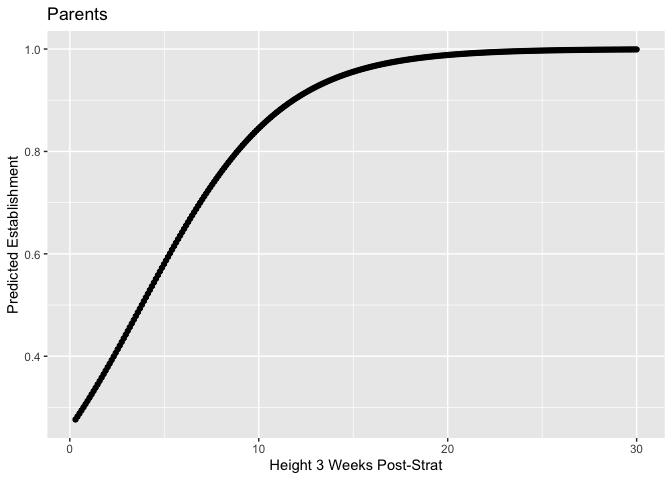<!-- -->

``` r
length_est_preds <- tibble(predictions=predict(length_est_model3, 
                                               newdata=parents_est_preds,
                                           re.form= NA, type="response")) %>% 
  bind_cols(parents_est_preds) 
length_est_preds %>% ggplot(aes(long.leaf.cm, predictions)) +
  geom_point() +
  labs(x="Leaf Length 3 Weeks Post-Strat", y="Predicted Establishment", title="Parents")
```

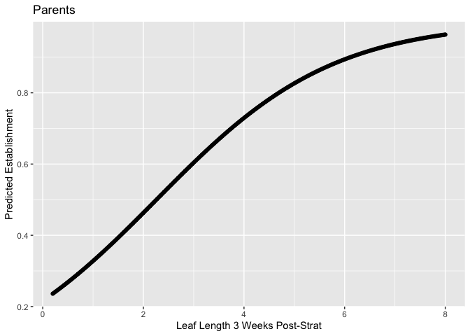<!-- -->


``` r
height_est_preds %>% filter(predictions>.50) %>% summarise(min(height.cm))
```

```
## # A tibble: 1 × 1
##   `min(height.cm)`
##              <dbl>
## 1             3.81
```

``` r
#Min height for prediction of greater than 50% establishment = 3.92
parents_est %>% mutate(BigEnough=if_else(height.cm>=3.92, 1, 0)) %>% 
  group_by(BigEnough) %>% 
  summarise(n=n())
```

```
## # A tibble: 2 × 2
##   BigEnough     n
##       <dbl> <int>
## 1         0   187
## 2         1    93
```

``` r
#33% of plants were "Big Enough"

length_est_preds %>% filter(predictions>.50) %>% summarise(min(long.leaf.cm))
```

```
## # A tibble: 1 × 1
##   `min(long.leaf.cm)`
##                 <dbl>
## 1                2.27
```

``` r
#Min height for prediction of greater than 50% establishment = 2.27
parents_est %>% mutate(BigEnough=if_else(long.leaf.cm>=2.27, 1, 0)) %>% 
  group_by(BigEnough) %>% 
  summarise(n=n())
```

```
## # A tibble: 2 × 2
##   BigEnough     n
##       <dbl> <int>
## 1         0   245
## 2         1    35
```

``` r
#12% of plants were "Big Enough"
```


### Crosses 

``` r
crosses_est <- establishment %>% 
  filter(Pop.Type!="Parent") %>% 
  filter(!is.na(height.cm)) %>% 
  filter(!is.na(long.leaf.cm))
unique(crosses_est$pop) #74 cross types 
```

```
##  [1] "(WV x WL2) x (WV)"          "(LV1 x WL2) x (TM2 x WL2)" 
##  [3] "(TM2 x WL2) x (SQ3 x WL2)"  "(WL2 x BH) x (SQ3 x WL2)"  
##  [5] "(TM2 x WL2) x (TM2 x WL2)"  "(LV1 x WL2) x (WL2 x DPR)" 
##  [7] "(WL1 x WL2) x (BH x WL2)"   "(TM2 x WL2) x (YO11 x WL2)"
##  [9] "(WL1 x WL2) x (WL2 x TM2)"  "(WL2 x TM2) x (CC x TM2)"  
## [11] "WV x TM2"                   "(WL2 x DPR) x (WL2)"       
## [13] "(TM2 x WL2) x (TM2)"        "(SQ3 x WL2) x (YO11 x WL2)"
## [15] "(SQ3 x WL2) x (SQ3 x WL2)"  "(YO11 x WL2) x (SQ3 x WL2)"
## [17] "(WL1 x WL2) x (WL2 x CC)"   "(LV1 x WL2) x (WL2)"       
## [19] "(TM2 x BH) x (TM2 x BH)"    "(LV1 x WL2) x (SQ3 x WL2)" 
## [21] "(DPR x WL2) x (YO11 x WL2)" "(DPR x WL2) x (WV x WL2)"  
## [23] "LV1 x WL2"                  "(WV) x (WV x WL2)"         
## [25] "LV1 x TM2"                  "(YO11 x WL2) x (WL2)"      
## [27] "(TM2 x BH) x (TM2)"         "TM2 x WL2"                 
## [29] "(YO11 x WL2) x (DPR x WL2)" "(DPR) x (WL2 x DPR)"       
## [31] "(WL2 x DPR) x (TM2 x WL2)"  "(SQ3 x WL2) x (TM2 x WL2)" 
## [33] "(TM2 x WL2) x (WL2)"        "(WL2 x BH) x (WL2 x TM2)"  
## [35] "(WL2 x CC) x (WL2 x TM2)"   "(WL2) x (DPR x WL2)"       
## [37] "WV x WL2"                   "(SQ3 x WL2) x (WL2)"       
## [39] "(LV1 x WL2) x (YO11 x WL2)" "(BH) x (TM2 x BH)"         
## [41] "(TM2 x BH) x (BH)"          "(WL2) x (WV x WL2)"        
## [43] "BH x TM2"                   "(YO11 x WL2) x (WL2 x TM2)"
## [45] "(WL2 x CC) x (SQ3 x WL2)"   "(DPR) x (DPR x WL2)"       
## [47] "(SQ3 x WL2) x (LV1 x WL2)"  "WL2 x BH"                  
## [49] "(TM2 x BH) x (TM2 x WL2)"   "(WL1 x TM2) x (WL2 x TM2)" 
## [51] "(YO11 x WL2) x (WV x WL2)"  "(SQ3 x WL2) x (DPR x WL2)" 
## [53] "DPR x WL2"                  "(LV1 x WL2) x (LV1 x WL2)" 
## [55] "BH x WL2"                   "(WV x WL2) x (WL2 x DPR)"  
## [57] "(WL2 x DPR) x (YO11 x WL2)" "(WL2) x (TM2 x WL2)"       
## [59] "(TM2) x (TM2 x WL2)"        "SQ3 x WL2"                 
## [61] "(CC x TM2) x (WL2 x TM2)"   "(TM2 x WL2) x (LV1 x WL2)" 
## [63] "(DPR x WL2) x (SQ3 x WL2)"  "(TM2 x WL2) x (DPR x WL2)" 
## [65] "(WL2 x DPR) x (DPR)"        "(YO11 x WL2) x (TM2 x WL2)"
## [67] "(DPR x WL2) x (DPR x WL2)"  "(DPR x WL2) x (TM2 x WL2)" 
## [69] "TM2 x YO11"                 "CC x TM2"                  
## [71] "(TM2) x (TM2 x BH)"         "(TM2 x WL2) x (TM2 x BH)"  
## [73] "(WL2 x TM2) x (WL2)"        "(TM2 x WL2) x (WV x WL2)"
```

``` r
height_est_model4 <- glmer(Est_Surv ~ height.cm + (1|pop), family=binomial, data=crosses_est)
summary(height_est_model4) #height not sig
```

```
## Generalized linear mixed model fit by maximum likelihood (Laplace
##   Approximation) [glmerMod]
##  Family: binomial  ( logit )
## Formula: Est_Surv ~ height.cm + (1 | pop)
##    Data: crosses_est
## 
##      AIC      BIC   logLik deviance df.resid 
##    751.7    764.6   -372.9    745.7      538 
## 
## Scaled residuals: 
##     Min      1Q  Median      3Q     Max 
## -1.3428 -0.9722  0.7631  0.9522  1.3174 
## 
## Random effects:
##  Groups Name        Variance Std.Dev.
##  pop    (Intercept) 0.1479   0.3846  
## Number of obs: 541, groups:  pop, 74
## 
## Fixed effects:
##             Estimate Std. Error z value Pr(>|z|)
## (Intercept) -0.22365    0.23176  -0.965    0.335
## height.cm    0.08139    0.07012   1.161    0.246
## 
## Correlation of Fixed Effects:
##           (Intr)
## height.cm -0.895
```

``` r
length_est_model4 <- glmer(Est_Surv ~ long.leaf.cm + (1|pop), family=binomial, data=crosses_est)
summary(length_est_model4)
```

```
## Generalized linear mixed model fit by maximum likelihood (Laplace
##   Approximation) [glmerMod]
##  Family: binomial  ( logit )
## Formula: Est_Surv ~ long.leaf.cm + (1 | pop)
##    Data: crosses_est
## 
##      AIC      BIC   logLik deviance df.resid 
##    715.3    728.2   -354.7    709.3      538 
## 
## Scaled residuals: 
##     Min      1Q  Median      3Q     Max 
## -1.9270 -0.9208  0.4490  0.9037  1.9498 
## 
## Random effects:
##  Groups Name        Variance Std.Dev.
##  pop    (Intercept) 0.08561  0.2926  
## Number of obs: 541, groups:  pop, 74
## 
## Fixed effects:
##              Estimate Std. Error z value Pr(>|z|)    
## (Intercept)   -1.4132     0.2687  -5.259 1.45e-07 ***
## long.leaf.cm   0.8344     0.1458   5.721 1.06e-08 ***
## ---
## Signif. codes:  0 '***' 0.001 '**' 0.01 '*' 0.05 '.' 0.1 ' ' 1
## 
## Correlation of Fixed Effects:
##             (Intr)
## long.lef.cm -0.929
```

``` r
##predictions for figures:
crosses_est_preds <- tibble(long.leaf.cm=seq(from = 0.1, to=26, length.out=541))

length_est_preds <- tibble(predictions=predict(length_est_model4, 
                                               newdata=crosses_est_preds,
                                           re.form= NA, type="response")) %>% 
  bind_cols(crosses_est_preds) 
length_est_preds %>% ggplot(aes(long.leaf.cm, predictions)) +
  geom_point() +
  labs(x="Leaf Length 3 Weeks Post-Strat", y="Predicted Establishment", title="Crosses")
```

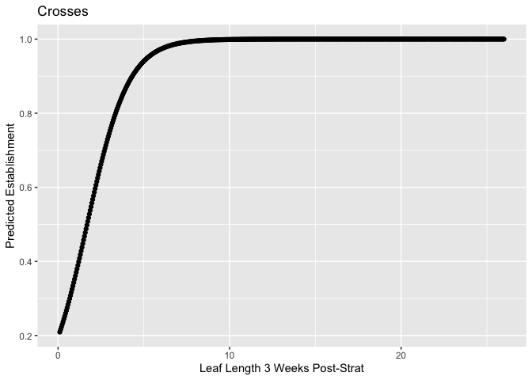<!-- -->


``` r
length_est_preds %>% filter(predictions>.50) %>% summarise(min(long.leaf.cm))
```

```
## # A tibble: 1 × 1
##   `min(long.leaf.cm)`
##                 <dbl>
## 1                1.73
```

``` r
#Min height for prediction of greater than 50% establishment = 1.73
crosses_est %>% mutate(BigEnough=if_else(long.leaf.cm>=1.73, 1, 0)) %>% 
  group_by(BigEnough) %>% 
  summarise(n=n())
```

```
## # A tibble: 2 × 2
##   BigEnough     n
##       <dbl> <int>
## 1         0   284
## 2         1   257
```

``` r
#47.5% of plants were "Big Enough"
```
