# Calculating total fitness for plants planted in 2024
Takes into account 2024 and 2025 data 

Question: Is assisted gene flow better than assisted migration?
-   If so, would expect F1s (half high, half low elev) to perform better than parents 
-   If not, parents would do better than F1s 
-   Also, based on 2023 results would expect High x High F1s to be the worst (esp through first year of life)

## Libraries

``` r
library(tidyverse)
```

```
## ── Attaching core tidyverse packages ──────────────────────── tidyverse 2.0.0 ──
## ✔ dplyr     1.2.1     ✔ readr     2.2.0
## ✔ forcats   1.0.1     ✔ stringr   1.6.0
## ✔ ggplot2   4.0.2     ✔ tibble    3.3.1
## ✔ lubridate 1.9.5     ✔ tidyr     1.3.2
## ✔ purrr     1.2.2     
## ── Conflicts ────────────────────────────────────────── tidyverse_conflicts() ──
## ✖ dplyr::filter() masks stats::filter()
## ✖ dplyr::lag()    masks stats::lag()
## ℹ Use the conflicted package (<http://conflicted.r-lib.org/>) to force all conflicts to become errors
```

``` r
library(ggpubr) #ggarrange


#making topo maps:
library(elevatr)
```

```
## elevatr v0.99.0 NOTE: Version 0.99.0 of 'elevatr' uses 'sf' and 'terra'.  Use 
## of the 'sp', 'raster', and underlying 'rgdal' packages by 'elevatr' is being 
## deprecated; however, get_elev_raster continues to return a RasterLayer.  This 
## will be dropped in future versions, so please plan accordingly.
```

``` r
library(terra)
```

```
## terra 1.9.11
## 
## Attaching package: 'terra'
## 
## The following object is masked from 'package:ggpubr':
## 
##     rotate
## 
## The following object is masked from 'package:tidyr':
## 
##     extract
```

``` r
library(sf)
```

```
## Linking to GEOS 3.13.0, GDAL 3.8.5, PROJ 9.5.1; sf_use_s2() is TRUE
```

``` r
library(giscoR)
library(marmap)
```

```
## Registered S3 methods overwritten by 'adehabitatMA':
##   method                       from
##   print.SpatialPixelsDataFrame sp  
##   print.SpatialPixels          sp  
## 
## Attaching package: 'marmap'
## 
## The following object is masked from 'package:terra':
## 
##     as.raster
## 
## The following object is masked from 'package:grDevices':
## 
##     as.raster
```

``` r
library(ggrepel) #for repelling labels 

sem <- function(x, na.rm=FALSE) {  #for calculating standard error
  sd(x,na.rm=na.rm)/sqrt(length(na.omit(x)))
} 
```

## Read in data

``` r
wintsurv <- read_csv("../input/WL2_2025_Data/CorrectedCSVs/WL2_overwinter_survival_20250523_corrected.csv") #contains all year 1 info too
```

```
## Rows: 1217 Columns: 13
## ── Column specification ────────────────────────────────────────────────────────
## Delimiter: ","
## chr (12): block, bed, col, unique.ID, bud.date, flower.date, fruit.date, las...
## dbl  (1): row
## 
## ℹ Use `spec()` to retrieve the full column specification for this data.
## ℹ Specify the column types or set `show_col_types = FALSE` to quiet this message.
```

``` r
surv_2025 <- read_csv("../input/WL2_2025_Data/CorrectedCSVs/WL2_mort_pheno_20250929_corrected.csv") %>%  #for surv to budding 
  select(bed:bud.date, death.date)
```

```
## New names:
## Rows: 972 Columns: 13
## ── Column specification
## ──────────────────────────────────────────────────────── Delimiter: "," chr
## (12): bed, col, Unique.ID, bud.date, flower.date, fruit.date, last.FL.da... dbl
## (1): row
## ℹ Use `spec()` to retrieve the full column specification for this data. ℹ
## Specify the column types or set `show_col_types = FALSE` to quiet this message.
## • `` -> `...13`
```

``` r
fruits_2025 <- read_csv("../input/WL2_2025_Data/CorrectedCSVs/WL2_ann_cens_20251028_corrected.csv") %>% #for fruit #
  select(bed:Unique.ID, num.fruit)
```

```
## Rows: 972 Columns: 16
## ── Column specification ────────────────────────────────────────────────────────
## Delimiter: ","
## chr (7): bed, col, Unique.ID, phen, survey.date, collected.date, survey.notes
## dbl (9): row, total.branch, diam.mm, height.cm, overhd.diam, overhd.perp, nu...
## 
## ℹ Use `spec()` to retrieve the full column specification for this data.
## ℹ Specify the column types or set `show_col_types = FALSE` to quiet this message.
```

## Pop Info

``` r
pop_info_2024 <- read_csv("../input/WL2_2024_Data/Final_2023_2024_Pop_Loc_Info.csv") %>% 
  select(Pop.Type:unique.ID) %>% 
  rename(row=bedrow, col=bedcol)
```

```
## Rows: 1217 Columns: 15
## ── Column specification ────────────────────────────────────────────────────────
## Delimiter: ","
## chr (8): Pop.Type, status, block, loc, bed, bedcol, pop, unique.ID
## dbl (7): bed.block.order, bed.order, AB.CD.order, column.order, bedrow, mf, rep
## 
## ℹ Use `spec()` to retrieve the full column specification for this data.
## ℹ Specify the column types or set `show_col_types = FALSE` to quiet this message.
```

``` r
pop_info_2025 <- read_csv("../input/WL2_2025_Data/2025_Pop_Loc_Info Updated.csv") %>% 
  select(status:Unique.ID)
```

```
## Rows: 976 Columns: 16
## ── Column specification ────────────────────────────────────────────────────────
## Delimiter: ","
## chr (10): status, block, bed, col, pop.id, mf, dame_mf, sire_mf, Unique.ID, ...
## dbl  (6): bed.block.order, bed.order, AB.CD.order, column.order, row, rep
## 
## ℹ Use `spec()` to retrieve the full column specification for this data.
## ℹ Specify the column types or set `show_col_types = FALSE` to quiet this message.
```

## Elevation Info / Climate distance

``` r
clim_dist_2024 <- read_csv("../output/Climate/WL2_2024_Clim_Dist.csv") %>% select(-conf.low, -conf.high)
```

```
## Rows: 20 Columns: 14
## ── Column specification ────────────────────────────────────────────────────────
## Delimiter: ","
## chr  (4): parent.pop, elevation.group, timeframe, Season
## dbl (10): elev_m, Lat, Long, Year, Gowers_Dist, conf.low, conf.high, WL2_Lat...
## 
## ℹ Use `spec()` to retrieve the full column specification for this data.
## ℹ Specify the column types or set `show_col_types = FALSE` to quiet this message.
```

``` r
head(clim_dist_2024)
```

```
## # A tibble: 6 × 12
##   parent.pop elevation.group elev_m   Lat  Long timeframe Season      Year
##   <chr>      <chr>            <dbl> <dbl> <dbl> <chr>     <chr>      <dbl>
## 1 WL2        high             2020.  38.8 -120. Recent    Water Year  2024
## 2 SQ3        high             2373.  36.7 -119. Recent    Water Year  2024
## 3 WL1        mid              1614.  38.8 -120. Recent    Water Year  2024
## 4 WV         mid               749.  40.7 -123. Recent    Water Year  2024
## 5 YO11       high             2872.  37.9 -119. Recent    Water Year  2024
## 6 LV1        high             2593.  40.5 -122. Recent    Water Year  2024
## # ℹ 4 more variables: Gowers_Dist <dbl>, WL2_Lat <dbl>, WL2_Long <dbl>,
## #   Geographic_Dist <dbl>
```

``` r
clim_dist_2024_wide <- clim_dist_2024 %>% 
  pivot_wider(names_from = timeframe, values_from = Gowers_Dist, names_prefix = "GD_") %>% 
  rename(pop=parent.pop)
```

## Map of populations (WL2 F1s only)

``` r
garden_loc <- tibble(pop="Wl2_Garden", elev_m=2020, Lat=38.82599, Long=-120.25090)
wl2_f1s_locs <- clim_dist_2024_wide %>% 
  select(pop, elev_m:Long) %>%
  filter(pop=="WL2" | pop=="SQ3" | pop=="LV1" | 
           pop=="WV" | pop=="DPR" | pop=="TM2" | pop=="BH") %>% 
  bind_rows(garden_loc)
states <- map_data("state") %>% filter(region == "california")

ggplot() +
  geom_polygon(data = states, aes(x = long, y = lat, group = group), fill = "gray") +
  coord_quickmap(xlim = c(-125, -114), ylim = c(35.8, 41))+
  geom_point(data = wl2_f1s_locs,
             aes(x = Long, y = Lat, color=elev_m),
             size = 6) +
  geom_label_repel(data = wl2_f1s_locs,
         aes(x = Long, y = Lat,
             label = `pop`),
         min.segment.length = 0,
         max.overlaps = 100,
         #force = 3,
         box.padding = 0.4,
         label.padding = 0.15,
         label.size = 0.1,
         size = 3) +
  labs(color="Elevation (m)") +
  scale_colour_gradient(low = "#F5A540", high = "#0043F0") +
  theme_void()
```

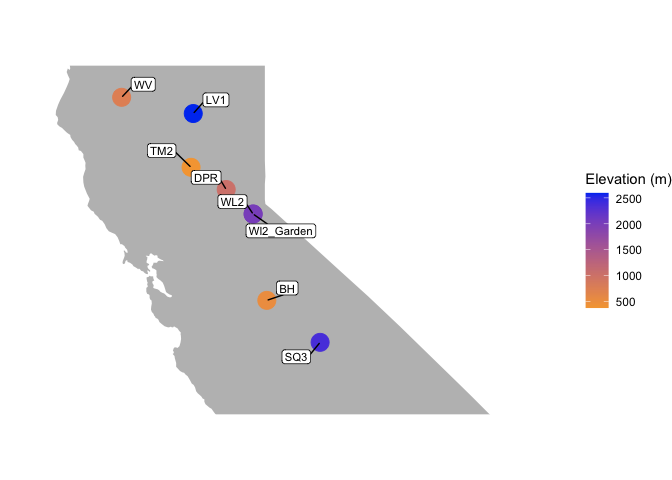<!-- -->

``` r
ggsave("../output/WL2_Traits/WL2F1s_Map.png", width = 10, height = 10, units = "in")
```

## Calculate y1 fitness and remove plants not planted in 2024

``` r
wintsurv %>%  
  left_join(pop_info_2024) %>% 
  filter(!str_detect(Pop.Type, "2023")) %>% 
  filter(!is.na(bud.date)) #none of the 2024 plants reproduced (don't need to take into account any annual plants)
```

```
## Joining with `by = join_by(block, bed, row, col, unique.ID)`
```

```
## # A tibble: 0 × 19
## # ℹ 19 variables: block <chr>, bed <chr>, row <dbl>, col <chr>,
## #   unique.ID <chr>, bud.date <chr>, flower.date <chr>, fruit.date <chr>,
## #   last.FL.date <chr>, last.FR.date <chr>, death.date <chr>,
## #   missing.date <chr>, survey.notes <chr>, Pop.Type <chr>, status <chr>,
## #   loc <chr>, pop <chr>, mf <dbl>, rep <dbl>
```

``` r
y1_fitness <- wintsurv %>% 
  select(bed:unique.ID, bud.date, death.date, missing.date, survey.notes) %>% 
  left_join(pop_info_2024) %>% 
  filter(unique.ID != "buffer") %>% #remove buffers
  filter(Pop.Type=="Parent" | Pop.Type=="F1" | Pop.Type=="F2") %>%  #keep only plants planted in 2024
  select(loc, bed:unique.ID, Pop.Type, pop:rep, death.date:survey.notes) %>% 
  mutate(deadatplanting = if_else(is.na(survey.notes), NA,
                                  if_else(survey.notes=="Dead at planting", "Yes", NA))) %>% 
  filter(is.na(deadatplanting)) %>% #remove plants that were dead at planting 
  filter(is.na(missing.date)) %>% #remove plants that went missing 
  select(-deadatplanting, -missing.date, -survey.notes) %>% #remove unnecessary cols 
  mutate(death.date=mdy(death.date)) %>% #convert to date format 
  mutate(Establishment = if_else(is.na(death.date), 1, 
                                 if_else(death.date < "2024-07-06", 0, 1)), #establishment = first 3 weeks post-transplant 
         Y1Surv = if_else(Establishment==0, NA, #can't survive year 1 if you didn't establish 
                          if_else(is.na(death.date), 1, 
                                        if_else(death.date < "2024-11-01", 0, 1))), #year 1 ended in Oct
         WintSurv = if_else(Establishment==0 | Y1Surv==0, NA, #can only have wint surv if survived y1 
                            if_else(is.na(death.date), 1, 0))) 
```

```
## Joining with `by = join_by(bed, row, col, unique.ID)`
```

``` r
y1_fitness %>% filter(WintSurv==1) #33 plants survived the winter 
```

```
## # A tibble: 79 × 13
##    loc    bed     row col   unique.ID Pop.Type pop           mf   rep death.date
##    <chr>  <chr> <dbl> <chr> <chr>     <chr>    <chr>      <dbl> <dbl> <date>    
##  1 C_20_B C        20 B     698       F2       (DPR x WL…    NA     4 NA        
##  2 C_23_B C        23 B     118       Parent   WL2           NA    23 NA        
##  3 C_24_B C        24 B     1459      F2       (DPR x WL…    NA     3 NA        
##  4 C_29_B C        29 B     341       F2       (WL1 x WL…    NA    10 NA        
##  5 C_30_A C        30 A     1228      F1       LV1 x TM2     NA     4 NA        
##  6 C_31_A C        31 A     939       F2       (YO11 x W…    NA    13 NA        
##  7 C_33_B C        33 B     183       Parent   WL2           NA    88 NA        
##  8 C_37_B C        37 B     1289      F1       TM2 x WL2     NA    13 NA        
##  9 C_43_A C        43 A     73        F2       (LV1 x WL…    NA    10 NA        
## 10 C_50_B C        50 B     404       Parent   BH            NA    18 NA        
## # ℹ 69 more rows
## # ℹ 3 more variables: Establishment <dbl>, Y1Surv <dbl>, WintSurv <dbl>
```

## Calculate y2 fitness and remove plants not planted in 2024

``` r
surv_2025 %>% left_join(pop_info_2025) %>% filter(status=="2024-survivor") %>% filter(is.na(death.date)) %>% filter(is.na(bud.date)) #0 2024 plants alive at end of 2025 that did not reproduce
```

```
## Joining with `by = join_by(bed, row, col, Unique.ID)`
```

```
## # A tibble: 0 × 13
## # ℹ 13 variables: bed <chr>, row <dbl>, col <chr>, Unique.ID <chr>,
## #   bud.date <chr>, death.date <chr>, status <chr>, block <chr>, pop.id <chr>,
## #   mf <chr>, dame_mf <chr>, sire_mf <chr>, rep <dbl>
```

``` r
y2_fitness <- pop_info_2025 %>% 
  left_join(surv_2025) %>% 
  left_join(fruits_2025) %>% 
  filter(Unique.ID!="buffer", !is.na(Unique.ID)) %>% 
  filter(status=="2024-survivor") %>% 
  mutate(Pop.Type=if_else(str_detect(pop.id, "\\) x"), "F2",
                          if_else(str_detect(pop.id, "x"), "F1",
                                  "Parent"
                          ))) %>% 
  #filter(Pop.Type!="F2") %>% #remove F2s
  mutate(SurvtoBud=if_else(!is.na(bud.date), 1, 0),
         LifeHistory = if_else(SurvtoBud==1, "Biennial", NA)) %>% #no annuals, so all rep indivs in 2025 are biennials (398 survived a second winter, but died in early summer 2026)
  select(unique.ID=Unique.ID, Pop.Type, pop=pop.id, mf, rep, LifeHistory, SurvtoBud, num.fruit)
```

```
## Joining with `by = join_by(bed, row, col, Unique.ID)`
## Joining with `by = join_by(bed, row, col, Unique.ID)`
```

``` r
#checked fruiting of plants planted in 2025
fruits_2025 %>% left_join(pop_info_2025) %>% 
  filter(Unique.ID!="buffer", !is.na(Unique.ID)) %>% 
  filter(status=="available") %>% 
  filter(num.fruit>0) %>% 
  arrange(pop.id) #just F2s/BC1s, TM2 and TM2 x WL2
```

```
## Joining with `by = join_by(bed, row, col, Unique.ID)`
```

```
## # A tibble: 32 × 12
##    bed     row col   Unique.ID num.fruit status    block pop.id    mf    dame_mf
##    <chr> <dbl> <chr> <chr>         <dbl> <chr>     <chr> <chr>     <chr> <chr>  
##  1 F        44 D     2140              8 available L     (TM2 x W… 3_2-… 3      
##  2 C        45 A     2165             11 available C     (TM2 x W… 2_1   2      
##  3 G        21 B     2184              6 available M     (TM2) x … <NA>  <NA>   
##  4 C        29 D     2269              2 available B     (WL2 x T… 2_1-3 2      
##  5 C        30 D     2646              5 available B     (WL2 x T… 2_1-3 2      
##  6 C        49 C     2643             14 available C     (WL2 x T… 2_1-3 2      
##  7 D        27 D     2283              5 available E     (WL2 x T… 2_1-3 2      
##  8 E        44 B     2273              3 available <NA>  (WL2 x T… 2_1-3 2      
##  9 E        41 D     2259              5 available I     (WL2 x T… 2_1-3 2      
## 10 F        11 A     2288              8 available J     (WL2 x T… 2_1-3 2      
## # ℹ 22 more rows
## # ℹ 2 more variables: sire_mf <chr>, rep <dbl>
```

## Merge y1 and y2 fitness ---> total fitnes

``` r
total_fit_2024plants <- y1_fitness %>% 
  select(-death.date) %>% 
  mutate(mf=as.character(mf)) %>% #needed for the merge
  left_join(y2_fitness) %>% 
  select(-mf) %>% #remove because all NAs
  mutate(ProbFruit=if_else(is.na(num.fruit) | num.fruit==0, 0, 1),
         TotalFitness=if_else(ProbFruit==0, 0, num.fruit)) 
```

```
## Joining with `by = join_by(unique.ID, Pop.Type, pop, mf, rep)`
```

``` r
write_csv(total_fit_2024plants, "../output/WL2_Traits/WL2_2024_AllFitness.csv")

total_fit_2024plants_noF2s <- total_fit_2024plants %>% 
  filter(Pop.Type!="F2") %>% 
  separate(pop, c("dame_pop",NA, "sire_pop"), remove = FALSE) %>% #define pops for crosses
  mutate(sire_pop=if_else(Pop.Type=="Parent", dame_pop, sire_pop)) %>% 
  #add clim and elev info for dames and sires:
  left_join(clim_dist_2024_wide, by=join_by(dame_pop==pop)) %>% 
  select(-elevation.group, -Season, -Year, -WL2_Lat, -WL2_Long) %>% 
  rename(dame_elev=elev_m, dame_Lat=Lat, dame_Long=Long, dame_GeoDist=Geographic_Dist,
         dame_GD_Recent=GD_Recent, dame_GD_Historic=GD_Historic) %>% 
  left_join(clim_dist_2024_wide, by=join_by(sire_pop==pop)) %>% 
  select(-elevation.group, -Season, -Year, -WL2_Lat, -WL2_Long) %>% 
  rename(sire_elev=elev_m, sire_Lat=Lat, sire_Long=Long, sire_GeoDist=Geographic_Dist,
         sire_GD_Recent=GD_Recent, sire_GD_Historic=GD_Historic) %>% 
  mutate(meanElev=(dame_elev+sire_elev)/2, 
         meanGeoDist=(dame_GeoDist+sire_GeoDist)/2,
         mean_GD_Recent=(dame_GD_Recent+sire_GD_Recent)/2, 
         mean_GD_Historic=(dame_GD_Historic+sire_GD_Historic)/2) #means for parents are just the parent's actual value since I set that pop as dame and sire 
```

```
## Warning: Expected 3 pieces. Missing pieces filled with `NA` in 278 rows [1, 2, 3, 4, 6,
## 7, 8, 9, 10, 12, 13, 14, 15, 17, 18, 20, 21, 23, 24, 26, ...].
```

``` r
#total_fit_2024plants %>% filter(WintSurv==1, is.na(SurvtoBud)) #double check that the merge worked
head(total_fit_2024plants_noF2s)
```

```
## # A tibble: 6 × 34
##   loc    bed     row col   unique.ID Pop.Type pop      dame_pop sire_pop   rep
##   <chr>  <chr> <dbl> <chr> <chr>     <chr>    <chr>    <chr>    <chr>    <dbl>
## 1 C_5_A  C         5 A     540       Parent   TM2      TM2      TM2         70
## 2 C_9_B  C         9 B     521       Parent   TM2      TM2      TM2         51
## 3 C_10_A C        10 A     392       Parent   BH       BH       BH           6
## 4 C_11_A C        11 A     479       Parent   TM2      TM2      TM2          9
## 5 C_12_A C        12 A     199       F1       WV x TM2 WV       TM2          7
## 6 C_14_A C        14 A     98        Parent   WL2      WL2      WL2          3
## # ℹ 24 more variables: Establishment <dbl>, Y1Surv <dbl>, WintSurv <dbl>,
## #   LifeHistory <chr>, SurvtoBud <dbl>, num.fruit <dbl>, ProbFruit <dbl>,
## #   TotalFitness <dbl>, dame_elev <dbl>, dame_Lat <dbl>, dame_Long <dbl>,
## #   dame_GeoDist <dbl>, dame_GD_Recent <dbl>, dame_GD_Historic <dbl>,
## #   sire_elev <dbl>, sire_Lat <dbl>, sire_Long <dbl>, sire_GeoDist <dbl>,
## #   sire_GD_Recent <dbl>, sire_GD_Historic <dbl>, meanElev <dbl>,
## #   meanGeoDist <dbl>, mean_GD_Recent <dbl>, mean_GD_Historic <dbl>
```

## Means


``` r
total_fit_2024plants_summary <- total_fit_2024plants %>% 
  group_by(Pop.Type, pop) %>% 
  summarise(meanEst=mean(Establishment, na.rm=TRUE), semEst=sem(Establishment, na.rm = TRUE),
            meanY1Surv=mean(Y1Surv, na.rm=TRUE), semY1Surv=sem(Y1Surv, na.rm = TRUE),
            meanWintSurv=mean(WintSurv, na.rm=TRUE), semWintSurv=sem(WintSurv, na.rm = TRUE),
            meanSurvtoBud=mean(SurvtoBud, na.rm=TRUE), semSurvtoBud=sem(SurvtoBud, na.rm = TRUE),
            meanFruit=mean(num.fruit, na.rm=TRUE), semFruit=sem(num.fruit, na.rm = TRUE),
            meanProbFruit=mean(ProbFruit, na.rm=TRUE), semProbFruit=sem(ProbFruit, na.rm = TRUE),
            meanTotalFit=mean(TotalFitness, na.rm=TRUE), semTotalFit=sem(TotalFitness, na.rm = TRUE))
```

```
## `summarise()` has regrouped the output.
## ℹ Summaries were computed grouped by Pop.Type and pop.
## ℹ Output is grouped by Pop.Type.
## ℹ Use `summarise(.groups = "drop_last")` to silence this message.
## ℹ Use `summarise(.by = c(Pop.Type, pop))` for per-operation grouping
##   (`?dplyr::dplyr_by`) instead.
```

``` r
total_fit_2024plants_summary
```

```
## # A tibble: 84 × 16
## # Groups:   Pop.Type [3]
##    Pop.Type pop     meanEst semEst meanY1Surv semY1Surv meanWintSurv semWintSurv
##    <chr>    <chr>     <dbl>  <dbl>      <dbl>     <dbl>        <dbl>       <dbl>
##  1 F1       BH x T…   0.375  0.183      0.333     0.333            0          NA
##  2 F1       BH x W…   1      0          0         0              NaN          NA
##  3 F1       CC x T…   0      0        NaN        NA              NaN          NA
##  4 F1       DPR x …   0.5    0.289      0         0              NaN          NA
##  5 F1       LV1 x …   0.435  0.106      0.3       0.153            1           0
##  6 F1       LV1 x …   0.545  0.157      0.333     0.211            1           0
##  7 F1       SQ3 x …   0.75   0.25       0         0              NaN          NA
##  8 F1       TM2 x …   0.333  0.167      0.667     0.333            1           0
##  9 F1       TM2 x …   1     NA          0        NA              NaN          NA
## 10 F1       WL2 x …   0      0        NaN        NA              NaN          NA
## # ℹ 74 more rows
## # ℹ 8 more variables: meanSurvtoBud <dbl>, semSurvtoBud <dbl>, meanFruit <dbl>,
## #   semFruit <dbl>, meanProbFruit <dbl>, semProbFruit <dbl>,
## #   meanTotalFit <dbl>, semTotalFit <dbl>
```

## Quick Figures

### Establishment

``` r
total_fit_2024plants_summary %>% 
  filter(Pop.Type=="Parent") %>% 
  left_join(clim_dist_2024_wide) %>% 
  ggplot(aes(x=fct_reorder(pop, meanEst), y=meanEst, fill=elev_m)) +
  geom_col(width = 0.7,position = position_dodge(0.75)) +
  geom_errorbar(aes(ymin=meanEst-semEst,
                    ymax=meanEst+semEst),width=.2, 
                position =position_dodge(0.75)) +
  labs(x="Population", y="Avg Establishment", fill="Elevation (m)") +
  scale_y_continuous(expand = c(0.01, 0)) +
  scale_fill_gradient(low = "#F5A540", high = "#0043F0") +
  theme_classic()
```

```
## Joining with `by = join_by(pop)`
```

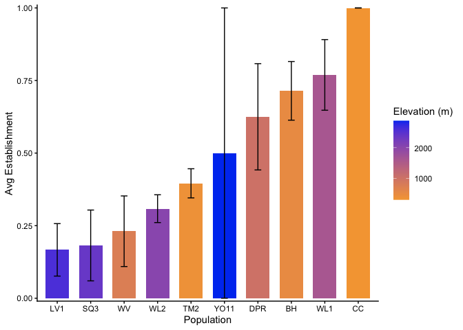<!-- -->

``` r
total_fit_2024plants_summary %>% 
  filter(Pop.Type=="F1") %>% 
  ggplot(aes(x=fct_reorder(pop, meanEst), y=meanEst)) +
  geom_col(width = 0.7,position = position_dodge(0.75)) +
  geom_errorbar(aes(ymin=meanEst-semEst,
                    ymax=meanEst+semEst),
                width=.2, position =position_dodge(0.75)) +
  theme_classic() +
  scale_y_continuous(expand = c(0.01, 0)) +
  theme(axis.text.x = element_text(angle = 45, hjust = 1)) + 
  labs(x="F1", y="Avg Establishment")
```

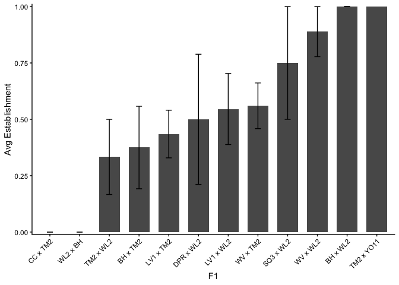<!-- -->

``` r
total_fit_2024plants_summary %>% 
  filter(Pop.Type=="F2") %>% 
  ggplot(aes(x=fct_reorder(pop, meanEst), y=meanEst)) +
  geom_col(width = 0.7,position = position_dodge(0.75)) +
  geom_errorbar(aes(ymin=meanEst-semEst,
                    ymax=meanEst+semEst),
                width=.2, position =position_dodge(0.75)) +
  theme_classic() +
  scale_y_continuous(expand = c(0.01, 0)) +
  theme(axis.text.x = element_text(angle = 45, hjust = 1)) + 
  labs(x="F2", y="Avg Establishment")
```

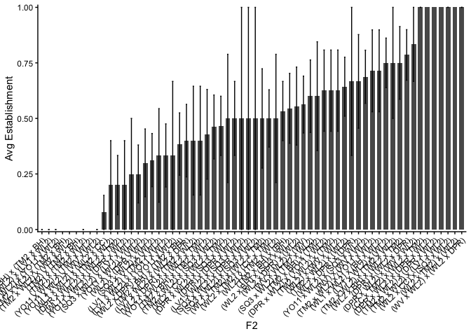<!-- -->

### Y1 Surv

``` r
total_fit_2024plants_summary %>% 
  filter(Pop.Type=="Parent") %>% 
  left_join(clim_dist_2024_wide) %>% 
  ggplot(aes(x=fct_reorder(pop, meanY1Surv), y=meanY1Surv, fill=elev_m)) +
  geom_col(width = 0.7,position = position_dodge(0.75)) +
  geom_errorbar(aes(ymin=meanY1Surv-semY1Surv,
                    ymax=meanY1Surv+semY1Surv),width=.2, 
                position =position_dodge(0.75)) +
  labs(x="Population", y="Avg Y1 Surv", fill="Elevation (m)") +
  scale_y_continuous(expand = c(0.01, 0)) +
  scale_fill_gradient(low = "#F5A540", high = "#0043F0") +
  theme_classic()
```

```
## Joining with `by = join_by(pop)`
```

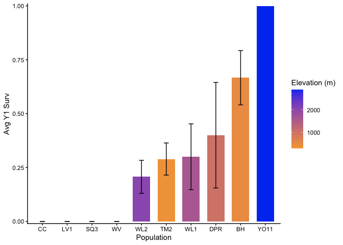<!-- -->

``` r
total_fit_2024plants_summary %>% 
  filter(Pop.Type=="F1") %>% 
  mutate(meanY1Surv=if_else(meanY1Surv=="NaN", NA, meanY1Surv)) %>% 
  filter(!is.na(meanY1Surv)) %>% 
  ggplot(aes(x=fct_reorder(pop, meanY1Surv), y=meanY1Surv)) +
  geom_col(width = 0.7,position = position_dodge(0.75)) +
  geom_errorbar(aes(ymin=meanY1Surv-semY1Surv,
                    ymax=meanY1Surv+semY1Surv),
                width=.2, position =position_dodge(0.75)) +
  theme_classic() +
  scale_y_continuous(expand = c(0.01, 0)) +
  theme(axis.text.x = element_text(angle = 45, hjust = 1)) + 
  labs(x="F1", y="Avg Y1 Surv")
```

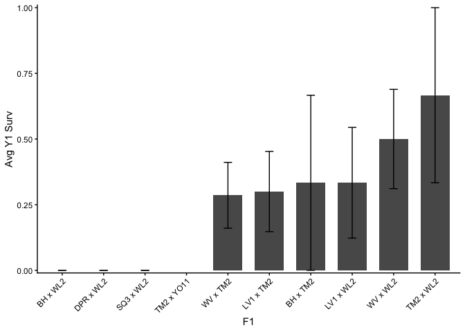<!-- -->

``` r
total_fit_2024plants_summary %>% 
  filter(Pop.Type=="F2") %>% 
  mutate(meanY1Surv=if_else(meanY1Surv=="NaN", NA, meanY1Surv)) %>% 
  filter(!is.na(meanY1Surv)) %>% 
  ggplot(aes(x=fct_reorder(pop, meanY1Surv), y=meanY1Surv)) +
  geom_col(width = 0.7,position = position_dodge(0.75)) +
  geom_errorbar(aes(ymin=meanY1Surv-semY1Surv,
                    ymax=meanY1Surv+semY1Surv),
                width=.2, position =position_dodge(0.75)) +
  theme_classic() +
  scale_y_continuous(expand = c(0.01, 0)) +
  theme(axis.text.x = element_text(angle = 45, hjust = 1)) + 
  labs(x="F2", y="Avg Y1 Surv")
```

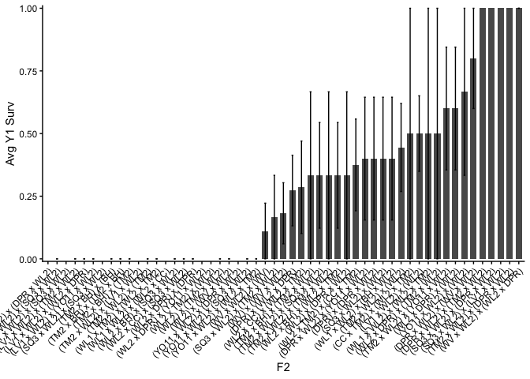<!-- -->

### Winter Surv


``` r
total_fit_2024plants_summary %>% 
  filter(Pop.Type=="Parent") %>% 
  mutate(meanWintSurv=if_else(meanWintSurv=="NaN", NA, meanWintSurv)) %>% 
  filter(!is.na(meanWintSurv)) %>% 
  left_join(clim_dist_2024_wide) %>% 
  ggplot(aes(x=fct_reorder(pop, meanWintSurv), y=meanWintSurv, fill=elev_m)) +
  geom_col(width = 0.7,position = position_dodge(0.75)) +
  geom_errorbar(aes(ymin=meanWintSurv-semWintSurv,
                    ymax=meanWintSurv+semWintSurv),width=.2, 
                position =position_dodge(0.75)) +
  labs(x="Population", y="Avg Winter Survival", fill="Elevation (m)") +
  scale_y_continuous(expand = c(0.01, 0)) +
  scale_fill_gradient(low = "#F5A540", high = "#0043F0") +
  theme_classic()
```

```
## Joining with `by = join_by(pop)`
```

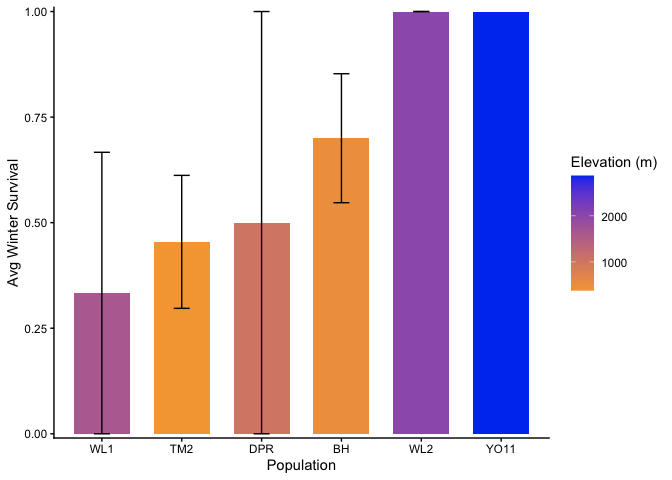<!-- -->

``` r
total_fit_2024plants_summary %>% 
  filter(Pop.Type=="F1") %>% 
  mutate(meanWintSurv=if_else(meanWintSurv=="NaN", NA, meanWintSurv)) %>% 
  filter(!is.na(meanWintSurv)) %>% 
  ggplot(aes(x=fct_reorder(pop, meanWintSurv), y=meanWintSurv)) +
  geom_col(width = 0.7,position = position_dodge(0.75)) +
  geom_errorbar(aes(ymin=meanWintSurv-semWintSurv,
                    ymax=meanWintSurv+semWintSurv),
                width=.2, position =position_dodge(0.75)) +
  theme_classic() +
  scale_y_continuous(expand = c(0.01, 0)) +
  theme(axis.text.x = element_text(angle = 45, hjust = 1)) + 
  labs(x="F1", y="Avg Winter Survival")
```

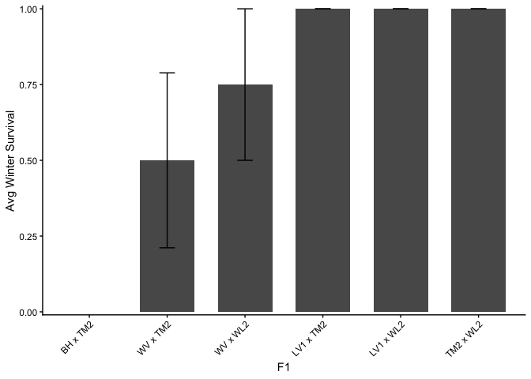<!-- -->

``` r
total_fit_2024plants_summary %>% 
  filter(Pop.Type=="F2") %>% 
  mutate(meanWintSurv=if_else(meanWintSurv=="NaN", NA, meanWintSurv)) %>% 
  filter(!is.na(meanWintSurv)) %>% 
  ggplot(aes(x=fct_reorder(pop, meanWintSurv), y=meanWintSurv)) +
  geom_col(width = 0.7,position = position_dodge(0.75)) +
  geom_errorbar(aes(ymin=meanWintSurv-semWintSurv,
                    ymax=meanWintSurv+semWintSurv),
                width=.2, position =position_dodge(0.75)) +
  theme_classic() +
  scale_y_continuous(expand = c(0.01, 0)) +
  theme(axis.text.x = element_text(angle = 45, hjust = 1)) + 
  labs(x="F2", y="Avg Winter Survival")
```

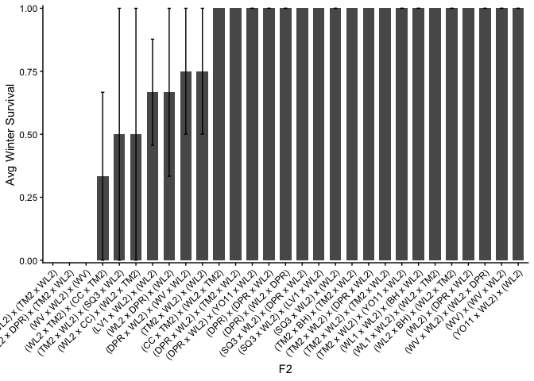<!-- -->

### Surv to Budding 

``` r
total_fit_2024plants_summary %>% 
  filter(Pop.Type=="Parent") %>% 
  mutate(meanSurvtoBud=if_else(meanSurvtoBud=="NaN", NA, meanSurvtoBud)) %>% 
  filter(!is.na(meanSurvtoBud)) %>% 
  left_join(clim_dist_2024_wide) %>% 
  ggplot(aes(x=fct_reorder(pop, meanSurvtoBud), y=meanSurvtoBud, fill=elev_m)) +
  geom_col(width = 0.7,position = position_dodge(0.75)) +
  geom_errorbar(aes(ymin=meanSurvtoBud-semSurvtoBud,
                    ymax=meanSurvtoBud+semSurvtoBud),width=.2, 
                position =position_dodge(0.75)) +
  labs(x="Population", y="Avg Surv to Buddding", fill="Elevation (m)") +
  scale_y_continuous(expand = c(0.01, 0)) +
  scale_fill_gradient(low = "#F5A540", high = "#0043F0") +
  theme_classic()
```

```
## Joining with `by = join_by(pop)`
```

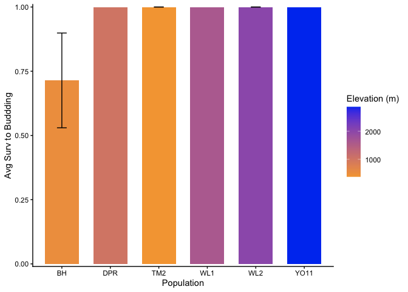<!-- -->

``` r
total_fit_2024plants_summary %>% 
  filter(Pop.Type=="F1") %>% 
  mutate(meanSurvtoBud=if_else(meanSurvtoBud=="NaN", NA, meanSurvtoBud)) %>% 
  filter(!is.na(meanSurvtoBud)) %>% 
  ggplot(aes(x=fct_reorder(pop, meanSurvtoBud), y=meanSurvtoBud)) +
  geom_col(width = 0.7,position = position_dodge(0.75)) +
  geom_errorbar(aes(ymin=meanSurvtoBud-semSurvtoBud,
                    ymax=meanSurvtoBud+semSurvtoBud),
                width=.2, position =position_dodge(0.75)) +
  theme_classic() +
  scale_y_continuous(expand = c(0.01, 0)) +
  theme(axis.text.x = element_text(angle = 45, hjust = 1)) + 
  labs(x="F1", y="Avg Surv to Buddding")
```

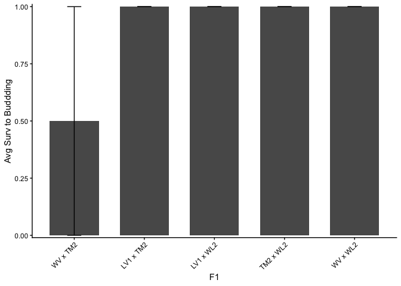<!-- -->

``` r
total_fit_2024plants_summary %>% 
  filter(Pop.Type=="F2") %>% 
  mutate(meanSurvtoBud=if_else(meanSurvtoBud=="NaN", NA, meanSurvtoBud)) %>% 
  filter(!is.na(meanSurvtoBud)) %>% 
  ggplot(aes(x=fct_reorder(pop, meanSurvtoBud), y=meanSurvtoBud)) +
  geom_col(width = 0.7,position = position_dodge(0.75)) +
  geom_errorbar(aes(ymin=meanSurvtoBud-semSurvtoBud,
                    ymax=meanSurvtoBud+semSurvtoBud),
                width=.2, position =position_dodge(0.75)) +
  theme_classic() +
  scale_y_continuous(expand = c(0.01, 0)) +
  theme(axis.text.x = element_text(angle = 45, hjust = 1)) + 
  labs(x="F2", y="Avg Surv to Buddding")
```

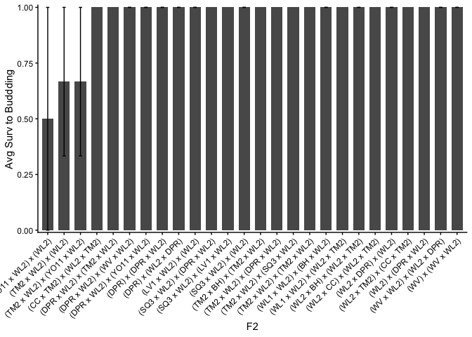<!-- -->

### Fruit #

``` r
total_fit_2024plants_summary %>% 
  filter(Pop.Type=="Parent") %>% 
  mutate(meanFruit=if_else(meanFruit=="NaN", NA, meanFruit)) %>% 
  filter(!is.na(meanFruit)) %>% 
  left_join(clim_dist_2024_wide) %>% 
  ggplot(aes(x=fct_reorder(pop, meanFruit), y=meanFruit, fill=elev_m)) +
  geom_col(width = 0.7,position = position_dodge(0.75)) +
  geom_errorbar(aes(ymin=meanFruit-semFruit,
                    ymax=meanFruit+semFruit),width=.2, 
                position =position_dodge(0.75)) +
  labs(x="Population", y="Avg Fecundity", fill="Elevation (m)") +
  scale_y_continuous(expand = c(0.01, 0)) +
  scale_fill_gradient(low = "#F5A540", high = "#0043F0") +
  theme_classic()
```

```
## Joining with `by = join_by(pop)`
```

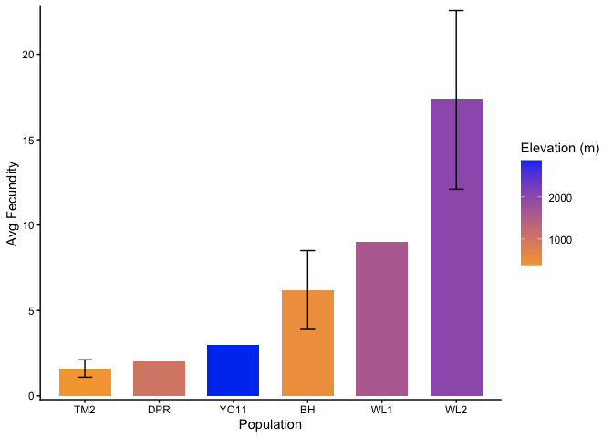<!-- -->

``` r
total_fit_2024plants_summary %>% 
  filter(Pop.Type=="F1") %>% 
  mutate(meanFruit=if_else(meanFruit=="NaN", NA, meanFruit)) %>% 
  filter(!is.na(meanFruit)) %>% 
  ggplot(aes(x=fct_reorder(pop, meanFruit), y=meanFruit)) +
  geom_col(width = 0.7,position = position_dodge(0.75)) +
  geom_errorbar(aes(ymin=meanFruit-semFruit,
                    ymax=meanFruit+semFruit),
                width=.2, position =position_dodge(0.75)) +
  theme_classic() +
  scale_y_continuous(expand = c(0.01, 0)) +
  theme(axis.text.x = element_text(angle = 45, hjust = 1)) + 
  labs(x="F1", y="Avg Fecundity")
```

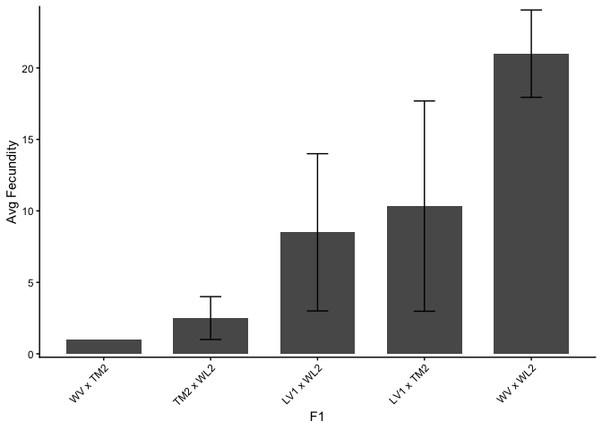<!-- -->

``` r
total_fit_2024plants_summary %>% 
  filter(Pop.Type=="F2") %>% 
  mutate(meanFruit=if_else(meanFruit=="NaN", NA, meanFruit)) %>% 
  filter(!is.na(meanFruit)) %>% 
  ggplot(aes(x=fct_reorder(pop, meanFruit), y=meanFruit)) +
  geom_col(width = 0.7,position = position_dodge(0.75)) +
  geom_errorbar(aes(ymin=meanFruit-semFruit,
                    ymax=meanFruit+semFruit),
                width=.2, position =position_dodge(0.75)) +
  theme_classic() +
  scale_y_continuous(expand = c(0.01, 0)) +
  theme(axis.text.x = element_text(angle = 45, hjust = 1)) + 
  labs(x="F2", y="Avg Fecundity")
```

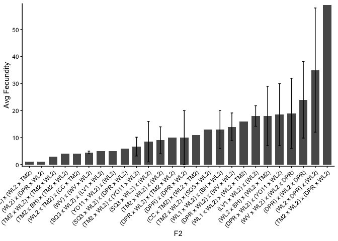<!-- -->

### Prob Fruit

``` r
total_fit_2024plants_summary %>% 
  filter(Pop.Type=="Parent") %>% 
  mutate(meanProbProbFruit=if_else(meanProbFruit=="NaN", NA, meanProbFruit)) %>% 
  filter(!is.na(meanProbFruit)) %>% 
  left_join(clim_dist_2024_wide) %>% 
  ggplot(aes(x=fct_reorder(pop, meanProbFruit), y=meanProbFruit, fill=elev_m)) +
  geom_col(width = 0.7,position = position_dodge(0.75)) +
  geom_errorbar(aes(ymin=meanProbFruit-semProbFruit,
                    ymax=meanProbFruit+semProbFruit),width=.2, 
                position =position_dodge(0.75)) +
  labs(x="Population", y="Avg Prob Rep", fill="Elevation (m)") +
  scale_y_continuous(expand = c(0.01, 0)) +
  scale_fill_gradient(low = "#F5A540", high = "#0043F0") +
  theme_classic()
```

```
## Joining with `by = join_by(pop)`
```

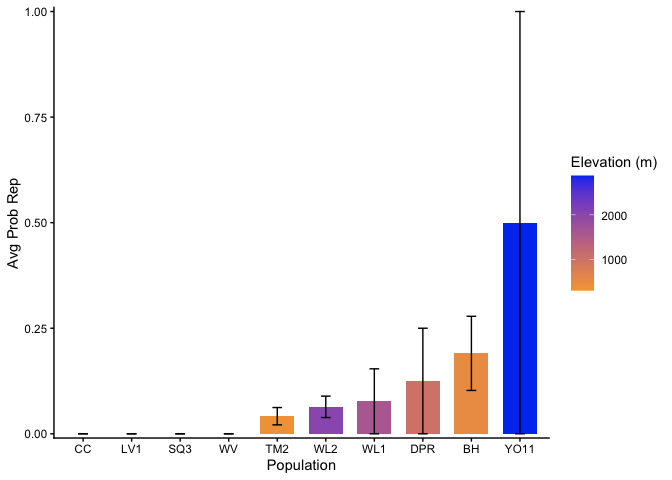<!-- -->

``` r
total_fit_2024plants_summary %>% 
  filter(Pop.Type=="F1") %>% 
  mutate(meanProbFruit=if_else(meanProbFruit=="NaN", NA, meanProbFruit)) %>% 
  filter(!is.na(meanProbFruit)) %>% 
  ggplot(aes(x=fct_reorder(pop, meanProbFruit), y=meanProbFruit)) +
  geom_col(width = 0.7,position = position_dodge(0.75)) +
  geom_errorbar(aes(ymin=meanProbFruit-semProbFruit,
                    ymax=meanProbFruit+semProbFruit),
                width=.2, position =position_dodge(0.75)) +
  theme_classic() +
  scale_y_continuous(expand = c(0.01, 0)) +
  theme(axis.text.x = element_text(angle = 45, hjust = 1)) + 
  labs(x="F1", y="Avg Prob Rep")
```

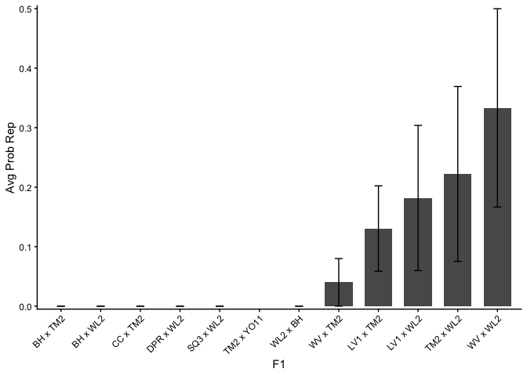<!-- -->

``` r
total_fit_2024plants_summary %>% 
  filter(Pop.Type=="F2") %>% 
  mutate(meanProbFruit=if_else(meanProbFruit=="NaN", NA, meanProbFruit)) %>% 
  filter(!is.na(meanProbFruit)) %>% 
  ggplot(aes(x=fct_reorder(pop, meanProbFruit), y=meanProbFruit)) +
  geom_col(width = 0.7,position = position_dodge(0.75)) +
  geom_errorbar(aes(ymin=meanProbFruit-semProbFruit,
                    ymax=meanProbFruit+semProbFruit),
                width=.2, position =position_dodge(0.75)) +
  theme_classic() +
  scale_y_continuous(expand = c(0.01, 0)) +
  theme(axis.text.x = element_text(angle = 45, hjust = 1)) + 
  labs(x="F2", y="Avg Prob Rep")
```

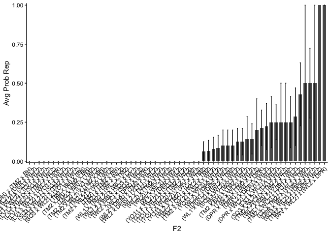<!-- -->

### Total fruit 

``` r
total_fit_2024plants_summary %>% 
  filter(Pop.Type=="Parent") %>% 
  mutate(meanTotalFit=if_else(meanTotalFit=="NaN", NA, meanTotalFit)) %>% 
  filter(!is.na(meanTotalFit)) %>% 
  left_join(clim_dist_2024_wide) %>% 
  ggplot(aes(x=fct_reorder(pop, meanTotalFit), y=meanTotalFit, fill=elev_m)) +
  geom_col(width = 0.7,position = position_dodge(0.75)) +
  geom_errorbar(aes(ymin=meanTotalFit-semTotalFit,
                    ymax=meanTotalFit+semTotalFit),width=.2, 
                position =position_dodge(0.75)) +
  labs(x="Population", y="Avg Total Fitness", fill="Elevation (m)") +
  scale_y_continuous(expand = c(0.01, 0)) +
  scale_fill_gradient(low = "#F5A540", high = "#0043F0") +
  theme_classic()
```

```
## Joining with `by = join_by(pop)`
```

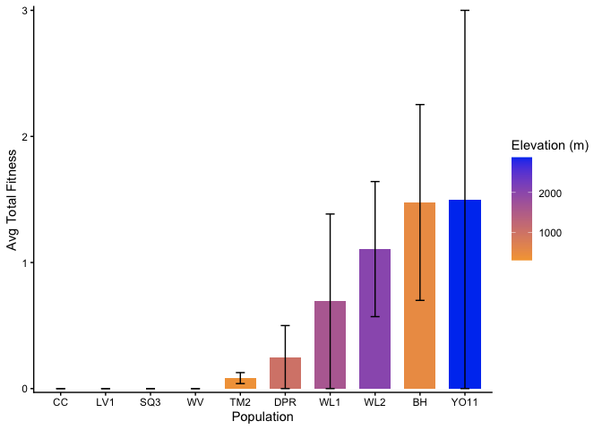<!-- -->

``` r
total_fit_2024plants_summary %>% 
  filter(Pop.Type=="F1") %>% 
  mutate(meanTotalFit=if_else(meanTotalFit=="NaN", NA, meanTotalFit)) %>% 
  filter(!is.na(meanTotalFit)) %>% 
  ggplot(aes(x=fct_reorder(pop, meanTotalFit), y=meanTotalFit)) +
  geom_col(width = 0.7,position = position_dodge(0.75)) +
  geom_errorbar(aes(ymin=meanTotalFit-semTotalFit,
                    ymax=meanTotalFit+semTotalFit),
                width=.2, position =position_dodge(0.75)) +
  theme_classic() +
  scale_y_continuous(expand = c(0.01, 0)) +
  theme(axis.text.x = element_text(angle = 45, hjust = 1)) + 
  labs(x="F1", y="Avg Total Fitness")
```

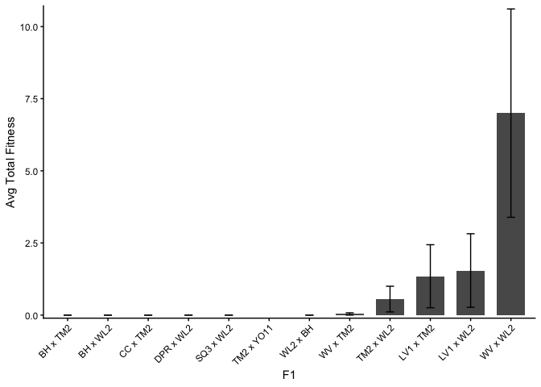<!-- -->

``` r
total_fit_2024plants_summary %>% 
  filter(Pop.Type=="F2") %>% 
  mutate(meanTotalFit=if_else(meanTotalFit=="NaN", NA, meanTotalFit)) %>% 
  filter(!is.na(meanTotalFit)) %>% 
  ggplot(aes(x=fct_reorder(pop, meanTotalFit), y=meanTotalFit)) +
  geom_col(width = 0.7,position = position_dodge(0.75)) +
  geom_errorbar(aes(ymin=meanTotalFit-semTotalFit,
                    ymax=meanTotalFit+semTotalFit),
                width=.2, position =position_dodge(0.75)) +
  theme_classic() +
  scale_y_continuous(expand = c(0.01, 0)) +
  theme(axis.text.x = element_text(angle = 45, hjust = 1)) + 
  labs(x="F2", y="Avg Total Fitness")
```

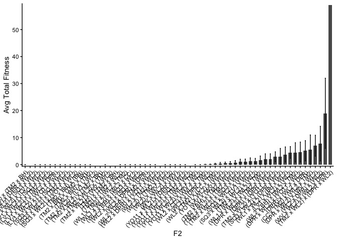<!-- -->


## Box Plots (quick check for heterosis)

``` r
total_fit_2024plants_noF2s %>% 
  ggplot(aes(x=pop, y=TotalFitness, colour = Pop.Type)) + #0s included 
  geom_boxplot() +
  theme(axis.text.x = element_text(angle = 45, hjust = 1))
```

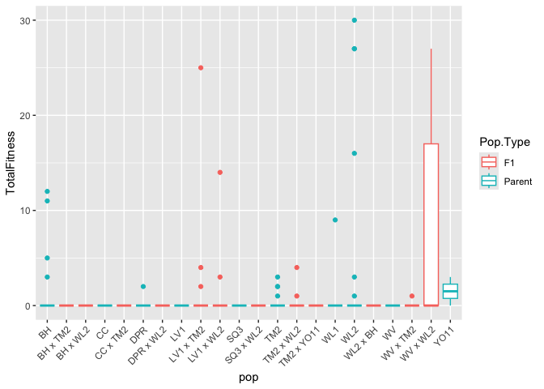<!-- -->

``` r
total_fit_2024plants_noF2s %>%
  mutate(num.fruit=if_else(is.na(num.fruit) | num.fruit==0, NA, num.fruit)) %>% 
  ggplot(aes(x=pop, y=num.fruit, colour = Pop.Type)) + #no 0s 
  geom_boxplot() +
  theme(axis.text.x = element_text(angle = 45, hjust = 1))
```

```
## Warning: Removed 352 rows containing non-finite outside the scale range
## (`stat_boxplot()`).
```

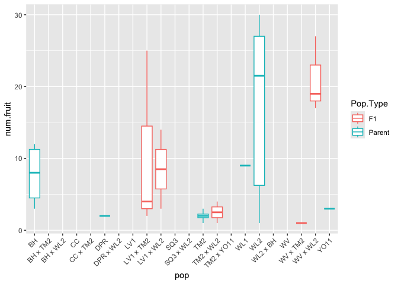<!-- -->

``` r
#no obvious trends of heterosis 
```

## Means (no F2s)

``` r
total_fit_2024plants_summary <- total_fit_2024plants_noF2s %>% 
  mutate(num.fruit=if_else(is.na(num.fruit) | num.fruit==0, NA, num.fruit)) %>%  #remove 0s
  group_by(Pop.Type, pop, dame_pop, sire_pop, 
           dame_elev, dame_GeoDist,
           dame_GD_Recent, dame_GD_Historic, 
           meanElev, meanGeoDist,
           mean_GD_Recent, mean_GD_Historic) %>% 
  summarise(n=n(), n_Fecundity=sum(!is.na(num.fruit)),
            mean_ProbFruit=mean(ProbFruit, na.rm=TRUE), stdev_ProbFruit=sd(ProbFruit, na.rm=TRUE),
            mean_Fecundity=mean(num.fruit, na.rm=TRUE), stdev_Fecundity=sd(num.fruit, na.rm=TRUE),
            mean_TotalFitness=mean(TotalFitness, na.rm=TRUE), stdev_TotalFitness=sd(TotalFitness, na.rm=TRUE),
            mean_Y1Surv=mean(Y1Surv, na.rm=TRUE), stdev_Y1Surv=sd(Y1Surv, na.rm=TRUE)) 
```

```
## `summarise()` has regrouped the output.
## ℹ Summaries were computed grouped by Pop.Type, pop, dame_pop, sire_pop,
##   dame_elev, dame_GeoDist, dame_GD_Recent, dame_GD_Historic, meanElev,
##   meanGeoDist, mean_GD_Recent, and mean_GD_Historic.
## ℹ Output is grouped by Pop.Type, pop, dame_pop, sire_pop, dame_elev,
##   dame_GeoDist, dame_GD_Recent, dame_GD_Historic, meanElev, meanGeoDist, and
##   mean_GD_Recent.
## ℹ Use `summarise(.groups = "drop_last")` to silence this message.
## ℹ Use `summarise(.by = c(Pop.Type, pop, dame_pop, sire_pop, dame_elev,
##   dame_GeoDist, dame_GD_Recent, dame_GD_Historic, meanElev, meanGeoDist,
##   mean_GD_Recent, mean_GD_Historic))` for per-operation grouping
##   (`?dplyr::dplyr_by`) instead.
```

``` r
total_fit_2024plants_summary
```

```
## # A tibble: 22 × 22
## # Groups:   Pop.Type, pop, dame_pop, sire_pop, dame_elev, dame_GeoDist,
## #   dame_GD_Recent, dame_GD_Historic, meanElev, meanGeoDist, mean_GD_Recent
## #   [22]
##    Pop.Type pop        dame_pop sire_pop dame_elev dame_GeoDist dame_GD_Recent
##    <chr>    <chr>      <chr>    <chr>        <dbl>        <dbl>          <dbl>
##  1 F1       BH x TM2   BH       TM2           511.      159626.          0.599
##  2 F1       BH x WL2   BH       WL2           511.      159626.          0.599
##  3 F1       CC x TM2   CC       TM2           313       132498.          0.464
##  4 F1       DPR x WL2  DPR      WL2          1019.       66246.          0.413
##  5 F1       LV1 x TM2  LV1      TM2          2593.      212682.          0.386
##  6 F1       LV1 x WL2  LV1      WL2          2593.      212682.          0.386
##  7 F1       SQ3 x WL2  SQ3      WL2          2373.      264780.          0.224
##  8 F1       TM2 x WL2  TM2      WL2           379.      140893.          0.415
##  9 F1       TM2 x YO11 TM2      YO11          379.      140893.          0.415
## 10 F1       WL2 x BH   WL2      BH           2020.         136.          0.149
## # ℹ 12 more rows
## # ℹ 15 more variables: dame_GD_Historic <dbl>, meanElev <dbl>,
## #   meanGeoDist <dbl>, mean_GD_Recent <dbl>, mean_GD_Historic <dbl>, n <int>,
## #   n_Fecundity <int>, mean_ProbFruit <dbl>, stdev_ProbFruit <dbl>,
## #   mean_Fecundity <dbl>, stdev_Fecundity <dbl>, mean_TotalFitness <dbl>,
## #   stdev_TotalFitness <dbl>, mean_Y1Surv <dbl>, stdev_Y1Surv <dbl>
```

## Fitness Relative to WL2 parent

``` r
WL2_crosses <- total_fit_2024plants_noF2s %>% 
  mutate(num.fruit=if_else(is.na(num.fruit) | num.fruit==0, NA, num.fruit)) %>%  #remove 0s
  filter(str_detect(pop, "WL2")) %>% 
  mutate(other_Parent_elev=if_else(dame_pop=="WL2", sire_elev, dame_elev),
         other_Parent_GeoDist=if_else(dame_pop=="WL2", sire_GeoDist, dame_GeoDist),
         other_Parent_climdist=if_else(dame_pop=="WL2", sire_GD_Recent, dame_GD_Recent)) %>%
  group_by(Pop.Type, pop, dame_pop, sire_pop, 
           other_Parent_elev, other_Parent_GeoDist, other_Parent_climdist) %>% 
  summarise(n=n(), n_Fecundity=sum(!is.na(num.fruit)),
            mean_Establishment=mean(Establishment, na.rm=TRUE),
            sem_Establishment=sem(Establishment, na.rm=TRUE),
            mean_Y1Surv=mean(Y1Surv, na.rm=TRUE), sem_Y1Surv=sem(Y1Surv, na.rm=TRUE),
            mean_WintSurv=mean(WintSurv, na.rm=TRUE), sem_WintSurv=sem(WintSurv, na.rm=TRUE),
            mean_SurvtoBud=mean(SurvtoBud, na.rm=TRUE), sem_SurvtoBud=sem(SurvtoBud, na.rm=TRUE),
            mean_ProbFruit=mean(ProbFruit, na.rm=TRUE), 
            sem_ProbFruit=sem(ProbFruit, na.rm=TRUE),
            mean_Fecundity=mean(num.fruit, na.rm=TRUE), 
            sem_Fecundity=sem(num.fruit, na.rm=TRUE),
            mean_TotalFitness=mean(TotalFitness, na.rm=TRUE),
            sem_TotalFitness=sem(TotalFitness, na.rm=TRUE)) %>% 
  mutate(Pop.Type=if_else(Pop.Type=="F1", "Donor x WL2", "WL2"))
```

```
## `summarise()` has regrouped the output.
## ℹ Summaries were computed grouped by Pop.Type, pop, dame_pop, sire_pop,
##   other_Parent_elev, other_Parent_GeoDist, and other_Parent_climdist.
## ℹ Output is grouped by Pop.Type, pop, dame_pop, sire_pop, other_Parent_elev,
##   and other_Parent_GeoDist.
## ℹ Use `summarise(.groups = "drop_last")` to silence this message.
## ℹ Use `summarise(.by = c(Pop.Type, pop, dame_pop, sire_pop, other_Parent_elev,
##   other_Parent_GeoDist, other_Parent_climdist))` for per-operation grouping
##   (`?dplyr::dplyr_by`) instead.
```

``` r
WL2_crosses %>% arrange(desc(mean_TotalFitness))
```

```
## # A tibble: 8 × 23
## # Groups:   Pop.Type, pop, dame_pop, sire_pop, other_Parent_elev,
## #   other_Parent_GeoDist [8]
##   Pop.Type    pop       dame_pop sire_pop other_Parent_elev other_Parent_GeoDist
##   <chr>       <chr>     <chr>    <chr>                <dbl>                <dbl>
## 1 Donor x WL2 WV x WL2  WV       WL2                   749.              317600.
## 2 Donor x WL2 LV1 x WL2 LV1      WL2                  2593.              212682.
## 3 WL2         WL2       WL2      WL2                  2020.                 136.
## 4 Donor x WL2 TM2 x WL2 TM2      WL2                   379.              140893.
## 5 Donor x WL2 BH x WL2  BH       WL2                   511.              159626.
## 6 Donor x WL2 DPR x WL2 DPR      WL2                  1019.               66246.
## 7 Donor x WL2 SQ3 x WL2 SQ3      WL2                  2373.              264780.
## 8 Donor x WL2 WL2 x BH  WL2      BH                    511.              159626.
## # ℹ 17 more variables: other_Parent_climdist <dbl>, n <int>, n_Fecundity <int>,
## #   mean_Establishment <dbl>, sem_Establishment <dbl>, mean_Y1Surv <dbl>,
## #   sem_Y1Surv <dbl>, mean_WintSurv <dbl>, sem_WintSurv <dbl>,
## #   mean_SurvtoBud <dbl>, sem_SurvtoBud <dbl>, mean_ProbFruit <dbl>,
## #   sem_ProbFruit <dbl>, mean_Fecundity <dbl>, sem_Fecundity <dbl>,
## #   mean_TotalFitness <dbl>, sem_TotalFitness <dbl>
```

``` r
WL2_crosses %>% arrange(desc(mean_Y1Surv))
```

```
## # A tibble: 8 × 23
## # Groups:   Pop.Type, pop, dame_pop, sire_pop, other_Parent_elev,
## #   other_Parent_GeoDist [8]
##   Pop.Type    pop       dame_pop sire_pop other_Parent_elev other_Parent_GeoDist
##   <chr>       <chr>     <chr>    <chr>                <dbl>                <dbl>
## 1 Donor x WL2 TM2 x WL2 TM2      WL2                   379.              140893.
## 2 Donor x WL2 WV x WL2  WV       WL2                   749.              317600.
## 3 Donor x WL2 LV1 x WL2 LV1      WL2                  2593.              212682.
## 4 WL2         WL2       WL2      WL2                  2020.                 136.
## 5 Donor x WL2 BH x WL2  BH       WL2                   511.              159626.
## 6 Donor x WL2 DPR x WL2 DPR      WL2                  1019.               66246.
## 7 Donor x WL2 SQ3 x WL2 SQ3      WL2                  2373.              264780.
## 8 Donor x WL2 WL2 x BH  WL2      BH                    511.              159626.
## # ℹ 17 more variables: other_Parent_climdist <dbl>, n <int>, n_Fecundity <int>,
## #   mean_Establishment <dbl>, sem_Establishment <dbl>, mean_Y1Surv <dbl>,
## #   sem_Y1Surv <dbl>, mean_WintSurv <dbl>, sem_WintSurv <dbl>,
## #   mean_SurvtoBud <dbl>, sem_SurvtoBud <dbl>, mean_ProbFruit <dbl>,
## #   sem_ProbFruit <dbl>, mean_Fecundity <dbl>, sem_Fecundity <dbl>,
## #   mean_TotalFitness <dbl>, sem_TotalFitness <dbl>
```

### Figures 

``` r
WL2_crosses %>% 
   ggplot(aes(x=fct_reorder(pop, other_Parent_elev), y=mean_TotalFitness, fill=other_Parent_elev, colour=other_Parent_elev)) +
  geom_errorbar(aes(ymin=mean_TotalFitness-sem_TotalFitness,
                    ymax=mean_TotalFitness+sem_TotalFitness),width=.2, 
                position =position_dodge(0.75)) +
  geom_col(width = 0.7,position = position_dodge(0.75)) + 
  theme_classic() + 
  scale_y_continuous(expand = c(0.01, 0)) +
  scale_fill_gradient(low = "#F5A540", high = "#0043F0") +
  scale_colour_gradient(low = "#F5A540", high = "#0043F0") +
  theme(text=element_text(size=25),axis.text.x = element_text(angle = 45, hjust = 1)) + 
  labs(y="Avg Total Fitness", x="Population", fill="Elevation (m)", color="Elevation (m)")
```

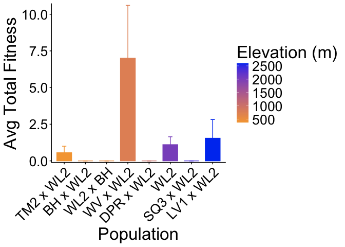<!-- -->

``` r
ggsave("../output/WL2_Traits/WL2_2024Plants_TotalFitness_WL2Crosses.png", width = 14, height = 8, units = "in")
```

## Mid-Parent Values

``` r
F1_info <- total_fit_2024plants_summary %>% filter(Pop.Type=="F1") %>% select(meanElev:mean_GD_Historic)
```

```
## Adding missing grouping variables: `Pop.Type`, `pop`, `dame_pop`, `sire_pop`,
## `dame_elev`, `dame_GeoDist`, `dame_GD_Recent`, `dame_GD_Historic`
```

``` r
parent_prep_probfruit <- total_fit_2024plants_summary %>% 
  filter(Pop.Type=="Parent") %>% 
  ungroup() %>% 
  select(pop, mean_ProbFruit:stdev_Y1Surv) %>% 
  pivot_wider(names_from = pop, 
              values_from = c(mean_ProbFruit, stdev_ProbFruit,
                              mean_Fecundity, stdev_Fecundity,
                              mean_TotalFitness, stdev_TotalFitness,
                              mean_Y1Surv, stdev_Y1Surv)) %>% 
  mutate("WV x TM2-mean_ProbFruit"=(mean_ProbFruit_WV+mean_ProbFruit_TM2)/2, 
         "LV1 x WL2-mean_ProbFruit"=(mean_ProbFruit_LV1+mean_ProbFruit_WL2)/2,
         "LV1 x TM2-mean_ProbFruit"=(mean_ProbFruit_LV1+mean_ProbFruit_TM2)/2, 
         "TM2 x WL2-mean_ProbFruit"=(mean_ProbFruit_TM2+mean_ProbFruit_WL2)/2,
         "CC x TM2-mean_ProbFruit"=(mean_ProbFruit_CC+mean_ProbFruit_TM2)/2, 
         "WV x WL2-mean_ProbFruit"=(mean_ProbFruit_WV+mean_ProbFruit_WL2)/2,
         "BH x TM2-mean_ProbFruit"=(mean_ProbFruit_BH+mean_ProbFruit_TM2)/2, 
         "WL2 x BH-mean_ProbFruit"=(mean_ProbFruit_BH+mean_ProbFruit_WL2)/2,
         "DPR x WL2-mean_ProbFruit"=(mean_ProbFruit_DPR+mean_ProbFruit_WL2)/2, 
         "BH x WL2-mean_ProbFruit"=(mean_ProbFruit_BH+mean_ProbFruit_WL2)/2,
         "SQ3 x WL2-mean_ProbFruit"=(mean_ProbFruit_SQ3+mean_ProbFruit_WL2)/2, 
         "TM2 x YO11-mean_ProbFruit"=(mean_ProbFruit_TM2+mean_ProbFruit_YO11)/2) %>% 
  mutate("WV x TM2-stdev_ProbFruit"=sqrt(stdev_ProbFruit_WV^2^2+stdev_ProbFruit_TM2^2), 
         "LV1 x WL2-stdev_ProbFruit"=sqrt(stdev_ProbFruit_LV1^2+stdev_ProbFruit_WL2^2),
         "LV1 x TM2-stdev_ProbFruit"=sqrt(stdev_ProbFruit_LV1^2+stdev_ProbFruit_TM2^2), 
         "TM2 x WL2-stdev_ProbFruit"=sqrt(stdev_ProbFruit_TM2^2+stdev_ProbFruit_WL2^2),
         "CC x TM2-stdev_ProbFruit"=sqrt(stdev_ProbFruit_CC^2+stdev_ProbFruit_TM2^2), 
         "WV x WL2-stdev_ProbFruit"=sqrt(stdev_ProbFruit_WV^2+stdev_ProbFruit_WL2^2),
         "BH x TM2-stdev_ProbFruit"=sqrt(stdev_ProbFruit_BH^2+stdev_ProbFruit_TM2^2), 
         "WL2 x BH-stdev_ProbFruit"=sqrt(stdev_ProbFruit_BH^2+stdev_ProbFruit_WL2^2),
         "DPR x WL2-stdev_ProbFruit"=sqrt(stdev_ProbFruit_DPR^2+stdev_ProbFruit_WL2^2), 
         "BH x WL2-stdev_ProbFruit"=sqrt(stdev_ProbFruit_BH^2+stdev_ProbFruit_WL2^2),
         "SQ3 x WL2-stdev_ProbFruit"=sqrt(stdev_ProbFruit_SQ3^2+stdev_ProbFruit_WL2^2), 
         "TM2 x YO11-stdev_ProbFruit"=sqrt(stdev_ProbFruit_TM2^2+stdev_ProbFruit_YO11^2)) %>% 
  mutate("WV x TM2-mean_Fecundity"=(mean_Fecundity_WV+mean_Fecundity_TM2)/2, 
         "LV1 x WL2-mean_Fecundity"=(mean_Fecundity_LV1+mean_Fecundity_WL2)/2,
         "LV1 x TM2-mean_Fecundity"=(mean_Fecundity_LV1+mean_Fecundity_TM2)/2, 
         "TM2 x WL2-mean_Fecundity"=(mean_Fecundity_TM2+mean_Fecundity_WL2)/2,
         "CC x TM2-mean_Fecundity"=(mean_Fecundity_CC+mean_Fecundity_TM2)/2, 
         "WV x WL2-mean_Fecundity"=(mean_Fecundity_WV+mean_Fecundity_WL2)/2,
         "BH x TM2-mean_Fecundity"=(mean_Fecundity_BH+mean_Fecundity_TM2)/2, 
         "WL2 x BH-mean_Fecundity"=(mean_Fecundity_BH+mean_Fecundity_WL2)/2,
         "DPR x WL2-mean_Fecundity"=(mean_Fecundity_DPR+mean_Fecundity_WL2)/2, 
         "BH x WL2-mean_Fecundity"=(mean_Fecundity_BH+mean_Fecundity_WL2)/2,
         "SQ3 x WL2-mean_Fecundity"=(mean_Fecundity_SQ3+mean_Fecundity_WL2)/2, 
         "TM2 x YO11-mean_Fecundity"=(mean_Fecundity_TM2+mean_Fecundity_YO11)/2) %>% 
  mutate("WV x TM2-stdev_Fecundity"=sqrt(stdev_Fecundity_WV^2^2+stdev_Fecundity_TM2^2), 
         "LV1 x WL2-stdev_Fecundity"=sqrt(stdev_Fecundity_LV1^2+stdev_Fecundity_WL2^2),
         "LV1 x TM2-stdev_Fecundity"=sqrt(stdev_Fecundity_LV1^2+stdev_Fecundity_TM2^2), 
         "TM2 x WL2-stdev_Fecundity"=sqrt(stdev_Fecundity_TM2^2+stdev_Fecundity_WL2^2),
         "CC x TM2-stdev_Fecundity"=sqrt(stdev_Fecundity_CC^2+stdev_Fecundity_TM2^2), 
         "WV x WL2-stdev_Fecundity"=sqrt(stdev_Fecundity_WV^2+stdev_Fecundity_WL2^2),
         "BH x TM2-stdev_Fecundity"=sqrt(stdev_Fecundity_BH^2+stdev_Fecundity_TM2^2), 
         "WL2 x BH-stdev_Fecundity"=sqrt(stdev_Fecundity_BH^2+stdev_Fecundity_WL2^2),
         "DPR x WL2-stdev_Fecundity"=sqrt(stdev_Fecundity_DPR^2+stdev_Fecundity_WL2^2), 
         "BH x WL2-stdev_Fecundity"=sqrt(stdev_Fecundity_BH^2+stdev_Fecundity_WL2^2),
         "SQ3 x WL2-stdev_Fecundity"=sqrt(stdev_Fecundity_SQ3^2+stdev_Fecundity_WL2^2), 
         "TM2 x YO11-stdev_Fecundity"=sqrt(stdev_Fecundity_TM2^2+stdev_Fecundity_YO11^2)) %>% 
  mutate("WV x TM2-mean_TotalFitness"=(mean_TotalFitness_WV+mean_TotalFitness_TM2)/2, 
         "LV1 x WL2-mean_TotalFitness"=(mean_TotalFitness_LV1+mean_TotalFitness_WL2)/2,
         "LV1 x TM2-mean_TotalFitness"=(mean_TotalFitness_LV1+mean_TotalFitness_TM2)/2, 
         "TM2 x WL2-mean_TotalFitness"=(mean_TotalFitness_TM2+mean_TotalFitness_WL2)/2,
         "CC x TM2-mean_TotalFitness"=(mean_TotalFitness_CC+mean_TotalFitness_TM2)/2, 
         "WV x WL2-mean_TotalFitness"=(mean_TotalFitness_WV+mean_TotalFitness_WL2)/2,
         "BH x TM2-mean_TotalFitness"=(mean_TotalFitness_BH+mean_TotalFitness_TM2)/2, 
         "WL2 x BH-mean_TotalFitness"=(mean_TotalFitness_BH+mean_TotalFitness_WL2)/2,
         "DPR x WL2-mean_TotalFitness"=(mean_TotalFitness_DPR+mean_TotalFitness_WL2)/2, 
         "BH x WL2-mean_TotalFitness"=(mean_TotalFitness_BH+mean_TotalFitness_WL2)/2,
         "SQ3 x WL2-mean_TotalFitness"=(mean_TotalFitness_SQ3+mean_TotalFitness_WL2)/2, 
         "TM2 x YO11-mean_TotalFitness"=(mean_TotalFitness_TM2+mean_TotalFitness_YO11)/2) %>% 
  mutate("WV x TM2-stdev_TotalFitness"=sqrt(stdev_TotalFitness_WV^2^2+stdev_TotalFitness_TM2^2), 
         "LV1 x WL2-stdev_TotalFitness"=sqrt(stdev_TotalFitness_LV1^2+stdev_TotalFitness_WL2^2),
         "LV1 x TM2-stdev_TotalFitness"=sqrt(stdev_TotalFitness_LV1^2+stdev_TotalFitness_TM2^2), 
         "TM2 x WL2-stdev_TotalFitness"=sqrt(stdev_TotalFitness_TM2^2+stdev_TotalFitness_WL2^2),
         "CC x TM2-stdev_TotalFitness"=sqrt(stdev_TotalFitness_CC^2+stdev_TotalFitness_TM2^2), 
         "WV x WL2-stdev_TotalFitness"=sqrt(stdev_TotalFitness_WV^2+stdev_TotalFitness_WL2^2),
         "BH x TM2-stdev_TotalFitness"=sqrt(stdev_TotalFitness_BH^2+stdev_TotalFitness_TM2^2), 
         "WL2 x BH-stdev_TotalFitness"=sqrt(stdev_TotalFitness_BH^2+stdev_TotalFitness_WL2^2),
         "DPR x WL2-stdev_TotalFitness"=sqrt(stdev_TotalFitness_DPR^2+stdev_TotalFitness_WL2^2), 
         "BH x WL2-stdev_TotalFitness"=sqrt(stdev_TotalFitness_BH^2+stdev_TotalFitness_WL2^2),
         "SQ3 x WL2-stdev_TotalFitness"=sqrt(stdev_TotalFitness_SQ3^2+stdev_TotalFitness_WL2^2), 
         "TM2 x YO11-stdev_TotalFitness"=sqrt(stdev_TotalFitness_TM2^2+stdev_TotalFitness_YO11^2)) %>% 
  mutate("WV x TM2-mean_Y1Surv"=(mean_Y1Surv_WV+mean_Y1Surv_TM2)/2, 
         "LV1 x WL2-mean_Y1Surv"=(mean_Y1Surv_LV1+mean_Y1Surv_WL2)/2,
         "LV1 x TM2-mean_Y1Surv"=(mean_Y1Surv_LV1+mean_Y1Surv_TM2)/2, 
         "TM2 x WL2-mean_Y1Surv"=(mean_Y1Surv_TM2+mean_Y1Surv_WL2)/2,
         "CC x TM2-mean_Y1Surv"=(mean_Y1Surv_CC+mean_Y1Surv_TM2)/2, 
         "WV x WL2-mean_Y1Surv"=(mean_Y1Surv_WV+mean_Y1Surv_WL2)/2,
         "BH x TM2-mean_Y1Surv"=(mean_Y1Surv_BH+mean_Y1Surv_TM2)/2, 
         "WL2 x BH-mean_Y1Surv"=(mean_Y1Surv_BH+mean_Y1Surv_WL2)/2,
         "DPR x WL2-mean_Y1Surv"=(mean_Y1Surv_DPR+mean_Y1Surv_WL2)/2, 
         "BH x WL2-mean_Y1Surv"=(mean_Y1Surv_BH+mean_Y1Surv_WL2)/2,
         "SQ3 x WL2-mean_Y1Surv"=(mean_Y1Surv_SQ3+mean_Y1Surv_WL2)/2, 
         "TM2 x YO11-mean_Y1Surv"=(mean_Y1Surv_TM2+mean_Y1Surv_YO11)/2) %>% 
  mutate("WV x TM2-stdev_Y1Surv"=sqrt(stdev_Y1Surv_WV^2^2+stdev_Y1Surv_TM2^2), 
         "LV1 x WL2-stdev_Y1Surv"=sqrt(stdev_Y1Surv_LV1^2+stdev_Y1Surv_WL2^2),
         "LV1 x TM2-stdev_Y1Surv"=sqrt(stdev_Y1Surv_LV1^2+stdev_Y1Surv_TM2^2), 
         "TM2 x WL2-stdev_Y1Surv"=sqrt(stdev_Y1Surv_TM2^2+stdev_Y1Surv_WL2^2),
         "CC x TM2-stdev_Y1Surv"=sqrt(stdev_Y1Surv_CC^2+stdev_Y1Surv_TM2^2), 
         "WV x WL2-stdev_Y1Surv"=sqrt(stdev_Y1Surv_WV^2+stdev_Y1Surv_WL2^2),
         "BH x TM2-stdev_Y1Surv"=sqrt(stdev_Y1Surv_BH^2+stdev_Y1Surv_TM2^2), 
         "WL2 x BH-stdev_Y1Surv"=sqrt(stdev_Y1Surv_BH^2+stdev_Y1Surv_WL2^2),
         "DPR x WL2-stdev_Y1Surv"=sqrt(stdev_Y1Surv_DPR^2+stdev_Y1Surv_WL2^2), 
         "BH x WL2-stdev_Y1Surv"=sqrt(stdev_Y1Surv_BH^2+stdev_Y1Surv_WL2^2),
         "SQ3 x WL2-stdev_Y1Surv"=sqrt(stdev_Y1Surv_SQ3^2+stdev_Y1Surv_WL2^2), 
         "TM2 x YO11-stdev_Y1Surv"=sqrt(stdev_Y1Surv_TM2^2+stdev_Y1Surv_YO11^2)) %>%
  select(`WV x TM2-mean_ProbFruit`:`TM2 x YO11-stdev_Y1Surv`) %>% 
  pivot_longer(cols = everything(), names_to = c("pop", "measurement"), names_sep = "-", values_to = "value") %>%
  pivot_wider(names_from = measurement, values_from = value) %>% 
  left_join(F1_info) %>% 
  mutate(pop = paste0(pop, "_midParent"), Pop.Type="midParent")
```

```
## Joining with `by = join_by(pop)`
```

``` r
mid_parent_F1s_fitness <- total_fit_2024plants_summary %>% 
   filter(Pop.Type=="F1") %>% 
  bind_rows(parent_prep_probfruit) %>% 
  mutate(elevation.group=if_else(meanElev<1000, "All Low",
                                 if_else(meanElev>2000, "All High", "Mixed")))
mid_parent_F1s_fitness
```

```
## # A tibble: 24 × 23
## # Groups:   Pop.Type, pop, dame_pop, sire_pop, dame_elev, dame_GeoDist,
## #   dame_GD_Recent, dame_GD_Historic, meanElev, meanGeoDist, mean_GD_Recent
## #   [24]
##    Pop.Type pop        dame_pop sire_pop dame_elev dame_GeoDist dame_GD_Recent
##    <chr>    <chr>      <chr>    <chr>        <dbl>        <dbl>          <dbl>
##  1 F1       BH x TM2   BH       TM2           511.      159626.          0.599
##  2 F1       BH x WL2   BH       WL2           511.      159626.          0.599
##  3 F1       CC x TM2   CC       TM2           313       132498.          0.464
##  4 F1       DPR x WL2  DPR      WL2          1019.       66246.          0.413
##  5 F1       LV1 x TM2  LV1      TM2          2593.      212682.          0.386
##  6 F1       LV1 x WL2  LV1      WL2          2593.      212682.          0.386
##  7 F1       SQ3 x WL2  SQ3      WL2          2373.      264780.          0.224
##  8 F1       TM2 x WL2  TM2      WL2           379.      140893.          0.415
##  9 F1       TM2 x YO11 TM2      YO11          379.      140893.          0.415
## 10 F1       WL2 x BH   WL2      BH           2020.         136.          0.149
## # ℹ 14 more rows
## # ℹ 16 more variables: dame_GD_Historic <dbl>, meanElev <dbl>,
## #   meanGeoDist <dbl>, mean_GD_Recent <dbl>, mean_GD_Historic <dbl>, n <int>,
## #   n_Fecundity <int>, mean_ProbFruit <dbl>, stdev_ProbFruit <dbl>,
## #   mean_Fecundity <dbl>, stdev_Fecundity <dbl>, mean_TotalFitness <dbl>,
## #   stdev_TotalFitness <dbl>, mean_Y1Surv <dbl>, stdev_Y1Surv <dbl>,
## #   elevation.group <chr>
```

## Figures 

``` r
mid_parent_F1s_fitness %>% 
  ggplot(aes(x=pop, y=mean_ProbFruit, fill=meanElev, colour=meanElev)) +
  geom_errorbar(aes(ymin=mean_ProbFruit-0.01,ymax=mean_ProbFruit+stdev_ProbFruit),width=.2, position = 
                  position_dodge(0.75)) +
  geom_col(width = 0.7,position = position_dodge(0.75)) + 
  theme_classic() + 
  scale_y_continuous(expand = c(0.01, 0), limits=c(0,1)) +
  scale_fill_gradient(low = "#F5A540", high = "#0043F0") +
  scale_colour_gradient(low = "#F5A540", high = "#0043F0") +
  theme(text=element_text(size=25),axis.text.x = element_text(angle = 45, hjust = 1)) + 
  labs(y="Avg Probability of Fruits + Stdev", x="Population", fill="Avg Elevation (m)", color="Avg Elevation (m)") + 
  facet_wrap(vars(elevation.group), scales="free")
```

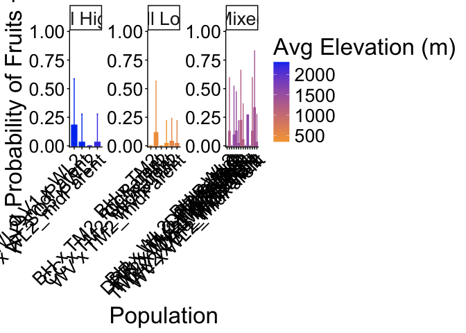<!-- -->

``` r
ggsave("../output/WL2_Traits/WL2_2024Plants_ProbFruit.png", width = 20, height = 8, units = "in")

mid_parent_F1s_fitness %>% 
  ggplot(aes(x=pop, y=mean_Fecundity, fill=meanElev, colour=meanElev)) +
  geom_errorbar(aes(ymin=mean_Fecundity-0.01,ymax=mean_Fecundity+stdev_Fecundity),width=.2, position = 
                  position_dodge(0.75)) +
  geom_col(width = 0.7,position = position_dodge(0.75)) + 
  theme_classic() + 
  scale_y_continuous(expand = c(0.01, 0)) +
  scale_fill_gradient(low = "#F5A540", high = "#0043F0") +
  scale_colour_gradient(low = "#F5A540", high = "#0043F0") +
  theme(text=element_text(size=25),axis.text.x = element_text(angle = 45, hjust = 1)) + 
  labs(y="Avg Fecundity + Stdev", x="Population", fill="Avg Elevation (m)", color="Avg Elevation (m)")  + 
  facet_wrap(vars(elevation.group), scales="free")
```

```
## Warning: Removed 13 rows containing missing values or values outside the scale range
## (`geom_col()`).
```

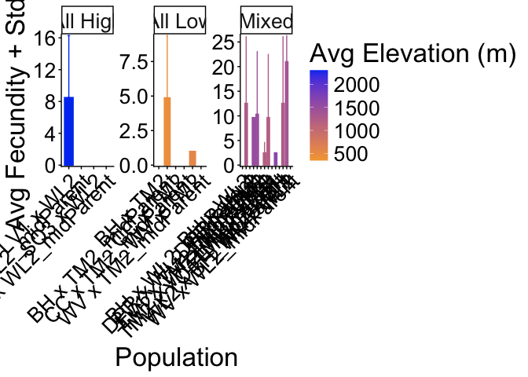<!-- -->

``` r
ggsave("../output/WL2_Traits/WL2_2024Plants_Fecundity.png", width = 20, height = 8, units = "in")
```

```
## Warning: Removed 13 rows containing missing values or values outside the scale range
## (`geom_col()`).
```

``` r
mid_parent_F1s_fitness %>% 
  ggplot(aes(x=pop, y=mean_TotalFitness, fill=meanElev, colour=meanElev)) +
  geom_errorbar(aes(ymin=mean_TotalFitness-0.01,ymax=mean_TotalFitness+stdev_TotalFitness),width=.2, position = 
                  position_dodge(0.75)) +
  geom_col(width = 0.7,position = position_dodge(0.75)) + 
  theme_classic() + 
  scale_y_continuous(expand = c(0.01, 0)) +
  scale_fill_gradient(low = "#F5A540", high = "#0043F0") +
  scale_colour_gradient(low = "#F5A540", high = "#0043F0") +
  theme(text=element_text(size=25),axis.text.x = element_text(angle = 45, hjust = 1)) + 
  labs(y="Avg Total Fitness + Stdev", x="Population", fill="Avg Elevation (m)", color="Avg Elevation (m)")  + 
  facet_wrap(vars(elevation.group), scales="free")
```

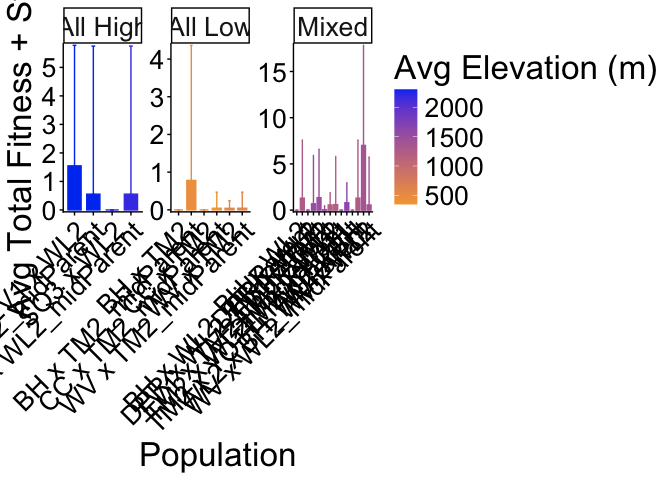<!-- -->

``` r
ggsave("../output/WL2_Traits/WL2_2024Plants_TotalFitness.png", width = 20, height = 8, units = "in")

mid_parent_F1s_fitness %>% 
  ggplot(aes(x=pop, y=mean_Y1Surv, fill=meanElev, colour=meanElev)) +
  geom_errorbar(aes(ymin=mean_Y1Surv-0.01,ymax=mean_Y1Surv+stdev_Y1Surv),width=.2, position = 
                  position_dodge(0.75)) +
  geom_col(width = 0.7,position = position_dodge(0.75)) + 
  theme_classic() + 
  scale_y_continuous(expand = c(0.01, 0)) +
  scale_fill_gradient(low = "#F5A540", high = "#0043F0") +
  scale_colour_gradient(low = "#F5A540", high = "#0043F0") +
  theme(text=element_text(size=25),axis.text.x = element_text(angle = 45, hjust = 1)) + 
  labs(y="Avg Y1 Survival + Stdev", x="Population", fill="Avg Elevation (m)", color="Avg Elevation (m)")  + 
  facet_wrap(vars(elevation.group), scales="free")
```

```
## Warning: Removed 2 rows containing missing values or values outside the scale range
## (`geom_col()`).
```

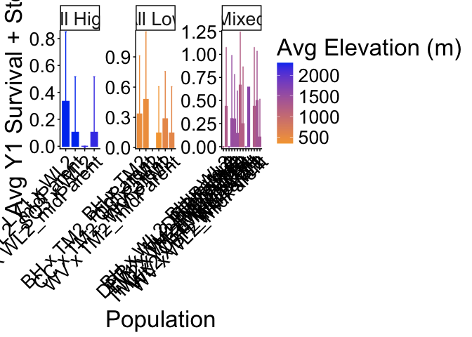<!-- -->

``` r
ggsave("../output/WL2_Traits/WL2_2024Plants_Y1Surv.png", width = 20, height = 8, units = "in")
```

```
## Warning: Removed 2 rows containing missing values or values outside the scale range
## (`geom_col()`).
```


``` r
mid_parent_F1s_fitness %>% 
  filter(elevation.group=="All High") %>% 
  ggplot(aes(x=pop, y=mean_TotalFitness)) +
  geom_errorbar(aes(ymin=mean_TotalFitness-0.01,ymax=mean_TotalFitness+stdev_TotalFitness),width=.2, position = 
                  position_dodge(0.75)) +
  geom_col(width = 0.7,position = position_dodge(0.75), fill="#0043F0", colour="#0043F0") + 
  theme_classic() + 
  scale_y_continuous(expand = c(0.01, 0)) +
  theme(text=element_text(size=25),axis.text.x = element_text(angle = 45, hjust = 1)) + 
  labs(y="Avg Total Fitness + Stdev", x="Population", fill="Avg Elevation (m)", color="Avg Elevation (m)")  + 
  facet_wrap(vars(elevation.group), scales="free")
```

```
## Ignoring unknown labels:
## • fill : "Avg Elevation (m)"
## • colour : "Avg Elevation (m)"
```

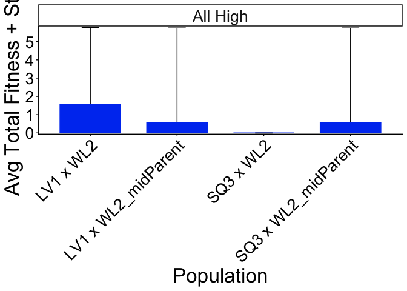<!-- -->

``` r
ggsave("../output/WL2_Traits/WL2_2024Plants_TotalFitness_AllHigh.png", width = 8, height = 8, units = "in")
```

```
## Ignoring unknown labels:
## • fill : "Avg Elevation (m)"
## • colour : "Avg Elevation (m)"
```

``` r
mid_parent_F1s_fitness %>% 
  filter(elevation.group=="All Low") %>% 
  ggplot(aes(x=pop, y=mean_TotalFitness)) +
  geom_errorbar(aes(ymin=mean_TotalFitness-0.01,ymax=mean_TotalFitness+stdev_TotalFitness),width=.2, position = 
                  position_dodge(0.75)) +
  geom_col(width = 0.7,position = position_dodge(0.75), fill="#F5A540", colour="#F5A540") + 
  theme_classic() + 
  scale_y_continuous(expand = c(0.01, 0)) +
  theme(text=element_text(size=25),axis.text.x = element_text(angle = 45, hjust = 1)) + 
  labs(y="Avg Total Fitness + Stdev", x="Population", fill="Avg Elevation (m)", color="Avg Elevation (m)")  + 
  facet_wrap(vars(elevation.group), scales="free")
```

```
## Ignoring unknown labels:
## • fill : "Avg Elevation (m)"
## • colour : "Avg Elevation (m)"
```

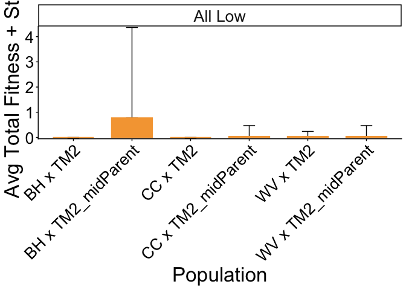<!-- -->

``` r
ggsave("../output/WL2_Traits/WL2_2024Plants_TotalFitness_AllLow.png", width = 8, height = 8, units = "in")
```

```
## Ignoring unknown labels:
## • fill : "Avg Elevation (m)"
## • colour : "Avg Elevation (m)"
```

``` r
mid_parent_F1s_fitness %>% 
  filter(elevation.group=="Mixed") %>% 
  ggplot(aes(x=pop, y=mean_TotalFitness, fill=meanElev, colour=meanElev)) +
  geom_errorbar(aes(ymin=mean_TotalFitness-0.01,ymax=mean_TotalFitness+stdev_TotalFitness),width=.2, position = 
                  position_dodge(0.75)) +
  geom_col(width = 0.7,position = position_dodge(0.75)) + 
  theme_classic() + 
  scale_y_continuous(expand = c(0.01, 0)) +
  scale_fill_gradient(low = "#b46ca4", high = "#9e60b8") +
  scale_colour_gradient(low = "#b46ca4", high = "#9e60b8") +
  theme(text=element_text(size=25),axis.text.x = element_text(angle = 45, hjust = 1)) + 
  labs(y="Avg Total Fitness + Stdev", x="Population", fill="Avg Elevation (m)", color="Avg Elevation (m)")  + 
  facet_wrap(vars(elevation.group), scales="free")
```

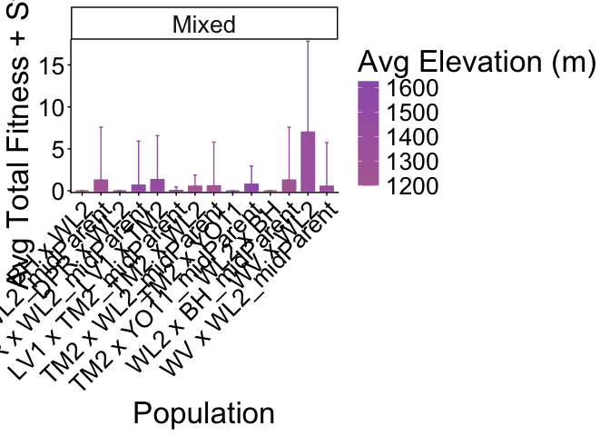<!-- -->

``` r
ggsave("../output/WL2_Traits/WL2_2024Plants_TotalFitness_Mixed.png", width = 14, height = 8, units = "in")
```

### Parents

``` r
total_fit_2024plants_summary %>% 
  filter(Pop.Type=="Parent") %>% 
   ggplot(aes(x=fct_reorder(pop, meanElev), y=mean_TotalFitness, fill=meanElev, colour=meanElev)) +
  geom_errorbar(aes(ymin=mean_TotalFitness-0.01,ymax=mean_TotalFitness+stdev_TotalFitness),width=.2, position = 
                  position_dodge(0.75)) +
  geom_col(width = 0.7,position = position_dodge(0.75)) + 
  theme_classic() + 
  scale_y_continuous(expand = c(0.01, 0)) +
  scale_fill_gradient(low = "#F5A540", high = "#0043F0") +
  scale_colour_gradient(low = "#F5A540", high = "#0043F0") +
  theme(text=element_text(size=25),axis.text.x = element_text(angle = 45, hjust = 1)) + 
  labs(y="Avg Total Fitness + Stdev", x="Population", fill="Elevation (m)", color="Elevation (m)")
```

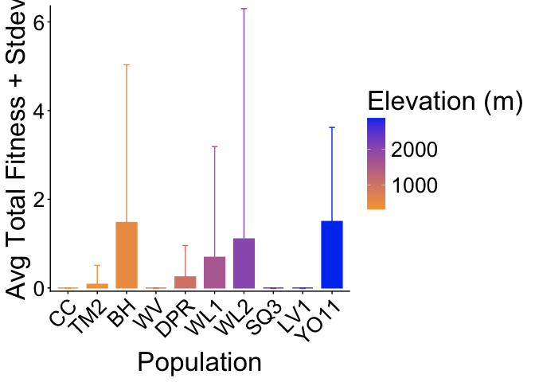<!-- -->

``` r
ggsave("../output/WL2_Traits/WL2_2024Plants_TotalFitness_Parents.png", width = 14, height = 8, units = "in")

total_fit_2024plants_summary %>% 
  filter(Pop.Type=="Parent") %>% 
   ggplot(aes(x=fct_reorder(pop, meanElev), y=mean_Y1Surv, fill=meanElev, colour=meanElev)) +
  geom_errorbar(aes(ymin=mean_Y1Surv-0.01,ymax=mean_Y1Surv+stdev_Y1Surv),width=.2, position = 
                  position_dodge(0.75)) +
  geom_col(width = 0.7,position = position_dodge(0.75)) + 
  theme_classic() + 
  scale_y_continuous(expand = c(0.01, 0)) +
  scale_fill_gradient(low = "#F5A540", high = "#0043F0") +
  scale_colour_gradient(low = "#F5A540", high = "#0043F0") +
  theme(text=element_text(size=25),axis.text.x = element_text(angle = 45, hjust = 1)) + 
  labs(y="Avg Y1 Survival + Stdev", x="Population", fill="Elevation (m)", color="Elevation (m)")
```

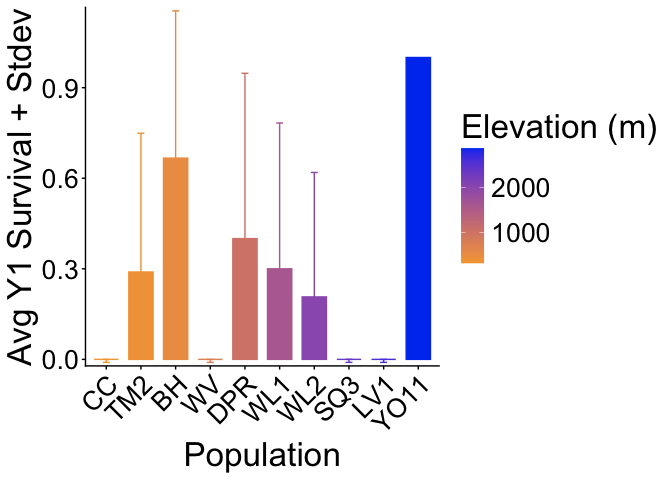<!-- -->

``` r
ggsave("../output/WL2_Traits/WL2_2024Plants_Y1Surv_Parents.png", width = 14, height = 8, units = "in")
```

