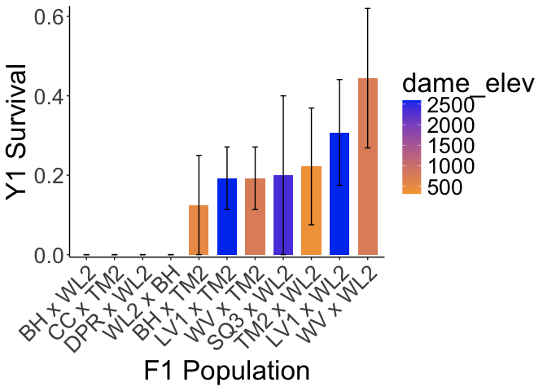
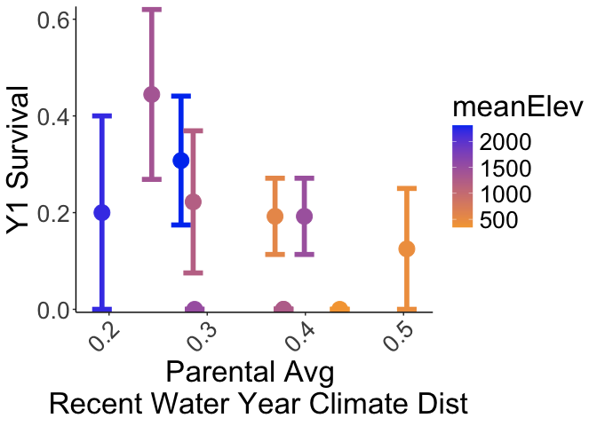
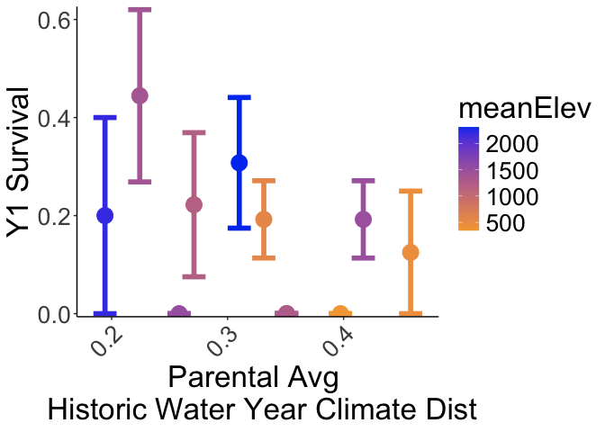
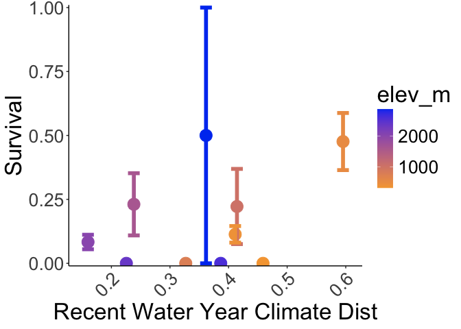
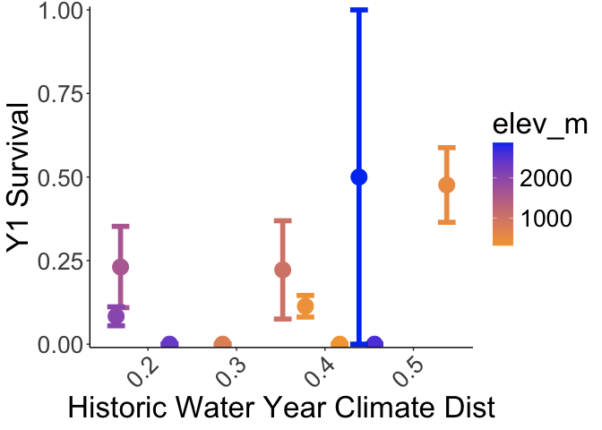
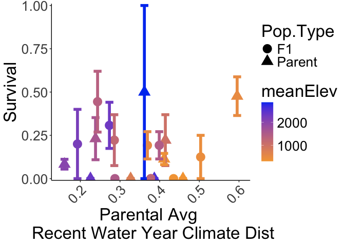
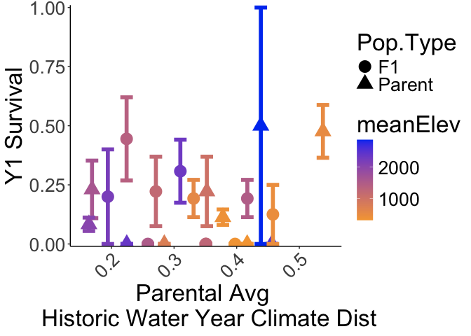

# Checking survival the end of 2024

## Libraries

``` r
library(tidyverse)
```

```
## ── Attaching core tidyverse packages ──────────────────────── tidyverse 2.0.0 ──
## ✔ dplyr     1.1.4     ✔ readr     2.1.5
## ✔ forcats   1.0.0     ✔ stringr   1.5.1
## ✔ ggplot2   3.5.1     ✔ tibble    3.2.1
## ✔ lubridate 1.9.3     ✔ tidyr     1.3.1
## ✔ purrr     1.0.2     
## ── Conflicts ────────────────────────────────────────── tidyverse_conflicts() ──
## ✖ dplyr::filter() masks stats::filter()
## ✖ dplyr::lag()    masks stats::lag()
## ℹ Use the conflicted package (<http://conflicted.r-lib.org/>) to force all conflicts to become errors
```

``` r
sem <- function(x, na.rm=FALSE) {           #for calculating standard error
  sd(x,na.rm=na.rm)/sqrt(length(na.omit(x)))
} 
```

## Surv Data

``` r
surv_2024 <- read_csv("../input/WL2_2024_Data/CorrectedCSVs/WL2_mort_pheno_20241023_corrected.csv")
```

```
## Rows: 1217 Columns: 13
## ── Column specification ────────────────────────────────────────────────────────
## Delimiter: ","
## chr (12): block, bed, col, unique.ID, bud.date, flower.date, fruit.date, las...
## dbl  (1): row
## 
## ℹ Use `spec()` to retrieve the full column specification for this data.
## ℹ Specify the column types or set `show_col_types = FALSE` to quiet this message.
```

``` r
head(surv_2024)
```

```
## # A tibble: 6 × 13
##   block bed     row col   unique.ID bud.date flower.date fruit.date last.FL.date
##   <chr> <chr> <dbl> <chr> <chr>     <chr>    <chr>       <chr>      <chr>       
## 1 <NA>  A         1 A     TM2_6_11  <NA>     <NA>        <NA>       <NA>        
## 2 <NA>  A         6 B     CC_3_3    <NA>     <NA>        <NA>       <NA>        
## 3 <NA>  A        16 B     BH_3_3    <NA>     <NA>        <NA>       <NA>        
## 4 <NA>  A        17 A     BH_7_3    6/18/24  7/2/24      7/9/24     8/13/24     
## 5 <NA>  A        18 A     BH_4_3    6/18/24  <NA>        7/23/24    <NA>        
## 6 <NA>  A        24 A     WL2_7_9   6/18/24  6/18/24     7/2/24     8/13/24     
## # ℹ 4 more variables: last.FR.date <chr>, death.date <chr>, missing.date <chr>,
## #   survey.notes <chr>
```

``` r
surv_2024 %>% filter(unique.ID=="buffer") #check for buffers
```

```
## # A tibble: 127 × 13
##    block bed     row col   unique.ID bud.date flower.date fruit.date
##    <chr> <chr> <dbl> <chr> <chr>     <chr>    <chr>       <chr>     
##  1 A     C         1 A     buffer    <NA>     <NA>        <NA>      
##  2 A     C         1 B     buffer    <NA>     <NA>        <NA>      
##  3 A     C         2 A     buffer    <NA>     <NA>        <NA>      
##  4 A     C         2 B     buffer    <NA>     <NA>        <NA>      
##  5 A     C         3 A     buffer    <NA>     <NA>        <NA>      
##  6 A     C         3 B     buffer    <NA>     <NA>        <NA>      
##  7 D     C        59 A     buffer    <NA>     <NA>        <NA>      
##  8 D     C        59 B     buffer    <NA>     <NA>        <NA>      
##  9 D     C        60 A     buffer    <NA>     <NA>        <NA>      
## 10 D     C        60 B     buffer    <NA>     <NA>        <NA>      
## # ℹ 117 more rows
## # ℹ 5 more variables: last.FL.date <chr>, last.FR.date <chr>, death.date <chr>,
## #   missing.date <chr>, survey.notes <chr>
```

## Pop Info

``` r
pop_info <- read_csv("../input/WL2_2024_Data/Final_2023_2024_Pop_Loc_Info.csv") %>% 
  select(Pop.Type:unique.ID) %>% 
  rename(row=bedrow, col=bedcol)
```

```
## Rows: 1217 Columns: 15
## ── Column specification ────────────────────────────────────────────────────────
## Delimiter: ","
## chr (8): Pop.Type, status, block, loc, bed, bedcol, pop, unique.ID
## dbl (7): bed.block.order, bed.order, AB.CD.order, column.order, bedrow, mf, rep
## 
## ℹ Use `spec()` to retrieve the full column specification for this data.
## ℹ Specify the column types or set `show_col_types = FALSE` to quiet this message.
```

## Elevation Info / Climate distance

``` r
clim_dist_2024 <- read_csv("../output/Climate/WL2_2024_Clim_Dist.csv") %>% select(-conf.low, -conf.high)
```

```
## Rows: 20 Columns: 11
## ── Column specification ────────────────────────────────────────────────────────
## Delimiter: ","
## chr (4): parent.pop, elevation.group, timeframe, Season
## dbl (7): elev_m, Lat, Long, Year, Gowers_Dist, conf.low, conf.high
## 
## ℹ Use `spec()` to retrieve the full column specification for this data.
## ℹ Specify the column types or set `show_col_types = FALSE` to quiet this message.
```

``` r
head(clim_dist_2024)
```

```
## # A tibble: 6 × 9
##   parent.pop elevation.group elev_m   Lat  Long timeframe Season      Year
##   <chr>      <chr>            <dbl> <dbl> <dbl> <chr>     <chr>      <dbl>
## 1 WL2        high             2020.  38.8 -120. Recent    Water Year  2024
## 2 SQ3        high             2373.  36.7 -119. Recent    Water Year  2024
## 3 WL1        mid              1614.  38.8 -120. Recent    Water Year  2024
## 4 WV         mid               749.  40.7 -123. Recent    Water Year  2024
## 5 YO11       high             2872.  37.9 -119. Recent    Water Year  2024
## 6 LV1        high             2593.  40.5 -122. Recent    Water Year  2024
## # ℹ 1 more variable: Gowers_Dist <dbl>
```

``` r
clim_dist_2024_wide <- clim_dist_2024 %>% 
  pivot_wider(names_from = timeframe, values_from = Gowers_Dist, names_prefix = "GD_") %>% 
  rename(pop=parent.pop)
```

## Merge

``` r
surv_2024_pops <- left_join(surv_2024, pop_info)
```

```
## Joining with `by = join_by(block, bed, row, col, unique.ID)`
```

``` r
unique(surv_2024_pops$Pop.Type)
```

```
## [1] "2023-TM2-fruit" "2023-survivor"  NA               "F2"            
## [5] "Parent"         "F1"
```

``` r
unique(surv_2024_pops$status)
```

```
## [1] "2023-TM2-fruit" "2023-survivor"  "buffer"         "available"     
## [5] NA
```

``` r
unique(surv_2024_pops$pop)
```

```
##  [1] "TM2"                        "CC"                        
##  [3] "BH"                         "WL2"                       
##  [5] "IH"                         "SC"                        
##  [7] "YO7"                        "SQ1"                       
##  [9] NA                           "(WV x WL2) x (WV)"         
## [11] "(LV1 x WL2) x (TM2 x WL2)"  "(TM2 x WL2) x (SQ3 x WL2)" 
## [13] "(WL2 x BH) x (SQ3 x WL2)"   "(TM2 x WL2) x (TM2 x WL2)" 
## [15] "(LV1 x WL2) x (WL2 x DPR)"  "(WL1 x WL2) x (BH x WL2)"  
## [17] "(TM2 x WL2) x (YO11 x WL2)" "(WL1 x WL2) x (WL2 x TM2)" 
## [19] "(WL2 x TM2) x (CC x TM2)"   "WV x TM2"                  
## [21] "(WL2 x DPR) x (WL2)"        "(TM2 x WL2) x (TM2)"       
## [23] "(SQ3 x WL2) x (YO11 x WL2)" "(SQ3 x WL2) x (SQ3 x WL2)" 
## [25] "(YO11 x WL2) x (SQ3 x WL2)" "(WL1 x WL2) x (WL2 x CC)"  
## [27] "(LV1 x WL2) x (WL2)"        "(TM2 x BH) x (TM2 x BH)"   
## [29] "(LV1 x WL2) x (SQ3 x WL2)"  "(DPR x WL2) x (YO11 x WL2)"
## [31] "WV"                         "(DPR x WL2) x (WV x WL2)"  
## [33] "LV1 x WL2"                  "(WV) x (WV x WL2)"         
## [35] "LV1"                        "LV1 x TM2"                 
## [37] "(YO11 x WL2) x (WL2)"       "(TM2 x BH) x (TM2)"        
## [39] "TM2 x WL2"                  "(YO11 x WL2) x (DPR x WL2)"
## [41] "CC x TM2"                   "(DPR) x (WL2 x DPR)"       
## [43] "(WL2 x DPR) x (TM2 x WL2)"  "(SQ3 x WL2) x (TM2 x WL2)" 
## [45] "(TM2 x WL2) x (WL2)"        "(WL2 x BH) x (WL2 x TM2)"  
## [47] "(WL2 x CC) x (WL2 x TM2)"   "(WL2) x (DPR x WL2)"       
## [49] "WV x WL2"                   "SQ3"                       
## [51] "(SQ3 x WL2) x (WL2)"        "(LV1 x WL2) x (YO11 x WL2)"
## [53] "(BH) x (TM2 x BH)"          "(TM2 x BH) x (BH)"         
## [55] "WL1"                        "(WL2) x (WV x WL2)"        
## [57] "BH x TM2"                   "(YO11 x WL2) x (WL2 x TM2)"
## [59] "(WL2 x CC) x (SQ3 x WL2)"   "(DPR) x (DPR x WL2)"       
## [61] "(SQ3 x WL2) x (LV1 x WL2)"  "WL2 x BH"                  
## [63] "(TM2 x BH) x (TM2 x WL2)"   "DPR"                       
## [65] "(WL1 x TM2) x (WL2 x TM2)"  "(YO11 x WL2) x (WV x WL2)" 
## [67] "(SQ3 x WL2) x (DPR x WL2)"  "DPR x WL2"                 
## [69] "(LV1 x WL2) x (LV1 x WL2)"  "BH x WL2"                  
## [71] "(WV x WL2) x (WL2 x DPR)"   "(WL2 x DPR) x (YO11 x WL2)"
## [73] "YO11"                       "(WL2) x (TM2 x WL2)"       
## [75] "(TM2) x (TM2 x WL2)"        "SQ3 x WL2"                 
## [77] "(CC x TM2) x (WL2 x TM2)"   "(TM2 x WL2) x (LV1 x WL2)" 
## [79] "(DPR x WL2) x (SQ3 x WL2)"  "WR"                        
## [81] "(TM2 x WL2) x (DPR x WL2)"  "(WL2 x DPR) x (DPR)"       
## [83] "Buffer"                     "(YO11 x WL2) x (TM2 x WL2)"
## [85] "(DPR x WL2) x (DPR x WL2)"  "(DPR x WL2) x (TM2 x WL2)" 
## [87] "TM2 x YO11"                 "buffer"                    
## [89] "(TM2) x (TM2 x BH)"         "(TM2 x WL2) x (TM2 x BH)"  
## [91] "(WL2 x TM2) x (WL2)"        "(TM2 x WL2) x (WV x WL2)"
```

``` r
#surv_2024_pops %>% filter(Pop.Type=="2023-TM2-fruit") #double check 2023 TM2 fruiting 
```

## Alive in Oct 2024

``` r
alive <- surv_2024_pops %>% 
  filter(unique.ID != "buffer") %>% #remove buffers
  filter(Pop.Type!="2023-TM2-fruit") %>% #remove 2023 TM2 fruiting plants 
  filter(is.na(death.date)) %>% #keep only plants without a death date
  filter(is.na(missing.date)) %>% #keep only plants without a missing date
  mutate(deadatplanting = if_else(is.na(survey.notes), NA,
                                  if_else(survey.notes=="Dead at planting", "Yes", NA))) %>% 
  filter(is.na(deadatplanting)) #remove plants that were dead at planting 
dim(alive) #132 alive
```

```
## [1] 132  20
```

``` r
xtabs(~Pop.Type, data=alive)
```

```
## Pop.Type
## 2023-survivor            F1            F2        Parent 
##            25            16            58            33
```

``` r
#25 parent plants from 2023 still alive
#16 F1s still alive 
#58 F2s still alive
#33 parents planted in 2024 still alive 
```

## F1 Year 1 Survival

``` r
f1_surv<- surv_2024_pops %>% 
  mutate(Surv=if_else(is.na(death.date), 1, 0)) %>% 
  filter(Pop.Type=="F1") %>% 
  separate(pop, c("dame_pop",NA, "sire_pop"), remove = FALSE) %>% 
  select(block, loc, Pop.Type, pop:rep, unique.ID, Surv) %>% 
  left_join(clim_dist_2024_wide, by=join_by(dame_pop==pop)) %>% 
  select(-elevation.group, -Season, -Year) %>% 
  rename(dame_elev=elev_m, dame_Lat=Lat, dame_Long=Long, dame_GD_Recent=GD_Recent, dame_GD_Historic=GD_Historic) %>% 
  left_join(clim_dist_2024_wide, by=join_by(sire_pop==pop)) %>% 
  select(-elevation.group, -Season, -Year) %>% 
  rename(sire_elev=elev_m, sire_Lat=Lat, sire_Long=Long, sire_GD_Recent=GD_Recent, sire_GD_Historic=GD_Historic) %>% 
  mutate(meanElev=(dame_elev+sire_elev)/2, 
         mean_GD_Recent=(dame_GD_Recent+sire_GD_Recent)/2, 
         mean_GD_Historic=(dame_GD_Historic+sire_GD_Historic)/2)
head(f1_surv)
```

```
## # A tibble: 6 × 23
##   block loc    Pop.Type pop       dame_pop sire_pop    mf   rep unique.ID  Surv
##   <chr> <chr>  <chr>    <chr>     <chr>    <chr>    <dbl> <dbl> <chr>     <dbl>
## 1 A     C_12_A F1       WV x TM2  WV       TM2         NA     7 199           0
## 2 B     C_21_A F1       WV x TM2  WV       TM2         NA    22 215           0
## 3 B     C_25_A F1       LV1 x WL2 LV1      WL2         NA    25 1275          0
## 4 B     C_27_B F1       WV x TM2  WV       TM2         NA     8 200           1
## 5 B     C_30_A F1       LV1 x TM2 LV1      TM2         NA     4 1228          1
## 6 B     C_32_B F1       TM2 x WL2 TM2      WL2         NA     3 1279          0
## # ℹ 13 more variables: dame_elev <dbl>, dame_Lat <dbl>, dame_Long <dbl>,
## #   dame_GD_Recent <dbl>, dame_GD_Historic <dbl>, sire_elev <dbl>,
## #   sire_Lat <dbl>, sire_Long <dbl>, sire_GD_Recent <dbl>,
## #   sire_GD_Historic <dbl>, meanElev <dbl>, mean_GD_Recent <dbl>,
## #   mean_GD_Historic <dbl>
```

``` r
f1_surv_summary <- f1_surv %>% 
  group_by(pop,Pop.Type, dame_pop, dame_elev, dame_GD_Recent, dame_GD_Historic, meanElev, mean_GD_Recent, mean_GD_Historic) %>% 
  summarise(n=n(),mean_Surv=mean(Surv, na.rm=TRUE), sem_surv=sem(Surv, na.rm=TRUE)) 
```

```
## `summarise()` has grouped output by 'pop', 'Pop.Type', 'dame_pop', 'dame_elev',
## 'dame_GD_Recent', 'dame_GD_Historic', 'meanElev', 'mean_GD_Recent'. You can
## override using the `.groups` argument.
```

``` r
f1_surv_summary %>% 
  filter(n>1) %>% 
  ggplot(aes(x=fct_reorder(pop, mean_Surv), y=mean_Surv)) + 
  geom_col(width = 0.7,position = position_dodge(0.75)) + 
  geom_errorbar(aes(ymin=mean_Surv-sem_surv,ymax=mean_Surv+sem_surv),width=.2, position = 
                  position_dodge(0.75)) +
  theme_classic() + 
  scale_y_continuous(expand = c(0.01, 0)) +
  labs(x="F1 Population", y="Survival") +
  theme(text=element_text(size=25), axis.text.x = element_text(angle = 45, hjust = 1))
```

<!-- -->

``` r
ggsave("../output/WL2_Traits/WL2_2024_Y1Surv_F1s.png", width = 14, height = 8, units = "in")

f1_surv_summary %>% 
  filter(n>1) %>% 
  ggplot(aes(x=fct_reorder(pop, mean_Surv), y=mean_Surv, fill=dame_elev)) + 
  geom_col(width = 0.7,position = position_dodge(0.75)) + 
  geom_errorbar(aes(ymin=mean_Surv-sem_surv,ymax=mean_Surv+sem_surv),width=.2, position = 
                  position_dodge(0.75)) +
  theme_classic() + 
  scale_fill_gradient(low = "#F5A540", high = "#0043F0") +
  scale_y_continuous(expand = c(0.01, 0)) +
  labs(x="F1 Population", y="Survival") +
  theme(text=element_text(size=25), axis.text.x = element_text(angle = 45, hjust = 1))
```

<!-- -->

``` r
f1_surv_summary %>% 
  filter(n>1) %>% 
  ggplot(aes(x=fct_reorder(pop, mean_Surv), y=mean_Surv, fill=meanElev)) + 
  geom_col(width = 0.7,position = position_dodge(0.75)) + 
  geom_errorbar(aes(ymin=mean_Surv-sem_surv,ymax=mean_Surv+sem_surv),width=.2, position = 
                  position_dodge(0.75)) +
  theme_classic() + 
  scale_fill_gradient(low = "#F5A540", high = "#0043F0") +
  scale_y_continuous(expand = c(0.01, 0)) +
  labs(x="F1 Population", y="Survival") +
  theme(text=element_text(size=25), axis.text.x = element_text(angle = 45, hjust = 1))
```

<!-- -->

``` r
f1_surv_summary %>% 
  filter(n>1) %>% 
  ggplot(aes(x=mean_GD_Recent, y=mean_Surv, group=pop, colour=meanElev)) + 
  geom_point(size=6) + 
  geom_errorbar(aes(ymin=mean_Surv-sem_surv,ymax=mean_Surv+sem_surv),width=.02, linewidth = 2) +
  theme_classic() + 
  scale_colour_gradient(low = "#F5A540", high = "#0043F0") +
  scale_y_continuous(expand = c(0.01, 0)) +
  labs(x="Parental Avg \n Recent Water Year Climate Dist", y="Survival") +
  theme(text=element_text(size=25), axis.text.x = element_text(angle = 45, hjust = 1))
```

<!-- -->

``` r
ggsave("../output/WL2_Traits/WL2_2024_Y1Surv_F1s_RecentCD.png", width = 14, height = 8, units = "in")

f1_surv_summary %>% 
  filter(n>1) %>% 
  ggplot(aes(x=mean_GD_Historic, y=mean_Surv, group=pop, colour=meanElev)) + 
  geom_point(size=6) + 
  geom_errorbar(aes(ymin=mean_Surv-sem_surv,ymax=mean_Surv+sem_surv),width=.02, linewidth = 2) +
  theme_classic() + 
  scale_colour_gradient(low = "#F5A540", high = "#0043F0") +
  scale_y_continuous(expand = c(0.01, 0)) +
  labs(x="Parental Avg \n Historic Water Year Climate Dist", y="Survival") +
  theme(text=element_text(size=25), axis.text.x = element_text(angle = 45, hjust = 1))
```

<!-- -->

``` r
ggsave("../output/WL2_Traits/WL2_2024_Y1Surv_F1s_HistoricCD.png", width = 14, height = 8, units = "in")
```

## Parent Pops Year 1 Survival

``` r
parent_surv<- surv_2024_pops %>% 
  mutate(Surv=if_else(is.na(death.date), 1, 0)) %>% 
  filter(Pop.Type=="Parent") %>% 
  left_join(clim_dist_2024_wide) %>% 
  select(block, loc, Pop.Type, pop:rep, elev_m:Long, GD_Recent, GD_Historic, unique.ID, Surv)
```

```
## Joining with `by = join_by(pop)`
```

``` r
parent_surv_summary <- parent_surv %>% 
  group_by(pop, Pop.Type, elev_m, GD_Recent, GD_Historic) %>% 
  summarise(n=n(),mean_Surv=mean(Surv, na.rm=TRUE), sem_surv=sem(Surv, na.rm=TRUE)) 
```

```
## `summarise()` has grouped output by 'pop', 'Pop.Type', 'elev_m', 'GD_Recent'.
## You can override using the `.groups` argument.
```

``` r
parent_surv_summary %>% 
  filter(n>1) %>% 
  ggplot(aes(x=fct_reorder(pop, mean_Surv), y=mean_Surv, fill=elev_m)) + 
  geom_col(width = 0.7,position = position_dodge(0.75)) + 
  geom_errorbar(aes(ymin=mean_Surv-sem_surv,ymax=mean_Surv+sem_surv),width=.2, position = 
                  position_dodge(0.75)) +
  theme_classic() + 
  scale_y_continuous(expand = c(0.01, 0)) +
  labs(x="Parent Population", y="Survival") +
  scale_fill_gradient(low = "#F5A540", high = "#0043F0") +
  theme(text=element_text(size=25), axis.text.x = element_text(angle = 45, hjust = 1))
```

<!-- -->

``` r
ggsave("../output/WL2_Traits/WL2_2024_Y1Surv_Parents.png", width = 14, height = 8, units = "in")

parent_surv_summary %>% 
  filter(n>1) %>% 
  ggplot(aes(x=GD_Recent, y=mean_Surv, group=pop, colour=elev_m)) + 
  geom_point(size=6) + 
  geom_errorbar(aes(ymin=mean_Surv-sem_surv,ymax=mean_Surv+sem_surv),width=.02, linewidth = 2) +
  theme_classic() + 
  scale_colour_gradient(low = "#F5A540", high = "#0043F0") +
  scale_y_continuous(expand = c(0.01, 0)) +
  labs(x="Recent Water Year Climate Dist", y="Survival") +
  theme(text=element_text(size=25), axis.text.x = element_text(angle = 45, hjust = 1))
```

<!-- -->

``` r
ggsave("../output/WL2_Traits/WL2_2024_Y1Surv_Parents_RecentCD.png", width = 14, height = 8, units = "in")

parent_surv_summary %>% 
  filter(n>1) %>% 
  ggplot(aes(x=GD_Historic, y=mean_Surv, group=pop, colour=elev_m)) + 
  geom_point(size=6) + 
  geom_errorbar(aes(ymin=mean_Surv-sem_surv,ymax=mean_Surv+sem_surv),width=.02, linewidth = 2) +
  theme_classic() + 
  scale_colour_gradient(low = "#F5A540", high = "#0043F0") +
  scale_y_continuous(expand = c(0.01, 0)) +
  labs(x="Historic Water Year Climate Dist", y="Survival") +
  theme(text=element_text(size=25), axis.text.x = element_text(angle = 45, hjust = 1))
```

<!-- -->

``` r
ggsave("../output/WL2_Traits/WL2_2024_Y1Surv_Parents_HistoricCD.png", width = 14, height = 8, units = "in")
```

## F1s + Parents

``` r
parents_F1s_combined <- parent_surv_summary %>% 
  rename(meanElev=elev_m, mean_GD_Recent=GD_Recent, mean_GD_Historic=GD_Historic) %>% 
  bind_rows(f1_surv_summary)

parents_F1s_combined %>%  
  filter(n>2) %>% 
  ggplot(aes(x=fct_reorder(pop, mean_Surv), y=mean_Surv, fill=meanElev)) + 
  geom_col(width = 0.7,position = position_dodge(0.75)) + 
  geom_errorbar(aes(ymin=mean_Surv-sem_surv,ymax=mean_Surv+sem_surv),width=.2, position = 
                  position_dodge(0.75)) +
  theme_classic() + 
  scale_fill_gradient(low = "#F5A540", high = "#0043F0") +
  scale_y_continuous(expand = c(0.01, 0)) +
  labs(x="Population", y="Survival", fill="Elevation (m)") +
  theme(text=element_text(size=25), axis.text.x = element_text(angle = 45, hjust = 1))
```

<!-- -->

``` r
ggsave("../output/WL2_Traits/WL2_2024_Y1Surv_F1s_Parents.png", width = 14, height = 8, units = "in")

parents_F1s_combined %>% 
  filter(n>1) %>% 
  ggplot(aes(x=mean_GD_Recent, y=mean_Surv, group=pop, colour=meanElev)) + 
  geom_point(aes(shape=Pop.Type), size=6) + 
  geom_errorbar(aes(ymin=mean_Surv-sem_surv,ymax=mean_Surv+sem_surv),width=.02, linewidth = 2) +
  theme_classic() + 
  scale_colour_gradient(low = "#F5A540", high = "#0043F0") +
  scale_y_continuous(expand = c(0.01, 0)) +
  labs(x="Parental Avg \n Recent Water Year Climate Dist", y="Survival") +
  theme(text=element_text(size=25), axis.text.x = element_text(angle = 45, hjust = 1))
```

<!-- -->

``` r
ggsave("../output/WL2_Traits/WL2_2024_Y1Surv_F1s_Parents_RecentCD.png", width = 14, height = 8, units = "in")

parents_F1s_combined %>% 
  filter(n>1) %>% 
  ggplot(aes(x=mean_GD_Historic, y=mean_Surv, group=pop, colour=meanElev)) + 
  geom_point(aes(shape=Pop.Type), size=6) + 
  geom_errorbar(aes(ymin=mean_Surv-sem_surv,ymax=mean_Surv+sem_surv),width=.02, linewidth = 2) +
  theme_classic() + 
  scale_colour_gradient(low = "#F5A540", high = "#0043F0") +
  scale_y_continuous(expand = c(0.01, 0)) +
  labs(x="Parental Avg \n Historic Water Year Climate Dist", y="Survival") +
  theme(text=element_text(size=25), axis.text.x = element_text(angle = 45, hjust = 1))
```

<!-- -->

``` r
ggsave("../output/WL2_Traits/WL2_2024_Y1Surv_F1s_Parents_HistoricCD.png", width = 14, height = 8, units = "in")
```
