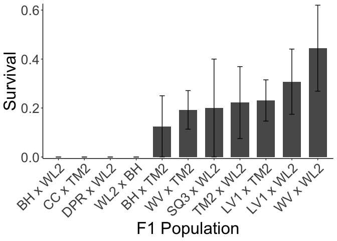
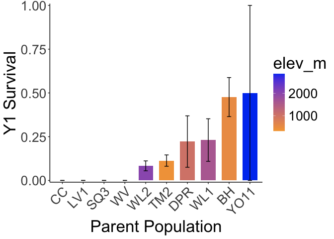
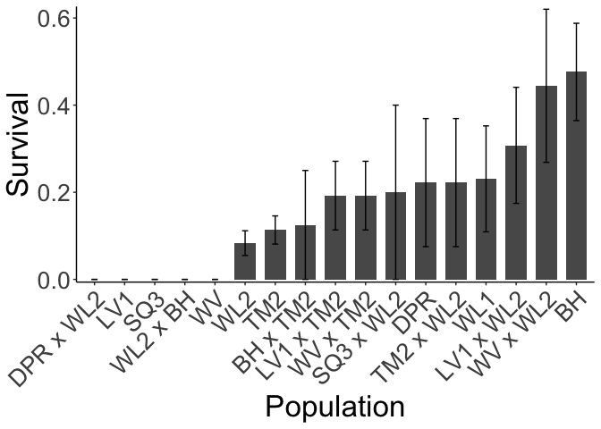

# Checking who was alive at the end of 2024

## Libraries

``` r
library(tidyverse)
```

```
## ── Attaching core tidyverse packages ──────────────────────── tidyverse 2.0.0 ──
## ✔ dplyr     1.1.4     ✔ readr     2.1.5
## ✔ forcats   1.0.0     ✔ stringr   1.5.1
## ✔ ggplot2   3.5.1     ✔ tibble    3.2.1
## ✔ lubridate 1.9.3     ✔ tidyr     1.3.1
## ✔ purrr     1.0.2     
## ── Conflicts ────────────────────────────────────────── tidyverse_conflicts() ──
## ✖ dplyr::filter() masks stats::filter()
## ✖ dplyr::lag()    masks stats::lag()
## ℹ Use the conflicted package (<http://conflicted.r-lib.org/>) to force all conflicts to become errors
```

``` r
sem <- function(x, na.rm=FALSE) {           #for caclulating standard error
  sd(x,na.rm=na.rm)/sqrt(length(na.omit(x)))
} 
```


## Surv Data

``` r
surv_2024 <- read_csv("../input/WL2_2024_Data/CorrectedCSVs/WL2_mort_pheno_20241023_corrected.csv")
```

```
## Rows: 1217 Columns: 13
## ── Column specification ────────────────────────────────────────────────────────
## Delimiter: ","
## chr (12): block, bed, col, unique.ID, bud.date, flower.date, fruit.date, las...
## dbl  (1): row
## 
## ℹ Use `spec()` to retrieve the full column specification for this data.
## ℹ Specify the column types or set `show_col_types = FALSE` to quiet this message.
```

``` r
head(surv_2024)
```

```
## # A tibble: 6 × 13
##   block bed     row col   unique.ID bud.date flower.date fruit.date last.FL.date
##   <chr> <chr> <dbl> <chr> <chr>     <chr>    <chr>       <chr>      <chr>       
## 1 <NA>  A         1 A     TM2_6_11  <NA>     <NA>        <NA>       <NA>        
## 2 <NA>  A         6 B     CC_3_3    <NA>     <NA>        <NA>       <NA>        
## 3 <NA>  A        16 B     BH_3_3    <NA>     <NA>        <NA>       <NA>        
## 4 <NA>  A        17 A     BH_7_3    6/18/24  7/2/24      7/9/24     8/13/24     
## 5 <NA>  A        18 A     BH_4_3    6/18/24  <NA>        7/23/24    <NA>        
## 6 <NA>  A        24 A     WL2_7_9   6/18/24  6/18/24     7/2/24     8/13/24     
## # ℹ 4 more variables: last.FR.date <chr>, death.date <chr>, missing.date <chr>,
## #   survey.notes <chr>
```

``` r
surv_2024 %>% filter(unique.ID=="buffer") #check for buffers
```

```
## # A tibble: 127 × 13
##    block bed     row col   unique.ID bud.date flower.date fruit.date
##    <chr> <chr> <dbl> <chr> <chr>     <chr>    <chr>       <chr>     
##  1 A     C         1 A     buffer    <NA>     <NA>        <NA>      
##  2 A     C         1 B     buffer    <NA>     <NA>        <NA>      
##  3 A     C         2 A     buffer    <NA>     <NA>        <NA>      
##  4 A     C         2 B     buffer    <NA>     <NA>        <NA>      
##  5 A     C         3 A     buffer    <NA>     <NA>        <NA>      
##  6 A     C         3 B     buffer    <NA>     <NA>        <NA>      
##  7 D     C        59 A     buffer    <NA>     <NA>        <NA>      
##  8 D     C        59 B     buffer    <NA>     <NA>        <NA>      
##  9 D     C        60 A     buffer    <NA>     <NA>        <NA>      
## 10 D     C        60 B     buffer    <NA>     <NA>        <NA>      
## # ℹ 117 more rows
## # ℹ 5 more variables: last.FL.date <chr>, last.FR.date <chr>, death.date <chr>,
## #   missing.date <chr>, survey.notes <chr>
```

## Pop Info

``` r
pop_info <- read_csv("../input/WL2_2024_Data/Final_2023_2024_Pop_Loc_Info.csv") %>% 
  select(Pop.Type:unique.ID) %>% 
  rename(row=bedrow, col=bedcol)
```

```
## Rows: 1217 Columns: 15
## ── Column specification ────────────────────────────────────────────────────────
## Delimiter: ","
## chr (8): Pop.Type, status, block, loc, bed, bedcol, pop, unique.ID
## dbl (7): bed.block.order, bed.order, AB.CD.order, column.order, bedrow, mf, rep
## 
## ℹ Use `spec()` to retrieve the full column specification for this data.
## ℹ Specify the column types or set `show_col_types = FALSE` to quiet this message.
```

## Elevation Info

``` r
elev_info <- read_csv("../input/Strep_tort_locs.csv")
```

```
## Rows: 54 Columns: 7
## ── Column specification ────────────────────────────────────────────────────────
## Delimiter: ","
## chr (6): Species epithet, Species Code, Site, Site code, Lat, Long
## dbl (1): Elevation (m)
## 
## ℹ Use `spec()` to retrieve the full column specification for this data.
## ℹ Specify the column types or set `show_col_types = FALSE` to quiet this message.
```

``` r
elev_info_yo <- elev_info %>% mutate(pop = str_replace(`Site code`, "YOSE(\\d+)", "YO\\1")) %>% select(Lat, Long, elev_m=`Elevation (m)`, pop)
head(elev_info_yo)
```

```
## # A tibble: 6 × 4
##   Lat      Long       elev_m pop  
##   <chr>    <chr>       <dbl> <chr>
## 1 37.40985 -119.96458   511. BH   
## 2 39.55355 -121.4329    283. BB   
## 3 39.58597 -121.43311   313  CC   
## 4 38.6382  -120.1422   2422. CP1  
## 5 38.66169 -120.13065  2244. CP2  
## 6 38.70649 -120.08797  2266. CP3
```

``` r
unique(elev_info_yo$pop)
```

```
##  [1] "BH"    "BB"    "CC"    "CP1"   "CP2"   "CP3"   "DP"    "DPR"   "FR"   
## [10] NA      "HH"    "IH"    "KC1"   "KC2"   "KC3"   "LV1"   "LV2"   "LV3"  
## [19] "LVTR1" "LVTR2" "LVTR3" "SQ1"   "SQ2"   "SQ3"   "SHA"   "SC"    "TM1"  
## [28] "TM2"   "WR"    "WV"    "WL1"   "WL2"   "WL3"   "WL4"   "YO1"   "YO10" 
## [37] "YO11"  "YO12"  "YO13"  "YO2"   "YO3"   "YO4"   "YO5"   "YO6"   "YO7"  
## [46] "YO8"   "YO9"
```

## Merge

``` r
surv_2024_pops <- left_join(surv_2024, pop_info)
```

```
## Joining with `by = join_by(block, bed, row, col, unique.ID)`
```

``` r
unique(surv_2024_pops$Pop.Type)
```

```
## [1] "2023-TM2-fruit" "2023-survivor"  NA               "F2"            
## [5] "Parent"         "F1"
```

``` r
unique(surv_2024_pops$status)
```

```
## [1] "2023-TM2-fruit" "2023-survivor"  "buffer"         "available"     
## [5] NA
```

``` r
surv_2024_pops %>% filter(Pop.Type=="2023-TM2-fruit") #double check 2023 TM2 fruiting 
```

```
## # A tibble: 24 × 19
##    block bed     row col   unique.ID bud.date flower.date fruit.date
##    <chr> <chr> <dbl> <chr> <chr>     <chr>    <chr>       <chr>     
##  1 <NA>  A         1 A     TM2_6_11  <NA>     <NA>        <NA>      
##  2 <NA>  A        43 A     TM2_6_1   <NA>     <NA>        <NA>      
##  3 <NA>  A        56 B     TM2_2_12  <NA>     <NA>        <NA>      
##  4 <NA>  A        23 D     TM2_3_3   <NA>     <NA>        <NA>      
##  5 <NA>  A        44 C     TM2_6_3   <NA>     <NA>        <NA>      
##  6 <NA>  B        37 A     TM2_1_16  <NA>     <NA>        <NA>      
##  7 <NA>  B        36 D     TM2_1_4   <NA>     <NA>        <NA>      
##  8 <NA>  B        43 D     TM2_7_10  <NA>     <NA>        <NA>      
##  9 <NA>  C        54 B     TM2_1_14  <NA>     <NA>        <NA>      
## 10 <NA>  C        32 D     TM2_7_12  <NA>     <NA>        <NA>      
## # ℹ 14 more rows
## # ℹ 11 more variables: last.FL.date <chr>, last.FR.date <chr>,
## #   death.date <chr>, missing.date <chr>, survey.notes <chr>, Pop.Type <chr>,
## #   status <chr>, loc <chr>, pop <chr>, mf <dbl>, rep <dbl>
```


## Alive in Oct 2024

``` r
alive <- surv_2024_pops %>% 
  filter(unique.ID != "buffer") %>% #remove buffers
  filter(Pop.Type!="2023-TM2-fruit") %>% #remove 2023 TM2 fruiting plants 
  filter(is.na(death.date)) %>% #keep only plants without a death date
  filter(is.na(missing.date)) %>% #keep only plants without a missing date
  mutate(deadatplanting = if_else(is.na(survey.notes), NA,
                                  if_else(survey.notes=="Dead at planting", "Yes", NA))) %>% 
  filter(is.na(deadatplanting))
dim(alive) #132 alive
```

```
## [1] 132  20
```

``` r
names(alive)
```

```
##  [1] "block"          "bed"            "row"            "col"           
##  [5] "unique.ID"      "bud.date"       "flower.date"    "fruit.date"    
##  [9] "last.FL.date"   "last.FR.date"   "death.date"     "missing.date"  
## [13] "survey.notes"   "Pop.Type"       "status"         "loc"           
## [17] "pop"            "mf"             "rep"            "deadatplanting"
```

``` r
xtabs(~Pop.Type, data=alive)
```

```
## Pop.Type
## 2023-survivor            F1            F2        Parent 
##            25            16            58            33
```

``` r
#25 parent plants from 2023 still alive
#16 F1s still alive 
#58 F2s still alive
#33 parents planted in 2024 still alive 
```

## F1 Year 1 Survival

``` r
f1_surv<- surv_2024_pops %>% 
  mutate(Surv=if_else(is.na(death.date), 1, 0)) %>% 
  filter(Pop.Type=="F1") %>% 
  group_by(pop) %>% 
  summarise(n=n(),mean_Surv=mean(Surv, na.rm=TRUE), sem_surv=sem(Surv, na.rm=TRUE)) 

f1_surv %>% 
  filter(n>1) %>% 
  ggplot(aes(x=fct_reorder(pop, mean_Surv), y=mean_Surv)) + 
  geom_col(width = 0.7,position = position_dodge(0.75)) + 
  geom_errorbar(aes(ymin=mean_Surv-sem_surv,ymax=mean_Surv+sem_surv),width=.2, position = 
                  position_dodge(0.75)) +
  theme_classic() + 
  scale_y_continuous(expand = c(0.01, 0)) +
  labs(x="F1 Population", y="Survival") +
  theme(text=element_text(size=25), axis.text.x = element_text(angle = 45, hjust = 1))
```

<!-- -->

``` r
ggsave("../output/WL2_Traits/WL2_SURV_Y1Surv_F1s.png", width = 14, height = 8, units = "in")
```

## Parent Pops Year 1 Survival

``` r
parent_surv<- surv_2024_pops %>% 
  mutate(Surv=if_else(is.na(death.date), 1, 0)) %>% 
  filter(Pop.Type=="Parent") %>% 
  left_join(elev_info_yo) %>% 
  group_by(pop, elev_m) %>% 
  summarise(n=n(),mean_Surv=mean(Surv, na.rm=TRUE), sem_surv=sem(Surv, na.rm=TRUE)) 
```

```
## Joining with `by = join_by(pop)`
## `summarise()` has grouped output by 'pop'. You can override using the `.groups`
## argument.
```

``` r
parent_surv %>% 
  filter(n>1) %>% 
  ggplot(aes(x=fct_reorder(pop, mean_Surv), y=mean_Surv, fill=elev_m)) + 
  geom_col(width = 0.7,position = position_dodge(0.75)) + 
  geom_errorbar(aes(ymin=mean_Surv-sem_surv,ymax=mean_Surv+sem_surv),width=.2, position = 
                  position_dodge(0.75)) +
  theme_classic() + 
  scale_y_continuous(expand = c(0.01, 0)) +
  labs(x="Parent Population", y="Survival") +
  scale_fill_gradient(low = "#F5A540", high = "#0043F0") +
  theme(text=element_text(size=25), axis.text.x = element_text(angle = 45, hjust = 1))
```

<!-- -->

``` r
ggsave("../output/WL2_Traits/WL2_SURV_Y1Surv_Parents.png", width = 14, height = 8, units = "in")
```

## F1s + Parents

``` r
names(parent_surv)
```

```
## [1] "pop"       "elev_m"    "n"         "mean_Surv" "sem_surv"
```

``` r
names(f1_surv)
```

```
## [1] "pop"       "n"         "mean_Surv" "sem_surv"
```

``` r
parent_surv %>% 
  select(-elev_m) %>% 
  bind_rows(f1_surv) %>% 
  filter(n>2) %>% 
  ggplot(aes(x=fct_reorder(pop, mean_Surv), y=mean_Surv)) + 
  geom_col(width = 0.7,position = position_dodge(0.75)) + 
  geom_errorbar(aes(ymin=mean_Surv-sem_surv,ymax=mean_Surv+sem_surv),width=.2, position = 
                  position_dodge(0.75)) +
  theme_classic() + 
  scale_y_continuous(expand = c(0.01, 0)) +
  labs(x="Population", y="Survival") +
  theme(text=element_text(size=25), axis.text.x = element_text(angle = 45, hjust = 1))
```

<!-- -->

``` r
ggsave("../output/WL2_Traits/WL2_Y1Surv_F1s_Parents.png", width = 14, height = 8, units = "in")
```
