# Checking the effects of initial size on establishment probability 
Establishment = survival first 3 weeks post transplant 


## Libraries

``` r
library(tidyverse)
```

```
## ── Attaching core tidyverse packages ──────────────────────── tidyverse 2.0.0 ──
## ✔ dplyr     1.1.4     ✔ readr     2.1.5
## ✔ forcats   1.0.0     ✔ stringr   1.5.1
## ✔ ggplot2   3.5.1     ✔ tibble    3.2.1
## ✔ lubridate 1.9.3     ✔ tidyr     1.3.1
## ✔ purrr     1.0.2     
## ── Conflicts ────────────────────────────────────────── tidyverse_conflicts() ──
## ✖ dplyr::filter() masks stats::filter()
## ✖ dplyr::lag()    masks stats::lag()
## ℹ Use the conflicted package (<http://conflicted.r-lib.org/>) to force all conflicts to become errors
```

``` r
library(lme4)
```

```
## Loading required package: Matrix
## 
## Attaching package: 'Matrix'
## 
## The following objects are masked from 'package:tidyr':
## 
##     expand, pack, unpack
```

## Load Initial Size

``` r
initial_size <- read_csv("../input/WL2_2025_Data/CorrectedCSVs/WL2_initial_size_DNA_corrected.csv") %>% 
  mutate(Unique.ID=as.character(Unique.ID)) %>% 
  select(Unique.ID:long.leaf.cm) %>% 
  filter(!is.na(height.cm)) 
```

```
## Rows: 1036 Columns: 10
## ── Column specification ────────────────────────────────────────────────────────
## Delimiter: ","
## chr (3): cryo.pos, DNA.y.n, Notes
## dbl (7): Rack, Unique.ID, germ.y.n, height.cm, hypocotyl.length.cm, long.lea...
## 
## ℹ Use `spec()` to retrieve the full column specification for this data.
## ℹ Specify the column types or set `show_col_types = FALSE` to quiet this message.
```

``` r
head(initial_size)
```

```
## # A tibble: 6 × 5
##   Unique.ID germ.y.n height.cm hypocotyl.length.cm long.leaf.cm
##   <chr>        <dbl>     <dbl>               <dbl>        <dbl>
## 1 1826             1       2.4                 1            3  
## 2 1828             1       1.4                 0.9          0.9
## 3 1831             1       3                   1            3.5
## 4 1835             1       2.2                 1.2          1.1
## 5 1837             1       2.7                 1.4          2.1
## 6 1838             1       2.2                 1.3          1.7
```

## Load Survival

``` r
wl2_surv <- read_csv("../input/WL2_2025_Data/CorrectedCSVs/WL2_mort_pheno_20250929_corrected.csv") %>% 
  select(bed:Unique.ID, death.date, survey.notes)
```

```
## New names:
## Rows: 972 Columns: 13
## ── Column specification
## ──────────────────────────────────────────────────────── Delimiter: "," chr
## (12): bed, col, Unique.ID, bud.date, flower.date, fruit.date, last.FL.da... dbl
## (1): row
## ℹ Use `spec()` to retrieve the full column specification for this data. ℹ
## Specify the column types or set `show_col_types = FALSE` to quiet this message.
## • `` -> `...13`
```

``` r
head(wl2_surv)
```

```
## # A tibble: 6 × 6
##   bed     row col   Unique.ID death.date survey.notes
##   <chr> <dbl> <chr> <chr>     <chr>      <chr>       
## 1 C         1 A     buffer    <NA>       <NA>        
## 2 C         1 B     buffer    <NA>       <NA>        
## 3 C         2 A     buffer    <NA>       <NA>        
## 4 C         2 B     buffer    <NA>       <NA>        
## 5 C         3 A     buffer    <NA>       <NA>        
## 6 C         3 B     buffer    <NA>       <NA>
```

## Load pop info

``` r
pop_info <- read_csv("../input/WL2_2025_Data/2025_Pop_Loc_Info Updated.csv") %>% 
  select(status:Unique.ID) %>% 
  filter(status == "available")
```

```
## Rows: 976 Columns: 16
## ── Column specification ────────────────────────────────────────────────────────
## Delimiter: ","
## chr (10): status, block, bed, col, pop.id, mf, dame_mf, sire_mf, Unique.ID, ...
## dbl  (6): bed.block.order, bed.order, AB.CD.order, column.order, row, rep
## 
## ℹ Use `spec()` to retrieve the full column specification for this data.
## ℹ Specify the column types or set `show_col_types = FALSE` to quiet this message.
```

## Merge

``` r
size_surv <- left_join(wl2_surv, initial_size)
```

```
## Joining with `by = join_by(Unique.ID)`
```

``` r
size_surv_pops <- left_join(pop_info, size_surv)
```

```
## Joining with `by = join_by(bed, row, col, Unique.ID)`
```

``` r
size_surv_pops %>% filter(is.na(germ.y.n))
```

```
## # A tibble: 15 × 17
##    status   block bed     row col   pop.id mf    dame_mf sire_mf   rep Unique.ID
##    <chr>    <chr> <chr> <dbl> <chr> <chr>  <chr> <chr>   <chr>   <dbl> <chr>    
##  1 availab… B     C        36 A     WL2    <NA>  <NA>    <NA>       82 1905     
##  2 availab… C     C        38 B     (WL2 … 2_3   2       3           1 2230     
##  3 availab… A     C        14 C     YO11   4     4       <NA>        8 1950     
##  4 availab… C     C        52 D     SQ3    7     7       <NA>       18 1701     
##  5 availab… F     D        37 A     LV1    22    22      <NA>       13 1675     
##  6 availab… F     D        37 B     (WV x… 3_1   3       1          12 2364     
##  7 availab… E     D        30 C     WL2    2     2       <NA>       11 1834     
##  8 availab… F     D        37 D     WL2    6     6       <NA>       59 1882     
##  9 availab… F     D        47 C     LV1    22    22      <NA>       20 1682     
## 10 availab… I     E        41 A     BH     3     3       <NA>        2 1601     
## 11 availab… K     F        22 D     (LV1 … 6_16… 6       16-A        3 2443     
## 12 availab… L     G         5 A     WL1    18    18      <NA>       10 1812     
## 13 availab… L     G        11 A     (WL2 … 2-3_… 3-Feb   3-Feb       2 2232     
## 14 availab… L     G        13 A     WL2 x… 8-1_… 1-Aug   14-1        3 2021     
## 15 availab… M     G        26 C     WL2 x… 8-1_… 1-Aug   14-1       10 2650     
## # ℹ 6 more variables: death.date <chr>, survey.notes <chr>, germ.y.n <dbl>,
## #   height.cm <dbl>, hypocotyl.length.cm <dbl>, long.leaf.cm <dbl>
```

``` r
size_surv_2025pops <- size_surv_pops %>% filter(!is.na(germ.y.n))
unique(size_surv_2025pops$death.date)
```

```
##  [1] "6/17/25"  "7/3/25"   "6/9/25"   NA         "6/27/25"  "8/7/25"  
##  [7] "7/18/25"  "9/24/25"  "8/21/25"  "08/01/25" "7/10/25"  "8/14/25" 
## [13] "8/28/25"  "6/3/25"   "8/1/25"   "9/18/25"  "7/25/25"  "9/29/25" 
## [19] "9/4/25"   "9/11/25"  "9/4/2025"
```

## Establishment

``` r
establishment <- size_surv_2025pops %>% 
  mutate(Est_Surv=if_else(is.na(death.date), 1, 
                          if_else(death.date=="6/3/25" | death.date=="6/9/25" |
                                    death.date=="6/17/25", 0,
                                       1))) %>% 
  mutate(Pop.Type=if_else(!str_detect(pop.id, "x"), "Parent", 
                          if_else(str_detect(pop.id, "\\) x"), "F2 or BC1", "F1"))) %>% 
  select(-status, -germ.y.n)

head(establishment)
```

```
## # A tibble: 6 × 17
##   block bed     row col   pop.id           mf    dame_mf sire_mf   rep Unique.ID
##   <chr> <chr> <dbl> <chr> <chr>            <chr> <chr>   <chr>   <dbl> <chr>    
## 1 A     C         4 A     (WV x WL2) x (W… 2_2   2       2           7 2566     
## 2 A     C         4 B     (SQ3 x WL2) x (… 12_1… 12      16-A       23 2595     
## 3 A     C         5 A     TM2              <NA>  <NA>    <NA>       87 2642     
## 4 A     C         6 A     (WL2 x BH) x (W… 1_2   1       2           1 2509     
## 5 A     C         6 B     (WL2 x WV) x (C… 1_1   1       1           4 2549     
## 6 A     C         7 A     (WL2 x TM2) x (… 2-3_… 3-Feb   3-Feb       8 2452     
## # ℹ 7 more variables: death.date <chr>, survey.notes <chr>, height.cm <dbl>,
## #   hypocotyl.length.cm <dbl>, long.leaf.cm <dbl>, Est_Surv <dbl>,
## #   Pop.Type <chr>
```

## Quick Plots 

``` r
establishment %>% 
  ggplot(aes(hypocotyl.length.cm, Est_Surv)) +
  geom_point()
```

```
## Warning: Removed 1 row containing missing values or values outside the scale range
## (`geom_point()`).
```

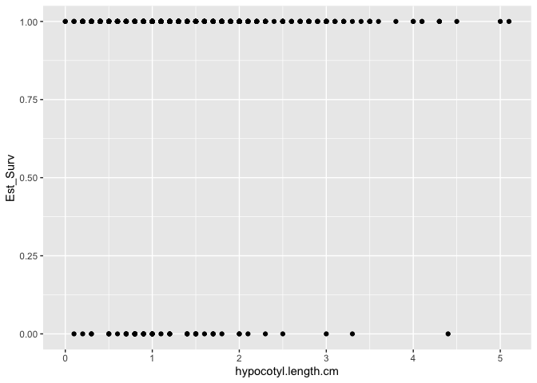<!-- -->

``` r
establishment %>% 
  ggplot(aes(height.cm, Est_Surv)) +
  geom_point()
```

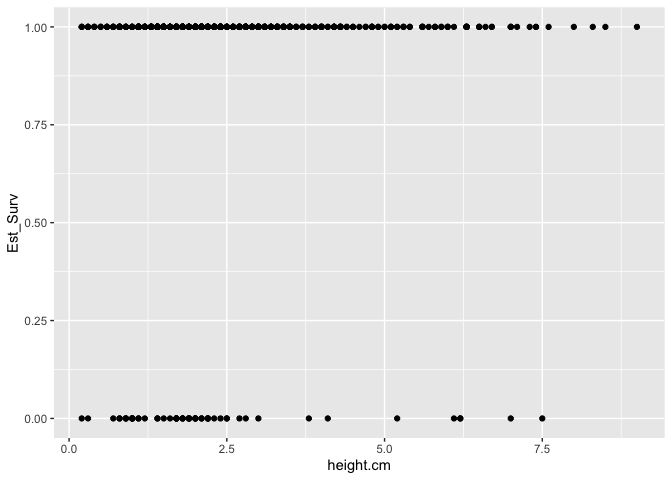<!-- -->

``` r
establishment %>% 
  ggplot(aes(long.leaf.cm, Est_Surv)) +
  geom_point()
```

```
## Warning: Removed 1 row containing missing values or values outside the scale range
## (`geom_point()`).
```

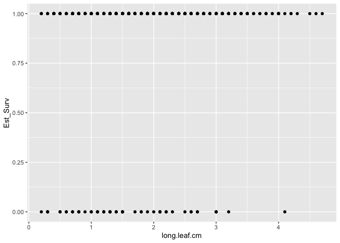<!-- -->

## PopType Averages

``` r
est_summary <- establishment %>% 
  group_by(Pop.Type) %>% 
  summarise(meanEst=mean(Est_Surv, na.rm=TRUE), 
            meanHyp = mean(hypocotyl.length.cm, na.rm=TRUE),
            meanHeight = mean(height.cm, na.rm=TRUE), 
            meanLength = mean(long.leaf.cm, na.rm=TRUE))
est_summary
```

```
## # A tibble: 3 × 5
##   Pop.Type  meanEst meanHyp meanHeight meanLength
##   <chr>       <dbl>   <dbl>      <dbl>      <dbl>
## 1 F1          0.918    1.18       2.00       1.51
## 2 F2 or BC1   0.923    1.45       2.70       2.04
## 3 Parent      0.892    1.32       2.60       1.85
```

``` r
#pretty high establishment all around 
```

## Pop Averages

``` r
est_summary_pops <- establishment %>% 
  group_by(Pop.Type, pop.id) %>% 
  summarise(meanEst=mean(Est_Surv, na.rm=TRUE), 
            meanHyp = mean(hypocotyl.length.cm, na.rm=TRUE),
            meanHeight = mean(height.cm, na.rm=TRUE), 
            meanLength = mean(long.leaf.cm, na.rm=TRUE))
```

```
## `summarise()` has grouped output by 'Pop.Type'. You can override using the
## `.groups` argument.
```

``` r
est_summary_pops %>% 
  ggplot(aes(x=meanHyp, y=meanEst)) +
  geom_point() 
```

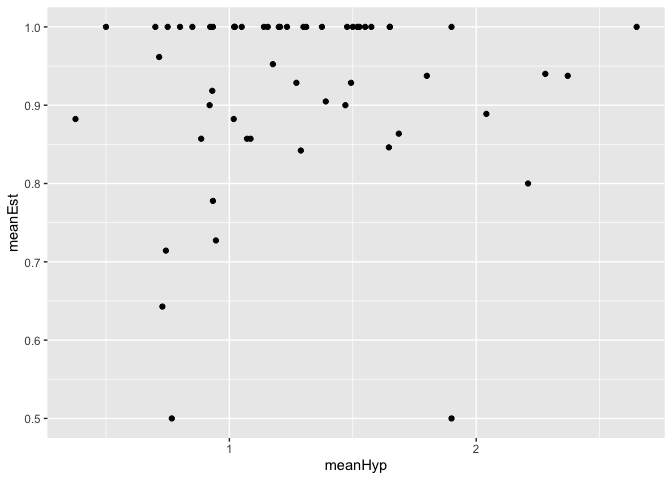<!-- -->

``` r
est_summary_pops %>% 
  ggplot(aes(x=meanHyp, y=meanEst)) +
  geom_point() + 
  facet_wrap(~Pop.Type)
```

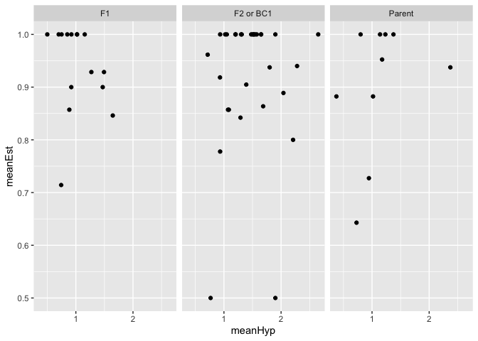<!-- -->

``` r
est_summary_pops %>% 
  ggplot(aes(x=meanHeight, y=meanEst)) +
  geom_point() 
```

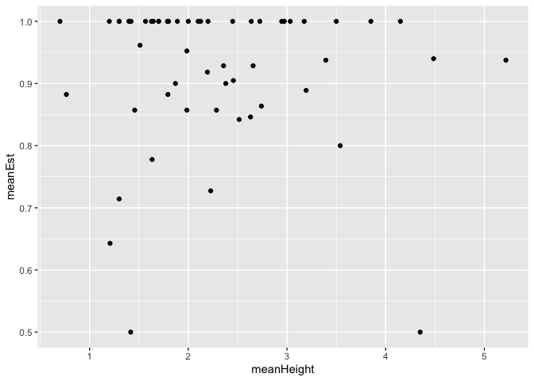<!-- -->

``` r
est_summary_pops %>% 
  ggplot(aes(x=meanHeight, y=meanEst)) +
  geom_point() + 
  facet_wrap(~Pop.Type)
```

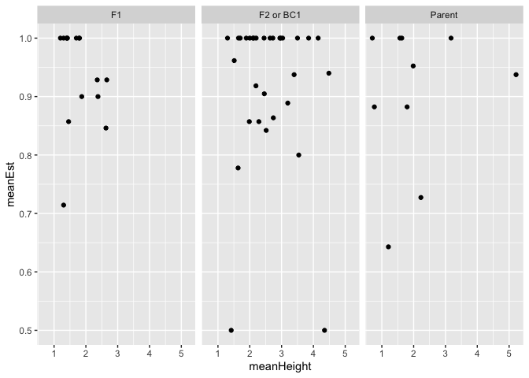<!-- -->

``` r
est_summary_pops %>% 
  ggplot(aes(x=meanLength, y=meanEst)) +
  geom_point() 
```

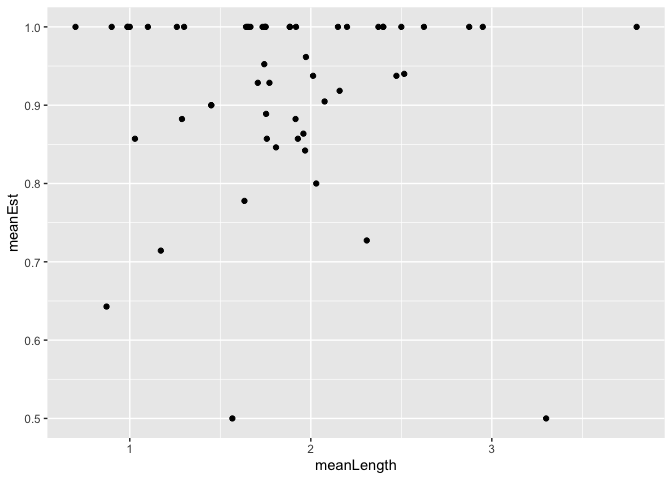<!-- -->

``` r
est_summary_pops %>% 
  ggplot(aes(x=meanLength, y=meanEst)) +
  geom_point() + 
  facet_wrap(~Pop.Type)
```

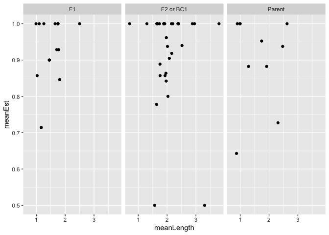<!-- -->

## Quick Models

``` r
hyp_for_models <- establishment %>% filter(!is.na(hypocotyl.length.cm))

hyp_est_model1 <- glm(Est_Surv ~ hypocotyl.length.cm, family=binomial, data=hyp_for_models)
summary(hyp_est_model1)
```

```
## 
## Call:
## glm(formula = Est_Surv ~ hypocotyl.length.cm, family = binomial, 
##     data = hyp_for_models)
## 
## Coefficients:
##                     Estimate Std. Error z value Pr(>|z|)    
## (Intercept)           2.0324     0.2695   7.541 4.67e-14 ***
## hypocotyl.length.cm   0.2657     0.1878   1.415    0.157    
## ---
## Signif. codes:  0 '***' 0.001 '**' 0.01 '*' 0.05 '.' 0.1 ' ' 1
## 
## (Dispersion parameter for binomial family taken to be 1)
## 
##     Null deviance: 390.11  on 670  degrees of freedom
## Residual deviance: 387.95  on 669  degrees of freedom
## AIC: 391.95
## 
## Number of Fisher Scoring iterations: 5
```

``` r
hyp_est_model2 <- glmer(Est_Surv ~ hypocotyl.length.cm + (1|Pop.Type), family=binomial, data=hyp_for_models)
```

```
## boundary (singular) fit: see help('isSingular')
```

``` r
summary(hyp_est_model2) #no significant relationship with hypocotyl length 
```

```
## Generalized linear mixed model fit by maximum likelihood (Laplace
##   Approximation) [glmerMod]
##  Family: binomial  ( logit )
## Formula: Est_Surv ~ hypocotyl.length.cm + (1 | Pop.Type)
##    Data: hyp_for_models
## 
##      AIC      BIC   logLik deviance df.resid 
##    393.9    407.5   -194.0    387.9      668 
## 
## Scaled residuals: 
##     Min      1Q  Median      3Q     Max 
## -4.9564  0.2775  0.3046  0.3255  0.3620 
## 
## Random effects:
##  Groups   Name        Variance Std.Dev.
##  Pop.Type (Intercept) 0        0       
## Number of obs: 671, groups:  Pop.Type, 3
## 
## Fixed effects:
##                     Estimate Std. Error z value Pr(>|z|)    
## (Intercept)           2.0324     0.2695   7.541 4.67e-14 ***
## hypocotyl.length.cm   0.2657     0.1878   1.415    0.157    
## ---
## Signif. codes:  0 '***' 0.001 '**' 0.01 '*' 0.05 '.' 0.1 ' ' 1
## 
## Correlation of Fixed Effects:
##             (Intr)
## hypctyl.ln. -0.857
## optimizer (Nelder_Mead) convergence code: 0 (OK)
## boundary (singular) fit: see help('isSingular')
```


``` r
height_for_models <- establishment %>% filter(!is.na(height.cm))

height_est_model1 <- glm(Est_Surv ~ height.cm, family=binomial, data=height_for_models)
summary(height_est_model1)
```

```
## 
## Call:
## glm(formula = Est_Surv ~ height.cm, family = binomial, data = height_for_models)
## 
## Coefficients:
##             Estimate Std. Error z value Pr(>|z|)    
## (Intercept)   1.9108     0.2757   6.931 4.19e-12 ***
## height.cm     0.1878     0.1067   1.761   0.0783 .  
## ---
## Signif. codes:  0 '***' 0.001 '**' 0.01 '*' 0.05 '.' 0.1 ' ' 1
## 
## (Dispersion parameter for binomial family taken to be 1)
## 
##     Null deviance: 395.02  on 671  degrees of freedom
## Residual deviance: 391.54  on 670  degrees of freedom
## AIC: 395.54
## 
## Number of Fisher Scoring iterations: 5
```

``` r
height_est_model2 <- glmer(Est_Surv ~ height.cm + (1|Pop.Type), family=binomial, data=height_for_models)
```

```
## boundary (singular) fit: see help('isSingular')
```

``` r
summary(height_est_model2) #no sig relationship with height 
```

```
## Generalized linear mixed model fit by maximum likelihood (Laplace
##   Approximation) [glmerMod]
##  Family: binomial  ( logit )
## Formula: Est_Surv ~ height.cm + (1 | Pop.Type)
##    Data: height_for_models
## 
##      AIC      BIC   logLik deviance df.resid 
##    397.5    411.1   -195.8    391.5      669 
## 
## Scaled residuals: 
##     Min      1Q  Median      3Q     Max 
## -5.2575  0.2737  0.3099  0.3310  0.3775 
## 
## Random effects:
##  Groups   Name        Variance Std.Dev.
##  Pop.Type (Intercept) 0        0       
## Number of obs: 672, groups:  Pop.Type, 3
## 
## Fixed effects:
##             Estimate Std. Error z value Pr(>|z|)    
## (Intercept)   1.9108     0.2757   6.931 4.19e-12 ***
## height.cm     0.1878     0.1067   1.761   0.0783 .  
## ---
## Signif. codes:  0 '***' 0.001 '**' 0.01 '*' 0.05 '.' 0.1 ' ' 1
## 
## Correlation of Fixed Effects:
##           (Intr)
## height.cm -0.866
## optimizer (Nelder_Mead) convergence code: 0 (OK)
## boundary (singular) fit: see help('isSingular')
```


``` r
length_for_models <- establishment %>% filter(!is.na(long.leaf.cm))

length_est_model1 <- glm(Est_Surv ~ long.leaf.cm, family=binomial, data=length_for_models)
summary(length_est_model1)
```

```
## 
## Call:
## glm(formula = Est_Surv ~ long.leaf.cm, family = binomial, data = length_for_models)
## 
## Coefficients:
##              Estimate Std. Error z value Pr(>|z|)    
## (Intercept)    1.3396     0.3120   4.294 1.76e-05 ***
## long.leaf.cm   0.6033     0.1796   3.360 0.000779 ***
## ---
## Signif. codes:  0 '***' 0.001 '**' 0.01 '*' 0.05 '.' 0.1 ' ' 1
## 
## (Dispersion parameter for binomial family taken to be 1)
## 
##     Null deviance: 390.11  on 670  degrees of freedom
## Residual deviance: 377.64  on 669  degrees of freedom
## AIC: 381.64
## 
## Number of Fisher Scoring iterations: 5
```

``` r
length_est_model2 <- glmer(Est_Surv ~ long.leaf.cm + (1|Pop.Type), family=binomial, data=length_for_models)
```

```
## boundary (singular) fit: see help('isSingular')
```

``` r
summary(length_est_model2) #sig pos relationship with height (longer survived better)
```

```
## Generalized linear mixed model fit by maximum likelihood (Laplace
##   Approximation) [glmerMod]
##  Family: binomial  ( logit )
## Formula: Est_Surv ~ long.leaf.cm + (1 | Pop.Type)
##    Data: length_for_models
## 
##      AIC      BIC   logLik deviance df.resid 
##    383.6    397.2   -188.8    377.6      668 
## 
## Scaled residuals: 
##     Min      1Q  Median      3Q     Max 
## -6.7305  0.2267  0.2800  0.3355  0.4818 
## 
## Random effects:
##  Groups   Name        Variance Std.Dev.
##  Pop.Type (Intercept) 1e-14    1e-07   
## Number of obs: 671, groups:  Pop.Type, 3
## 
## Fixed effects:
##              Estimate Std. Error z value Pr(>|z|)    
## (Intercept)    1.3396     0.3120   4.294 1.76e-05 ***
## long.leaf.cm   0.6033     0.1796   3.360 0.000779 ***
## ---
## Signif. codes:  0 '***' 0.001 '**' 0.01 '*' 0.05 '.' 0.1 ' ' 1
## 
## Correlation of Fixed Effects:
##             (Intr)
## long.lef.cm -0.894
## optimizer (Nelder_Mead) convergence code: 0 (OK)
## boundary (singular) fit: see help('isSingular')
```

## Models by Pop type 

### Parents 

``` r
parents_est <- establishment %>% 
  filter(Pop.Type=="Parent") %>% 
  filter(!is.na(height.cm)) %>% 
  filter(!is.na(long.leaf.cm))
unique(parents_est$pop.id)
```

```
##  [1] "TM2"  "WL1"  "WL2"  "SQ3"  "DPR"  "WV"   "BH"   "CC"   "YO11" "LV1"
```

``` r
height_est_model3 <- glmer(Est_Surv ~ height.cm + (1|pop.id), family=binomial, data=parents_est)
summary(height_est_model3) #no relat
```

```
## Generalized linear mixed model fit by maximum likelihood (Laplace
##   Approximation) [glmerMod]
##  Family: binomial  ( logit )
## Formula: Est_Surv ~ height.cm + (1 | pop.id)
##    Data: parents_est
## 
##      AIC      BIC   logLik deviance df.resid 
##    130.3    140.0    -62.2    124.3      182 
## 
## Scaled residuals: 
##     Min      1Q  Median      3Q     Max 
## -4.8738  0.2609  0.3321  0.3732  0.4875 
## 
## Random effects:
##  Groups Name        Variance Std.Dev.
##  pop.id (Intercept) 0.1419   0.3767  
## Number of obs: 185, groups:  pop.id, 10
## 
## Fixed effects:
##             Estimate Std. Error z value Pr(>|z|)    
## (Intercept)   1.6439     0.4935   3.331 0.000864 ***
## height.cm     0.2186     0.1773   1.233 0.217590    
## ---
## Signif. codes:  0 '***' 0.001 '**' 0.01 '*' 0.05 '.' 0.1 ' ' 1
## 
## Correlation of Fixed Effects:
##           (Intr)
## height.cm -0.777
```

``` r
length_est_model3 <- glmer(Est_Surv ~ long.leaf.cm + (1|pop.id), family=binomial, data=parents_est)
summary(length_est_model3)
```

```
## Generalized linear mixed model fit by maximum likelihood (Laplace
##   Approximation) [glmerMod]
##  Family: binomial  ( logit )
## Formula: Est_Surv ~ long.leaf.cm + (1 | pop.id)
##    Data: parents_est
## 
##      AIC      BIC   logLik deviance df.resid 
##    125.9    135.5    -59.9    119.9      182 
## 
## Scaled residuals: 
##     Min      1Q  Median      3Q     Max 
## -5.4440  0.2145  0.2966  0.3667  0.6693 
## 
## Random effects:
##  Groups Name        Variance Std.Dev.
##  pop.id (Intercept) 0.2088   0.4569  
## Number of obs: 185, groups:  pop.id, 10
## 
## Fixed effects:
##              Estimate Std. Error z value Pr(>|z|)  
## (Intercept)    0.9325     0.5677   1.643   0.1004  
## long.leaf.cm   0.7681     0.3334   2.304   0.0212 *
## ---
## Signif. codes:  0 '***' 0.001 '**' 0.01 '*' 0.05 '.' 0.1 ' ' 1
## 
## Correlation of Fixed Effects:
##             (Intr)
## long.lef.cm -0.808
```

``` r
##predictions for figures:
parents_est_preds <- tibble(long.leaf.cm=seq(from = 0.2, to=4.6, length.out=185))

length_est_preds <- tibble(predictions=predict(length_est_model3, 
                                               newdata=parents_est_preds,
                                           re.form= NA, type="response")) %>% 
  bind_cols(parents_est_preds) 
length_est_preds %>% ggplot(aes(long.leaf.cm, predictions)) +
  geom_point() +
  labs(x="Leaf Length 4 Weeks Post-Strat", y="Predicted Establishment", title="Parents")
```

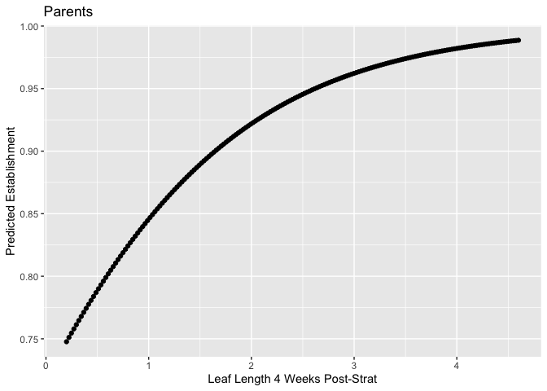<!-- -->

### Crosses 

``` r
crosses_est <- establishment %>% 
  filter(Pop.Type!="Parent") %>% 
  filter(!is.na(height.cm)) %>% 
  filter(!is.na(long.leaf.cm))
unique(crosses_est$pop.id) #74 cross types 
```

```
##  [1] "(WV x WL2) x (WL2 x BH)"    "(SQ3 x WL2) x (WL2)"       
##  [3] "(WL2 x BH) x (WL2 x CC)"    "(WL2 x WV) x (CC x WL2)"   
##  [5] "(WL2 x TM2) x (CC x TM2)"   "(WL2 x TM2) x (WL2 x BH)"  
##  [7] "(WL2 x TM2) x (TM2)"        "(WV x WL2) x (WL2 x CC)"   
##  [9] "(WV x TM2) x (TM2 x WL2)"   "(WL2) x (WL2 x TM2)"       
## [11] "(DPR x TM2) x (TM2 x WL2)"  "(TM2 x WL2) x (TM2)"       
## [13] "LV1 x WL2"                  "WL2 x LV1"                 
## [15] "(LV1 x WL2) x (WL2)"        "(CC x WL2) x (WL2)"        
## [17] "(WV x WL2) x (WV)"          "WL2 x DPR"                 
## [19] "(TM2) x (TM2 x WL2)"        "DPR x WL2"                 
## [21] "(WV x TM2) x (WL2 x TM2)"   "WL1 x WL2"                 
## [23] "(YO11 x WL2) x (WL2)"       "WL2 x CC"                  
## [25] "YO11 x WL2"                 "(TM2 x WL2) x (WL1 x TM2)" 
## [27] "TM2 x WL2"                  "BH x WL2"                  
## [29] "(WV) x (WV x WL2)"          "SQ3 x WL2"                 
## [31] "(TM2 x WL2) x (TM2 x BH)"   "(WL2 x CC) x (WL2 x BH)"   
## [33] "(WL2) x (WL2 x BH)"         "WL2 x YO11"                
## [35] "WL2 x WV"                   "(WL2 x BH) x (WL2 x TM2)"  
## [37] "WL2 x TM2"                  "(TM2 x WL2) x (WL2 x DPR)" 
## [39] "(CC x WL2) x (WL2 x TM2)"   "(WL2 x BH) x (CC x WL2)"   
## [41] "WL2 x WL1"                  "(LV1 x WL2) x (YO11 x WL2)"
## [43] "(WL2) x (TM2 x WL2)"        "WL2 x SQ3"                 
## [45] "(WL2 x TM2) x (WV x WL2)"   "(WL2) x (DPR x WL2)"
```

``` r
height_est_model4 <- glmer(Est_Surv ~ height.cm + (1|pop.id), family=binomial, data=crosses_est)
```

```
## boundary (singular) fit: see help('isSingular')
```

``` r
summary(height_est_model4) #height not sig
```

```
## Generalized linear mixed model fit by maximum likelihood (Laplace
##   Approximation) [glmerMod]
##  Family: binomial  ( logit )
## Formula: Est_Surv ~ height.cm + (1 | pop.id)
##    Data: crosses_est
## 
##      AIC      BIC   logLik deviance df.resid 
##    266.6    279.1   -130.3    260.6      483 
## 
## Scaled residuals: 
##     Min      1Q  Median      3Q     Max 
## -4.9845  0.2662  0.2878  0.3024  0.3362 
## 
## Random effects:
##  Groups Name        Variance Std.Dev.
##  pop.id (Intercept) 0        0       
## Number of obs: 486, groups:  pop.id, 46
## 
## Fixed effects:
##             Estimate Std. Error z value Pr(>|z|)    
## (Intercept)   2.1517     0.3697   5.820 5.89e-09 ***
## height.cm     0.1415     0.1403   1.009    0.313    
## ---
## Signif. codes:  0 '***' 0.001 '**' 0.01 '*' 0.05 '.' 0.1 ' ' 1
## 
## Correlation of Fixed Effects:
##           (Intr)
## height.cm -0.886
## optimizer (Nelder_Mead) convergence code: 0 (OK)
## boundary (singular) fit: see help('isSingular')
```

``` r
length_est_model4 <- glmer(Est_Surv ~ long.leaf.cm + (1|pop.id), family=binomial, data=crosses_est)
```

```
## boundary (singular) fit: see help('isSingular')
```

``` r
summary(length_est_model4)
```

```
## Generalized linear mixed model fit by maximum likelihood (Laplace
##   Approximation) [glmerMod]
##  Family: binomial  ( logit )
## Formula: Est_Surv ~ long.leaf.cm + (1 | pop.id)
##    Data: crosses_est
## 
##      AIC      BIC   logLik deviance df.resid 
##    261.8    274.4   -127.9    255.8      483 
## 
## Scaled residuals: 
##     Min      1Q  Median      3Q     Max 
## -6.3161  0.2262  0.2704  0.3151  0.4278 
## 
## Random effects:
##  Groups Name        Variance Std.Dev.
##  pop.id (Intercept) 0        0       
## Number of obs: 486, groups:  pop.id, 46
## 
## Fixed effects:
##              Estimate Std. Error z value Pr(>|z|)    
## (Intercept)    1.5961     0.3951   4.040 5.35e-05 ***
## long.leaf.cm   0.5098     0.2193   2.324   0.0201 *  
## ---
## Signif. codes:  0 '***' 0.001 '**' 0.01 '*' 0.05 '.' 0.1 ' ' 1
## 
## Correlation of Fixed Effects:
##             (Intr)
## long.lef.cm -0.900
## optimizer (Nelder_Mead) convergence code: 0 (OK)
## boundary (singular) fit: see help('isSingular')
```

``` r
##predictions for figures:
crosses_est_preds <- tibble(long.leaf.cm=seq(from = 0.2, to=4.7, length.out=486))

length_est_preds <- tibble(predictions=predict(length_est_model4, 
                                               newdata=crosses_est_preds,
                                           re.form= NA, type="response")) %>% 
  bind_cols(crosses_est_preds) 
length_est_preds %>% ggplot(aes(long.leaf.cm, predictions)) +
  geom_point() +
  labs(x="Leaf Length 4 Weeks Post-Strat", y="Predicted Establishment", title="Crosses")
```

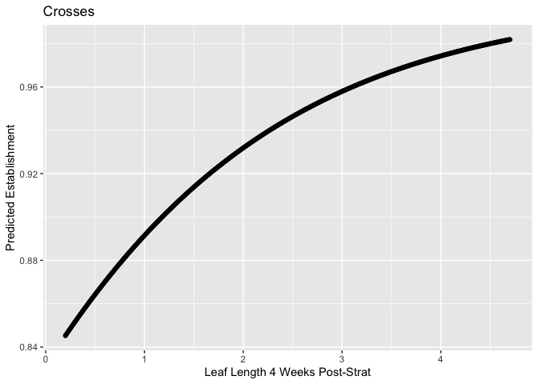<!-- -->
