# Total Fitness for plants planted in 2025

Takes into account 2025 and 2026 data

To Do:

-   Need to check ann cens 2025 for 3 potential iteroparous indivs

## Libraries


``` r
library(tidyverse)
```

```
## ── Attaching core tidyverse packages ──────────────────────── tidyverse 2.0.0 ──
## ✔ dplyr     1.2.1     ✔ readr     2.2.0
## ✔ forcats   1.0.1     ✔ stringr   1.6.0
## ✔ ggplot2   4.0.2     ✔ tibble    3.3.1
## ✔ lubridate 1.9.5     ✔ tidyr     1.3.2
## ✔ purrr     1.2.2     
## ── Conflicts ────────────────────────────────────────── tidyverse_conflicts() ──
## ✖ dplyr::filter() masks stats::filter()
## ✖ dplyr::lag()    masks stats::lag()
## ℹ Use the conflicted package (<http://conflicted.r-lib.org/>) to force all conflicts to become errors
```

``` r
sem <- function(x, na.rm=FALSE) {  #for calculating standard error
  sd(x,na.rm=na.rm)/sqrt(length(na.omit(x)))
} 

cbPalette <- c("#999999", "#E69F00", "#56B4E9", "#009E73", "#F0E442", "#0072B2", "#D55E00", "#CC79A7")
```

## Read in data


``` r
wintsurv_2025_2026 <- read_csv("../input/WL2_2026_Data/CorrectedCSVs/WL2_2026_WinterSurv_corrected.csv")
```

```
## Rows: 972 Columns: 11
## ── Column specification ────────────────────────────────────────────────────────
## Delimiter: ","
## chr (7): bed, col, Unique.ID, bud.date, flower.date, death.date, survey.notes
## dbl (1): row
## lgl (3): fruit.date, last.FL.date, last:FR.date
## 
## ℹ Use `spec()` to retrieve the full column specification for this data.
## ℹ Specify the column types or set `show_col_types = FALSE` to quiet this message.
```

``` r
unique(wintsurv_2025_2026$death.date) #contains all year 1 death info too
```

```
##  [1] NA         "6/17/25"  "7/3/25"   "6/9/25"   "5/14/26"  "10/20/25"
##  [7] "6/27/25"  "8/7/25"   "7/18/25"  "8/28/25"  "9/11/25"  "9/24/25" 
## [13] "8/21/25"  "9/18/25"  "9/4/25"   "8/1/25"   "9/29/25"  "7/10/25" 
## [19] "8/14/25"  "6/3/25"   "Oct-25"   "7/25/25"  "8/25/25"  "10/28/25"
```

``` r
unique(wintsurv_2025_2026$bud.date) #no 2025 rep info 
```

```
## [1] NA        "5/14/26"
```

``` r
rep_2025 <- read_csv("../input/WL2_2025_Data/CorrectedCSVs/WL2_mort_pheno_20250929_corrected.csv") %>% select(-survey.notes, -death.date) #for 2025 rep info
```

```
## New names:
## Rows: 972 Columns: 13
## ── Column specification
## ──────────────────────────────────────────────────────── Delimiter: "," chr
## (12): bed, col, Unique.ID, bud.date, flower.date, fruit.date, last.FL.da... dbl
## (1): row
## ℹ Use `spec()` to retrieve the full column specification for this data. ℹ
## Specify the column types or set `show_col_types = FALSE` to quiet this message.
## • `` -> `...13`
```

``` r
surv_2026 <- read_csv("../input/WL2_2026_Data/CorrectedCSVs/WL2_mort_pheno_20260820_corrected.csv") %>% 
  select(-survey.notes)#for surv to budding - need to update this with end of season data
```

```
## Rows: 838 Columns: 11
## ── Column specification ────────────────────────────────────────────────────────
## Delimiter: ","
## chr (10): bed, col, Unique.ID, bud.date, flower.date, fruit.date, last.FL.da...
## dbl  (1): row
## 
## ℹ Use `spec()` to retrieve the full column specification for this data.
## ℹ Specify the column types or set `show_col_types = FALSE` to quiet this message.
```

``` r
unique(surv_2026$bud.date)
```

```
##  [1] NA        "5/14/26" "6/5/26"  "5/28/26" "6/10/26" "6/26/26" "7/31/26"
##  [8] "6/17/26" "7/2/26"  "8/13/26" "5/28/25" "7/10/26"
```

``` r
fruits_2026 <- read_csv("../input/WL2_2026_Data/CorrectedCSVs/WL2_ann_cens_20260820_corrected.csv") %>% 
  select(-survey.notes) #for fruit number - need to update this with end of season data
```

```
## Rows: 838 Columns: 16
## ── Column specification ────────────────────────────────────────────────────────
## Delimiter: ","
## chr (7): bed, col, Unique.ID, phen, survey.date, collected.date, survey.notes
## dbl (9): row, total.branch, diam.mm, height.cm, overhd.diam, overhd.perp, nu...
## 
## ℹ Use `spec()` to retrieve the full column specification for this data.
## ℹ Specify the column types or set `show_col_types = FALSE` to quiet this message.
```

## Pop Info


``` r
pop_info_2025 <- read_csv("../input/WL2_2025_Data/2025_Pop_Loc_Info Updated.csv") %>% 
  select(status:Unique.ID) %>% 
  mutate(Pop.Type=if_else(str_detect(pop.id, "\\) x"), "F2",
                          if_else(str_detect(pop.id, "x"), "F1",
                          if_else(pop.id=="buffer" | is.na(pop.id), NA,
                                  "Parent"
                          )))) #define different pop types 
```

```
## Rows: 976 Columns: 16
## ── Column specification ────────────────────────────────────────────────────────
## Delimiter: ","
## chr (10): status, block, bed, col, pop.id, mf, dame_mf, sire_mf, Unique.ID, ...
## dbl  (6): bed.block.order, bed.order, AB.CD.order, column.order, row, rep
## 
## ℹ Use `spec()` to retrieve the full column specification for this data.
## ℹ Specify the column types or set `show_col_types = FALSE` to quiet this message.
```

``` r
pop_info_2026 <- read_csv("../input/WL2_2026_Data/Buffer New Bed Map_Corrected.csv") %>%
  rename(rep=Rep, Pop.Type=Type) 
```

```
## Rows: 838 Columns: 13
## ── Column specification ────────────────────────────────────────────────────────
## Delimiter: ","
## chr (11): pop.id, mf, dame_mf, sire_mf, bed, col, status, Type, block_2025, ...
## dbl  (2): Rep, row
## 
## ℹ Use `spec()` to retrieve the full column specification for this data.
## ℹ Specify the column types or set `show_col_types = FALSE` to quiet this message.
```

## Elevation Info / Climate distance


``` r
clim_dist_2025 <- read_csv("../output/Climate/WL2_2025_Clim_Dist.csv") %>% select(-conf.low, -conf.high)
```

```
## Rows: 20 Columns: 14
## ── Column specification ────────────────────────────────────────────────────────
## Delimiter: ","
## chr  (4): parent.pop, elevation.group, timeframe, Season
## dbl (10): elev_m, Lat, Long, Year, Gowers_Dist, conf.low, conf.high, WL2_Lat...
## 
## ℹ Use `spec()` to retrieve the full column specification for this data.
## ℹ Specify the column types or set `show_col_types = FALSE` to quiet this message.
```

``` r
head(clim_dist_2025)
```

```
## # A tibble: 6 × 12
##   parent.pop elevation.group elev_m   Lat  Long timeframe Season      Year
##   <chr>      <chr>            <dbl> <dbl> <dbl> <chr>     <chr>      <dbl>
## 1 WL2        high             2020.  38.8 -120. Recent    Water Year  2025
## 2 SQ3        high             2373.  36.7 -119. Recent    Water Year  2025
## 3 WL1        mid              1614.  38.8 -120. Recent    Water Year  2025
## 4 LV1        high             2593.  40.5 -122. Recent    Water Year  2025
## 5 YO11       high             2872.  37.9 -119. Recent    Water Year  2025
## 6 DPR        mid              1019.  39.2 -121. Recent    Water Year  2025
## # ℹ 4 more variables: Gowers_Dist <dbl>, WL2_Lat <dbl>, WL2_Long <dbl>,
## #   Geographic_Dist <dbl>
```

``` r
clim_dist_2025_wide <- clim_dist_2025 %>% 
  pivot_wider(names_from = timeframe, values_from = Gowers_Dist, names_prefix = "GD_") %>% 
  rename(pop.id=parent.pop)
```

## Calculate y1 fitness and remove plants not planted in 2025


``` r
rep_2025 %>% 
  left_join(pop_info_2025) %>% 
  filter(status=="available") %>% filter(!is.na(bud.date)) #39 annuals 
```

```
## Joining with `by = join_by(bed, row, col, Unique.ID)`
```

```
## # A tibble: 39 × 19
##    bed     row col   Unique.ID bud.date flower.date fruit.date last.FL.date
##    <chr> <dbl> <chr> <chr>     <chr>    <chr>       <chr>      <chr>       
##  1 C        28 B     2557      6/17/25  7/3/25      7/10/25    8/14/25     
##  2 C        45 A     2165      7/18/25  8/7/25      8/28/25    <NA>        
##  3 C        46 B     2392      8/7/75   8/21/25     8/28/25    <NA>        
##  4 C        54 A     1795      7/3/25   7/25/25     8/7/25     9/4/25      
##  5 C        29 D     2269      6/27/25  7/10/25     7/18/25    8/7/25      
##  6 C        30 D     2646      7/10/25  7/25/25     8/7/15     8/28/25     
##  7 C        46 D     1766      7/25/25  9/11/25     9/18/25    <NA>        
##  8 C        49 C     2643      6/3/25   7/3/25      7/10/25    8/7/29      
##  9 D         9 B     2320      7/18/25  7/18/25     8/7/25     8/14/25     
## 10 D        30 B     1760      6/27/25  7/18/25     7/25/25    <NA>        
## # ℹ 29 more rows
## # ℹ 11 more variables: last.FR.date <chr>, round2.rep.dates <chr>, ...13 <chr>,
## #   status <chr>, block <chr>, pop.id <chr>, mf <chr>, dame_mf <chr>,
## #   sire_mf <chr>, rep <dbl>, Pop.Type <chr>
```

``` r
y1_fitness <- wintsurv_2025_2026 %>% 
  select(bed:Unique.ID, death.date, survey.notes) %>% 
  left_join(rep_2025) %>% #merge in 2025 rep info 
  filter(Unique.ID != "buffer") %>% #remove buffers
  left_join(pop_info_2025) %>% 
  filter(status=="available") %>%  #keep only plants planted in 2025
  select(block, bed:Unique.ID, Pop.Type, pop.id:rep, bud.date, death.date) %>% 
  filter(Unique.ID!="2605", Unique.ID!="1950",
         Unique.ID!="1675") %>% #remove plants that were dead at planting 
  mutate(death.date=mdy(death.date)) %>% #convert to date format 
  mutate(Establishment = if_else(is.na(death.date), 1, 
                                 if_else(death.date < "2025-06-21", 0, 1)), #establishment = first 3 weeks post-transplant 
         Y1Surv = if_else(Establishment==0, NA, #can't survive year 1 if you didn't establish 
                          if_else(is.na(death.date), 1, 
                                        if_else(death.date < "2025-11-01", 0, 1))), #year 1 ended in Oct
         WintSurv = if_else(Establishment==0 | Y1Surv==0, NA, #can only have wint surv if survived y1 
                            if_else(is.na(death.date), 1, 0)),
         LifeHistory=if_else(!is.na(bud.date) & Y1Surv==0, "Annual",
                             if_else(!is.na(bud.date) & WintSurv==0, "Annual",
                             if_else(!is.na(bud.date), "TBD", "Non-Rep"))))
```

```
## Joining with `by = join_by(bed, row, col, Unique.ID)`
## Joining with `by = join_by(bed, row, col, Unique.ID)`
```

``` r
y1_fitness %>% filter(WintSurv==1) #126 plants survived the winter 
```

```
## # A tibble: 126 × 17
##    block bed     row col   Unique.ID Pop.Type pop.id mf    dame_mf sire_mf   rep
##    <chr> <chr> <dbl> <chr> <chr>     <chr>    <chr>  <chr> <chr>   <chr>   <dbl>
##  1 A     C         7 B     2095      F2       (SQ3 … 3_13… 3       13-B        4
##  2 A     C         8 A     2291      F2       (WL2 … 1_2   1       2           2
##  3 B     C        31 B     2442      F2       (LV1 … 6_16… 6       16-A        3
##  4 B     C        33 A     2523      F2       (WL2 … 1_2   1       2          10
##  5 B     C        34 A     1745      Parent   TM2    5     5       <NA>       41
##  6 C     C        42 A     1747      Parent   TM2    6     6       <NA>       43
##  7 C     C        43 B     2522      F2       (WL2 … 1_2   1       2           9
##  8 C     C        44 A     2558      F2       (WV x… 3_1   3       1           2
##  9 C     C        44 B     2169      F2       (TM2)… 2-1_2 1-Feb   2           1
## 10 C     C        45 B     2328      F2       (WL2)… 3-14… 14-Mar  2          13
## # ℹ 116 more rows
## # ℹ 6 more variables: bud.date <chr>, death.date <date>, Establishment <dbl>,
## #   Y1Surv <dbl>, WintSurv <dbl>, LifeHistory <chr>
```

``` r
y1_fitness %>% filter(LifeHistory=="Annual") #looks correct
```

```
## # A tibble: 36 × 17
##    block bed     row col   Unique.ID Pop.Type pop.id mf    dame_mf sire_mf   rep
##    <chr> <chr> <dbl> <chr> <chr>     <chr>    <chr>  <chr> <chr>   <chr>   <dbl>
##  1 B     C        28 B     2557      F2       (WV x… 3_1   3       1           1
##  2 C     C        45 A     2165      F2       (TM2 … 2_1   2       1           2
##  3 C     C        46 B     2392      F1       TM2 x… <NA>  <NA>    <NA>       15
##  4 C     C        54 A     1795      Parent   TM2    <NA>  <NA>    <NA>       91
##  5 B     C        29 D     2269      F2       (WL2 … 2_1-3 2       3-Jan      31
##  6 B     C        30 D     2646      F2       (WL2 … 2_1-3 2       3-Jan      50
##  7 C     C        46 D     1766      Parent   TM2    8     8       <NA>       62
##  8 C     C        49 C     2643      F2       (WL2 … 2_1-3 2       3-Jan      45
##  9 D     D         9 B     2320      F2       (WL2)… 3-14… 14-Mar  2           5
## 10 F     D        30 B     1760      Parent   TM2    7     7       <NA>       56
## # ℹ 26 more rows
## # ℹ 6 more variables: bud.date <chr>, death.date <date>, Establishment <dbl>,
## #   Y1Surv <dbl>, WintSurv <dbl>, LifeHistory <chr>
```

``` r
y1_fitness %>% filter(LifeHistory=="TBD") #all 3 have bud dates of Sept - need to pull in ann cens from 2025 to figure out if they were successful in 2025
```

```
## # A tibble: 3 × 17
##   block bed     row col   Unique.ID Pop.Type pop.id  mf    dame_mf sire_mf   rep
##   <chr> <chr> <dbl> <chr> <chr>     <chr>    <chr>   <chr> <chr>   <chr>   <dbl>
## 1 F     D        38 A     1774      Parent   TM2     9     9       <NA>       70
## 2 K     F        20 C     2262      F2       (WL2 x… 2_1-3 2       3-Jan      24
## 3 L     G         5 C     2083      F2       (DPR x… 3_2   3       2           6
## # ℹ 6 more variables: bud.date <chr>, death.date <date>, Establishment <dbl>,
## #   Y1Surv <dbl>, WintSurv <dbl>, LifeHistory <chr>
```

## Calculate y2 fitness and remove plants not planted in 2025


``` r
surv_2026 %>% left_join(pop_info_2026) %>% 
  filter(status=="2025-survivor") %>% filter(is.na(death.date)) %>% 
  filter(is.na(bud.date)) #no 2025 plant alive that have not reproduced yet
```

```
## Joining with `by = join_by(bed, row, col, Unique.ID)`
```

```
## # A tibble: 0 × 19
## # ℹ 19 variables: bed <chr>, row <dbl>, col <chr>, Unique.ID <chr>,
## #   bud.date <chr>, flower.date <chr>, fruit.date <chr>, last.FL.date <chr>,
## #   last.FR.date <chr>, death.date <chr>, pop.id <chr>, mf <chr>,
## #   dame_mf <chr>, sire_mf <chr>, rep <dbl>, status <chr>, Pop.Type <chr>,
## #   block_2025 <chr>, block <chr>
```

``` r
surv_2026 %>% filter(is.na(bud.date)) %>% filter(!is.na(death.date)) %>% left_join(pop_info_2026) %>% 
  filter(status=="2025-survivor") #63 2025 plants died before reproducing 
```

```
## Joining with `by = join_by(bed, row, col, Unique.ID)`
```

```
## # A tibble: 63 × 19
##    bed     row col   Unique.ID bud.date flower.date fruit.date last.FL.date
##    <chr> <dbl> <chr> <chr>     <chr>    <chr>       <chr>      <chr>       
##  1 C         8 B     2095      <NA>     <NA>        <NA>       <NA>        
##  2 C         9 A     2291      <NA>     <NA>        <NA>       <NA>        
##  3 C        32 B     2442      <NA>     <NA>        <NA>       <NA>        
##  4 C        34 A     2523      <NA>     <NA>        <NA>       <NA>        
##  5 C        43 A     1747      <NA>     <NA>        <NA>       <NA>        
##  6 C         6 C     2476      <NA>     <NA>        <NA>       <NA>        
##  7 C        21 C     2303      <NA>     <NA>        <NA>       <NA>        
##  8 C        23 C     2405      <NA>     <NA>        <NA>       <NA>        
##  9 C        56 D     2519      <NA>     <NA>        <NA>       <NA>        
## 10 C        58 D     1835      <NA>     <NA>        <NA>       <NA>        
## # ℹ 53 more rows
## # ℹ 11 more variables: last.FR.date <chr>, death.date <chr>, pop.id <chr>,
## #   mf <chr>, dame_mf <chr>, sire_mf <chr>, rep <dbl>, status <chr>,
## #   Pop.Type <chr>, block_2025 <chr>, block <chr>
```

``` r
pop_info_2026 %>% filter(status=="2025-survivor") %>% filter(!str_detect(pop.id, "\\(")) %>% select(pop.id) %>% distinct()
```

```
## # A tibble: 20 × 1
##    pop.id    
##    <chr>     
##  1 TM2       
##  2 BH        
##  3 DPR x WL2 
##  4 SQ3 x WL2 
##  5 WL2       
##  6 WL1       
##  7 WL2 x TM2 
##  8 WL1 x WL2 
##  9 WL2 x YO11
## 10 TM2 x WL2 
## 11 WL2 x DPR 
## 12 BH x WL2  
## 13 WL2 x SQ3 
## 14 SQ3       
## 15 YO11      
## 16 WL2 x WV  
## 17 WL2 x LV1 
## 18 LV1 x WL2 
## 19 WV        
## 20 CC
```

``` r
y2_fitness <- pop_info_2026 %>% 
  left_join(surv_2026) %>% 
  left_join(fruits_2026) %>% 
  filter(Unique.ID!="buffer", !is.na(Unique.ID)) %>% 
  filter(status=="2025-survivor") %>% 
  mutate(SurvtoBud=if_else(Unique.ID=="2640", 1, #missed the bud date for this plant but it did reproduce 
                           if_else(!is.na(bud.date), 1, 0))) %>% 
  select(Unique.ID, pop.id, mf, rep, SurvtoBud, num.fruit)
```

```
## Joining with `by = join_by(bed, row, col, Unique.ID)`
## Joining with `by = join_by(bed, row, col, Unique.ID)`
```

## Merge y1 and y2 fitness ---\> total fitnes


``` r
total_fit_2025plants <- y1_fitness %>% 
  select(-bud.date, -death.date) %>% 
  left_join(y2_fitness) %>% 
  mutate(LifeHistory=if_else(LifeHistory!="Non-Rep", LifeHistory, #if annual or TBD keep that
                             if_else(is.na(SurvtoBud) | SurvtoBud==0, "Non-Rep", "Biennial")),
         ProbFruit=if_else(is.na(num.fruit) | num.fruit==0, 0, 1),
         TotalFitness=if_else(ProbFruit==0, 0, num.fruit))
```

```
## Joining with `by = join_by(Unique.ID, pop.id, mf, rep)`
```

``` r
head(total_fit_2025plants)
```

```
## # A tibble: 6 × 19
##   block bed     row col   Unique.ID Pop.Type pop.id  mf    dame_mf sire_mf   rep
##   <chr> <chr> <dbl> <chr> <chr>     <chr>    <chr>   <chr> <chr>   <chr>   <dbl>
## 1 A     C         4 A     2566      F2       (WV x … 2_2   2       2           7
## 2 A     C         4 B     2595      F2       (SQ3 x… 12_1… 12      16-A       23
## 3 A     C         5 A     2642      Parent   TM2     <NA>  <NA>    <NA>       87
## 4 A     C         6 A     2509      F2       (WL2 x… 1_2   1       2           1
## 5 A     C         6 B     2549      F2       (WL2 x… 1_1   1       1           4
## 6 A     C         7 A     2452      F2       (WL2 x… 2-3_… 3-Feb   3-Feb       8
## # ℹ 8 more variables: Establishment <dbl>, Y1Surv <dbl>, WintSurv <dbl>,
## #   LifeHistory <chr>, SurvtoBud <dbl>, num.fruit <dbl>, ProbFruit <dbl>,
## #   TotalFitness <dbl>
```

``` r
summary(total_fit_2025plants)
```

```
##     block               bed                 row           col           
##  Length:682         Length:682         Min.   : 4.0   Length:682        
##  Class :character   Class :character   1st Qu.:15.0   Class :character  
##  Mode  :character   Mode  :character   Median :25.0   Mode  :character  
##                                        Mean   :26.8                     
##                                        3rd Qu.:40.0                     
##                                        Max.   :58.0                     
##                                                                         
##   Unique.ID           Pop.Type            pop.id               mf           
##  Length:682         Length:682         Length:682         Length:682        
##  Class :character   Class :character   Class :character   Class :character  
##  Mode  :character   Mode  :character   Mode  :character   Mode  :character  
##                                                                             
##                                                                             
##                                                                             
##                                                                             
##    dame_mf            sire_mf               rep        Establishment   
##  Length:682         Length:682         Min.   : 1.00   Min.   :0.0000  
##  Class :character   Class :character   1st Qu.: 3.00   1st Qu.:1.0000  
##  Mode  :character   Mode  :character   Median : 7.00   Median :1.0000  
##                                        Mean   :15.67   Mean   :0.9135  
##                                        3rd Qu.:18.00   3rd Qu.:1.0000  
##                                        Max.   :96.00   Max.   :1.0000  
##                                                                        
##      Y1Surv          WintSurv      LifeHistory          SurvtoBud  
##  Min.   :0.0000   Min.   :0.0000   Length:682         Min.   :0.0  
##  1st Qu.:0.0000   1st Qu.:0.0000   Class :character   1st Qu.:0.0  
##  Median :1.0000   Median :0.0000   Mode  :character   Median :0.5  
##  Mean   :0.7448   Mean   :0.2716                      Mean   :0.5  
##  3rd Qu.:1.0000   3rd Qu.:1.0000                      3rd Qu.:1.0  
##  Max.   :1.0000   Max.   :1.0000                      Max.   :1.0  
##  NA's   :59       NA's   :218                         NA's   :556  
##    num.fruit       ProbFruit        TotalFitness   
##  Min.   : 0.00   Min.   :0.00000   Min.   : 0.000  
##  1st Qu.: 5.00   1st Qu.:0.00000   1st Qu.: 0.000  
##  Median :12.00   Median :0.00000   Median : 0.000  
##  Mean   :15.67   Mean   :0.06891   Mean   : 1.126  
##  3rd Qu.:22.00   3rd Qu.:0.00000   3rd Qu.: 0.000  
##  Max.   :69.00   Max.   :1.00000   Max.   :69.000  
##  NA's   :633
```

``` r
write_csv(total_fit_2025plants, "../output/WL2_Traits/WL2_2025_AllFitness.csv")

total_fit_2025plants %>% filter(LifeHistory=="Biennial") #looks correct 
```

```
## # A tibble: 60 × 19
##    block bed     row col   Unique.ID Pop.Type pop.id mf    dame_mf sire_mf   rep
##    <chr> <chr> <dbl> <chr> <chr>     <chr>    <chr>  <chr> <chr>   <chr>   <dbl>
##  1 B     C        34 A     1745      Parent   TM2    5     5       <NA>       41
##  2 C     C        43 B     2522      F2       (WL2 … 1_2   1       2           9
##  3 C     C        44 A     2558      F2       (WV x… 3_1   3       1           2
##  4 C     C        44 B     2169      F2       (TM2)… 2-1_2 1-Feb   2           1
##  5 C     C        45 B     2328      F2       (WL2)… 3-14… 14-Mar  2          13
##  6 C     C        50 A     1620      Parent   BH     1     1       <NA>       21
##  7 C     C        51 A     2579      F2       (WV) … 3_22  3       22          2
##  8 C     C        51 B     2361      F2       (WV x… 3_1   3       1           9
##  9 D     C        56 B     2173      F2       (TM2)… 2-1_2 1-Feb   2           5
## 10 A     C         7 D     2419      F1       SQ3 x… 6-C_… 6-C     8-A         3
## # ℹ 50 more rows
## # ℹ 8 more variables: Establishment <dbl>, Y1Surv <dbl>, WintSurv <dbl>,
## #   LifeHistory <chr>, SurvtoBud <dbl>, num.fruit <dbl>, ProbFruit <dbl>,
## #   TotalFitness <dbl>
```

## Life History Figures

``` r
total_fit_2025plants %>% 
  group_by(Pop.Type, LifeHistory) %>% 
  summarise(n=n()) %>% 
  ggplot(aes(x=Pop.Type, y=n, group=LifeHistory, fill=LifeHistory)) +
  geom_col(width = 0.7,position = position_dodge(0.75)) +
  labs(x="# of Individuals") +
  theme_classic() +
  scale_y_continuous(expand = c(0.01, 0)) +
  scale_fill_manual(values=cbPalette)
```

```
## `summarise()` has regrouped the output.
## ℹ Summaries were computed grouped by Pop.Type and LifeHistory.
## ℹ Output is grouped by Pop.Type.
## ℹ Use `summarise(.groups = "drop_last")` to silence this message.
## ℹ Use `summarise(.by = c(Pop.Type, LifeHistory))` for per-operation grouping
##   (`?dplyr::dplyr_by`) instead.
```

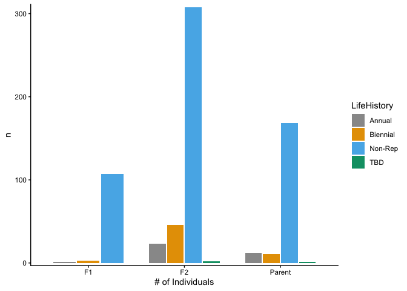<!-- -->

``` r
total_fit_2025plants %>% 
  ggplot(aes(x=Pop.Type, fill=LifeHistory)) +
  geom_bar(width = 0.7) +
  scale_fill_manual(values=cbPalette)
```

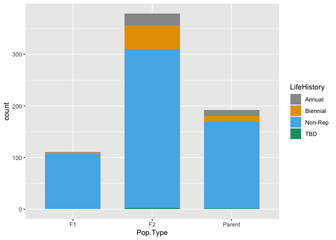<!-- -->

``` r
total_fit_2025plants %>% 
  ggplot(aes(x=Pop.Type, fill=LifeHistory)) +
  geom_bar(position = "fill", width = 0.7) +
  scale_fill_manual(values=cbPalette) +
  labs(y="% of Indivs")
```

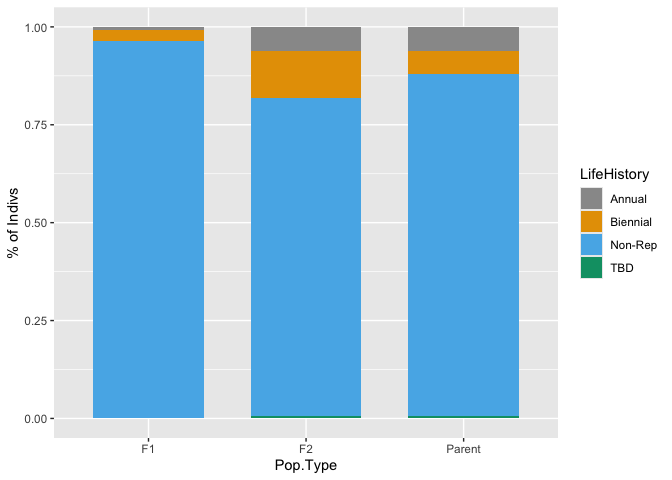<!-- -->

``` r
total_fit_2025plants %>% 
  filter(WintSurv==1) %>% 
  ggplot(aes(x=Pop.Type, fill=LifeHistory)) +
  geom_bar(position = "fill", width = 0.7) +
  scale_fill_manual(values=cbPalette) +
  labs(y="% of Indivs that Survived to 2026")
```

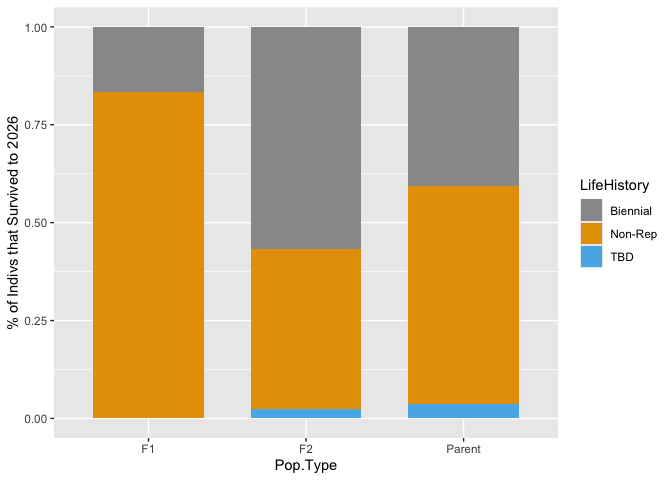<!-- -->

``` r
total_fit_2025plants %>% 
  filter(LifeHistory!="Non-Rep") %>% 
  ggplot(aes(x=Pop.Type, fill=LifeHistory)) +
  geom_bar(position = "fill", width = 0.7) +
  scale_fill_manual(values=cbPalette) +
  labs(y="% of Rep Indivs")
```

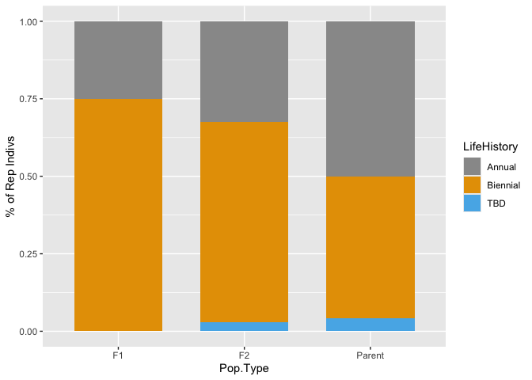<!-- -->

``` r
total_fit_2025plants %>% 
  filter(LifeHistory!="Non-Rep") %>% 
  filter(Pop.Type!="F2") %>% 
  ggplot(aes(x=pop.id, fill=LifeHistory)) +
  geom_bar(position = "fill", width = 0.7) +
  scale_fill_manual(values=cbPalette) +
  labs(y="% of Rep Indivs") #variation in TM2 and TM2 x WL2 but not WL2 x TM2
```

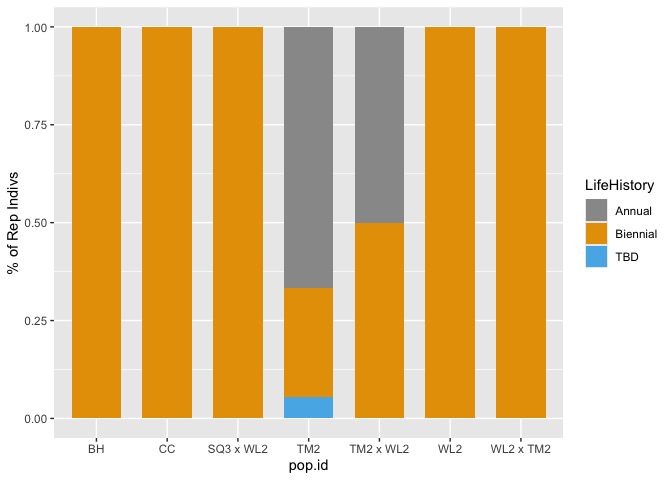<!-- -->

## Means


``` r
total_fit_2025plants_summary <- total_fit_2025plants %>% 
  group_by(Pop.Type, LifeHistory, pop.id) %>% 
  summarise(meanEst=mean(Establishment, na.rm=TRUE), semEst=sem(Establishment, na.rm = TRUE),
            meanY1Surv=mean(Y1Surv, na.rm=TRUE), semY1Surv=sem(Y1Surv, na.rm = TRUE),
            meanWintSurv=mean(WintSurv, na.rm=TRUE), semWintSurv=sem(WintSurv, na.rm = TRUE),
            meanSurvtoBud=mean(SurvtoBud, na.rm=TRUE), semSurvtoBud=sem(SurvtoBud, na.rm = TRUE),
            meanFruit=mean(num.fruit, na.rm=TRUE), semFruit=sem(num.fruit, na.rm = TRUE),
            meanProbFruit=mean(ProbFruit, na.rm=TRUE), semProbFruit=sem(ProbFruit, na.rm = TRUE),
            meanTotalFit=mean(TotalFitness, na.rm=TRUE), semTotalFit=sem(TotalFitness, na.rm = TRUE))
```

```
## `summarise()` has regrouped the output.
## ℹ Summaries were computed grouped by Pop.Type, LifeHistory, and pop.id.
## ℹ Output is grouped by Pop.Type and LifeHistory.
## ℹ Use `summarise(.groups = "drop_last")` to silence this message.
## ℹ Use `summarise(.by = c(Pop.Type, LifeHistory, pop.id))` for per-operation
##   grouping (`?dplyr::dplyr_by`) instead.
```

``` r
total_fit_2025plants_summary
```

```
## # A tibble: 95 × 17
## # Groups:   Pop.Type, LifeHistory [11]
##    Pop.Type LifeHistory pop.id meanEst  semEst meanY1Surv semY1Surv meanWintSurv
##    <chr>    <chr>       <chr>    <dbl>   <dbl>      <dbl>     <dbl>        <dbl>
##  1 F1       Annual      TM2 x…   1     NA           1        NA            0    
##  2 F1       Biennial    SQ3 x…   1     NA           1        NA            1    
##  3 F1       Biennial    TM2 x…   1     NA           1        NA            1    
##  4 F1       Biennial    WL2 x…   1     NA           1        NA            1    
##  5 F1       Non-Rep     BH x …   0.929  0.0714      0.692     0.133        0.111
##  6 F1       Non-Rep     DPR x…   0.9    0.1         0.556     0.176        0.6  
##  7 F1       Non-Rep     LV1 x…   1      0           0.667     0.167        0.167
##  8 F1       Non-Rep     SQ3 x…   0.667  0.211       1         0            0    
##  9 F1       Non-Rep     TM2 x…   0.917  0.0833      0.727     0.141        0    
## 10 F1       Non-Rep     WL1 x…   0.917  0.0833      0.818     0.122        0.111
## # ℹ 85 more rows
## # ℹ 9 more variables: semWintSurv <dbl>, meanSurvtoBud <dbl>,
## #   semSurvtoBud <dbl>, meanFruit <dbl>, semFruit <dbl>, meanProbFruit <dbl>,
## #   semProbFruit <dbl>, meanTotalFit <dbl>, semTotalFit <dbl>
```

## Quick Figures

### Establishment

``` r
total_fit_2025plants_summary %>% 
  filter(Pop.Type=="Parent") %>% 
  left_join(clim_dist_2025_wide) %>% 
  ggplot(aes(x=fct_reorder(pop.id, meanEst), y=meanEst, fill=elev_m)) +
  geom_col(width = 0.7,position = position_dodge(0.75)) +
  geom_errorbar(aes(ymin=meanEst-semEst,
                    ymax=meanEst+semEst),width=.2, 
                position =position_dodge(0.75)) +
  labs(x="Population", y="Avg Establishment", fill="Elevation (m)") +
  scale_y_continuous(expand = c(0.01, 0)) +
  scale_fill_gradient(low = "#F5A540", high = "#0043F0") +
  theme_classic()
```

```
## Joining with `by = join_by(pop.id)`
```

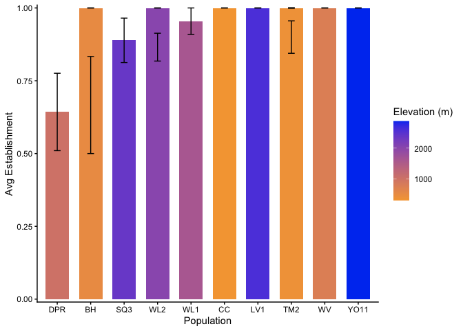<!-- -->

``` r
total_fit_2025plants_summary %>% 
  filter(Pop.Type=="F1") %>% 
  mutate(Donor.Pop=str_remove_all(pop.id, "WL2")) %>% 
  mutate(Donor.Pop=str_remove_all(Donor.Pop, " x ")) %>% 
  left_join(clim_dist_2025_wide, by=join_by(Donor.Pop==pop.id)) %>% 
  ggplot(aes(x=fct_reorder(pop.id, elev_m), y=meanEst, fill=elev_m)) +
  geom_col(width = 0.7,position = position_dodge(0.75)) +
  geom_errorbar(aes(ymin=meanEst-semEst,
                    ymax=meanEst+semEst),
                width=.2, position =position_dodge(0.75)) +
  theme_classic() +
  scale_fill_gradient(low = "#F5A540", high = "#0043F0") +
  scale_y_continuous(expand = c(0.01, 0)) +
  theme(axis.text.x = element_text(angle = 45, hjust = 1)) + 
  labs(x="F1", y="Avg Establishment", fill="Donor Elevation (m)")
```

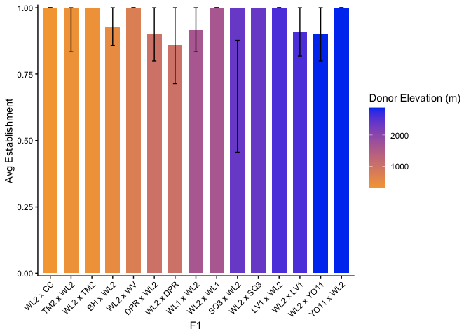<!-- -->

``` r
total_fit_2025plants_summary %>% 
  filter(Pop.Type=="F2") %>% 
  ggplot(aes(x=fct_reorder(pop.id, meanEst), y=meanEst)) +
  geom_col(width = 0.7,position = position_dodge(0.75)) +
  geom_errorbar(aes(ymin=meanEst-semEst,
                    ymax=meanEst+semEst),
                width=.2, position =position_dodge(0.75)) +
  theme_classic() +
  scale_y_continuous(expand = c(0.01, 0)) +
  theme(axis.text.x = element_text(angle = 45, hjust = 1)) + 
  labs(x="F2", y="Avg Establishment")
```

<!-- -->

### Y1 Surv

``` r
total_fit_2025plants_summary %>% 
  filter(Pop.Type=="Parent") %>% 
  left_join(clim_dist_2025_wide) %>% 
  ggplot(aes(x=fct_reorder(pop.id, meanY1Surv), y=meanY1Surv, fill=elev_m)) +
  geom_col(width = 0.7,position = position_dodge(0.75)) +
  geom_errorbar(aes(ymin=meanY1Surv-semY1Surv,
                    ymax=meanY1Surv+semY1Surv),width=.2, 
                position =position_dodge(0.75)) +
  labs(x="Population", y="Avg Y1 Surv", fill="Elevation (m)") +
  scale_y_continuous(expand = c(0.01, 0)) +
  scale_fill_gradient(low = "#F5A540", high = "#0043F0") +
  theme_classic()
```

```
## Joining with `by = join_by(pop.id)`
```

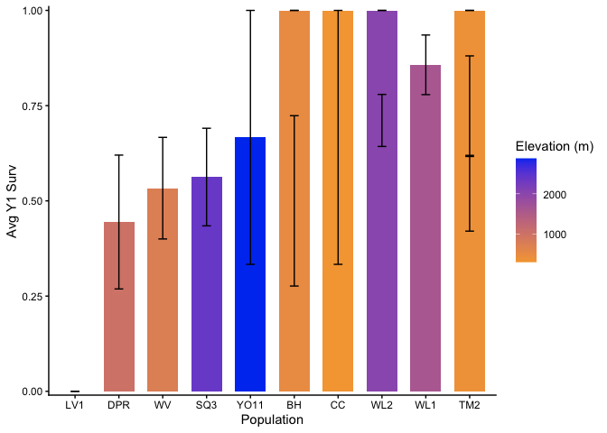<!-- -->

``` r
total_fit_2025plants_summary %>% 
  filter(Pop.Type=="F1") %>% 
  mutate(Donor.Pop=str_remove_all(pop.id, "WL2")) %>% 
  mutate(Donor.Pop=str_remove_all(Donor.Pop, " x ")) %>% 
  left_join(clim_dist_2025_wide, by=join_by(Donor.Pop==pop.id)) %>% 
  ggplot(aes(x=fct_reorder(pop.id, elev_m), y=meanY1Surv, fill=elev_m)) +
  geom_col(width = 0.7,position = position_dodge(0.75)) +
  geom_errorbar(aes(ymin=meanY1Surv-semY1Surv,
                    ymax=meanY1Surv+semY1Surv),
                width=.2, position =position_dodge(0.75)) +
  theme_classic() +
  scale_fill_gradient(low = "#F5A540", high = "#0043F0") +
  scale_y_continuous(expand = c(0.01, 0)) +
  theme(axis.text.x = element_text(angle = 45, hjust = 1)) + 
  labs(x="F1", y="Avg Y1 Surv", fill="Donor Elevation (m)")
```

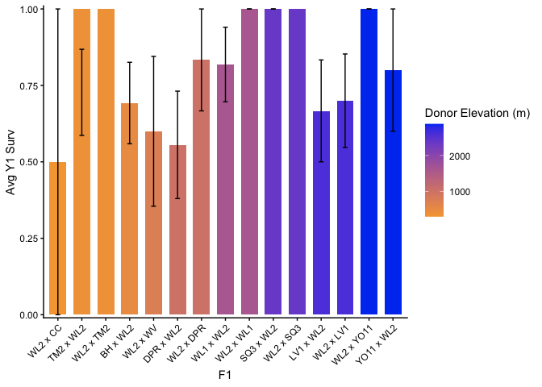<!-- -->

``` r
total_fit_2025plants_summary %>% 
  filter(Pop.Type=="F2") %>% 
  ggplot(aes(x=fct_reorder(pop.id, meanY1Surv), y=meanY1Surv)) +
  geom_col(width = 0.7,position = position_dodge(0.75)) +
  geom_errorbar(aes(ymin=meanY1Surv-semY1Surv,
                    ymax=meanY1Surv+semY1Surv),
                width=.2, position =position_dodge(0.75)) +
  theme_classic() +
  scale_y_continuous(expand = c(0.01, 0)) +
  theme(axis.text.x = element_text(angle = 45, hjust = 1)) + 
  labs(x="F2", y="Avg Y1 Surv")
```

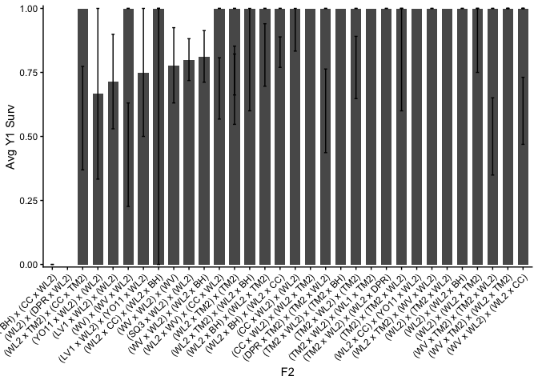<!-- -->

### Winter Surv


``` r
total_fit_2025plants_summary %>% 
  filter(Pop.Type=="Parent") %>% 
  mutate(meanWintSurv=if_else(meanWintSurv=="NaN", NA, meanWintSurv)) %>% 
  filter(!is.na(meanWintSurv)) %>% 
  left_join(clim_dist_2025_wide) %>% 
  ggplot(aes(x=fct_reorder(pop.id, meanWintSurv), y=meanWintSurv, fill=elev_m)) +
  geom_col(width = 0.7,position = position_dodge(0.75)) +
  geom_errorbar(aes(ymin=meanWintSurv-semWintSurv,
                    ymax=meanWintSurv+semWintSurv),width=.2, 
                position =position_dodge(0.75)) +
  labs(x="Population", y="Avg Winter Survival", fill="Elevation (m)") +
  scale_y_continuous(expand = c(0.01, 0)) +
  scale_fill_gradient(low = "#F5A540", high = "#0043F0") +
  theme_classic()
```

```
## Joining with `by = join_by(pop.id)`
```

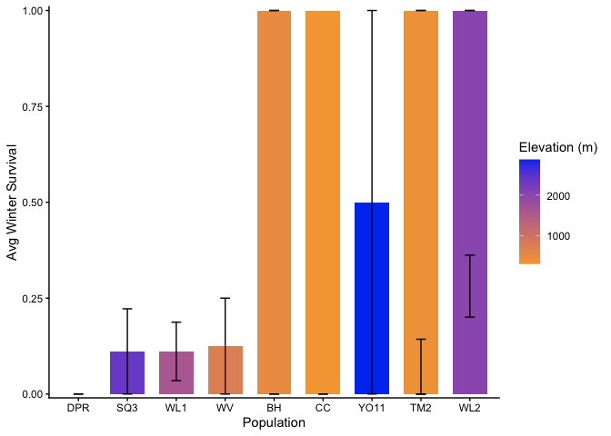<!-- -->

``` r
total_fit_2025plants_summary %>% 
  filter(Pop.Type=="F1") %>% 
  mutate(Donor.Pop=str_remove_all(pop.id, "WL2")) %>% 
  mutate(Donor.Pop=str_remove_all(Donor.Pop, " x ")) %>% 
  left_join(clim_dist_2025_wide, by=join_by(Donor.Pop==pop.id)) %>% 
  mutate(meanWintSurv=if_else(meanWintSurv=="NaN", NA, meanWintSurv)) %>% 
  filter(!is.na(meanWintSurv)) %>% 
  ggplot(aes(x=fct_reorder(pop.id, elev_m), y=meanWintSurv, fill=elev_m)) +
  geom_col(width = 0.7,position = position_dodge(0.75)) +
  geom_errorbar(aes(ymin=meanWintSurv-semWintSurv,
                    ymax=meanWintSurv+semWintSurv),
                width=.2, position =position_dodge(0.75)) +
  theme_classic() +
  scale_fill_gradient(low = "#F5A540", high = "#0043F0") +
  scale_y_continuous(expand = c(0.01, 0)) +
  theme(axis.text.x = element_text(angle = 45, hjust = 1)) + 
  labs(x="F1", y="Avg Winter Survival", fill="Donor Elevation (m)")
```

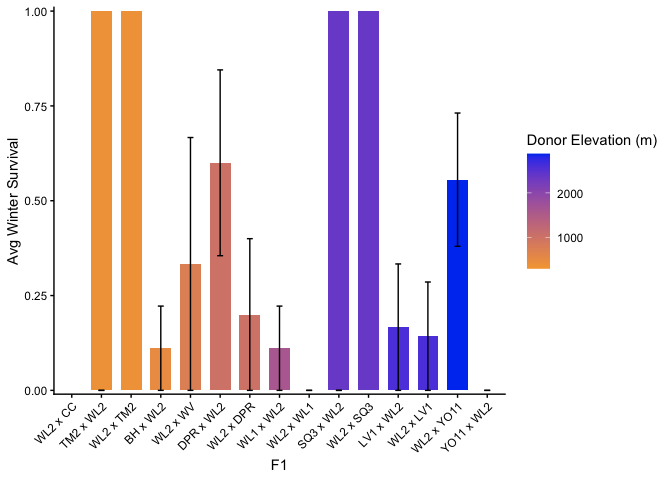<!-- -->

``` r
total_fit_2025plants_summary %>% 
  filter(Pop.Type=="F2") %>% 
  mutate(meanWintSurv=if_else(meanWintSurv=="NaN", NA, meanWintSurv)) %>% 
  filter(!is.na(meanWintSurv)) %>% 
  ggplot(aes(x=fct_reorder(pop.id, meanWintSurv), y=meanWintSurv)) +
  geom_col(width = 0.7,position = position_dodge(0.75)) +
  geom_errorbar(aes(ymin=meanWintSurv-semWintSurv,
                    ymax=meanWintSurv+semWintSurv),
                width=.2, position =position_dodge(0.75)) +
  theme_classic() +
  scale_y_continuous(expand = c(0.01, 0)) +
  theme(axis.text.x = element_text(angle = 45, hjust = 1)) + 
  labs(x="F2", y="Avg Winter Survival")
```

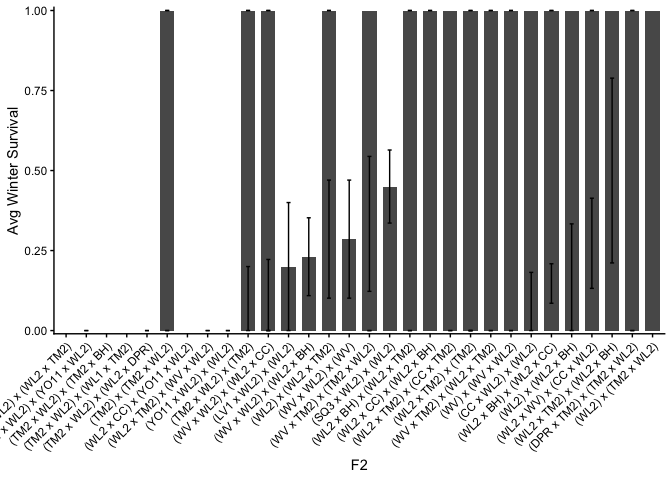<!-- -->

### Surv to Budding 

``` r
total_fit_2025plants_summary %>% 
  filter(Pop.Type=="Parent") %>% 
  mutate(meanSurvtoBud=if_else(meanSurvtoBud=="NaN", NA, meanSurvtoBud)) %>% 
  filter(!is.na(meanSurvtoBud)) %>% 
  left_join(clim_dist_2025_wide) %>% 
  ggplot(aes(x=fct_reorder(pop.id, meanSurvtoBud), y=meanSurvtoBud, fill=elev_m)) +
  geom_col(width = 0.7,position = position_dodge(0.75)) +
  geom_errorbar(aes(ymin=meanSurvtoBud-semSurvtoBud,
                    ymax=meanSurvtoBud+semSurvtoBud),width=.2, 
                position =position_dodge(0.75)) +
  labs(x="Population", y="Avg Surv to Buddding", fill="Elevation (m)") +
  scale_y_continuous(expand = c(0.01, 0)) +
  scale_fill_gradient(low = "#F5A540", high = "#0043F0") +
  theme_classic()
```

```
## Joining with `by = join_by(pop.id)`
```

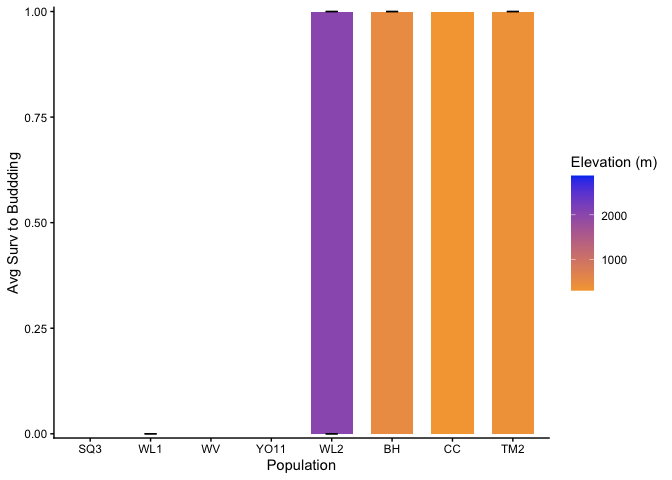<!-- -->

``` r
total_fit_2025plants_summary %>% 
  filter(Pop.Type=="F1") %>% 
  mutate(Donor.Pop=str_remove_all(pop.id, "WL2")) %>% 
  mutate(Donor.Pop=str_remove_all(Donor.Pop, " x ")) %>% 
  left_join(clim_dist_2025_wide, by=join_by(Donor.Pop==pop.id)) %>% 
  mutate(meanSurvtoBud=if_else(meanSurvtoBud=="NaN", NA, meanSurvtoBud)) %>% 
  filter(!is.na(meanSurvtoBud)) %>% 
  ggplot(aes(x=fct_reorder(pop.id, elev_m), y=meanSurvtoBud, fill=elev_m)) +
  geom_col(width = 0.7,position = position_dodge(0.75)) +
  geom_errorbar(aes(ymin=meanSurvtoBud-semSurvtoBud,
                    ymax=meanSurvtoBud+semSurvtoBud),
                width=.2, position =position_dodge(0.75)) +
  theme_classic() +
  scale_fill_gradient(low = "#F5A540", high = "#0043F0") +
  scale_y_continuous(expand = c(0.01, 0)) +
  theme(axis.text.x = element_text(angle = 45, hjust = 1)) + 
  labs(x="F1", y="Avg Surv to Buddding", fill="Donor Elevation (m)")
```

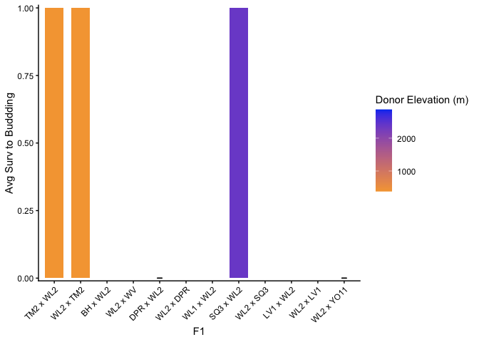<!-- -->

``` r
total_fit_2025plants_summary %>% 
  filter(Pop.Type=="F2") %>% 
  mutate(meanSurvtoBud=if_else(meanSurvtoBud=="NaN", NA, meanSurvtoBud)) %>% 
  filter(!is.na(meanSurvtoBud)) %>% 
  ggplot(aes(x=fct_reorder(pop.id, meanSurvtoBud), y=meanSurvtoBud)) +
  geom_col(width = 0.7,position = position_dodge(0.75)) +
  geom_errorbar(aes(ymin=meanSurvtoBud-semSurvtoBud,
                    ymax=meanSurvtoBud+semSurvtoBud),
                width=.2, position =position_dodge(0.75)) +
  theme_classic() +
  scale_y_continuous(expand = c(0.01, 0)) +
  theme(axis.text.x = element_text(angle = 45, hjust = 1)) + 
  labs(x="F2", y="Avg Surv to Buddding")
```

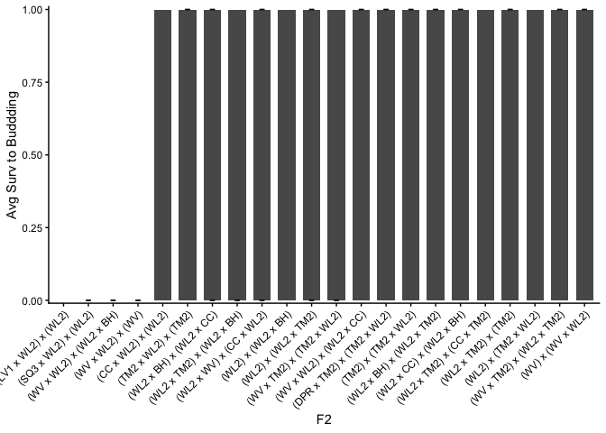<!-- -->

### Fruit #

``` r
total_fit_2025plants_summary %>% 
  filter(Pop.Type=="Parent") %>% 
  mutate(meanFruit=if_else(meanFruit=="NaN", NA, meanFruit)) %>% 
  filter(!is.na(meanFruit)) %>% 
  left_join(clim_dist_2025_wide) %>% 
  ggplot(aes(x=fct_reorder(pop.id, meanFruit), y=meanFruit, fill=elev_m)) +
  geom_col(width = 0.7,position = position_dodge(0.75)) +
  geom_errorbar(aes(ymin=meanFruit-semFruit,
                    ymax=meanFruit+semFruit),width=.2, 
                position =position_dodge(0.75)) +
  labs(x="Population", y="Avg Fecundity", fill="Elevation (m)") +
  scale_y_continuous(expand = c(0.01, 0)) +
  scale_fill_gradient(low = "#F5A540", high = "#0043F0") +
  theme_classic()
```

```
## Joining with `by = join_by(pop.id)`
```

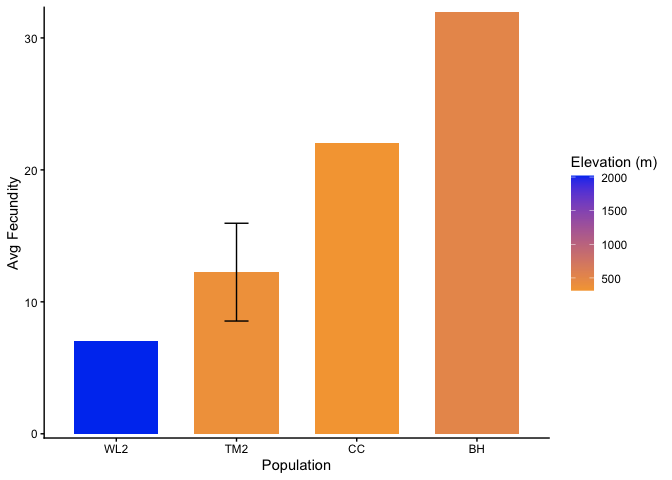<!-- -->

``` r
total_fit_2025plants_summary %>% 
  filter(Pop.Type=="F1") %>% 
  mutate(Donor.Pop=str_remove_all(pop.id, "WL2")) %>% 
  mutate(Donor.Pop=str_remove_all(Donor.Pop, " x ")) %>% 
  left_join(clim_dist_2025_wide, by=join_by(Donor.Pop==pop.id)) %>% 
  mutate(meanFruit=if_else(meanFruit=="NaN", NA, meanFruit)) %>% 
  filter(!is.na(meanFruit)) %>% 
  ggplot(aes(x=fct_reorder(pop.id, elev_m), y=meanFruit, fill=elev_m)) +
  geom_col(width = 0.7,position = position_dodge(0.75)) +
  geom_errorbar(aes(ymin=meanFruit-semFruit,
                    ymax=meanFruit+semFruit),
                width=.2, position =position_dodge(0.75)) +
  theme_classic() +
  scale_fill_gradient(low = "#F5A540", high = "#0043F0") +
  scale_y_continuous(expand = c(0.01, 0)) +
  theme(axis.text.x = element_text(angle = 45, hjust = 1)) + 
  labs(x="F1", y="Avg Fecundity", fill="Donor Elevation (m)")
```

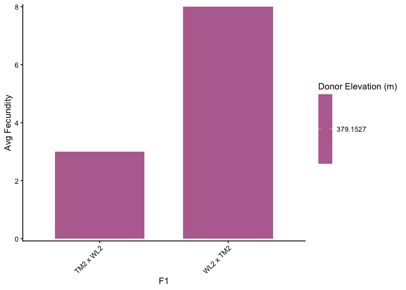<!-- -->

``` r
total_fit_2025plants_summary %>% 
  filter(Pop.Type=="F2") %>% 
  mutate(meanFruit=if_else(meanFruit=="NaN", NA, meanFruit)) %>% 
  filter(!is.na(meanFruit)) %>% 
  ggplot(aes(x=fct_reorder(pop.id, meanFruit), y=meanFruit)) +
  geom_col(width = 0.7,position = position_dodge(0.75)) +
  geom_errorbar(aes(ymin=meanFruit-semFruit,
                    ymax=meanFruit+semFruit),
                width=.2, position =position_dodge(0.75)) +
  theme_classic() +
  scale_y_continuous(expand = c(0.01, 0)) +
  theme(axis.text.x = element_text(angle = 45, hjust = 1)) + 
  labs(x="F2", y="Avg Fecundity")
```

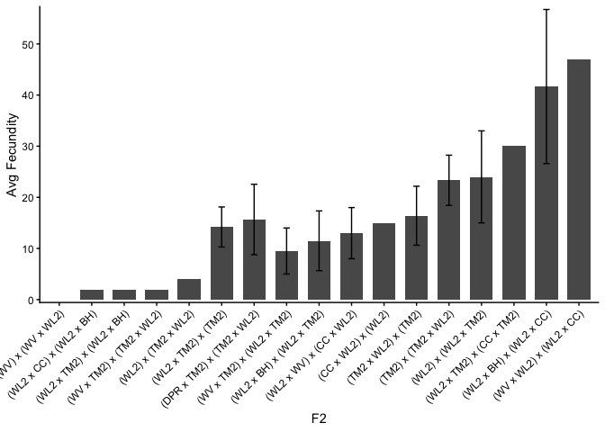<!-- -->

### Prob Fruit

``` r
total_fit_2025plants_summary %>% 
  filter(Pop.Type=="Parent") %>% 
  mutate(meanProbProbFruit=if_else(meanProbFruit=="NaN", NA, meanProbFruit)) %>% 
  filter(!is.na(meanProbFruit)) %>% 
  left_join(clim_dist_2025_wide) %>% 
  ggplot(aes(x=fct_reorder(pop.id, meanProbFruit), y=meanProbFruit, fill=elev_m)) +
  geom_col(width = 0.7,position = position_dodge(0.75)) +
  geom_errorbar(aes(ymin=meanProbFruit-semProbFruit,
                    ymax=meanProbFruit+semProbFruit),width=.2, 
                position =position_dodge(0.75)) +
  labs(x="Population", y="Avg Prob Rep", fill="Elevation (m)") +
  scale_y_continuous(expand = c(0.01, 0)) +
  scale_fill_gradient(low = "#F5A540", high = "#0043F0") +
  theme_classic()
```

```
## Joining with `by = join_by(pop.id)`
```

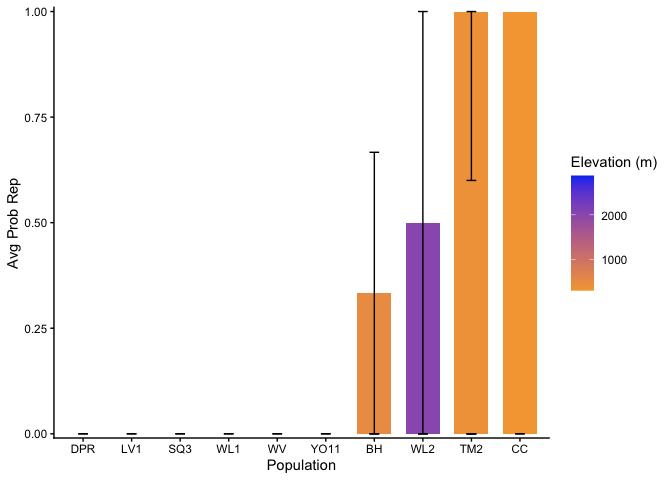<!-- -->

``` r
total_fit_2025plants_summary %>% 
  filter(Pop.Type=="F1") %>% 
  mutate(Donor.Pop=str_remove_all(pop.id, "WL2")) %>% 
  mutate(Donor.Pop=str_remove_all(Donor.Pop, " x ")) %>% 
  left_join(clim_dist_2025_wide, by=join_by(Donor.Pop==pop.id)) %>% 
  mutate(meanProbFruit=if_else(meanProbFruit=="NaN", NA, meanProbFruit)) %>% 
  filter(!is.na(meanProbFruit)) %>% 
  ggplot(aes(x=fct_reorder(pop.id, elev_m), y=meanProbFruit, fill=elev_m)) +
  geom_col(width = 0.7,position = position_dodge(0.75)) +
  geom_errorbar(aes(ymin=meanProbFruit-semProbFruit,
                    ymax=meanProbFruit+semProbFruit),
                width=.2, position =position_dodge(0.75)) +
  theme_classic() +
  scale_fill_gradient(low = "#F5A540", high = "#0043F0") +
  scale_y_continuous(expand = c(0.01, 0)) +
  theme(axis.text.x = element_text(angle = 45, hjust = 1)) + 
  labs(x="F1", y="Avg Prob Rep", fill="Donor Elevation (m)")
```

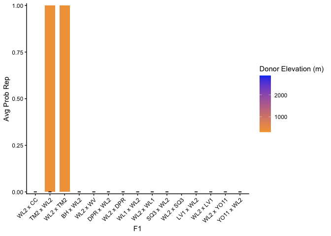<!-- -->

``` r
total_fit_2025plants_summary %>% 
  filter(Pop.Type=="F2") %>% 
  mutate(meanProbFruit=if_else(meanProbFruit=="NaN", NA, meanProbFruit)) %>% 
  filter(!is.na(meanProbFruit)) %>% 
  ggplot(aes(x=fct_reorder(pop.id, meanProbFruit), y=meanProbFruit)) +
  geom_col(width = 0.7,position = position_dodge(0.75)) +
  geom_errorbar(aes(ymin=meanProbFruit-semProbFruit,
                    ymax=meanProbFruit+semProbFruit),
                width=.2, position =position_dodge(0.75)) +
  theme_classic() +
  scale_y_continuous(expand = c(0.01, 0)) +
  theme(axis.text.x = element_text(angle = 45, hjust = 1)) + 
  labs(x="F2", y="Avg Prob Rep")
```

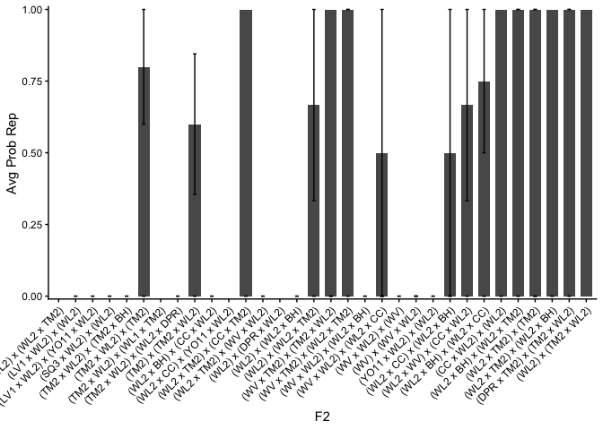<!-- -->

### Total fruit 

``` r
total_fit_2025plants_summary %>% 
  filter(Pop.Type=="Parent") %>% 
  mutate(meanTotalFit=if_else(meanTotalFit=="NaN", NA, meanTotalFit)) %>% 
  filter(!is.na(meanTotalFit)) %>% 
  left_join(clim_dist_2025_wide) %>% 
  ggplot(aes(x=fct_reorder(pop.id, meanTotalFit), y=meanTotalFit, fill=elev_m)) +
  geom_col(width = 0.7,position = position_dodge(0.75)) +
  geom_errorbar(aes(ymin=meanTotalFit-semTotalFit,
                    ymax=meanTotalFit+semTotalFit),width=.2, 
                position =position_dodge(0.75)) +
  labs(x="Population", y="Avg Total Fitness", fill="Elevation (m)") +
  scale_y_continuous(expand = c(0.01, 0)) +
  scale_fill_gradient(low = "#F5A540", high = "#0043F0") +
  theme_classic()
```

```
## Joining with `by = join_by(pop.id)`
```

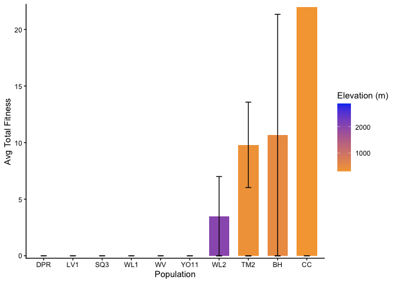<!-- -->

``` r
total_fit_2025plants_summary %>% 
  filter(Pop.Type=="F1") %>% 
  mutate(Donor.Pop=str_remove_all(pop.id, "WL2")) %>% 
  mutate(Donor.Pop=str_remove_all(Donor.Pop, " x ")) %>% 
  left_join(clim_dist_2025_wide, by=join_by(Donor.Pop==pop.id)) %>% 
  mutate(meanTotalFit=if_else(meanTotalFit=="NaN", NA, meanTotalFit)) %>% 
  filter(!is.na(meanTotalFit)) %>% 
  ggplot(aes(x=fct_reorder(pop.id, elev_m), y=meanTotalFit, fill=elev_m)) +
  geom_col(width = 0.7,position = position_dodge(0.75)) +
  geom_errorbar(aes(ymin=meanTotalFit-semTotalFit,
                    ymax=meanTotalFit+semTotalFit),
                width=.2, position =position_dodge(0.75)) +
  theme_classic() +
  scale_fill_gradient(low = "#F5A540", high = "#0043F0") +
  scale_y_continuous(expand = c(0.01, 0)) +
  theme(axis.text.x = element_text(angle = 45, hjust = 1)) + 
  labs(x="F1", y="Avg Total Fitness", fill="Donor Elevation (m)")
```

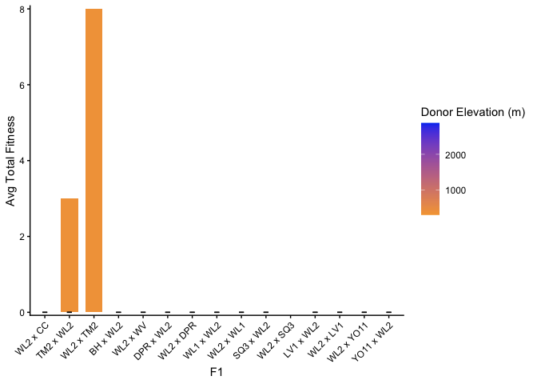<!-- -->

``` r
total_fit_2025plants_summary %>% 
  filter(Pop.Type=="F2") %>% 
  mutate(meanTotalFit=if_else(meanTotalFit=="NaN", NA, meanTotalFit)) %>% 
  filter(!is.na(meanTotalFit)) %>% 
  ggplot(aes(x=fct_reorder(pop.id, meanTotalFit), y=meanTotalFit)) +
  geom_col(width = 0.7,position = position_dodge(0.75)) +
  geom_errorbar(aes(ymin=meanTotalFit-semTotalFit,
                    ymax=meanTotalFit+semTotalFit),
                width=.2, position =position_dodge(0.75)) +
  theme_classic() +
  scale_y_continuous(expand = c(0.01, 0)) +
  theme(axis.text.x = element_text(angle = 45, hjust = 1)) + 
  labs(x="F2", y="Avg Total Fitness")
```

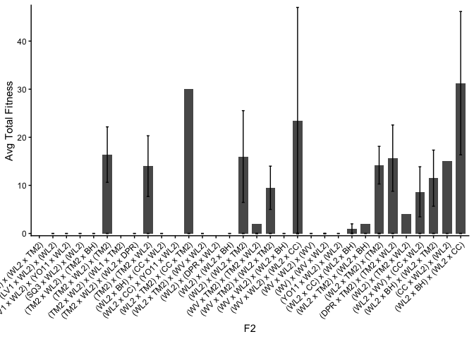<!-- -->
