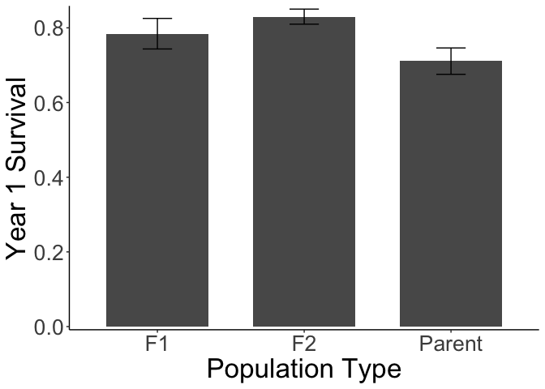
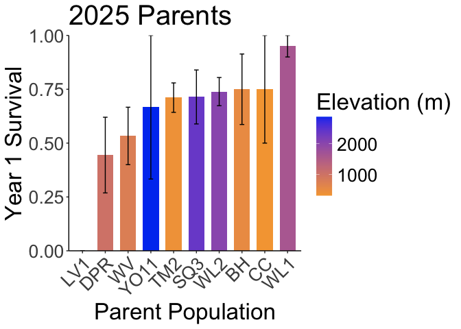
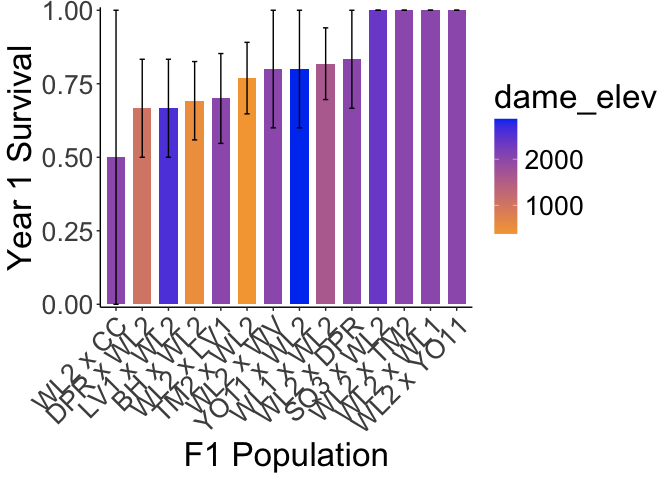
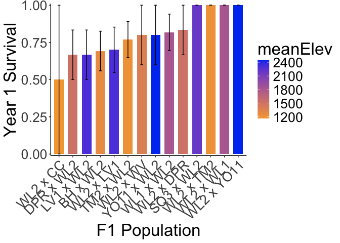
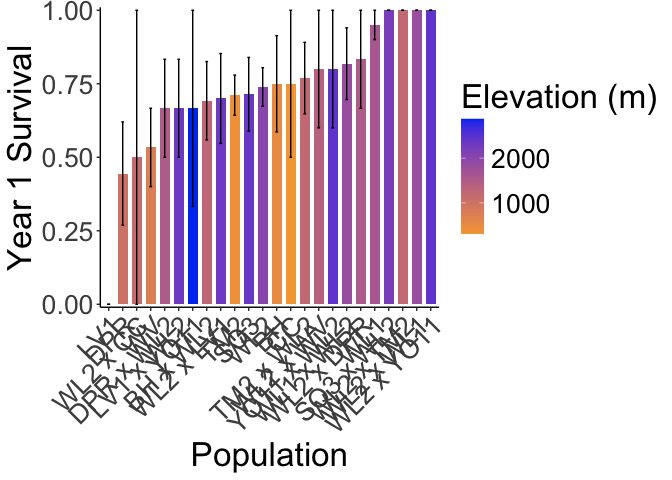

# Survival of plants planted in 2025
To Do:
- take into account plants that survived to rep then died 

## Libraries

``` r
library(tidyverse)
```

```
## ── Attaching core tidyverse packages ──────────────────────── tidyverse 2.0.0 ──
## ✔ dplyr     1.1.4     ✔ readr     2.1.5
## ✔ forcats   1.0.0     ✔ stringr   1.5.1
## ✔ ggplot2   3.5.1     ✔ tibble    3.2.1
## ✔ lubridate 1.9.3     ✔ tidyr     1.3.1
## ✔ purrr     1.0.2     
## ── Conflicts ────────────────────────────────────────── tidyverse_conflicts() ──
## ✖ dplyr::filter() masks stats::filter()
## ✖ dplyr::lag()    masks stats::lag()
## ℹ Use the conflicted package (<http://conflicted.r-lib.org/>) to force all conflicts to become errors
```

``` r
sem <- function(x, na.rm=FALSE) {           #for calculating standard error
  sd(x,na.rm=na.rm)/sqrt(length(na.omit(x)))
} 
```

## Load data

## Mort/pheno

``` r
mort_pheno_2025 <- read_csv("../input/WL2_2025_Data/CorrectedCSVs/WL2_mort_pheno_20250929_corrected.csv")
```

```
## New names:
## Rows: 972 Columns: 13
## ── Column specification
## ──────────────────────────────────────────────────────── Delimiter: "," chr
## (12): bed, col, Unique.ID, bud.date, flower.date, fruit.date, last.FL.da... dbl
## (1): row
## ℹ Use `spec()` to retrieve the full column specification for this data. ℹ
## Specify the column types or set `show_col_types = FALSE` to quiet this message.
## • `` -> `...13`
```

``` r
mort_pheno_2025 %>% filter(!is.na(Unique.ID), Unique.ID!="buffer") %>% filter(is.na(as.numeric(Unique.ID))) #only non-numeric ID is yose plant from 2023
```

```
## Warning: There was 1 warning in `filter()`.
## ℹ In argument: `is.na(as.numeric(Unique.ID))`.
## Caused by warning:
## ! NAs introduced by coercion
```

```
## # A tibble: 1 × 13
##   bed     row col   Unique.ID bud.date flower.date fruit.date last.FL.date
##   <chr> <dbl> <chr> <chr>     <chr>    <chr>       <chr>      <chr>       
## 1 G         5 D     YO7_5_7   6/27/25  7/3/25      7/18/25    7/25/25     
## # ℹ 5 more variables: last.FR.date <chr>, death.date <chr>,
## #   round2.rep.dates <chr>, survey.notes <chr>, ...13 <chr>
```

## Pop Info 

``` r
pop_info_2025 <- read_csv("../input/WL2_2025_Data/2025_Pop_Loc_Info Updated.csv") %>% 
  select(status:Unique.ID)
```

```
## Rows: 976 Columns: 16
## ── Column specification ────────────────────────────────────────────────────────
## Delimiter: ","
## chr (10): status, block, bed, col, pop.id, mf, dame_mf, sire_mf, Unique.ID, ...
## dbl  (6): bed.block.order, bed.order, AB.CD.order, column.order, row, rep
## 
## ℹ Use `spec()` to retrieve the full column specification for this data.
## ℹ Specify the column types or set `show_col_types = FALSE` to quiet this message.
```

## Merge

``` r
mort_pheno_2025_pops <- mort_pheno_2025 %>% 
  select(bed:Unique.ID, bud.date, death.date) %>% 
  left_join(pop_info_2025) %>% 
  filter(Unique.ID!="buffer", !is.na(Unique.ID))
```

```
## Joining with `by = join_by(bed, row, col, Unique.ID)`
```

## Elevation Info

``` r
elev_info <- read_csv("../input/Strep_tort_locs.csv")
```

```
## Rows: 54 Columns: 7
## ── Column specification ────────────────────────────────────────────────────────
## Delimiter: ","
## chr (6): Species epithet, Species Code, Site, Site code, Lat, Long
## dbl (1): Elevation (m)
## 
## ℹ Use `spec()` to retrieve the full column specification for this data.
## ℹ Specify the column types or set `show_col_types = FALSE` to quiet this message.
```

``` r
elev_info_yo <- elev_info %>% 
  mutate(pop = str_replace(`Site code`, "YOSE(\\d+)", "YO\\1")) %>% select(Lat, Long, elev_m=`Elevation (m)`, pop) %>% 
  rename(pop.id=pop)
head(elev_info_yo)
```

```
## # A tibble: 6 × 4
##   Lat      Long       elev_m pop.id
##   <chr>    <chr>       <dbl> <chr> 
## 1 37.40985 -119.96458   511. BH    
## 2 39.55355 -121.4329    283. BB    
## 3 39.58597 -121.43311   313  CC    
## 4 38.6382  -120.1422   2422. CP1   
## 5 38.66169 -120.13065  2244. CP2   
## 6 38.70649 -120.08797  2266. CP3
```

``` r
unique(elev_info_yo$pop.id)
```

```
##  [1] "BH"    "BB"    "CC"    "CP1"   "CP2"   "CP3"   "DP"    "DPR"   "FR"   
## [10] NA      "HH"    "IH"    "KC1"   "KC2"   "KC3"   "LV1"   "LV2"   "LV3"  
## [19] "LVTR1" "LVTR2" "LVTR3" "SQ1"   "SQ2"   "SQ3"   "SHA"   "SC"    "TM1"  
## [28] "TM2"   "WR"    "WV"    "WL1"   "WL2"   "WL3"   "WL4"   "YO1"   "YO10" 
## [37] "YO11"  "YO12"  "YO13"  "YO2"   "YO3"   "YO4"   "YO5"   "YO6"   "YO7"  
## [46] "YO8"   "YO9"
```

## 2025 Plants Only

``` r
mort_pheno_2025_pops_2025plants <- mort_pheno_2025_pops %>% 
  filter(status=="available") %>% 
  mutate(Pop.Type=if_else(str_detect(pop.id, "\\) x"), "F2",
                          if_else(str_detect(pop.id, "x"), "F1",
                                  "Parent"
                          ))) %>% 
  mutate(Surv=if_else(!is.na(bud.date), 1, 
                      if_else(is.na(death.date), 1, 0))) #1 = surv; 0 = mort

xtabs(~Pop.Type, data=mort_pheno_2025_pops_2025plants)
```

```
## Pop.Type
##     F1     F2 Parent 
##    112    379    193
```

``` r
xtabs(~Pop.Type+Surv, data=mort_pheno_2025_pops_2025plants)
```

```
##         Surv
## Pop.Type   0   1
##   F1      32  80
##   F2      88 291
##   Parent  69 124
```

``` r
#80/112 F1 survived
#291/379 F2s survived
#124/193 Parents survived 

#mort_pheno_2025_pops_2025plants %>% filter(Pop.Type=="F1") %>% distinct(pop.id) #15 F1 types 
mort_pheno_2025_pops_2025plants %>% filter(!is.na(bud.date)) %>% filter(!is.na(death.date)) #7 plants reproduced and died in 2025
```

```
## # A tibble: 7 × 15
##   bed     row col   Unique.ID bud.date death.date status    block pop.id   mf   
##   <chr> <dbl> <chr> <chr>     <chr>    <chr>      <chr>     <chr> <chr>    <chr>
## 1 C        29 D     2269      6/27/25  8/14/25    available B     (WL2 x … 2_1-3
## 2 D        46 B     2238      6/27/25  7/25/25    available F     (WL2 x … 2-3_…
## 3 D        31 D     2647      6/17/25  6/27/25    available F     (WL2 x … 2_1-3
## 4 E        26 A     1713      7/10/25  9/4/25     available I     TM2      1    
## 5 E        28 C     2637      6/27/25  9/24/25    available I     TM2      9    
## 6 E        51 C     1715      6/17/25  9/4/25     available J     TM2      2    
## 7 F        11 A     2288      17-Jun   9/24/25    available J     (WL2 x … 2_1-3
## # ℹ 5 more variables: dame_mf <chr>, sire_mf <chr>, rep <dbl>, Pop.Type <chr>,
## #   Surv <dbl>
```

## Plot by pop type 

``` r
mort_pheno_2025_pops_2025plants %>% 
  group_by(Pop.Type) %>% 
  summarise(meanSurv=mean(Surv), semSurv=sem(Surv)) %>% 
  ggplot(aes(x=Pop.Type, y=meanSurv)) +
  geom_col(width = 0.7,position = position_dodge(0.75)) + 
  geom_errorbar(aes(ymin=meanSurv-semSurv,ymax=meanSurv+semSurv),width=.2, position = 
                  position_dodge(0.75)) +
  theme_classic() + 
  scale_y_continuous(expand = c(0.01, 0.00)) +
  labs(y="Year 1 Survival", x="Population Type") +
  theme(text=element_text(size=25))
```

<!-- -->

``` r
ggsave("../output/WL2_Traits/WL2_Y1Surv_2025Plants_PopType.png", width = 10, height = 8, units = "in")
```

## Means by pop

``` r
by_pop_Surv <- mort_pheno_2025_pops_2025plants %>% 
  group_by(pop.id, Pop.Type) %>% 
  summarise(N_Surv = sum(!is.na(Surv)), mean_Surv = mean(Surv,na.rm=(TRUE)), 
            sem_Surv=sem(Surv, na.rm=(TRUE)))
```

```
## `summarise()` has grouped output by 'pop.id'. You can override using the
## `.groups` argument.
```

## Plot by pops 

### Parents

``` r
by_pop_parents_Surv <- by_pop_Surv %>% 
  filter(Pop.Type == "Parent") %>% 
  left_join(elev_info_yo)
```

```
## Joining with `by = join_by(pop.id)`
```

``` r
head(by_pop_parents_Surv)
```

```
## # A tibble: 6 × 8
## # Groups:   pop.id [6]
##   pop.id Pop.Type N_Surv mean_Surv sem_Surv Lat      Long       elev_m
##   <chr>  <chr>     <int>     <dbl>    <dbl> <chr>    <chr>       <dbl>
## 1 BH     Parent       11     0.545   0.157  37.40985 -119.96458   511.
## 2 CC     Parent        4     0.75    0.25   39.58597 -121.43311   313 
## 3 DPR    Parent       14     0.286   0.125  39.22846 -120.81518  1019.
## 4 LV1    Parent        3     0.333   0.333  40.47471 -121.50486  2593.
## 5 SQ3    Parent       18     0.667   0.114  36.72109 -118.84933  2373.
## 6 TM2    Parent       48     0.667   0.0688 39.59255 -121.55072   379.
```

``` r
by_pop_parents_Surv %>% 
  filter(N_Surv>1) %>% 
  ggplot(aes(x=fct_reorder(pop.id, mean_Surv), y=mean_Surv, fill=elev_m)) + 
  geom_col(width = 0.7,position = position_dodge(0.75)) +
  geom_errorbar(aes(ymin=mean_Surv-sem_Surv,ymax=mean_Surv+sem_Surv),width=.2, position = 
                  position_dodge(0.75)) +
  labs(x="Parent Population", y="Year 1 Survival", fill="Elevation (m)", title="2025 Parents") +
  theme_classic() + 
  scale_y_continuous(expand = c(0, 0)) +
  scale_fill_gradient(low = "#F5A540", high = "#0043F0") +
  theme(text=element_text(size=25), axis.text.x = element_text(angle = 45, hjust = 1))
```

<!-- -->

``` r
ggsave("../output/WL2_Traits/WL2_Y1Surv_2025Plants_Parents.png", width = 14, height = 8, units = "in")
```

### F1s

``` r
by_pop_Surv_F1 <- by_pop_Surv %>% 
  filter(Pop.Type == "F1") %>% 
  separate(pop.id, c("dame_pop",NA, "sire_pop"), remove = FALSE) %>% 
  left_join(elev_info_yo, by=join_by(dame_pop==pop.id)) %>% 
  rename(dame_elev=elev_m, dame_Lat=Lat, dame_Long=Long) %>% 
  left_join(elev_info_yo, by=join_by(sire_pop==pop.id)) %>% 
  rename(sire_elev=elev_m, sire_Lat=Lat, sire_Long=Long) %>% 
  mutate(meanElev=(dame_elev+sire_elev)/2)
head(by_pop_Surv_F1)
```

```
## # A tibble: 6 × 14
## # Groups:   pop.id [6]
##   pop.id dame_pop sire_pop Pop.Type N_Surv mean_Surv sem_Surv dame_Lat dame_Long
##   <chr>  <chr>    <chr>    <chr>     <int>     <dbl>    <dbl> <chr>    <chr>    
## 1 BH x … BH       WL2      F1           14     0.643    0.133 37.40985 -119.964…
## 2 DPR x… DPR      WL2      F1           10     0.6      0.163 39.22846 -120.815…
## 3 LV1 x… LV1      WL2      F1            9     0.667    0.167 40.47471 -121.504…
## 4 SQ3 x… SQ3      WL2      F1            7     0.714    0.184 36.72109 -118.849…
## 5 TM2 x… TM2      WL2      F1           14     0.714    0.125 39.59255 -121.550…
## 6 WL1 x… WL1      WL2      F1           13     0.692    0.133 38.78608 -120.2143
## # ℹ 5 more variables: dame_elev <dbl>, sire_Lat <chr>, sire_Long <chr>,
## #   sire_elev <dbl>, meanElev <dbl>
```

``` r
by_pop_Surv_F1 %>% 
  filter(N_Surv>1) %>% 
  ggplot(aes(x=fct_reorder(pop.id, mean_Surv), y=mean_Surv, fill=dame_elev)) + 
  geom_col(width = 0.7,position = position_dodge(0.75)) + 
  geom_errorbar(aes(ymin=mean_Surv-sem_Surv,ymax=mean_Surv+sem_Surv),width=.2, position = 
                  position_dodge(0.75)) +
  theme_classic() + 
  scale_fill_gradient(low = "#F5A540", high = "#0043F0") +
  scale_y_continuous(expand = c(0.01, 0)) +
  labs(x="F1 Population", y="Year 1 Survival") +
  theme(text=element_text(size=25), axis.text.x = element_text(angle = 45, hjust = 1))
```

<!-- -->

``` r
by_pop_Surv_F1 %>% 
  filter(N_Surv>1) %>% 
  ggplot(aes(x=fct_reorder(pop.id, mean_Surv), y=mean_Surv, fill=meanElev)) + 
  geom_col(width = 0.7,position = position_dodge(0.75)) + 
  geom_errorbar(aes(ymin=mean_Surv-sem_Surv,ymax=mean_Surv+sem_Surv),width=.2, position = 
                  position_dodge(0.75)) +
  theme_classic() + 
  scale_fill_gradient(low = "#F5A540", high = "#0043F0") +
  scale_y_continuous(expand = c(0.01, 0)) +
  labs(x="F1 Population", y="Year 1 Survival") +
  theme(text=element_text(size=25), axis.text.x = element_text(angle = 45, hjust = 1))
```

<!-- -->

``` r
ggsave("../output/WL2_Traits/WL2_Y1Surv_2025Plants_F1s.png", width = 14, height = 8, units = "in")
```

### F1s + Parents

``` r
parents_F1s_combined <- by_pop_parents_Surv %>% 
  rename(meanElev=elev_m) %>% 
  bind_rows(by_pop_Surv_F1)

parents_F1s_combined %>%  
  filter(N_Surv>1) %>% 
  ggplot(aes(x=fct_reorder(pop.id, mean_Surv), y=mean_Surv, fill=meanElev)) + 
  geom_col(width = 0.7,position = position_dodge(0.75)) + 
  geom_errorbar(aes(ymin=mean_Surv-sem_Surv,ymax=mean_Surv+sem_Surv),width=.2, position = 
                  position_dodge(0.75)) +
  theme_classic() + 
  scale_fill_gradient(low = "#F5A540", high = "#0043F0") +
  scale_y_continuous(expand = c(0.01, 0)) +
  labs(x="Population", y="Year 1 Survival", fill="Elevation (m)") +
  theme(text=element_text(size=25), axis.text.x = element_text(angle = 45, hjust = 1))
```

<!-- -->

``` r
ggsave("../output/WL2_Traits/WL2_Y1Surv_2025Plants_F1s_Parents.png", width = 14, height = 8, units = "in")
```
