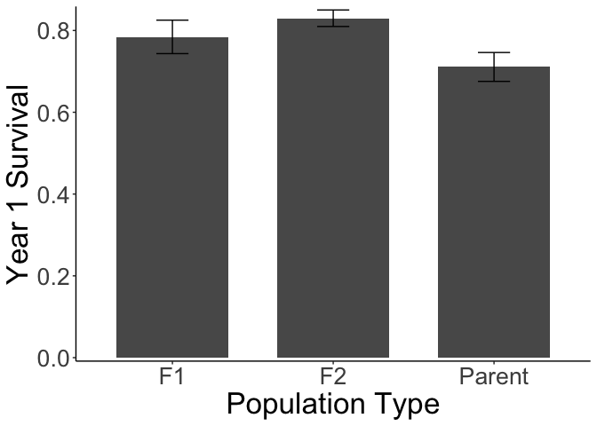
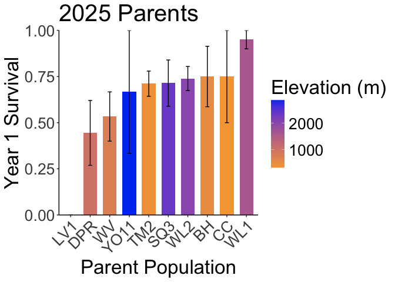
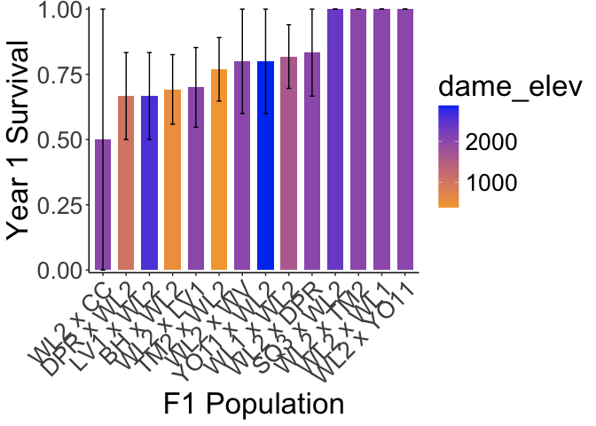
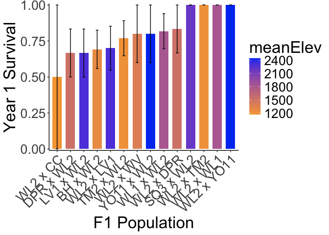
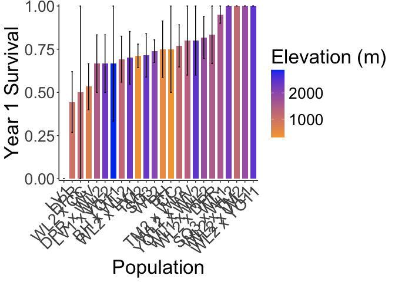
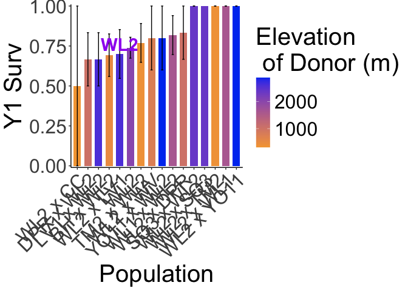
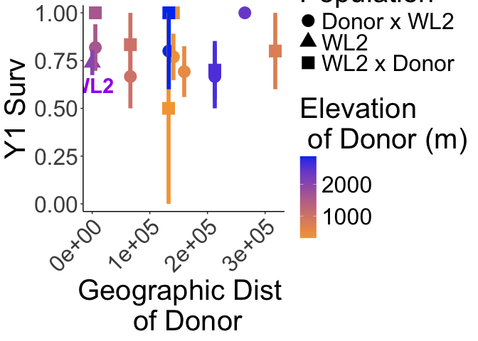
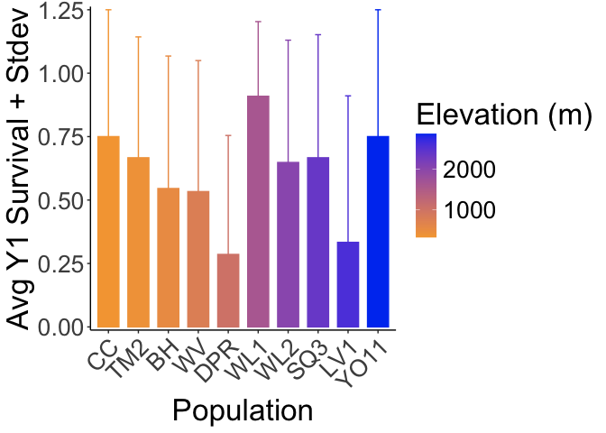
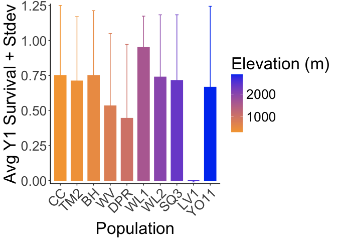

# Survival of plants planted in 2025

## Libraries

``` r
library(tidyverse)
```

```
## ── Attaching core tidyverse packages ──────────────────────── tidyverse 2.0.0 ──
## ✔ dplyr     1.1.4     ✔ readr     2.1.5
## ✔ forcats   1.0.0     ✔ stringr   1.5.1
## ✔ ggplot2   3.5.1     ✔ tibble    3.2.1
## ✔ lubridate 1.9.3     ✔ tidyr     1.3.1
## ✔ purrr     1.0.2     
## ── Conflicts ────────────────────────────────────────── tidyverse_conflicts() ──
## ✖ dplyr::filter() masks stats::filter()
## ✖ dplyr::lag()    masks stats::lag()
## ℹ Use the conflicted package (<http://conflicted.r-lib.org/>) to force all conflicts to become errors
```

``` r
library(geosphere) #for calculating geographic distance

sem <- function(x, na.rm=FALSE) {           #for calculating standard error
  sd(x,na.rm=na.rm)/sqrt(length(na.omit(x)))
} 
```

## Load data

## Mort/pheno

``` r
mort_pheno_2025 <- read_csv("../input/WL2_2025_Data/CorrectedCSVs/WL2_mort_pheno_20250929_corrected.csv")
```

```
## New names:
## Rows: 972 Columns: 13
## ── Column specification
## ──────────────────────────────────────────────────────── Delimiter: "," chr
## (12): bed, col, Unique.ID, bud.date, flower.date, fruit.date, last.FL.da... dbl
## (1): row
## ℹ Use `spec()` to retrieve the full column specification for this data. ℹ
## Specify the column types or set `show_col_types = FALSE` to quiet this message.
## • `` -> `...13`
```

``` r
mort_pheno_2025 %>% filter(!is.na(Unique.ID), Unique.ID!="buffer") %>% filter(is.na(as.numeric(Unique.ID))) #only non-numeric ID is yose plant from 2023
```

```
## Warning: There was 1 warning in `filter()`.
## ℹ In argument: `is.na(as.numeric(Unique.ID))`.
## Caused by warning:
## ! NAs introduced by coercion
```

```
## # A tibble: 1 × 13
##   bed     row col   Unique.ID bud.date flower.date fruit.date last.FL.date
##   <chr> <dbl> <chr> <chr>     <chr>    <chr>       <chr>      <chr>       
## 1 G         5 D     YO7_5_7   6/27/25  7/3/25      7/18/25    7/25/25     
## # ℹ 5 more variables: last.FR.date <chr>, death.date <chr>,
## #   round2.rep.dates <chr>, survey.notes <chr>, ...13 <chr>
```

## Pop Info 

``` r
pop_info_2025 <- read_csv("../input/WL2_2025_Data/2025_Pop_Loc_Info Updated.csv") %>% 
  select(status:Unique.ID)
```

```
## Rows: 976 Columns: 16
## ── Column specification ────────────────────────────────────────────────────────
## Delimiter: ","
## chr (10): status, block, bed, col, pop.id, mf, dame_mf, sire_mf, Unique.ID, ...
## dbl  (6): bed.block.order, bed.order, AB.CD.order, column.order, row, rep
## 
## ℹ Use `spec()` to retrieve the full column specification for this data.
## ℹ Specify the column types or set `show_col_types = FALSE` to quiet this message.
```

## Merge

``` r
mort_pheno_2025_pops <- mort_pheno_2025 %>% 
  select(bed:Unique.ID, bud.date, death.date, survey.notes) %>% 
  left_join(pop_info_2025) %>% 
  filter(Unique.ID!="buffer", !is.na(Unique.ID))
```

```
## Joining with `by = join_by(bed, row, col, Unique.ID)`
```

## Elevation Info

``` r
elev_info <- read_csv("../input/Strep_tort_locs.csv")
```

```
## Rows: 54 Columns: 7
## ── Column specification ────────────────────────────────────────────────────────
## Delimiter: ","
## chr (6): Species epithet, Species Code, Site, Site code, Lat, Long
## dbl (1): Elevation (m)
## 
## ℹ Use `spec()` to retrieve the full column specification for this data.
## ℹ Specify the column types or set `show_col_types = FALSE` to quiet this message.
```

``` r
elev_info_yo <- elev_info %>% 
  mutate(pop = str_replace(`Site code`, "YOSE(\\d+)", "YO\\1")) %>% 
  select(Lat, Long, elev_m=`Elevation (m)`, pop) %>% 
  rename(pop.id=pop) %>% 
  mutate(Lat=as.numeric(Lat), Long=as.numeric(Long),
         WL2_Lat=38.82599, WL2_Long=-120.2509) %>% 
  mutate(Geographic_Dist=distHaversine(cbind(WL2_Long, WL2_Lat), cbind(Long, Lat))) %>% 
  select(-WL2_Lat, -WL2_Long)
```

```
## Warning: There were 2 warnings in `mutate()`.
## The first warning was:
## ℹ In argument: `Lat = as.numeric(Lat)`.
## Caused by warning:
## ! NAs introduced by coercion
## ℹ Run `dplyr::last_dplyr_warnings()` to see the 1 remaining warning.
```

``` r
head(elev_info_yo)
```

```
## # A tibble: 6 × 5
##     Lat  Long elev_m pop.id Geographic_Dist
##   <dbl> <dbl>  <dbl> <chr>            <dbl>
## 1  37.4 -120.   511. BH             159626.
## 2  39.6 -121.   283. BB             130228.
## 3  39.6 -121.   313  CC             132498.
## 4  38.6 -120.  2422. CP1             22937.
## 5  38.7 -120.  2244. CP2             21060.
## 6  38.7 -120.  2266. CP3             19415.
```

``` r
unique(elev_info_yo$pop.id)
```

```
##  [1] "BH"    "BB"    "CC"    "CP1"   "CP2"   "CP3"   "DP"    "DPR"   "FR"   
## [10] NA      "HH"    "IH"    "KC1"   "KC2"   "KC3"   "LV1"   "LV2"   "LV3"  
## [19] "LVTR1" "LVTR2" "LVTR3" "SQ1"   "SQ2"   "SQ3"   "SHA"   "SC"    "TM1"  
## [28] "TM2"   "WR"    "WV"    "WL1"   "WL2"   "WL3"   "WL4"   "YO1"   "YO10" 
## [37] "YO11"  "YO12"  "YO13"  "YO2"   "YO3"   "YO4"   "YO5"   "YO6"   "YO7"  
## [46] "YO8"   "YO9"
```

## 2025 Plants Only

``` r
y1surv_2025plants <- mort_pheno_2025_pops %>% 
  filter(status=="available") %>% #only keep plants planted in 2025
  mutate(Pop.Type=if_else(str_detect(pop.id, "\\) x"), "F2",
                          if_else(str_detect(pop.id, "x"), "F1",
                                  "Parent"
                          ))) %>% 
  mutate(deadatplanting = if_else(is.na(survey.notes), NA,
                                  if_else(survey.notes=="dead pre-planting" | 
                                            survey.notes=="dead at planting",
                                          "Yes", NA))) %>% 
  filter(is.na(deadatplanting)) %>% #remove plants that were dead at planting 
  select(-status, -deadatplanting, -survey.notes) %>% #remove unnecessary cols 
  mutate(death.date=mdy(death.date)) %>% #convert to date format 
  mutate(Establishment = if_else(is.na(death.date) | !is.na(bud.date), 1, 
                                 if_else(death.date < "2025-06-21", 0, 1)), #establishment = first 3 weeks post-transplant 
         Y1Surv = if_else(Establishment==0, NA, #can't survive year 1 if you didn't establish 
                          if_else(!is.na(bud.date), 1, #if you reproduced you survived 
                      if_else(is.na(death.date), 1, 0)))) 
  

xtabs(~Pop.Type, data=y1surv_2025plants)
```

```
## Pop.Type
##     F1     F2 Parent 
##    112    376    187
```

``` r
xtabs(~Pop.Type+Y1Surv, data=y1surv_2025plants)
```

```
##         Y1Surv
## Pop.Type   0   1
##   F1      22  80
##   F2      59 288
##   Parent  48 118
```

``` r
#80/112 F1 survived
#288/379 F2s survived
#118/193 Parents survived 

#y1surv_2025plants %>% filter(Pop.Type=="F1") %>% distinct(pop.id) #15 F1 types 
y1surv_2025plants %>% filter(!is.na(bud.date)) %>% filter(!is.na(death.date)) #7 plants reproduced and died in 2025
```

```
## # A tibble: 7 × 15
##   bed     row col   Unique.ID bud.date death.date block pop.id     mf    dame_mf
##   <chr> <dbl> <chr> <chr>     <chr>    <date>     <chr> <chr>      <chr> <chr>  
## 1 C        29 D     2269      6/27/25  2025-08-14 B     (WL2 x TM… 2_1-3 2      
## 2 D        46 B     2238      6/27/25  2025-07-25 F     (WL2 x TM… 2-3_… 3-Feb  
## 3 D        31 D     2647      6/17/25  2025-06-27 F     (WL2 x TM… 2_1-3 2      
## 4 E        26 A     1713      7/10/25  2025-09-04 I     TM2        1     1      
## 5 E        28 C     2637      6/27/25  2025-09-24 I     TM2        9     9      
## 6 E        51 C     1715      6/17/25  2025-09-04 J     TM2        2     2      
## 7 F        11 A     2288      17-Jun   2025-09-24 J     (WL2 x TM… 2_1-3 2      
## # ℹ 5 more variables: sire_mf <chr>, rep <dbl>, Pop.Type <chr>,
## #   Establishment <dbl>, Y1Surv <dbl>
```

## Plot by pop type 

``` r
y1surv_2025plants %>% 
  group_by(Pop.Type) %>% 
  summarise(meanSurv=mean(Y1Surv, na.rm=TRUE), semSurv=sem(Y1Surv, na.rm=TRUE)) %>% 
  ggplot(aes(x=Pop.Type, y=meanSurv)) +
  geom_col(width = 0.7,position = position_dodge(0.75)) + 
  geom_errorbar(aes(ymin=meanSurv-semSurv,ymax=meanSurv+semSurv),width=.2, position = 
                  position_dodge(0.75)) +
  theme_classic() + 
  scale_y_continuous(expand = c(0.01, 0.00)) +
  labs(y="Year 1 Survival", x="Population Type") +
  theme(text=element_text(size=25))
```

<!-- -->

``` r
ggsave("../output/WL2_Traits/WL2_Y1Surv_2025Plants_PopType.png", width = 10, height = 8, units = "in")
```

## Means by pop

``` r
by_pop_Surv <- y1surv_2025plants %>% 
  group_by(pop.id, Pop.Type) %>% 
  summarise(N_Surv = sum(!is.na(Y1Surv)), mean_Surv = mean(Y1Surv,na.rm=(TRUE)), 
            sem_Surv=sem(Y1Surv, na.rm=(TRUE)))
```

```
## `summarise()` has grouped output by 'pop.id'. You can override using the
## `.groups` argument.
```

## Plot by pops 

### Parents

``` r
by_pop_parents_Surv <- by_pop_Surv %>% 
  filter(Pop.Type == "Parent") %>% 
  left_join(elev_info_yo)
```

```
## Joining with `by = join_by(pop.id)`
```

``` r
head(by_pop_parents_Surv)
```

```
## # A tibble: 6 × 9
## # Groups:   pop.id [6]
##   pop.id Pop.Type N_Surv mean_Surv sem_Surv   Lat  Long elev_m Geographic_Dist
##   <chr>  <chr>     <int>     <dbl>    <dbl> <dbl> <dbl>  <dbl>           <dbl>
## 1 BH     Parent        8     0.75    0.164   37.4 -120.   511.         159626.
## 2 CC     Parent        4     0.75    0.25    39.6 -121.   313          132498.
## 3 DPR    Parent        9     0.444   0.176   39.2 -121.  1019.          66246.
## 4 LV1    Parent        2     0       0       40.5 -122.  2593.         212682.
## 5 SQ3    Parent       14     0.714   0.125   36.7 -119.  2373.         264780.
## 6 TM2    Parent       45     0.711   0.0683  39.6 -122.   379.         140893.
```

``` r
by_pop_parents_Surv %>% 
  filter(N_Surv>1) %>% 
  ggplot(aes(x=fct_reorder(pop.id, mean_Surv), y=mean_Surv, fill=elev_m)) + 
  geom_col(width = 0.7,position = position_dodge(0.75)) +
  geom_errorbar(aes(ymin=mean_Surv-sem_Surv,ymax=mean_Surv+sem_Surv),width=.2, position = 
                  position_dodge(0.75)) +
  labs(x="Parent Population", y="Year 1 Survival", fill="Elevation (m)", title="2025 Parents") +
  theme_classic() + 
  scale_y_continuous(expand = c(0, 0)) +
  scale_fill_gradient(low = "#F5A540", high = "#0043F0") +
  theme(text=element_text(size=25), axis.text.x = element_text(angle = 45, hjust = 1))
```

<!-- -->

``` r
ggsave("../output/WL2_Traits/WL2_Y1Surv_2025Plants_Parents.png", width = 14, height = 8, units = "in")
```

### F1s

``` r
by_pop_Surv_F1 <- by_pop_Surv %>% 
  filter(Pop.Type == "F1") %>% 
  separate(pop.id, c("dame_pop",NA, "sire_pop"), remove = FALSE) %>% 
  left_join(elev_info_yo, by=join_by(dame_pop==pop.id)) %>% 
  rename(dame_elev=elev_m, dame_Lat=Lat, dame_Long=Long) %>% 
  left_join(elev_info_yo, by=join_by(sire_pop==pop.id)) %>% 
  rename(sire_elev=elev_m, sire_Lat=Lat, sire_Long=Long) %>% 
  mutate(meanElev=(dame_elev+sire_elev)/2)
head(by_pop_Surv_F1)
```

```
## # A tibble: 6 × 16
## # Groups:   pop.id [6]
##   pop.id dame_pop sire_pop Pop.Type N_Surv mean_Surv sem_Surv dame_Lat dame_Long
##   <chr>  <chr>    <chr>    <chr>     <int>     <dbl>    <dbl>    <dbl>     <dbl>
## 1 BH x … BH       WL2      F1           13     0.692    0.133     37.4     -120.
## 2 DPR x… DPR      WL2      F1            9     0.667    0.167     39.2     -121.
## 3 LV1 x… LV1      WL2      F1            9     0.667    0.167     40.5     -122.
## 4 SQ3 x… SQ3      WL2      F1            5     1        0         36.7     -119.
## 5 TM2 x… TM2      WL2      F1           13     0.769    0.122     39.6     -122.
## 6 WL1 x… WL1      WL2      F1           11     0.818    0.122     38.8     -120.
## # ℹ 7 more variables: dame_elev <dbl>, Geographic_Dist.x <dbl>, sire_Lat <dbl>,
## #   sire_Long <dbl>, sire_elev <dbl>, Geographic_Dist.y <dbl>, meanElev <dbl>
```

``` r
by_pop_Surv_F1 %>% 
  filter(N_Surv>1) %>% 
  ggplot(aes(x=fct_reorder(pop.id, mean_Surv), y=mean_Surv, fill=dame_elev)) + 
  geom_col(width = 0.7,position = position_dodge(0.75)) + 
  geom_errorbar(aes(ymin=mean_Surv-sem_Surv,ymax=mean_Surv+sem_Surv),width=.2, position = 
                  position_dodge(0.75)) +
  theme_classic() + 
  scale_fill_gradient(low = "#F5A540", high = "#0043F0") +
  scale_y_continuous(expand = c(0.01, 0)) +
  labs(x="F1 Population", y="Year 1 Survival") +
  theme(text=element_text(size=25), axis.text.x = element_text(angle = 45, hjust = 1))
```

<!-- -->

``` r
by_pop_Surv_F1 %>% 
  filter(N_Surv>1) %>% 
  ggplot(aes(x=fct_reorder(pop.id, mean_Surv), y=mean_Surv, fill=meanElev)) + 
  geom_col(width = 0.7,position = position_dodge(0.75)) + 
  geom_errorbar(aes(ymin=mean_Surv-sem_Surv,ymax=mean_Surv+sem_Surv),width=.2, position = 
                  position_dodge(0.75)) +
  theme_classic() + 
  scale_fill_gradient(low = "#F5A540", high = "#0043F0") +
  scale_y_continuous(expand = c(0.01, 0)) +
  labs(x="F1 Population", y="Year 1 Survival") +
  theme(text=element_text(size=25), axis.text.x = element_text(angle = 45, hjust = 1))
```

<!-- -->

``` r
ggsave("../output/WL2_Traits/WL2_Y1Surv_2025Plants_F1s.png", width = 14, height = 8, units = "in")
```

### F1s + Parents

``` r
parents_F1s_combined <- by_pop_parents_Surv %>% 
  rename(meanElev=elev_m) %>% 
  bind_rows(by_pop_Surv_F1)

parents_F1s_combined %>%  
  filter(N_Surv>1) %>% 
  ggplot(aes(x=fct_reorder(pop.id, mean_Surv), y=mean_Surv, fill=meanElev)) + 
  geom_col(width = 0.7,position = position_dodge(0.75)) + 
  geom_errorbar(aes(ymin=mean_Surv-sem_Surv,ymax=mean_Surv+sem_Surv),width=.2, position = 
                  position_dodge(0.75)) +
  theme_classic() + 
  scale_fill_gradient(low = "#F5A540", high = "#0043F0") +
  scale_y_continuous(expand = c(0.01, 0)) +
  labs(x="Population", y="Year 1 Survival", fill="Elevation (m)") +
  theme(text=element_text(size=25), axis.text.x = element_text(angle = 45, hjust = 1))
```

<!-- -->

``` r
ggsave("../output/WL2_Traits/WL2_Y1Surv_2025Plants_F1s_Parents.png", width = 14, height = 8, units = "in")
```

## Fitness Relative to WL2 parent

``` r
WL2_crosses_2025 <- by_pop_Surv %>% 
  filter(Pop.Type!="F2") %>% #remove F2s for now
  filter(str_detect(pop.id, "WL2")) %>% #keep only F1s with WL2 involved 
  separate(pop.id, c("dame_pop",NA, "sire_pop"), remove = FALSE) %>%  #define pops for F1s
  mutate(sire_pop=if_else(pop.id=="WL2", "WL2", sire_pop)) %>% #to help with merges
  left_join(elev_info_yo, by=join_by(dame_pop==pop.id)) %>% 
  rename(dame_elev=elev_m, dame_Lat=Lat, dame_Long=Long, dame_GeoDist=Geographic_Dist) %>% 
  left_join(elev_info_yo, by=join_by(sire_pop==pop.id)) %>% 
  rename(sire_elev=elev_m, sire_Lat=Lat, sire_Long=Long, sire_GeoDist=Geographic_Dist) %>% 
  mutate(other_Parent_elev=if_else(dame_pop=="WL2", sire_elev, dame_elev),
         other_Parent_GeoDist=if_else(dame_pop=="WL2", sire_GeoDist, dame_GeoDist)) %>% 
  mutate(sire_pop=if_else(pop.id=="WL2", NA, sire_pop)) %>% #change sire back to NA for WL2
  mutate(Pop.Type=if_else(pop.id=="WL2", "WL2",
                          if_else(sire_pop=="WL2", "Donor x WL2",
                                  "WL2 x Donor")))
```

```
## Warning: Expected 3 pieces. Missing pieces filled with `NA` in 1 rows [7].
```

``` r
WL2_crosses_2025
```

```
## # A tibble: 16 × 17
## # Groups:   pop.id [16]
##    pop.id     dame_pop sire_pop Pop.Type    N_Surv mean_Surv sem_Surv dame_Lat
##    <chr>      <chr>    <chr>    <chr>        <int>     <dbl>    <dbl>    <dbl>
##  1 BH x WL2   BH       WL2      Donor x WL2     13     0.692   0.133      37.4
##  2 DPR x WL2  DPR      WL2      Donor x WL2      9     0.667   0.167      39.2
##  3 LV1 x WL2  LV1      WL2      Donor x WL2      9     0.667   0.167      40.5
##  4 SQ3 x WL2  SQ3      WL2      Donor x WL2      5     1       0          36.7
##  5 TM2 x WL2  TM2      WL2      Donor x WL2     13     0.769   0.122      39.6
##  6 WL1 x WL2  WL1      WL2      Donor x WL2     11     0.818   0.122      38.8
##  7 WL2        WL2      <NA>     WL2             46     0.739   0.0655     38.8
##  8 WL2 x CC   WL2      CC       WL2 x Donor      2     0.5     0.5        38.8
##  9 WL2 x DPR  WL2      DPR      WL2 x Donor      6     0.833   0.167      38.8
## 10 WL2 x LV1  WL2      LV1      WL2 x Donor     10     0.7     0.153      38.8
## 11 WL2 x SQ3  WL2      SQ3      WL2 x Donor      1     1      NA          38.8
## 12 WL2 x TM2  WL2      TM2      WL2 x Donor      2     1       0          38.8
## 13 WL2 x WL1  WL2      WL1      WL2 x Donor      2     1       0          38.8
## 14 WL2 x WV   WL2      WV       WL2 x Donor      5     0.8     0.2        38.8
## 15 WL2 x YO11 WL2      YO11     WL2 x Donor      9     1       0          38.8
## 16 YO11 x WL2 YO11     WL2      Donor x WL2      5     0.8     0.2        37.9
## # ℹ 9 more variables: dame_Long <dbl>, dame_elev <dbl>, dame_GeoDist <dbl>,
## #   sire_Lat <dbl>, sire_Long <dbl>, sire_elev <dbl>, sire_GeoDist <dbl>,
## #   other_Parent_elev <dbl>, other_Parent_GeoDist <dbl>
```


``` r
WL2_crosses_2025 %>% 
  ggplot(aes(x=fct_reorder(pop.id, mean_Surv), y=mean_Surv, fill=other_Parent_elev)) + 
  geom_col(width = 0.7,position = position_dodge(0.75)) + 
  geom_errorbar(aes(ymin=mean_Surv-sem_Surv,ymax=mean_Surv+sem_Surv),width=.2, position = 
                  position_dodge(0.75)) +
  theme_classic() + 
  scale_fill_gradient(low = "#F5A540", high = "#0043F0") +
  annotate("text", x = 5, y= 0.76, label = "WL2", 
           colour = "purple", fontface="bold", size = 22 / .pt) +
  scale_y_continuous(expand = c(0.01, 0)) +
  labs(x="Population", y="Y1 Surv", fill="Elevation \n of Donor (m)") +
  theme(text=element_text(size=30), axis.text.x = element_text(angle = 45, hjust = 1)) 
```

<!-- -->

``` r
ggsave("../output/WL2_Traits/WL2_2025Plants_Y1Surv_F1sWL2.png", width = 12, height = 6, units = "in")
```


``` r
WL2_crosses_2025 %>% 
  filter(N_Surv>1) %>% 
  ggplot(aes(x=other_Parent_GeoDist, y=mean_Surv,
             group = pop.id, colour=other_Parent_elev)) + 
  geom_point(size=6, aes(shape=Pop.Type)) +
  geom_errorbar(aes(ymin=mean_Surv-sem_Surv,ymax=mean_Surv+sem_Surv),
                 width=0, linewidth = 2) +
  theme_classic() + 
  scale_colour_gradient(low = "#F5A540", high = "#0043F0") +
  annotate("text", x = 136.2622, y= 0.62, label = "WL2", 
           colour = "purple", fontface="bold", size = 22 / .pt) +
  scale_y_continuous(expand = c(0.01, 0.03)) +
  labs(x="Geographic Dist \n of Donor", y="Y1 Surv", 
       color="Elevation \n of Donor (m)", shape="Population") +
  theme(text=element_text(size=30), axis.text.x = element_text(angle = 45, hjust = 1)) 
```

<!-- -->

``` r
ggsave("../output/WL2_Traits/WL2_2025Plants_Y1Surv_F1sWL2_GeoDist.png", width = 12, height = 6, units = "in")

WL2_crosses_2025 %>% arrange(other_Parent_GeoDist)
```

```
## # A tibble: 16 × 17
## # Groups:   pop.id [16]
##    pop.id     dame_pop sire_pop Pop.Type    N_Surv mean_Surv sem_Surv dame_Lat
##    <chr>      <chr>    <chr>    <chr>        <int>     <dbl>    <dbl>    <dbl>
##  1 WL2        WL2      <NA>     WL2             46     0.739   0.0655     38.8
##  2 WL1 x WL2  WL1      WL2      Donor x WL2     11     0.818   0.122      38.8
##  3 WL2 x WL1  WL2      WL1      WL2 x Donor      2     1       0          38.8
##  4 DPR x WL2  DPR      WL2      Donor x WL2      9     0.667   0.167      39.2
##  5 WL2 x DPR  WL2      DPR      WL2 x Donor      6     0.833   0.167      38.8
##  6 WL2 x CC   WL2      CC       WL2 x Donor      2     0.5     0.5        38.8
##  7 WL2 x YO11 WL2      YO11     WL2 x Donor      9     1       0          38.8
##  8 YO11 x WL2 YO11     WL2      Donor x WL2      5     0.8     0.2        37.9
##  9 TM2 x WL2  TM2      WL2      Donor x WL2     13     0.769   0.122      39.6
## 10 WL2 x TM2  WL2      TM2      WL2 x Donor      2     1       0          38.8
## 11 BH x WL2   BH       WL2      Donor x WL2     13     0.692   0.133      37.4
## 12 LV1 x WL2  LV1      WL2      Donor x WL2      9     0.667   0.167      40.5
## 13 WL2 x LV1  WL2      LV1      WL2 x Donor     10     0.7     0.153      38.8
## 14 SQ3 x WL2  SQ3      WL2      Donor x WL2      5     1       0          36.7
## 15 WL2 x SQ3  WL2      SQ3      WL2 x Donor      1     1      NA          38.8
## 16 WL2 x WV   WL2      WV       WL2 x Donor      5     0.8     0.2        38.8
## # ℹ 9 more variables: dame_Long <dbl>, dame_elev <dbl>, dame_GeoDist <dbl>,
## #   sire_Lat <dbl>, sire_Long <dbl>, sire_elev <dbl>, sire_GeoDist <dbl>,
## #   other_Parent_elev <dbl>, other_Parent_GeoDist <dbl>
```


## Mid Parent 

### Prep

``` r
parent_F1s_surv <- y1surv_2025plants %>% 
  filter(Pop.Type!="F2") %>% #remove F2s
  select(bed:Unique.ID, Pop.Type, pop.id, rep, Y1Surv) %>% 
  separate(pop.id, c("dame_pop",NA, "sire_pop"), remove = FALSE) %>% #define pops for crosses
  mutate(sire_pop=if_else(Pop.Type=="Parent", dame_pop, sire_pop)) %>% 
  #add clim and elev info for dames and sires:
  left_join(elev_info_yo, by=join_by(dame_pop==pop.id)) %>% 
  rename(dame_elev=elev_m, dame_Lat=Lat, dame_Long=Long) %>% 
  left_join(elev_info_yo, by=join_by(sire_pop==pop.id)) %>% 
  rename(sire_elev=elev_m, sire_Lat=Lat, sire_Long=Long) %>% 
  mutate(meanElev=(dame_elev+sire_elev)/2) #means for parents are just the parent's actual value since I set that pop as dame and sire 
```

```
## Warning: Expected 3 pieces. Missing pieces filled with `NA` in 187 rows [1, 2, 3, 4, 7,
## 8, 9, 10, 13, 14, 15, 16, 18, 21, 22, 24, 25, 27, 28, 30, ...].
```

``` r
parent_F1s_surv_summary <- parent_F1s_surv %>% 
  group_by(Pop.Type, pop.id, dame_pop, sire_pop, 
           dame_elev, meanElev) %>% 
  summarise(n=n(), 
            mean_Y1Surv=mean(Y1Surv, na.rm=TRUE), 
            stdev_Y1Surv=sd(Y1Surv, na.rm=TRUE)) 
```

```
## `summarise()` has grouped output by 'Pop.Type', 'pop.id', 'dame_pop',
## 'sire_pop', 'dame_elev'. You can override using the `.groups` argument.
```

``` r
parent_F1s_surv_summary
```

```
## # A tibble: 25 × 9
## # Groups:   Pop.Type, pop.id, dame_pop, sire_pop, dame_elev [25]
##    Pop.Type pop.id    dame_pop sire_pop dame_elev meanElev     n mean_Y1Surv
##    <chr>    <chr>     <chr>    <chr>        <dbl>    <dbl> <int>       <dbl>
##  1 F1       BH x WL2  BH       WL2           511.    1266.    14       0.692
##  2 F1       DPR x WL2 DPR      WL2          1019.    1519.    10       0.667
##  3 F1       LV1 x WL2 LV1      WL2          2593.    2307.     9       0.667
##  4 F1       SQ3 x WL2 SQ3      WL2          2373.    2197.     7       1    
##  5 F1       TM2 x WL2 TM2      WL2           379.    1200.    14       0.769
##  6 F1       WL1 x WL2 WL1      WL2          1614.    1817.    13       0.818
##  7 F1       WL2 x CC  WL2      CC           2020.    1167.     2       0.5  
##  8 F1       WL2 x DPR WL2      DPR          2020.    1519.     7       0.833
##  9 F1       WL2 x LV1 WL2      LV1          2020.    2307.    11       0.7  
## 10 F1       WL2 x SQ3 WL2      SQ3          2020.    2197.     1       1    
## # ℹ 15 more rows
## # ℹ 1 more variable: stdev_Y1Surv <dbl>
```

### Calculating mid-parent values

``` r
F1_info <- parent_F1s_surv_summary %>% ungroup() %>% filter(Pop.Type=="F1") %>% select(pop.id, meanElev)

parent_prep_y1surv <- parent_F1s_surv_summary %>% 
  filter(Pop.Type=="Parent") %>% 
  ungroup() %>% 
  select(pop.id, mean_Y1Surv:stdev_Y1Surv) %>% 
  pivot_wider(names_from = pop.id, 
              values_from = c(mean_Y1Surv, stdev_Y1Surv)) %>% 
  mutate("BH x WL2-mean_Y1Surv"=(mean_Y1Surv_BH+mean_Y1Surv_WL2)/2, 
         "DPR x WL2-mean_Y1Surv"=(mean_Y1Surv_DPR+mean_Y1Surv_WL2)/2,
         "LV1 x WL2-mean_Y1Surv"=(mean_Y1Surv_LV1+mean_Y1Surv_WL2)/2, 
         "SQ3 x WL2-mean_Y1Surv"=(mean_Y1Surv_SQ3+mean_Y1Surv_WL2)/2,
         "TM2 x WL2-mean_Y1Surv"=(mean_Y1Surv_TM2+mean_Y1Surv_WL2)/2, 
         "WL1 x WL2-mean_Y1Surv"=(mean_Y1Surv_WL1+mean_Y1Surv_WL2)/2,
         "WL2 x CC-mean_Y1Surv"=(mean_Y1Surv_WL2+mean_Y1Surv_CC)/2, 
         "WL2 x DPR-mean_Y1Surv"=(mean_Y1Surv_WL2+mean_Y1Surv_DPR)/2,
         "WL2 x LV1-mean_Y1Surv"=(mean_Y1Surv_WL2+mean_Y1Surv_LV1)/2, 
         "WL2 x SQ3-mean_Y1Surv"=(mean_Y1Surv_WL2+mean_Y1Surv_SQ3)/2,
         "WL2 x TM2-mean_Y1Surv"=(mean_Y1Surv_WL2+mean_Y1Surv_TM2)/2, 
         "WL2 x WL1-mean_Y1Surv"=(mean_Y1Surv_WL2+mean_Y1Surv_WL1)/2,
         "WL2 x WV-mean_Y1Surv"=(mean_Y1Surv_WL2+mean_Y1Surv_WV)/2,
         "WL2 x YO11-mean_Y1Surv"=(mean_Y1Surv_WL2+mean_Y1Surv_YO11)/2,
         "YO11 x WL2-mean_Y1Surv"=(mean_Y1Surv_YO11+mean_Y1Surv_WL2)/2) %>% 
  mutate("BH x WL2-stdev_Y1Surv"=(stdev_Y1Surv_BH+stdev_Y1Surv_WL2)/2, 
         "DPR x WL2-stdev_Y1Surv"=(stdev_Y1Surv_DPR+stdev_Y1Surv_WL2)/2,
         "LV1 x WL2-stdev_Y1Surv"=(stdev_Y1Surv_LV1+stdev_Y1Surv_WL2)/2, 
         "SQ3 x WL2-stdev_Y1Surv"=(stdev_Y1Surv_SQ3+stdev_Y1Surv_WL2)/2,
         "TM2 x WL2-stdev_Y1Surv"=(stdev_Y1Surv_TM2+stdev_Y1Surv_WL2)/2, 
         "WL1 x WL2-stdev_Y1Surv"=(stdev_Y1Surv_WL1+stdev_Y1Surv_WL2)/2,
         "WL2 x CC-stdev_Y1Surv"=(stdev_Y1Surv_WL2+stdev_Y1Surv_CC)/2, 
         "WL2 x DPR-stdev_Y1Surv"=(stdev_Y1Surv_WL2+stdev_Y1Surv_DPR)/2,
         "WL2 x LV1-stdev_Y1Surv"=(stdev_Y1Surv_WL2+stdev_Y1Surv_LV1)/2, 
         "WL2 x SQ3-stdev_Y1Surv"=(stdev_Y1Surv_WL2+stdev_Y1Surv_SQ3)/2,
         "WL2 x TM2-stdev_Y1Surv"=(stdev_Y1Surv_WL2+stdev_Y1Surv_TM2)/2, 
         "WL2 x WL1-stdev_Y1Surv"=(stdev_Y1Surv_WL2+stdev_Y1Surv_WL1)/2,
         "WL2 x WV-stdev_Y1Surv"=(stdev_Y1Surv_WL2+stdev_Y1Surv_WV)/2,
         "WL2 x YO11-stdev_Y1Surv"=(stdev_Y1Surv_WL2+stdev_Y1Surv_YO11)/2,
         "YO11 x WL2-stdev_Y1Surv"=(stdev_Y1Surv_YO11+stdev_Y1Surv_WL2)/2) %>% 
  select(`BH x WL2-mean_Y1Surv`:`YO11 x WL2-stdev_Y1Surv`) %>% 
  pivot_longer(cols = everything(), names_to = c("pop.id", "measurement"), names_sep = "-", values_to = "value") %>%
  pivot_wider(names_from = measurement, values_from = value) %>% 
  left_join(F1_info) %>% 
  mutate(pop.id = paste0(pop.id, "_midParent"), Pop.Type="midParent")
```

```
## Joining with `by = join_by(pop.id)`
```

``` r
mid_parent_F1s_y1surv <- parent_F1s_surv_summary %>% 
   filter(Pop.Type=="F1") %>% 
  bind_rows(parent_prep_y1surv) %>% 
  mutate(elevation.group=if_else(meanElev>2000, "All High", "Mixed"))
mid_parent_F1s_y1surv
```

```
## # A tibble: 30 × 10
## # Groups:   Pop.Type, pop.id, dame_pop, sire_pop, dame_elev [30]
##    Pop.Type pop.id    dame_pop sire_pop dame_elev meanElev     n mean_Y1Surv
##    <chr>    <chr>     <chr>    <chr>        <dbl>    <dbl> <int>       <dbl>
##  1 F1       BH x WL2  BH       WL2           511.    1266.    14       0.692
##  2 F1       DPR x WL2 DPR      WL2          1019.    1519.    10       0.667
##  3 F1       LV1 x WL2 LV1      WL2          2593.    2307.     9       0.667
##  4 F1       SQ3 x WL2 SQ3      WL2          2373.    2197.     7       1    
##  5 F1       TM2 x WL2 TM2      WL2           379.    1200.    14       0.769
##  6 F1       WL1 x WL2 WL1      WL2          1614.    1817.    13       0.818
##  7 F1       WL2 x CC  WL2      CC           2020.    1167.     2       0.5  
##  8 F1       WL2 x DPR WL2      DPR          2020.    1519.     7       0.833
##  9 F1       WL2 x LV1 WL2      LV1          2020.    2307.    11       0.7  
## 10 F1       WL2 x SQ3 WL2      SQ3          2020.    2197.     1       1    
## # ℹ 20 more rows
## # ℹ 2 more variables: stdev_Y1Surv <dbl>, elevation.group <chr>
```

### Figures

``` r
mid_parent_F1s_y1surv %>% 
  ggplot(aes(x=pop.id, y=mean_Y1Surv, fill=meanElev, colour=meanElev)) +
  geom_errorbar(aes(ymin=mean_Y1Surv-0.01,ymax=mean_Y1Surv+stdev_Y1Surv),width=.2, position = 
                  position_dodge(0.75)) +
  geom_col(width = 0.7,position = position_dodge(0.75)) + 
  theme_classic() + 
  scale_y_continuous(expand = c(0.01, 0)) +
  scale_fill_gradient(low = "#b46ca4", high = "#0043F0") +
  scale_colour_gradient(low = "#b46ca4", high = "#0043F0") +
  theme(text=element_text(size=25),axis.text.x = element_text(angle = 45, hjust = 1)) + 
  labs(y="Avg Y1 Survival + Stdev", x="Population", fill="Avg Elevation (m)", color="Avg Elevation (m)") + 
  facet_wrap(vars(elevation.group), scales="free")
```

<!-- -->

``` r
ggsave("../output/WL2_Traits/WL2_2025Plants_Y1Surv.png", width = 20, height = 8, units = "in")
```


``` r
parent_F1s_surv_summary %>% 
  filter(Pop.Type=="Parent") %>% ggplot(aes(x=fct_reorder(pop.id, meanElev), y=mean_Y1Surv, fill=meanElev, colour=meanElev)) +
  geom_errorbar(aes(ymin=mean_Y1Surv-0.01,ymax=mean_Y1Surv+stdev_Y1Surv),width=.2, position = 
                  position_dodge(0.75)) +
  geom_col(width = 0.7,position = position_dodge(0.75)) + 
  theme_classic() + 
  scale_y_continuous(expand = c(0.01, 0)) +
  scale_fill_gradient(low = "#F5A540", high = "#0043F0") +
  scale_colour_gradient(low = "#F5A540", high = "#0043F0") +
  theme(text=element_text(size=25),axis.text.x = element_text(angle = 45, hjust = 1)) + 
  labs(y="Avg Y1 Survival + Stdev", x="Population", fill="Elevation (m)", color="Elevation (m)")
```

<!-- -->

``` r
ggsave("../output/WL2_Traits/WL2_2025Plants_Y1Surv_Parents.png", width = 14, height = 8, units = "in")
```

