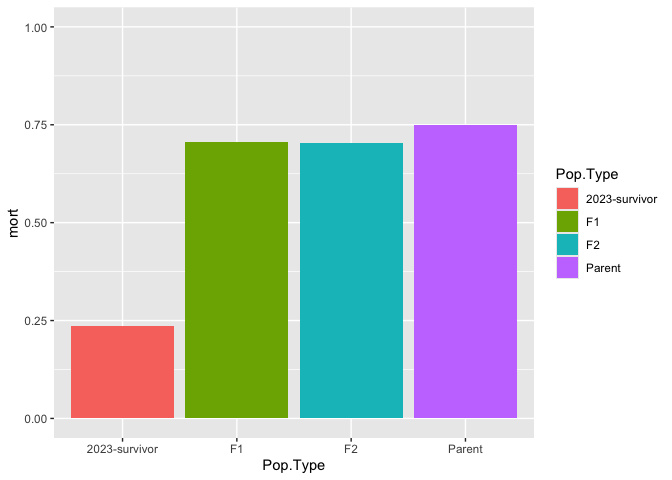
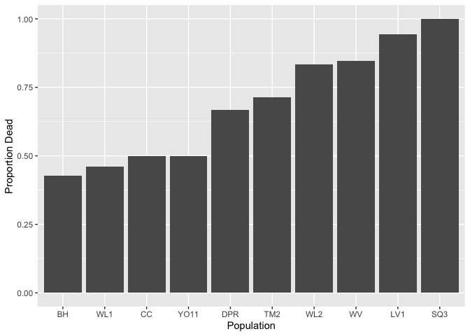
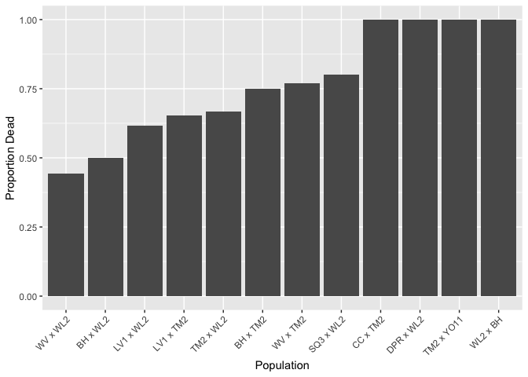
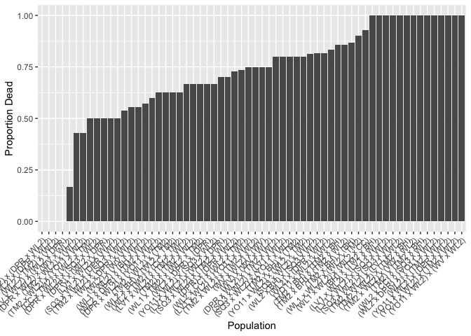
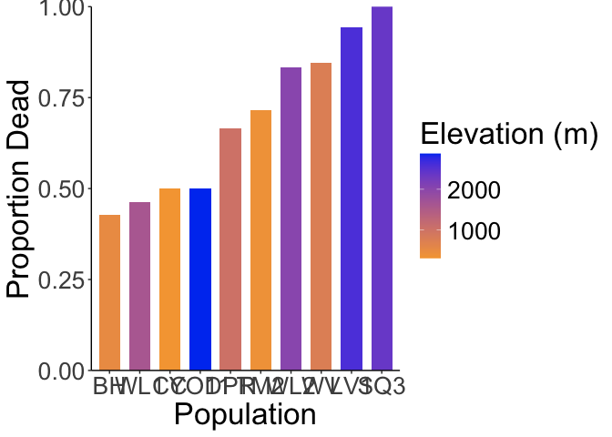

# Mortality at WL2

## Libraries 

```r
library(tidyverse)
```

```
## ── Attaching core tidyverse packages ──────────────────────── tidyverse 2.0.0 ──
## ✔ dplyr     1.1.4     ✔ readr     2.1.5
## ✔ forcats   1.0.0     ✔ stringr   1.5.1
## ✔ ggplot2   3.5.1     ✔ tibble    3.2.1
## ✔ lubridate 1.9.3     ✔ tidyr     1.3.1
## ✔ purrr     1.0.2     
## ── Conflicts ────────────────────────────────────────── tidyverse_conflicts() ──
## ✖ dplyr::filter() masks stats::filter()
## ✖ dplyr::lag()    masks stats::lag()
## ℹ Use the conflicted package (<http://conflicted.r-lib.org/>) to force all conflicts to become errors
```

## Load the libraries

```r
mort_pheno_0716 <- read_csv("../input/WL2_2024_Data/WL2_Mort_Pheno Survey_Order_Fixed_0716.csv") %>% 
  select(status:death.date)
```

```
## Rows: 1217 Columns: 19
## ── Column specification ────────────────────────────────────────────────────────
## Delimiter: ","
## chr (14): status, block, loc, bed, col, pop, unique.ID, bud.date, flower.dat...
## dbl  (5): bed.block.order, bed.order, row, mf, rep
## 
## ℹ Use `spec()` to retrieve the full column specification for this data.
## ℹ Specify the column types or set `show_col_types = FALSE` to quiet this message.
```

```r
head(mort_pheno_0716)
```

```
## # A tibble: 6 × 16
##   status      block loc   bed     row col   pop      mf   rep unique.ID bud.date
##   <chr>       <chr> <chr> <chr> <dbl> <chr> <chr> <dbl> <dbl> <chr>     <chr>   
## 1 2023-TM2-f… <NA>  A_1_A A         1 A     TM2       6    11 TM2_6_11  <NA>    
## 2 2023-survi… <NA>  A_6_B A         6 B     CC        3     3 CC_3_3    <NA>    
## 3 2023-survi… <NA>  A_16… A        16 B     BH        3     3 BH_3_3    <NA>    
## 4 2023-survi… <NA>  A_17… A        17 A     BH        7     3 BH_7_3    6/18/20…
## 5 2023-survi… <NA>  A_18… A        18 A     BH        4     3 BH_4_3    6/18/20…
## 6 2023-survi… <NA>  A_24… A        24 A     WL2       7     9 WL2_7_9   6/18/20…
## # ℹ 5 more variables: flower.date <chr>, fruit.date <chr>, last.FL.date <chr>,
## #   last.FR.date <chr>, death.date <chr>
```

Pop/Loc Info for pop.type

```r
pop_loc <- read_csv("../input/WL2_2024_Data/WL2_Final_2023_2024_Pop_Loc_Info.csv") %>% 
  rename(row=bedrow, col=bedcol)
```

```
## Rows: 1217 Columns: 15
## ── Column specification ────────────────────────────────────────────────────────
## Delimiter: ","
## chr (8): Pop.Type, status, block, loc, bed, bedcol, pop, unique.ID
## dbl (7): bed.block.order, bed.order, AB.CD.order, column.order, bedrow, mf, rep
## 
## ℹ Use `spec()` to retrieve the full column specification for this data.
## ℹ Specify the column types or set `show_col_types = FALSE` to quiet this message.
```

```r
head(pop_loc)
```

```
## # A tibble: 6 × 15
##   bed.block.order bed.order AB.CD.order column.order Pop.Type status block loc  
##             <dbl>     <dbl>       <dbl>        <dbl> <chr>    <chr>  <chr> <chr>
## 1               1         1           1            1 2023-TM… 2023-… <NA>  A_1_A
## 2              22        12           1            1 2023-su… 2023-… <NA>  A_6_B
## 3              62        32           1            1 2023-su… 2023-… <NA>  A_16…
## 4              65        33           1            1 2023-su… 2023-… <NA>  A_17…
## 5              69        35           1            1 2023-su… 2023-… <NA>  A_18…
## 6              93        47           1            1 2023-su… 2023-… <NA>  A_24…
## # ℹ 7 more variables: bed <chr>, row <dbl>, col <chr>, pop <chr>, mf <dbl>,
## #   rep <dbl>, unique.ID <chr>
```

Merge

```r
mort_pheno_0716_pops <- left_join(pop_loc, mort_pheno_0716)
```

```
## Joining with `by = join_by(status, block, loc, bed, row, col, pop, mf, rep,
## unique.ID)`
```

```r
head(mort_pheno_0716_pops)
```

```
## # A tibble: 6 × 21
##   bed.block.order bed.order AB.CD.order column.order Pop.Type status block loc  
##             <dbl>     <dbl>       <dbl>        <dbl> <chr>    <chr>  <chr> <chr>
## 1               1         1           1            1 2023-TM… 2023-… <NA>  A_1_A
## 2              22        12           1            1 2023-su… 2023-… <NA>  A_6_B
## 3              62        32           1            1 2023-su… 2023-… <NA>  A_16…
## 4              65        33           1            1 2023-su… 2023-… <NA>  A_17…
## 5              69        35           1            1 2023-su… 2023-… <NA>  A_18…
## 6              93        47           1            1 2023-su… 2023-… <NA>  A_24…
## # ℹ 13 more variables: bed <chr>, row <dbl>, col <chr>, pop <chr>, mf <dbl>,
## #   rep <dbl>, unique.ID <chr>, bud.date <chr>, flower.date <chr>,
## #   fruit.date <chr>, last.FL.date <chr>, last.FR.date <chr>, death.date <chr>
```

## By pop type 

```r
unique(mort_pheno_0716_pops$Pop.Type)
```

```
## [1] "2023-TM2-fruit" "2023-survivor"  NA               "F2"            
## [5] "Parent"         "F1"
```

```r
by_pop_type <- mort_pheno_0716_pops %>% 
  filter(!is.na(Pop.Type)) %>% 
  group_by(Pop.Type) %>% 
  summarise(Alive=sum(is.na(death.date)), Dead=sum(!is.na(death.date))) %>% 
  mutate(mort = Dead/(Alive+Dead))
by_pop_type
```

```
## # A tibble: 5 × 4
##   Pop.Type       Alive  Dead  mort
##   <chr>          <int> <int> <dbl>
## 1 2023-TM2-fruit    24     0 0    
## 2 2023-survivor    103    32 0.237
## 3 F1                32    77 0.706
## 4 F2               130   308 0.703
## 5 Parent            71   212 0.749
```

```r
by_pop_type %>% 
  filter(Pop.Type != "2023-TM2-fruit") %>% 
  ggplot(aes(x=Pop.Type, y=mort, fill=Pop.Type)) +
  geom_col() +
  ylim(0,1)
```

<!-- -->

## By population

```r
by_pop <- mort_pheno_0716_pops %>% 
  group_by(pop, Pop.Type) %>% 
  summarise(Alive=sum(is.na(death.date)), Dead=sum(!is.na(death.date))) %>% 
  mutate(mort = Dead/(Alive+Dead))
```

```
## `summarise()` has grouped output by 'pop'. You can override using the `.groups`
## argument.
```

```r
by_pop %>% arrange(mort)
```

```
## # A tibble: 98 × 5
## # Groups:   pop [92]
##    pop                       Pop.Type       Alive  Dead  mort
##    <chr>                     <chr>          <int> <int> <dbl>
##  1 (DPR x WL2) x (DPR x WL2) F2                 1     0     0
##  2 (TM2 x WL2) x (DPR x WL2) F2                 1     0     0
##  3 (WL2 x TM2) x (WL2)       F2                 1     0     0
##  4 (WV x WL2) x (WL2 x DPR)  F2                 2     0     0
##  5 Buffer                    <NA>               5     0     0
##  6 SQ1                       2023-survivor      1     0     0
##  7 TM2                       2023-TM2-fruit    24     0     0
##  8 WL2                       2023-survivor      6     0     0
##  9 WR                        2023-survivor      1     0     0
## 10 buffer                    <NA>               1     0     0
## # ℹ 88 more rows
```

```r
by_pop %>% 
  filter(Pop.Type == "Parent") %>% 
  ggplot(aes(fct_reorder(pop, mort), mort)) + 
  geom_col() +
  labs(x="Population", y="Proportion Dead")
```

<!-- -->

```r
by_pop %>% 
  filter(Pop.Type == "F1") %>% 
  ggplot(aes(fct_reorder(pop, mort), mort)) + 
  geom_col() +
  labs(x="Population", y="Proportion Dead") +
  theme(axis.text.x = element_text(angle = 45, hjust = 1))
```

<!-- -->

```r
by_pop %>% 
  filter(Pop.Type == "F2") %>% 
  ggplot(aes(fct_reorder(pop, mort), mort)) + 
  geom_col() +
  labs(x="Population", y="Proportion Dead") +
  theme(axis.text.x = element_text(angle = 45, hjust = 1))
```

<!-- -->

Parents colored by elevation

```r
by_pop_parents <- by_pop %>% 
  filter(Pop.Type == "Parent")

elev_info <- read_csv("../input/Strep_tort_locs.csv")
```

```
## Rows: 54 Columns: 7
## ── Column specification ────────────────────────────────────────────────────────
## Delimiter: ","
## chr (6): Species epithet, Species Code, Site, Site code, Lat, Long
## dbl (1): Elevation (m)
## 
## ℹ Use `spec()` to retrieve the full column specification for this data.
## ℹ Specify the column types or set `show_col_types = FALSE` to quiet this message.
```

```r
elev_info_yo <- elev_info %>% mutate(pop = str_replace(`Site code`, "YOSE(\\d+)", "YO\\1")) %>% select(Lat, Long, elev_m=`Elevation (m)`, pop)
head(elev_info_yo)
```

```
## # A tibble: 6 × 4
##   Lat      Long       elev_m pop  
##   <chr>    <chr>       <dbl> <chr>
## 1 37.40985 -119.96458   511. BH   
## 2 39.55355 -121.4329    283. BB   
## 3 39.58597 -121.43311   313  CC   
## 4 38.6382  -120.1422   2422. CP1  
## 5 38.66169 -120.13065  2244. CP2  
## 6 38.70649 -120.08797  2266. CP3
```

```r
unique(elev_info_yo$pop)
```

```
##  [1] "BH"    "BB"    "CC"    "CP1"   "CP2"   "CP3"   "DP"    "DPR"   "FR"   
## [10] NA      "HH"    "IH"    "KC1"   "KC2"   "KC3"   "LV1"   "LV2"   "LV3"  
## [19] "LVTR1" "LVTR2" "LVTR3" "SQ1"   "SQ2"   "SQ3"   "SHA"   "SC"    "TM1"  
## [28] "TM2"   "WR"    "WV"    "WL1"   "WL2"   "WL3"   "WL4"   "YO1"   "YO10" 
## [37] "YO11"  "YO12"  "YO13"  "YO2"   "YO3"   "YO4"   "YO5"   "YO6"   "YO7"  
## [46] "YO8"   "YO9"
```

```r
by_pop_parents_elev <- left_join(by_pop_parents, elev_info_yo)
```

```
## Joining with `by = join_by(pop)`
```

```r
head(by_pop_parents_elev)
```

```
## # A tibble: 6 × 8
## # Groups:   pop [6]
##   pop   Pop.Type Alive  Dead  mort Lat      Long       elev_m
##   <chr> <chr>    <int> <int> <dbl> <chr>    <chr>       <dbl>
## 1 BH    Parent      12     9 0.429 37.40985 -119.96458   511.
## 2 CC    Parent       1     1 0.5   39.58597 -121.43311   313 
## 3 DPR   Parent       3     6 0.667 39.22846 -120.81518  1019.
## 4 LV1   Parent       1    17 0.944 40.47471 -121.50486  2593.
## 5 SQ3   Parent       0    11 1     36.72109 -118.84933  2373.
## 6 TM2   Parent      28    70 0.714 39.59255 -121.55072   379.
```

```r
by_pop_parents_elev %>% 
  ggplot(aes(x=fct_reorder(pop, mort), y=mort, fill=elev_m)) + 
  geom_col(width = 0.7,position = position_dodge(0.75)) +
  labs(x="Population", y="Proportion Dead", fill="Elevation (m)") +
  theme_classic() + 
  scale_y_continuous(expand = c(0, 0)) +
  scale_fill_gradient(low = "#F5A540", high = "#0043F0") +
  theme(text=element_text(size=25))
```

<!-- -->

```r
ggsave("../output/WL2_Traits/WL2_Mortality_0716_Parents.png", width = 14, height = 8, units = "in")
```


## Over Time
Would need to calculate proportion dead for each census week for each population 

