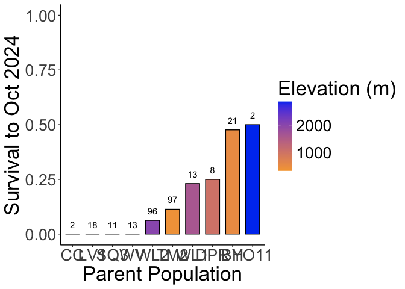

# Analysis of Survival at WL2 2024 Garden to Plant for BC2 crosses

To Do:
-   See Julin's code for poperly calculating sem for surv
-   Convert to yes/no for each parent pop

## Relevant Libraries and Functions

``` r
library(tidyverse)
```

```
## ── Attaching core tidyverse packages ──────────────────────── tidyverse 2.0.0 ──
## ✔ dplyr     1.1.4     ✔ readr     2.1.5
## ✔ forcats   1.0.0     ✔ stringr   1.5.1
## ✔ ggplot2   3.5.1     ✔ tibble    3.2.1
## ✔ lubridate 1.9.3     ✔ tidyr     1.3.1
## ✔ purrr     1.0.2     
## ── Conflicts ────────────────────────────────────────── tidyverse_conflicts() ──
## ✖ dplyr::filter() masks stats::filter()
## ✖ dplyr::lag()    masks stats::lag()
## ℹ Use the conflicted package (<http://conflicted.r-lib.org/>) to force all conflicts to become errors
```

``` r
library(tidymodels)
```

```
## ── Attaching packages ────────────────────────────────────── tidymodels 1.2.0 ──
## ✔ broom        1.0.7     ✔ rsample      1.2.1
## ✔ dials        1.3.0     ✔ tune         1.2.1
## ✔ infer        1.0.7     ✔ workflows    1.1.4
## ✔ modeldata    1.4.0     ✔ workflowsets 1.1.0
## ✔ parsnip      1.2.1     ✔ yardstick    1.3.1
## ✔ recipes      1.1.0     
## ── Conflicts ───────────────────────────────────────── tidymodels_conflicts() ──
## ✖ scales::discard() masks purrr::discard()
## ✖ dplyr::filter()   masks stats::filter()
## ✖ recipes::fixed()  masks stringr::fixed()
## ✖ dplyr::lag()      masks stats::lag()
## ✖ yardstick::spec() masks readr::spec()
## ✖ recipes::step()   masks stats::step()
## • Dig deeper into tidy modeling with R at https://www.tmwr.org
```

``` r
tidymodels_prefer()
library(lmerTest) #for mixed effect models
```

```
## Loading required package: lme4
## Loading required package: Matrix
## 
## Attaching package: 'Matrix'
## 
## The following objects are masked from 'package:tidyr':
## 
##     expand, pack, unpack
```

``` r
conflicted::conflicts_prefer(lmerTest::lmer)
```

```
## [conflicted] Will prefer lmerTest::lmer over any other package.
```

``` r
library(broom.mixed) #tidy method for lmerTest
library(emmeans) #for post-hoc pairwise comparisons 
```

```
## Welcome to emmeans.
## Caution: You lose important information if you filter this package's results.
## See '? untidy'
```

``` r
library(naniar) #replaces values with NA
library(brms)
```

```
## Loading required package: Rcpp
## 
## Attaching package: 'Rcpp'
## 
## The following object is masked from 'package:rsample':
## 
##     populate
## 
## Loading 'brms' package (version 2.22.0). Useful instructions
## can be found by typing help('brms'). A more detailed introduction
## to the package is available through vignette('brms_overview').
```

``` r
sem <- function(x, na.rm=FALSE) {           #for caclulating standard error
  sd(x,na.rm=na.rm)/sqrt(length(na.omit(x)))
} 

elev_three_palette <- c("#0043F0", "#C9727F", "#F5A540") #colors from Gremer et al 2019
elev_order <- c("High", "Mid", "Low") #for proper arrangement in figures 
```

## Load pop and location data

``` r
plant_info <- read_csv("../input/WL2_2024_Data/WL2_Final_2023_2024_Pop_Loc_Info.csv")
```

```
## Rows: 1217 Columns: 15
## ── Column specification ────────────────────────────────────────────────────────
## Delimiter: ","
## chr (8): Pop.Type, status, block, loc, bed, bedcol, pop, unique.ID
## dbl (7): bed.block.order, bed.order, AB.CD.order, column.order, bedrow, mf, rep
## 
## ℹ Use `spec()` to retrieve the full column specification for this data.
## ℹ Specify the column types or set `show_col_types = FALSE` to quiet this message.
```

``` r
head(plant_info)
```

```
## # A tibble: 6 × 15
##   bed.block.order bed.order AB.CD.order column.order Pop.Type status block loc  
##             <dbl>     <dbl>       <dbl>        <dbl> <chr>    <chr>  <chr> <chr>
## 1               1         1           1            1 2023-TM… 2023-… <NA>  A_1_A
## 2              22        12           1            1 2023-su… 2023-… <NA>  A_6_B
## 3              62        32           1            1 2023-su… 2023-… <NA>  A_16…
## 4              65        33           1            1 2023-su… 2023-… <NA>  A_17…
## 5              69        35           1            1 2023-su… 2023-… <NA>  A_18…
## 6              93        47           1            1 2023-su… 2023-… <NA>  A_24…
## # ℹ 7 more variables: bed <chr>, bedrow <dbl>, bedcol <chr>, pop <chr>,
## #   mf <dbl>, rep <dbl>, unique.ID <chr>
```

``` r
unique(plant_info$Pop.Type) #info about whether the plant is from 2023, an F1, F2, or parent 
```

```
## [1] "2023-TM2-fruit" "2023-survivor"  NA               "F2"            
## [5] "Parent"         "F1"
```

``` r
unique(plant_info$status) #status info for planting (i.e. available spot to plant or not)
```

```
## [1] "2023-TM2-fruit" "2023-survivor"  "buffer"         "available"     
## [5] NA
```

``` r
plant_info_to_merge <- plant_info %>% 
  select(Pop.Type, block, parent.pop=pop,mf:unique.ID) %>% 
  filter(!is.na(parent.pop))

pop_loc <- read_csv("../input/Strep_tort_locs.csv")
```

```
## Rows: 54 Columns: 7
## ── Column specification ────────────────────────────────────────────────────────
## Delimiter: ","
## chr (6): Species epithet, Species Code, Site, Site code, Lat, Long
## dbl (1): Elevation (m)
## 
## ℹ Use `spec()` to retrieve the full column specification for this data.
## ℹ Specify the column types or set `show_col_types = FALSE` to quiet this message.
```

``` r
head(pop_loc)
```

```
## # A tibble: 6 × 7
##   `Species epithet` `Species Code` Site  `Site code` Lat   Long  `Elevation (m)`
##   <chr>             <chr>          <chr> <chr>       <chr> <chr>           <dbl>
## 1 Streptanthus tor… STTO           Ben … BH          37.4… -119…            511.
## 2 Streptanthus tor… STTO           Bidw… BB          39.5… -121…            283.
## 3 Streptanthus tor… STTO           Cany… CC          39.5… -121…            313 
## 4 Streptanthus tor… STTO           Cars… CP1         38.6… -120…           2422.
## 5 Streptanthus tor… STTO           Cars… CP2         38.6… -120…           2244.
## 6 Streptanthus tor… STTO           Cars… CP3         38.7… -120…           2266.
```

``` r
unique(pop_loc$`Site code`)
```

```
##  [1] "BH"     "BB"     "CC"     "CP1"    "CP2"    "CP3"    "DP"     "DPR"   
##  [9] "FR"     NA       "HH"     "IH"     "KC1"    "KC2"    "KC3"    "LV1"   
## [17] "LV2"    "LV3"    "LVTR1"  "LVTR2"  "LVTR3"  "SQ1"    "SQ2"    "SQ3"   
## [25] "SHA"    "SC"     "TM1"    "TM2"    "WR"     "WV"     "WL1"    "WL2"   
## [33] "WL3"    "WL4"    "YOSE1"  "YOSE10" "YOSE11" "YOSE12" "YOSE13" "YOSE2" 
## [41] "YOSE3"  "YOSE4"  "YOSE5"  "YOSE6"  "YOSE7"  "YOSE8"  "YOSE9"
```

``` r
unique(plant_info_to_merge$parent.pop)
```

```
##  [1] "TM2"                        "CC"                        
##  [3] "BH"                         "WL2"                       
##  [5] "IH"                         "SC"                        
##  [7] "YO7"                        "SQ1"                       
##  [9] "(WV x WL2) x (WV)"          "(LV1 x WL2) x (TM2 x WL2)" 
## [11] "(TM2 x WL2) x (SQ3 x WL2)"  "(WL2 x BH) x (SQ3 x WL2)"  
## [13] "(TM2 x WL2) x (TM2 x WL2)"  "(LV1 x WL2) x (WL2 x DPR)" 
## [15] "(WL1 x WL2) x (BH x WL2)"   "(TM2 x WL2) x (YO11 x WL2)"
## [17] "(WL1 x WL2) x (WL2 x TM2)"  "(WL2 x TM2) x (CC x TM2)"  
## [19] "WV x TM2"                   "(WL2 x DPR) x (WL2)"       
## [21] "(TM2 x WL2) x (TM2)"        "(SQ3 x WL2) x (YO11 x WL2)"
## [23] "(SQ3 x WL2) x (SQ3 x WL2)"  "(YO11 x WL2) x (SQ3 x WL2)"
## [25] "(WL1 x WL2) x (WL2 x CC)"   "(LV1 x WL2) x (WL2)"       
## [27] "(TM2 x BH) x (TM2 x BH)"    "(LV1 x WL2) x (SQ3 x WL2)" 
## [29] "(DPR x WL2) x (YO11 x WL2)" "WV"                        
## [31] "(DPR x WL2) x (WV x WL2)"   "LV1 x WL2"                 
## [33] "(WV) x (WV x WL2)"          "LV1"                       
## [35] "LV1 x TM2"                  "(YO11 x WL2) x (WL2)"      
## [37] "(TM2 x BH) x (TM2)"         "TM2 x WL2"                 
## [39] "(YO11 x WL2) x (DPR x WL2)" "CC x TM2"                  
## [41] "(DPR) x (WL2 x DPR)"        "(WL2 x DPR) x (TM2 x WL2)" 
## [43] "(SQ3 x WL2) x (TM2 x WL2)"  "(TM2 x WL2) x (WL2)"       
## [45] "(WL2 x BH) x (WL2 x TM2)"   "(WL2 x CC) x (WL2 x TM2)"  
## [47] "(WL2) x (DPR x WL2)"        "WV x WL2"                  
## [49] "SQ3"                        "(SQ3 x WL2) x (WL2)"       
## [51] "(LV1 x WL2) x (YO11 x WL2)" "(BH) x (TM2 x BH)"         
## [53] "(TM2 x BH) x (BH)"          "WL1"                       
## [55] "(WL2) x (WV x WL2)"         "BH x TM2"                  
## [57] "(YO11 x WL2) x (WL2 x TM2)" "(WL2 x CC) x (SQ3 x WL2)"  
## [59] "(DPR) x (DPR x WL2)"        "(SQ3 x WL2) x (LV1 x WL2)" 
## [61] "WL2 x BH"                   "(TM2 x BH) x (TM2 x WL2)"  
## [63] "DPR"                        "(WL1 x TM2) x (WL2 x TM2)" 
## [65] "(YO11 x WL2) x (WV x WL2)"  "(SQ3 x WL2) x (DPR x WL2)" 
## [67] "DPR x WL2"                  "(LV1 x WL2) x (LV1 x WL2)" 
## [69] "BH x WL2"                   "(WV x WL2) x (WL2 x DPR)"  
## [71] "(WL2 x DPR) x (YO11 x WL2)" "YO11"                      
## [73] "(WL2) x (TM2 x WL2)"        "(TM2) x (TM2 x WL2)"       
## [75] "SQ3 x WL2"                  "(CC x TM2) x (WL2 x TM2)"  
## [77] "(TM2 x WL2) x (LV1 x WL2)"  "(DPR x WL2) x (SQ3 x WL2)" 
## [79] "WR"                         "(TM2 x WL2) x (DPR x WL2)" 
## [81] "(WL2 x DPR) x (DPR)"        "Buffer"                    
## [83] "(YO11 x WL2) x (TM2 x WL2)" "(DPR x WL2) x (DPR x WL2)" 
## [85] "(DPR x WL2) x (TM2 x WL2)"  "TM2 x YO11"                
## [87] "buffer"                     "(TM2) x (TM2 x BH)"        
## [89] "(TM2 x WL2) x (TM2 x BH)"   "(WL2 x TM2) x (WL2)"       
## [91] "(TM2 x WL2) x (WV x WL2)"
```

``` r
#need to change YOSE to YO
pop_loc_yo <- pop_loc %>% mutate(parent.pop = str_replace(`Site code`, "YOSE(\\d+)", "YO\\1")) %>% select(Lat, Long, elev_m=`Elevation (m)`, parent.pop)
unique(pop_loc_yo$parent.pop)
```

```
##  [1] "BH"    "BB"    "CC"    "CP1"   "CP2"   "CP3"   "DP"    "DPR"   "FR"   
## [10] NA      "HH"    "IH"    "KC1"   "KC2"   "KC3"   "LV1"   "LV2"   "LV3"  
## [19] "LVTR1" "LVTR2" "LVTR3" "SQ1"   "SQ2"   "SQ3"   "SHA"   "SC"    "TM1"  
## [28] "TM2"   "WR"    "WV"    "WL1"   "WL2"   "WL3"   "WL4"   "YO1"   "YO10" 
## [37] "YO11"  "YO12"  "YO13"  "YO2"   "YO3"   "YO4"   "YO5"   "YO6"   "YO7"  
## [46] "YO8"   "YO9"
```

``` r
pop_elev <- left_join(plant_info_to_merge, pop_loc_yo)
```

```
## Joining with `by = join_by(parent.pop)`
```

``` r
head(pop_elev)
```

```
## # A tibble: 6 × 9
##   Pop.Type       block parent.pop    mf   rep unique.ID Lat      Long     elev_m
##   <chr>          <chr> <chr>      <dbl> <dbl> <chr>     <chr>    <chr>     <dbl>
## 1 2023-TM2-fruit <NA>  TM2            6    11 TM2_6_11  39.59255 -121.55…   379.
## 2 2023-survivor  <NA>  CC             3     3 CC_3_3    39.58597 -121.43…   313 
## 3 2023-survivor  <NA>  BH             3     3 BH_3_3    37.40985 -119.96…   511.
## 4 2023-survivor  <NA>  BH             7     3 BH_7_3    37.40985 -119.96…   511.
## 5 2023-survivor  <NA>  BH             4     3 BH_4_3    37.40985 -119.96…   511.
## 6 2023-survivor  <NA>  WL2            7     9 WL2_7_9   38.8263  -120.25…  2020.
```

## Load the mort/pheno data

``` r
mort_pheno_1023 <- read_csv("../input/WL2_2024_Data/CorrectedCSVs/WL2_mort_pheno_20241023_corrected.csv", 
                            na = c("", "NA", "-", "N/A")) %>% arrange(death.date)
```

```
## Rows: 1217 Columns: 13
## ── Column specification ────────────────────────────────────────────────────────
## Delimiter: ","
## chr (12): block, bed, col, unique.ID, bud.date, flower.date, fruit.date, las...
## dbl  (1): row
## 
## ℹ Use `spec()` to retrieve the full column specification for this data.
## ℹ Specify the column types or set `show_col_types = FALSE` to quiet this message.
```

``` r
head(mort_pheno_1023)
```

```
## # A tibble: 6 × 13
##   block bed     row col   unique.ID bud.date flower.date fruit.date last.FL.date
##   <chr> <chr> <dbl> <chr> <chr>     <chr>    <chr>       <chr>      <chr>       
## 1 <NA>  A        45 B     IH_2_4    7/2/24   7/16/24     7/23/24    9/3/24      
## 2 B     C        28 C     251       <NA>     <NA>        <NA>       <NA>        
## 3 <NA>  C        30 C     BH_4_7    6/25/24  7/9/24      7/16/24    8/27/24     
## 4 E     D        20 B     141       <NA>     <NA>        <NA>       <NA>        
## 5 G     D        48 A     485       <NA>     <NA>        <NA>       <NA>        
## 6 F     D        37 D     312       <NA>     <NA>        <NA>       <NA>        
## # ℹ 4 more variables: last.FR.date <chr>, death.date <chr>, missing.date <chr>,
## #   survey.notes <chr>
```

``` r
names(mort_pheno_1023)
```

```
##  [1] "block"        "bed"          "row"          "col"          "unique.ID"   
##  [6] "bud.date"     "flower.date"  "fruit.date"   "last.FL.date" "last.FR.date"
## [11] "death.date"   "missing.date" "survey.notes"
```

``` r
unique(mort_pheno_1023$bed) #D and "D."
```

```
##  [1] "A"  "C"  "D"  "E"  "H"  "B"  "J"  "G"  "K"  "F"  "I"  "D."
```

``` r
unique(mort_pheno_1023$death.date)  
```

```
##  [1] "10/16/24" "10/2/24"  "10/23/24" "10/9/24"  "6/18/24"  "6/25/24" 
##  [7] "7/16/24"  "7/2/24"   "7/23/24"  "7/30/24"  "7/9/24"   "8/13/24" 
## [13] "8/20/24"  "8/27/24"  "8/6/24"   "9/10/24"  "9/17/24"  "9/24/24" 
## [19] "9/3/24"   NA
```

``` r
#some dates should be checked: 6/24, 6/27 - both were data verifcation errors, corrected on csv. 

mort_pheno_1023_nobuff <- mort_pheno_1023 %>% 
  filter(unique.ID !="buffer") %>% 
  filter(!is.na(unique.ID))
```

## Merge with location info 

``` r
oct_mort_loc <- left_join(mort_pheno_1023_nobuff, pop_elev) 
```

```
## Joining with `by = join_by(block, unique.ID)`
```

``` r
head(oct_mort_loc)
```

```
## # A tibble: 6 × 20
##   block bed     row col   unique.ID bud.date flower.date fruit.date last.FL.date
##   <chr> <chr> <dbl> <chr> <chr>     <chr>    <chr>       <chr>      <chr>       
## 1 <NA>  A        45 B     IH_2_4    7/2/24   7/16/24     7/23/24    9/3/24      
## 2 B     C        28 C     251       <NA>     <NA>        <NA>       <NA>        
## 3 <NA>  C        30 C     BH_4_7    6/25/24  7/9/24      7/16/24    8/27/24     
## 4 E     D        20 B     141       <NA>     <NA>        <NA>       <NA>        
## 5 G     D        48 A     485       <NA>     <NA>        <NA>       <NA>        
## 6 F     D        37 D     312       <NA>     <NA>        <NA>       <NA>        
## # ℹ 11 more variables: last.FR.date <chr>, death.date <chr>,
## #   missing.date <chr>, survey.notes <chr>, Pop.Type <chr>, parent.pop <chr>,
## #   mf <dbl>, rep <dbl>, Lat <chr>, Long <chr>, elev_m <dbl>
```

``` r
names(oct_mort_loc)
```

```
##  [1] "block"        "bed"          "row"          "col"          "unique.ID"   
##  [6] "bud.date"     "flower.date"  "fruit.date"   "last.FL.date" "last.FR.date"
## [11] "death.date"   "missing.date" "survey.notes" "Pop.Type"     "parent.pop"  
## [16] "mf"           "rep"          "Lat"          "Long"         "elev_m"
```

``` r
oct_mort_loc %>% filter(!is.na(missing.date)) #11 2024 plants with a missing date & 1 2023 plant that went missing 
```

```
## # A tibble: 12 × 20
##    block bed     row col   unique.ID bud.date flower.date fruit.date
##    <chr> <chr> <dbl> <chr> <chr>     <chr>    <chr>       <chr>     
##  1 B     C        31 D     853       <NA>     <NA>        <NA>      
##  2 C     C        46 D     429       <NA>     <NA>        <NA>      
##  3 F     D        42 A     1232      <NA>     <NA>        <NA>      
##  4 G     D        56 A     558       <NA>     <NA>        <NA>      
##  5 F     D        38 C     1269      <NA>     <NA>        <NA>      
##  6 I     E        45 A     1025      <NA>     <NA>        <NA>      
##  7 I     E        25 D     637       <NA>     <NA>        <NA>      
##  8 J     F         8 B     729       <NA>     <NA>        <NA>      
##  9 J     F        14 B     1251      <NA>     <NA>        <NA>      
## 10 J     F        18 B     208       <NA>     <NA>        <NA>      
## 11 L     G         4 A     1238      <NA>     <NA>        <NA>      
## 12 <NA>  H        12 B     SC_2_1    <NA>     <NA>        <NA>      
## # ℹ 12 more variables: last.FL.date <chr>, last.FR.date <chr>,
## #   death.date <chr>, missing.date <chr>, survey.notes <chr>, Pop.Type <chr>,
## #   parent.pop <chr>, mf <dbl>, rep <dbl>, Lat <chr>, Long <chr>, elev_m <dbl>
```

``` r
oct_mort_loc %>% filter(Pop.Type=="2023-survivor") # double checked none of these plants were actually alive (no data)
```

```
## # A tibble: 131 × 20
##    block bed     row col   unique.ID bud.date flower.date fruit.date
##    <chr> <chr> <dbl> <chr> <chr>     <chr>    <chr>       <chr>     
##  1 <NA>  A        45 B     IH_2_4    7/2/24   7/16/24     7/23/24   
##  2 <NA>  C        30 C     BH_4_7    6/25/24  7/9/24      7/16/24   
##  3 <NA>  D        51 C     IH_1_8    6/25/24  7/16/24     7/23/24   
##  4 <NA>  E        46 B     IH_3_11   7/2/24   7/30/24     8/6/24    
##  5 <NA>  A        17 A     BH_7_3    6/18/24  7/2/24      7/9/24    
##  6 <NA>  A        24 A     WL2_7_9   6/18/24  6/18/24     7/2/24    
##  7 <NA>  A        32 B     IH_7_4    6/18/24  7/9/24      7/16/24   
##  8 <NA>  A        35 A     SC_8_4    6/18/24  7/2/24      7/16/24   
##  9 <NA>  A        36 A     BH_3_4    6/18/24  7/9/24      7/16/24   
## 10 <NA>  A        39 B     WL2_7_10  6/18/24  6/18/24     7/2/24    
## # ℹ 121 more rows
## # ℹ 12 more variables: last.FL.date <chr>, last.FR.date <chr>,
## #   death.date <chr>, missing.date <chr>, survey.notes <chr>, Pop.Type <chr>,
## #   parent.pop <chr>, mf <dbl>, rep <dbl>, Lat <chr>, Long <chr>, elev_m <dbl>
```

## Survival 

### Add Surv columns 

``` r
wl2_surv <- oct_mort_loc %>% 
  filter(Pop.Type != "2023-TM2-fruit") %>% #take out 2023 fruiting locations 
  filter(is.na(missing.date)) %>% #take out plants that went missing 
  mutate(Surv_to_Oct = if_else(is.na(death.date), 1, 0), #surv to end of 2024 survey season
         Surv_Post_Transplant = if_else(is.na(death.date), 1,
           if_else(death.date=="6/18/24" | death.date=="6/25/24", 0, 1))) %>% #surv 2 weeks post-transplant
  select(Lat:elev_m, Pop.Type:rep, block:unique.ID, death.date, Surv_to_Oct, Surv_Post_Transplant, missing.date, survey.notes)

head(wl2_surv)
```

```
## # A tibble: 6 × 17
##   Lat      Long   elev_m Pop.Type parent.pop    mf   rep block bed     row col  
##   <chr>    <chr>   <dbl> <chr>    <chr>      <dbl> <dbl> <chr> <chr> <dbl> <chr>
## 1 39.09332 -120.…   454. 2023-su… IH             2     4 <NA>  A        45 B    
## 2 <NA>     <NA>      NA  F2       (WL2 x BH…    NA    16 B     C        28 C    
## 3 37.40985 -119.…   511. 2023-su… BH             4     7 <NA>  C        30 C    
## 4 38.8263  -120.…  2020. Parent   WL2           NA    46 E     D        20 B    
## 5 39.59255 -121.…   379. Parent   TM2           NA    15 G     D        48 A    
## 6 <NA>     <NA>      NA  F2       (TM2 x WL…    NA     8 F     D        37 D    
## # ℹ 6 more variables: unique.ID <chr>, death.date <chr>, Surv_to_Oct <dbl>,
## #   Surv_Post_Transplant <dbl>, missing.date <chr>, survey.notes <chr>
```

``` r
tail(wl2_surv)
```

```
## # A tibble: 6 × 17
##   Lat      Long   elev_m Pop.Type parent.pop    mf   rep block bed     row col  
##   <chr>    <chr>   <dbl> <chr>    <chr>      <dbl> <dbl> <chr> <chr> <dbl> <chr>
## 1 <NA>     <NA>      NA  F1       LV1 x TM2     NA    26 P     I        11 A    
## 2 37.40985 -119.…   511. 2023-su… BH             1     1 <NA>  I        18 A    
## 3 39.22846 -120.…  1019. Parent   DPR           NA    15 P     I        10 D    
## 4 37.40985 -119.…   511. 2023-su… BH             4     2 <NA>  J        10 A    
## 5 37.80903 -119.…  2470. 2023-su… YO7            7    11 <NA>  J        15 A    
## 6 37.40985 -119.…   511. 2023-su… BH             6     2 <NA>  J        13 C    
## # ℹ 6 more variables: unique.ID <chr>, death.date <chr>, Surv_to_Oct <dbl>,
## #   Surv_Post_Transplant <dbl>, missing.date <chr>, survey.notes <chr>
```


``` r
xtabs(~Surv_to_Oct+Pop.Type, data=wl2_surv) #numbers look right 
```

```
##            Pop.Type
## Surv_to_Oct 2023-survivor  F1  F2 Parent
##           0           106  86 371    248
##           1            24  17  64     33
```

``` r
#(830 2024 plants - 11 went missing in the field) - 14% overall survival 
#(131 2023 plants - 1 went missing in the field) - 19% overall survival 

xtabs(~Surv_Post_Transplant+Pop.Type, data=wl2_surv)
```

```
##                     Pop.Type
## Surv_Post_Transplant 2023-survivor  F1  F2 Parent
##                    0            22  23  78     87
##                    1           108  80 357    194
```

``` r
#(830 2024 plants - 3 went missing in the field) - 77% overall survival 
```

## Quick Look at 2024 Parent Pops

``` r
meansurv_2024_parents <- wl2_surv %>% 
  filter(Pop.Type=="Parent") %>% 
  group_by(parent.pop, elev_m) %>% 
  summarise(N_Surv = sum(!is.na(Surv_to_Oct)), 
            mean_Surv_to_Oct = mean(Surv_to_Oct,na.rm=(TRUE)), 
            mean_Surv_Post_Transplant = mean(Surv_Post_Transplant,na.rm=(TRUE)))
```

```
## `summarise()` has grouped output by 'parent.pop'. You can override using the
## `.groups` argument.
```

``` r
meansurv_2024_parents #variable planting sample sizes (some as small as 2)
```

```
## # A tibble: 10 × 5
## # Groups:   parent.pop [10]
##    parent.pop elev_m N_Surv mean_Surv_to_Oct mean_Surv_Post_Transplant
##    <chr>       <dbl>  <int>            <dbl>                     <dbl>
##  1 BH           511.     21           0.476                      0.857
##  2 CC           313       2           0                          1    
##  3 DPR         1019.      8           0.25                       0.75 
##  4 LV1         2593.     18           0                          0.389
##  5 SQ3         2373.     11           0                          0.727
##  6 TM2          379.     97           0.113                      0.794
##  7 WL1         1614.     13           0.231                      1    
##  8 WL2         2020.     96           0.0625                     0.562
##  9 WV           749.     13           0                          0.538
## 10 YO11        2872.      2           0.5                        1
```

``` r
meansurv_2024_parents %>% 
  ggplot(aes(x=fct_reorder(parent.pop, mean_Surv_to_Oct), y=mean_Surv_to_Oct, fill=elev_m)) + 
  geom_col(width = 0.7,position = position_dodge(0.75), colour="black") +
  labs(x="Parent Population", y="Survival to Oct 2024", fill="Elevation (m)") +
  theme_classic() + 
  ylim(0,1) +
  #scale_y_continuous(expand = c(0, 0)) +
  geom_text(data = meansurv_2024_parents, aes(label = N_Surv), vjust = -1) +
  scale_fill_gradient(low = "#F5A540", high = "#0043F0") +
  theme(text=element_text(size=25))
```

<!-- -->

``` r
ggsave("../output/WL2_Traits/2024ParentSurvtoOct.png", width = 12, height = 6, units = "in")

meansurv_2024_parents %>% 
  ggplot(aes(x=fct_reorder(parent.pop, mean_Surv_Post_Transplant), y=mean_Surv_Post_Transplant, fill=elev_m)) + 
  geom_col(width = 0.7,position = position_dodge(0.75), colour="black") +
  labs(x="Parent Population", y="Survival Two Weeks Post-Transplant", fill="Elevation (m)") +
  theme_classic() + 
  coord_cartesian(ylim = c(0, 1.25)) +
  scale_y_continuous(breaks = c(0.00, 0.25, 0.50, 0.75, 1.00, 1.25)) +
  #scale_y_continuous(expand = c(0, 0)) +
  geom_text(data = meansurv_2024_parents, aes(label = N_Surv), vjust = -1) +
  scale_fill_gradient(low = "#F5A540", high = "#0043F0") +
  theme(text=element_text(size=25))
```

<!-- -->

``` r
ggsave("../output/WL2_Traits/2024ParentSurvPostTransplant.png", width = 12, height = 6, units = "in")
```

## F1s


``` r
wl2_surv_F1 <- wl2_surv %>% 
  filter(Pop.Type=="F1") %>% 
  unite(Field_Loc, bed:col, sep="_") %>% 
  select(Pop.Type:parent.pop, Field_Loc, unique.ID:Surv_Post_Transplant, survey.notes) %>% 
  separate_wider_delim(parent.pop, " x ", names = c("maternal.pop", "paternal.pop"), cols_remove = FALSE) %>% 
  mutate(WL2.cross = if_else(maternal.pop=="WL2" | paternal.pop=="WL2", TRUE, FALSE))
wl2_surv_F1
```

```
## # A tibble: 103 × 11
##    Pop.Type maternal.pop paternal.pop parent.pop Field_Loc unique.ID death.date
##    <chr>    <chr>        <chr>        <chr>      <chr>     <chr>     <chr>     
##  1 F1       CC           TM2          CC x TM2   C_38_A    1362      6/18/24   
##  2 F1       BH           TM2          BH x TM2   C_17_D    600       6/18/24   
##  3 F1       LV1          WL2          LV1 x WL2  D_52_C    1271      6/18/24   
##  4 F1       LV1          TM2          LV1 x TM2  H_15_C    1246      6/18/24   
##  5 F1       TM2          WL2          TM2 x WL2  C_32_B    1279      6/25/24   
##  6 F1       WV           TM2          WV x TM2   C_49_B    201       6/25/24   
##  7 F1       LV1          TM2          LV1 x TM2  C_56_B    1241      6/25/24   
##  8 F1       LV1          TM2          LV1 x TM2  C_13_D    1245      6/25/24   
##  9 F1       LV1          TM2          LV1 x TM2  D_23_A    1231      6/25/24   
## 10 F1       TM2          WL2          TM2 x WL2  D_18_C    1281      6/25/24   
## # ℹ 93 more rows
## # ℹ 4 more variables: Surv_to_Oct <dbl>, Surv_Post_Transplant <dbl>,
## #   survey.notes <chr>, WL2.cross <lgl>
```

``` r
xtabs(~Surv_to_Oct+WL2.cross, data=wl2_surv_F1) #slightly higher surv in WL2 crosses 
```

```
##            WL2.cross
## Surv_to_Oct FALSE TRUE
##           0    51   35
##           1     9    8
```

``` r
xtabs(~Surv_Post_Transplant+WL2.cross, data=wl2_surv_F1) #slightly higher surv in TM2 crosses
```

```
##                     WL2.cross
## Surv_Post_Transplant FALSE TRUE
##                    0    10   13
##                    1    50   30
```

Filter to only F1s with WL2 involved 

``` r
wl2_surv_wl2F1s <- wl2_surv_F1 %>% filter(WL2.cross=="TRUE")  
unique(wl2_surv_wl2F1s$parent.pop) #only 7 F1s with WL2 involved
```

```
## [1] "LV1 x WL2" "TM2 x WL2" "WL2 x BH"  "SQ3 x WL2" "DPR x WL2" "WV x WL2" 
## [7] "BH x WL2"
```

``` r
xtabs(~Surv_to_Oct+maternal.pop, data=wl2_surv_wl2F1s) 
```

```
##            maternal.pop
## Surv_to_Oct BH DPR LV1 SQ3 TM2 WL2 WV
##           0  2   4   9   4   7   4  5
##           1  0   0   2   0   2   0  4
```

``` r
xtabs(~Surv_Post_Transplant+maternal.pop, data=wl2_surv_wl2F1s) 
```

```
##                     maternal.pop
## Surv_Post_Transplant BH DPR LV1 SQ3 TM2 WL2 WV
##                    0  0   1   5   1   5   1  0
##                    1  2   3   6   3   4   3  9
```

``` r
xtabs(~Surv_to_Oct+paternal.pop, data=wl2_surv_wl2F1s) 
```

```
##            paternal.pop
## Surv_to_Oct BH WL2
##           0  4  31
##           1  0   8
```

``` r
xtabs(~Surv_Post_Transplant+paternal.pop, data=wl2_surv_wl2F1s) 
```

```
##                     paternal.pop
## Surv_Post_Transplant BH WL2
##                    0  1  12
##                    1  3  27
```

``` r
#sample sizes so low, it's hard to feel confident in any trends 
```

### Calculate proportions of each plant for analysis 

``` r
wl2_surv_F1_props <- wl2_surv_F1 %>% 
  filter(WL2.cross=="TRUE") %>% #if want TM2 F1s just # this out 
  mutate(prop.WL2=str_count(parent.pop, "WL2")/2,
         prop.CC=str_count(parent.pop, "CC")/2,
         prop.BH=str_count(parent.pop, "BH")/2,
         prop.WV=str_count(parent.pop, "WV")/2,
         prop.LV1=str_count(parent.pop, "LV1")/2,
         prop.TM2=str_count(parent.pop, "TM2")/2,
         prop.SQ3=str_count(parent.pop, "SQ3")/2,
         prop.DPR=str_count(parent.pop, "DPR")/2,
         prop.YO11=str_count(parent.pop, "YO11")/2)

summary(wl2_surv_F1_props)
```

```
##    Pop.Type         maternal.pop       paternal.pop        parent.pop       
##  Length:43          Length:43          Length:43          Length:43         
##  Class :character   Class :character   Class :character   Class :character  
##  Mode  :character   Mode  :character   Mode  :character   Mode  :character  
##                                                                             
##                                                                             
##                                                                             
##   Field_Loc          unique.ID          death.date         Surv_to_Oct   
##  Length:43          Length:43          Length:43          Min.   :0.000  
##  Class :character   Class :character   Class :character   1st Qu.:0.000  
##  Mode  :character   Mode  :character   Mode  :character   Median :0.000  
##                                                           Mean   :0.186  
##                                                           3rd Qu.:0.000  
##                                                           Max.   :1.000  
##  Surv_Post_Transplant survey.notes       WL2.cross         prop.WL2  
##  Min.   :0.0000       Length:43          Mode:logical   Min.   :0.5  
##  1st Qu.:0.0000       Class :character   TRUE:43        1st Qu.:0.5  
##  Median :1.0000       Mode  :character                  Median :0.5  
##  Mean   :0.6977                                         Mean   :0.5  
##  3rd Qu.:1.0000                                         3rd Qu.:0.5  
##  Max.   :1.0000                                         Max.   :0.5  
##     prop.CC     prop.BH           prop.WV          prop.LV1     
##  Min.   :0   Min.   :0.00000   Min.   :0.0000   Min.   :0.0000  
##  1st Qu.:0   1st Qu.:0.00000   1st Qu.:0.0000   1st Qu.:0.0000  
##  Median :0   Median :0.00000   Median :0.0000   Median :0.0000  
##  Mean   :0   Mean   :0.06977   Mean   :0.1047   Mean   :0.1279  
##  3rd Qu.:0   3rd Qu.:0.00000   3rd Qu.:0.0000   3rd Qu.:0.2500  
##  Max.   :0   Max.   :0.50000   Max.   :0.5000   Max.   :0.5000  
##     prop.TM2         prop.SQ3          prop.DPR         prop.YO11
##  Min.   :0.0000   Min.   :0.00000   Min.   :0.00000   Min.   :0  
##  1st Qu.:0.0000   1st Qu.:0.00000   1st Qu.:0.00000   1st Qu.:0  
##  Median :0.0000   Median :0.00000   Median :0.00000   Median :0  
##  Mean   :0.1047   Mean   :0.04651   Mean   :0.04651   Mean   :0  
##  3rd Qu.:0.0000   3rd Qu.:0.00000   3rd Qu.:0.00000   3rd Qu.:0  
##  Max.   :0.5000   Max.   :0.50000   Max.   :0.50000   Max.   :0
```

``` r
xtabs(~Surv_to_Oct+prop.BH, data=wl2_surv_F1_props)
```

```
##            prop.BH
## Surv_to_Oct  0 0.5
##           0 29   6
##           1  8   0
```

``` r
xtabs(~Surv_to_Oct+prop.WV, data=wl2_surv_F1_props)
```

```
##            prop.WV
## Surv_to_Oct  0 0.5
##           0 30   5
##           1  4   4
```

``` r
xtabs(~Surv_to_Oct+prop.LV1, data=wl2_surv_F1_props)
```

```
##            prop.LV1
## Surv_to_Oct  0 0.5
##           0 26   9
##           1  6   2
```

``` r
xtabs(~Surv_to_Oct+prop.TM2, data=wl2_surv_F1_props)
```

```
##            prop.TM2
## Surv_to_Oct  0 0.5
##           0 28   7
##           1  6   2
```

``` r
xtabs(~Surv_to_Oct+prop.SQ3, data=wl2_surv_F1_props)
```

```
##            prop.SQ3
## Surv_to_Oct  0 0.5
##           0 31   4
##           1  8   0
```

``` r
xtabs(~Surv_to_Oct+prop.DPR, data=wl2_surv_F1_props)
```

```
##            prop.DPR
## Surv_to_Oct  0 0.5
##           0 31   4
##           1  8   0
```


``` r
m1 <- glm(Surv_to_Oct ~ prop.BH+prop.WV+prop.LV1+prop.TM2+prop.SQ3+prop.DPR, family = binomial, data=wl2_surv_F1_props)

m2 <- glm(Surv_Post_Transplant ~ prop.BH+prop.WV+prop.LV1+prop.TM2+prop.SQ3+prop.DPR, family = binomial, data=wl2_surv_F1_props)

m3 <- glm(Surv_to_Oct ~ maternal.pop, family = binomial, data=wl2_surv_F1_props)

m4 <- glm(Surv_Post_Transplant ~ maternal.pop, family = binomial, data=wl2_surv_F1_props)
```


``` r
summary(m1)
```

```
## 
## Call:
## glm(formula = Surv_to_Oct ~ prop.BH + prop.WV + prop.LV1 + prop.TM2 + 
##     prop.SQ3 + prop.DPR, family = binomial, data = wl2_surv_F1_props)
## 
## Coefficients: (1 not defined because of singularities)
##               Estimate Std. Error z value Pr(>|z|)
## (Intercept) -1.957e+01  5.377e+03  -0.004    0.997
## prop.BH     -3.169e-08  1.388e+04   0.000    1.000
## prop.WV      3.869e+01  1.075e+04   0.004    0.997
## prop.LV1     3.612e+01  1.075e+04   0.003    0.997
## prop.TM2     3.663e+01  1.075e+04   0.003    0.997
## prop.SQ3    -3.180e-08  1.521e+04   0.000    1.000
## prop.DPR            NA         NA      NA       NA
## 
## (Dispersion parameter for binomial family taken to be 1)
## 
##     Null deviance: 41.318  on 42  degrees of freedom
## Residual deviance: 32.331  on 37  degrees of freedom
## AIC: 44.331
## 
## Number of Fisher Scoring iterations: 18
```

``` r
summary(m2)
```

```
## 
## Call:
## glm(formula = Surv_Post_Transplant ~ prop.BH + prop.WV + prop.LV1 + 
##     prop.TM2 + prop.SQ3 + prop.DPR, family = binomial, data = wl2_surv_F1_props)
## 
## Coefficients: (1 not defined because of singularities)
##             Estimate Std. Error z value Pr(>|z|)
## (Intercept)    1.099      1.155   0.951    0.341
## prop.BH        1.022      3.183   0.321    0.748
## prop.WV       34.935   4348.426   0.008    0.994
## prop.LV1      -1.833      2.608  -0.703    0.482
## prop.TM2      -2.644      2.671  -0.990    0.322
## prop.SQ3       0.000      3.266   0.000    1.000
## prop.DPR          NA         NA      NA       NA
## 
## (Dispersion parameter for binomial family taken to be 1)
## 
##     Null deviance: 52.703  on 42  degrees of freedom
## Residual deviance: 41.928  on 37  degrees of freedom
## AIC: 53.928
## 
## Number of Fisher Scoring iterations: 17
```

``` r
summary(m3)
```

```
## 
## Call:
## glm(formula = Surv_to_Oct ~ maternal.pop, family = binomial, 
##     data = wl2_surv_F1_props)
## 
## Coefficients:
##                   Estimate Std. Error z value Pr(>|z|)
## (Intercept)     -1.957e+01  7.604e+03  -0.003    0.998
## maternal.popDPR -6.443e-09  9.313e+03   0.000    1.000
## maternal.popLV1  1.806e+01  7.604e+03   0.002    0.998
## maternal.popSQ3 -6.496e-09  9.313e+03   0.000    1.000
## maternal.popTM2  1.831e+01  7.604e+03   0.002    0.998
## maternal.popWL2 -6.502e-09  9.313e+03   0.000    1.000
## maternal.popWV   1.934e+01  7.604e+03   0.003    0.998
## 
## (Dispersion parameter for binomial family taken to be 1)
## 
##     Null deviance: 41.318  on 42  degrees of freedom
## Residual deviance: 32.331  on 36  degrees of freedom
## AIC: 46.331
## 
## Number of Fisher Scoring iterations: 18
```

``` r
summary(m4)
```

```
## 
## Call:
## glm(formula = Surv_Post_Transplant ~ maternal.pop, family = binomial, 
##     data = wl2_surv_F1_props)
## 
## Coefficients:
##                   Estimate Std. Error z value Pr(>|z|)
## (Intercept)      1.857e+01  4.612e+03   0.004    0.997
## maternal.popDPR -1.747e+01  4.612e+03  -0.004    0.997
## maternal.popLV1 -1.838e+01  4.612e+03  -0.004    0.997
## maternal.popSQ3 -1.747e+01  4.612e+03  -0.004    0.997
## maternal.popTM2 -1.879e+01  4.612e+03  -0.004    0.997
## maternal.popWL2 -1.747e+01  4.612e+03  -0.004    0.997
## maternal.popWV   8.695e-09  5.099e+03   0.000    1.000
## 
## (Dispersion parameter for binomial family taken to be 1)
## 
##     Null deviance: 52.703  on 42  degrees of freedom
## Residual deviance: 41.020  on 36  degrees of freedom
## AIC: 55.02
## 
## Number of Fisher Scoring iterations: 17
```

Have to convert using inv_logit

coefficients

``` r
results1 <- c(coef(m1)[1], #intercept
             coef(m1)[2:7] + coef(m1)[1]) %>% #coefficients + intercept
  inv_logit_scaled()

results1
```

```
##  (Intercept)      prop.BH      prop.WV     prop.LV1     prop.TM2     prop.SQ3 
## 3.181005e-09 3.181005e-09 1.000000e+00 9.999999e-01 1.000000e+00 3.181005e-09 
##     prop.DPR 
##           NA
```

``` r
results2 <- c(coef(m2)[1], #intercept
             coef(m2)[2:7] + coef(m2)[1]) %>% #coefficients + intercept
  inv_logit_scaled()

results2
```

```
## (Intercept)     prop.BH     prop.WV    prop.LV1    prop.TM2    prop.SQ3 
##   0.7500000   0.8928571   1.0000000   0.3243243   0.1758242   0.7500000 
##    prop.DPR 
##          NA
```

``` r
results3 <- c(coef(m3)[1], #intercept
             coef(m3)[2:7] + coef(m3)[1]) %>% #coefficients + intercept
  inv_logit_scaled()

results3
```

```
##     (Intercept) maternal.popDPR maternal.popLV1 maternal.popSQ3 maternal.popTM2 
##    3.181005e-09    3.181005e-09    1.818182e-01    3.181005e-09    2.222222e-01 
## maternal.popWL2  maternal.popWV 
##    3.181005e-09    4.444444e-01
```

``` r
results4 <- c(coef(m4)[1], #intercept
             coef(m4)[2:7] + coef(m4)[1]) %>% #coefficients + intercept
  inv_logit_scaled()

results4
```

```
##     (Intercept) maternal.popDPR maternal.popLV1 maternal.popSQ3 maternal.popTM2 
##       1.0000000       0.7500000       0.5454545       0.7500000       0.4444444 
## maternal.popWL2  maternal.popWV 
##       0.7500000       1.0000000
```

error

``` r
summary(m1)$coefficients[,2] %>% # get the error from the summary table
  inv_logit_scaled()
```

```
## (Intercept)     prop.BH     prop.WV    prop.LV1    prop.TM2    prop.SQ3 
##           1           1           1           1           1           1
```

``` r
summary(m2)$coefficients[,2] %>% # get the error from the summary table
  inv_logit_scaled()
```

```
## (Intercept)     prop.BH     prop.WV    prop.LV1    prop.TM2    prop.SQ3 
##   0.7603684   0.9602006   1.0000000   0.9313543   0.9352833   0.9632433
```

``` r
summary(m3)$coefficients[,2] %>% # get the error from the summary table
  inv_logit_scaled()
```

```
##     (Intercept) maternal.popDPR maternal.popLV1 maternal.popSQ3 maternal.popTM2 
##               1               1               1               1               1 
## maternal.popWL2  maternal.popWV 
##               1               1
```

``` r
summary(m4)$coefficients[,2] %>% # get the error from the summary table
  inv_logit_scaled()
```

```
##     (Intercept) maternal.popDPR maternal.popLV1 maternal.popSQ3 maternal.popTM2 
##               1               1               1               1               1 
## maternal.popWL2  maternal.popWV 
##               1               1
```

``` r
#error is really high 
```

### Yes/No Parents

``` r
wl2_surv_F1_binary <- wl2_surv_F1 %>% 
 # filter(WL2.cross=="TRUE") %>% #if want TM2 F1s just # this out 
  mutate(WL2=if_else(str_detect(parent.pop, "WL2"), 1, 0),
         CC=if_else(str_detect(parent.pop, "CC"), 1, 0),
         BH=if_else(str_detect(parent.pop, "BH"), 1, 0),
         WV=if_else(str_detect(parent.pop, "WV"), 1, 0),
         LV1=if_else(str_detect(parent.pop, "LV1"), 1, 0),
         TM2=if_else(str_detect(parent.pop, "TM2"), 1, 0),
         SQ3=if_else(str_detect(parent.pop, "SQ3"), 1, 0),
         DPR=if_else(str_detect(parent.pop, "DPR"), 1, 0),
         YO11=if_else(str_detect(parent.pop, "YO11"), 1, 0))
head(wl2_surv_F1_binary, 20)
```

```
## # A tibble: 20 × 20
##    Pop.Type maternal.pop paternal.pop parent.pop Field_Loc unique.ID death.date
##    <chr>    <chr>        <chr>        <chr>      <chr>     <chr>     <chr>     
##  1 F1       CC           TM2          CC x TM2   C_38_A    1362      6/18/24   
##  2 F1       BH           TM2          BH x TM2   C_17_D    600       6/18/24   
##  3 F1       LV1          WL2          LV1 x WL2  D_52_C    1271      6/18/24   
##  4 F1       LV1          TM2          LV1 x TM2  H_15_C    1246      6/18/24   
##  5 F1       TM2          WL2          TM2 x WL2  C_32_B    1279      6/25/24   
##  6 F1       WV           TM2          WV x TM2   C_49_B    201       6/25/24   
##  7 F1       LV1          TM2          LV1 x TM2  C_56_B    1241      6/25/24   
##  8 F1       LV1          TM2          LV1 x TM2  C_13_D    1245      6/25/24   
##  9 F1       LV1          TM2          LV1 x TM2  D_23_A    1231      6/25/24   
## 10 F1       TM2          WL2          TM2 x WL2  D_18_C    1281      6/25/24   
## 11 F1       LV1          TM2          LV1 x TM2  D_45_D    1233      6/25/24   
## 12 F1       LV1          WL2          LV1 x WL2  E_43_C    1259      6/25/24   
## 13 F1       BH           TM2          BH x TM2   E_46_C    594       6/25/24   
## 14 F1       LV1          WL2          LV1 x WL2  F_21_A    1270      6/25/24   
## 15 F1       WL2          BH           WL2 x BH   G_18_B    833       6/25/24   
## 16 F1       TM2          WL2          TM2 x WL2  G_24_A    1277      6/25/24   
## 17 F1       LV1          WL2          LV1 x WL2  G_32_A    1254      6/25/24   
## 18 F1       SQ3          WL2          SQ3 x WL2  G_15_D    644       6/25/24   
## 19 F1       LV1          WL2          LV1 x WL2  H_15_B    1263      6/25/24   
## 20 F1       BH           TM2          BH x TM2   H_30_B    587       6/25/24   
## # ℹ 13 more variables: Surv_to_Oct <dbl>, Surv_Post_Transplant <dbl>,
## #   survey.notes <chr>, WL2.cross <lgl>, WL2 <dbl>, CC <dbl>, BH <dbl>,
## #   WV <dbl>, LV1 <dbl>, TM2 <dbl>, SQ3 <dbl>, DPR <dbl>, YO11 <dbl>
```

``` r
summary(wl2_surv_F1_binary)
```

```
##    Pop.Type         maternal.pop       paternal.pop        parent.pop       
##  Length:103         Length:103         Length:103         Length:103        
##  Class :character   Class :character   Class :character   Class :character  
##  Mode  :character   Mode  :character   Mode  :character   Mode  :character  
##                                                                             
##                                                                             
##                                                                             
##   Field_Loc          unique.ID          death.date         Surv_to_Oct   
##  Length:103         Length:103         Length:103         Min.   :0.000  
##  Class :character   Class :character   Class :character   1st Qu.:0.000  
##  Mode  :character   Mode  :character   Mode  :character   Median :0.000  
##                                                           Mean   :0.165  
##                                                           3rd Qu.:0.000  
##                                                           Max.   :1.000  
##  Surv_Post_Transplant survey.notes       WL2.cross            WL2        
##  Min.   :0.0000       Length:103         Mode :logical   Min.   :0.0000  
##  1st Qu.:1.0000       Class :character   FALSE:60        1st Qu.:0.0000  
##  Median :1.0000       Mode  :character   TRUE :43        Median :0.0000  
##  Mean   :0.7767                                          Mean   :0.4175  
##  3rd Qu.:1.0000                                          3rd Qu.:1.0000  
##  Max.   :1.0000                                          Max.   :1.0000  
##        CC                BH               WV              LV1        
##  Min.   :0.00000   Min.   :0.0000   Min.   :0.0000   Min.   :0.0000  
##  1st Qu.:0.00000   1st Qu.:0.0000   1st Qu.:0.0000   1st Qu.:0.0000  
##  Median :0.00000   Median :0.0000   Median :0.0000   Median :0.0000  
##  Mean   :0.01942   Mean   :0.1359   Mean   :0.3301   Mean   :0.3398  
##  3rd Qu.:0.00000   3rd Qu.:0.0000   3rd Qu.:1.0000   3rd Qu.:1.0000  
##  Max.   :1.00000   Max.   :1.0000   Max.   :1.0000   Max.   :1.0000  
##       TM2              SQ3               DPR               YO11         
##  Min.   :0.0000   Min.   :0.00000   Min.   :0.00000   Min.   :0.000000  
##  1st Qu.:0.0000   1st Qu.:0.00000   1st Qu.:0.00000   1st Qu.:0.000000  
##  Median :1.0000   Median :0.00000   Median :0.00000   Median :0.000000  
##  Mean   :0.6699   Mean   :0.03884   Mean   :0.03884   Mean   :0.009709  
##  3rd Qu.:1.0000   3rd Qu.:0.00000   3rd Qu.:0.00000   3rd Qu.:0.000000  
##  Max.   :1.0000   Max.   :1.00000   Max.   :1.00000   Max.   :1.000000
```

``` r
#switch to long format?
#could try switching to character?

xtabs(~Surv_to_Oct+WL2, data=wl2_surv_F1_binary)
```

```
##            WL2
## Surv_to_Oct  0  1
##           0 51 35
##           1  9  8
```

``` r
xtabs(~Surv_to_Oct+CC, data=wl2_surv_F1_binary)
```

```
##            CC
## Surv_to_Oct  0  1
##           0 84  2
##           1 17  0
```

``` r
xtabs(~Surv_to_Oct+BH, data=wl2_surv_F1_binary)
```

```
##            BH
## Surv_to_Oct  0  1
##           0 73 13
##           1 16  1
```

``` r
xtabs(~Surv_to_Oct+WV, data=wl2_surv_F1_binary)
```

```
##            WV
## Surv_to_Oct  0  1
##           0 60 26
##           1  9  8
```

``` r
xtabs(~Surv_to_Oct+LV1, data=wl2_surv_F1_binary)
```

```
##            LV1
## Surv_to_Oct  0  1
##           0 57 29
##           1 11  6
```

``` r
xtabs(~Surv_to_Oct+TM2, data=wl2_surv_F1_binary)
```

```
##            TM2
## Surv_to_Oct  0  1
##           0 28 58
##           1  6 11
```

``` r
xtabs(~Surv_to_Oct+SQ3, data=wl2_surv_F1_binary)
```

```
##            SQ3
## Surv_to_Oct  0  1
##           0 82  4
##           1 17  0
```

``` r
xtabs(~Surv_to_Oct+DPR, data=wl2_surv_F1_binary)
```

```
##            DPR
## Surv_to_Oct  0  1
##           0 82  4
##           1 17  0
```

``` r
xtabs(~Surv_to_Oct+YO11, data=wl2_surv_F1_binary)
```

```
##            YO11
## Surv_to_Oct  0  1
##           0 85  1
##           1 17  0
```


``` r
#try with random effects with glmmer - could try calculating 
surv_parent_binary_m1 = glm(Surv_to_Oct ~ 1 + (1|WL2)+(1|BH)+WV+LV1+TM2+SQ3+DPR, family = binomial, data=wl2_surv_F1_binary)
#try bernoulli instead of binomial 
summary(surv_parent_binary_m1)
```

```
## 
## Call:
## glm(formula = Surv_to_Oct ~ 1 + (1 | WL2) + (1 | BH) + WV + LV1 + 
##     TM2 + SQ3 + DPR, family = binomial, data = wl2_surv_F1_binary)
## 
## Coefficients: (2 not defined because of singularities)
##              Estimate Std. Error z value Pr(>|z|)  
## (Intercept)   -1.7034     0.7369  -2.311   0.0208 *
## 1 | WL2TRUE        NA         NA      NA       NA  
## 1 | BHTRUE         NA         NA      NA       NA  
## WV             0.8470     0.7371   1.149   0.2505  
## LV1            0.4234     0.7638   0.554   0.5793  
## TM2           -0.4524     0.5762  -0.785   0.4324  
## SQ3          -15.8627  1978.0903  -0.008   0.9936  
## DPR          -15.8627  1978.0903  -0.008   0.9936  
## ---
## Signif. codes:  0 '***' 0.001 '**' 0.01 '*' 0.05 '.' 0.1 ' ' 1
## 
## (Dispersion parameter for binomial family taken to be 1)
## 
##     Null deviance: 92.277  on 102  degrees of freedom
## Residual deviance: 87.168  on  97  degrees of freedom
## AIC: 99.168
## 
## Number of Fisher Scoring iterations: 16
```

``` r
results1 <- c(coef(surv_parent_binary_m1)[1], #intercept
             coef(surv_parent_binary_m1)[2:7] + coef(surv_parent_binary_m1)[1]) %>% #coefficients + intercept
  inv_logit_scaled()
results1 #what's the effect of each parent on survival compared to DPR
```

```
##  (Intercept)  1 | WL2TRUE   1 | BHTRUE           WV          LV1          TM2 
## 1.540216e-01           NA           NA 2.980865e-01 2.175538e-01 1.037935e-01 
##          SQ3 
## 2.350463e-08
```

``` r
summary(surv_parent_binary_m1)$coefficients[,2] %>% # get the error from the summary table
  inv_logit_scaled() #code is working correctly, inv_logit really high numbers so it just returns 1 (hitting the upper limit) #Note: this only works b/c this is a binomial variable (and not a continuous one)
```

```
## (Intercept)          WV         LV1         TM2         SQ3         DPR 
##   0.6763280   0.6763592   0.6821681   0.6402002   1.0000000   1.0000000
```

``` r
#if it was continuous, would be error around the slope 
#error really high?
```


``` r
surv_parent_binary_m2 = glm(Surv_Post_Transplant ~ WL2+BH+WV+LV1+TM2+SQ3+DPR, family = binomial, data=wl2_surv_F1_binary)

summary(surv_parent_binary_m2)
```

```
## 
## Call:
## glm(formula = Surv_Post_Transplant ~ WL2 + BH + WV + LV1 + TM2 + 
##     SQ3 + DPR, family = binomial, data = wl2_surv_F1_binary)
## 
## Coefficients:
##             Estimate Std. Error z value Pr(>|z|)  
## (Intercept)   1.2558     2.6164   0.480   0.6312  
## WL2          -0.9163     1.3964  -0.656   0.5117  
## BH            0.3812     1.3921   0.274   0.7842  
## WV            2.9089     1.6048   1.813   0.0699 .
## LV1           0.3399     1.2993   0.262   0.7936  
## TM2          -0.5627     1.5315  -0.367   0.7133  
## SQ3           0.7591     1.7969   0.422   0.6727  
## DPR           0.7591     1.7969   0.422   0.6727  
## ---
## Signif. codes:  0 '***' 0.001 '**' 0.01 '*' 0.05 '.' 0.1 ' ' 1
## 
## (Dispersion parameter for binomial family taken to be 1)
## 
##     Null deviance: 109.397  on 102  degrees of freedom
## Residual deviance:  92.523  on  95  degrees of freedom
## AIC: 108.52
## 
## Number of Fisher Scoring iterations: 6
```

``` r
results2 <- c(coef(surv_parent_binary_m2)[1], #intercept
             coef(surv_parent_binary_m2)[2:7] + coef(surv_parent_binary_m2)[1]) %>% #coefficients + intercept
  inv_logit_scaled()
results2
```

```
## (Intercept)         WL2          BH          WV         LV1         TM2 
##   0.7783094   0.5840813   0.8371312   0.9847046   0.8314238   0.6666667 
##         SQ3 
##   0.8823529
```

``` r
summary(surv_parent_binary_m2)$coefficients[,2] %>% # get the error from the summary table
  inv_logit_scaled()
```

```
## (Intercept)         WL2          BH          WV         LV1         TM2 
##   0.9319089   0.8016158   0.8009215   0.8326813   0.7857115   0.8222254 
##         SQ3         DPR 
##   0.8577702   0.8577702
```

``` r
#error really high?
```

## F2s


``` r
wl2_surv_F2 <- wl2_surv %>% 
  filter(Pop.Type=="F2") %>% 
  unite(Field_Loc, bed:col, sep="_") %>% 
  mutate(WL2.cross = if_else(str_detect(parent.pop, "WL2"), TRUE, FALSE)) %>% 
  select(WL2.cross, Pop.Type:parent.pop, Field_Loc, unique.ID:Surv_Post_Transplant, survey.notes) %>% 
  separate_wider_delim(parent.pop, ") x (", names = c("maternal.pops", "paternal.pops"), cols_remove = FALSE) %>%
  mutate(maternal.pops=str_remove(maternal.pops, "\\("), paternal.pops=str_remove(paternal.pops, "\\)")) 
wl2_surv_F2
```

```
## # A tibble: 435 × 11
##    WL2.cross Pop.Type maternal.pops paternal.pops parent.pop Field_Loc unique.ID
##    <lgl>     <chr>    <chr>         <chr>         <chr>      <chr>     <chr>    
##  1 TRUE      F2       WL2 x BH      WL2 x TM2     (WL2 x BH… C_28_C    251      
##  2 TRUE      F2       TM2 x WL2     SQ3 x WL2     (TM2 x WL… D_37_D    312      
##  3 TRUE      F2       WL2 x TM2     CC x TM2      (WL2 x TM… H_30_D    263      
##  4 TRUE      F2       WL2 x TM2     CC x TM2      (WL2 x TM… D_55_A    254      
##  5 TRUE      F2       WL1 x TM2     WL2 x TM2     (WL1 x TM… D_52_B    326      
##  6 TRUE      F2       WL1 x TM2     WL2 x TM2     (WL1 x TM… E_48_C    328      
##  7 TRUE      F2       TM2 x WL2     YO11 x WL2    (TM2 x WL… F_17_B    377      
##  8 TRUE      F2       TM2 x WL2     TM2           (TM2 x WL… C_28_B    347      
##  9 TRUE      F2       WL2 x DPR     TM2 x WL2     (WL2 x DP… C_42_A    1314     
## 10 TRUE      F2       WL2 x BH      SQ3 x WL2     (WL2 x BH… C_7_C     1172     
## # ℹ 425 more rows
## # ℹ 4 more variables: death.date <chr>, Surv_to_Oct <dbl>,
## #   Surv_Post_Transplant <dbl>, survey.notes <chr>
```

BC1s

``` r
wl2_surv_bc1 <- wl2_surv_F2 %>% 
  filter(WL2.cross=="TRUE") %>% 
  filter(paternal.pops=="WL2"|maternal.pops=="WL2")
wl2_surv_bc1
```

```
## # A tibble: 92 × 11
##    WL2.cross Pop.Type maternal.pops paternal.pops parent.pop Field_Loc unique.ID
##    <lgl>     <chr>    <chr>         <chr>         <chr>      <chr>     <chr>    
##  1 TRUE      F2       WL2 x DPR     WL2           (WL2 x DP… E_7_C     1103     
##  2 TRUE      F2       WL2           DPR x WL2     (WL2) x (… F_27_D    908      
##  3 TRUE      F2       SQ3 x WL2     WL2           (SQ3 x WL… C_3_D     87       
##  4 TRUE      F2       YO11 x WL2    WL2           (YO11 x W… C_16_D    932      
##  5 TRUE      F2       SQ3 x WL2     WL2           (SQ3 x WL… C_22_C    88       
##  6 TRUE      F2       YO11 x WL2    WL2           (YO11 x W… D_9_B     937      
##  7 TRUE      F2       WL2           DPR x WL2     (WL2) x (… E_41_D    904      
##  8 TRUE      F2       YO11 x WL2    WL2           (YO11 x W… E_44_D    940      
##  9 TRUE      F2       YO11 x WL2    WL2           (YO11 x W… F_9_C     930      
## 10 TRUE      F2       TM2 x WL2     WL2           (TM2 x WL… G_14_A    365      
## # ℹ 82 more rows
## # ℹ 4 more variables: death.date <chr>, Surv_to_Oct <dbl>,
## #   Surv_Post_Transplant <dbl>, survey.notes <chr>
```

``` r
xtabs(~Surv_to_Oct+maternal.pops, data=wl2_surv_bc1)
```

```
##            maternal.pops
## Surv_to_Oct LV1 x WL2 SQ3 x WL2 TM2 x WL2 WL2 WL2 x DPR WL2 x TM2 YO11 x WL2
##           0        10        14        10  21         6         1         10
##           1         6         2         4   3         3         0          2
```

``` r
xtabs(~Surv_Post_Transplant+maternal.pops, data=wl2_surv_bc1)
```

```
##                     maternal.pops
## Surv_Post_Transplant LV1 x WL2 SQ3 x WL2 TM2 x WL2 WL2 WL2 x DPR WL2 x TM2
##                    0         0         4         1   5         1         0
##                    1        16        12        13  19         8         1
##                     maternal.pops
## Surv_Post_Transplant YO11 x WL2
##                    0          5
##                    1          7
```

``` r
xtabs(~Surv_to_Oct+paternal.pops, data=wl2_surv_bc1)
```

```
##            paternal.pops
## Surv_to_Oct DPR x WL2 TM2 x WL2 WL2 WV x WL2
##           0         9         4  51        8
##           1         2         0  17        1
```

``` r
xtabs(~Surv_Post_Transplant+paternal.pops, data=wl2_surv_bc1)
```

```
##                     paternal.pops
## Surv_Post_Transplant DPR x WL2 TM2 x WL2 WL2 WV x WL2
##                    0         4         0  11        1
##                    1         7         4  57        8
```

### Calculate yes/no for each parent 

``` r
wl2_surv_F2_binary <- wl2_surv_F2 %>% 
  filter(WL2.cross=="TRUE") %>% #if want TM2 F1s just # this out 
  mutate(WL2=if_else(str_detect(parent.pop, "WL2"), 1, 0),
         CC=if_else(str_detect(parent.pop, "CC"), 1, 0),
         BH=if_else(str_detect(parent.pop, "BH"), 1, 0),
         WV=if_else(str_detect(parent.pop, "WV"), 1, 0),
         LV1=if_else(str_detect(parent.pop, "LV1"), 1, 0),
         TM2=if_else(str_detect(parent.pop, "TM2"), 1, 0),
         SQ3=if_else(str_detect(parent.pop, "SQ3"), 1, 0),
         DPR=if_else(str_detect(parent.pop, "DPR"), 1, 0),
         YO11=if_else(str_detect(parent.pop, "YO11"), 1, 0),
         maternal.WL2=if_else(str_detect(maternal.pops, "WL2"), 1, 0),
         maternal.CC=if_else(str_detect(maternal.pops, "CC"), 1, 0),
         maternal.BH=if_else(str_detect(maternal.pops, "BH"), 1, 0),
         maternal.WV=if_else(str_detect(maternal.pops, "WV"), 1, 0),
         maternal.LV1=if_else(str_detect(maternal.pops, "LV1"), 1, 0),
         maternal.TM2=if_else(str_detect(maternal.pops, "TM2"), 1, 0),
         maternal.SQ3=if_else(str_detect(maternal.pops, "SQ3"), 1, 0),
         maternal.DPR=if_else(str_detect(maternal.pops, "DPR"), 1, 0),
         maternal.YO11=if_else(str_detect(maternal.pops, "YO11"), 1, 0))
head(wl2_surv_F2_binary, 20)
```

```
## # A tibble: 20 × 29
##    WL2.cross Pop.Type maternal.pops paternal.pops parent.pop Field_Loc unique.ID
##    <lgl>     <chr>    <chr>         <chr>         <chr>      <chr>     <chr>    
##  1 TRUE      F2       WL2 x BH      WL2 x TM2     (WL2 x BH… C_28_C    251      
##  2 TRUE      F2       TM2 x WL2     SQ3 x WL2     (TM2 x WL… D_37_D    312      
##  3 TRUE      F2       WL2 x TM2     CC x TM2      (WL2 x TM… H_30_D    263      
##  4 TRUE      F2       WL2 x TM2     CC x TM2      (WL2 x TM… D_55_A    254      
##  5 TRUE      F2       WL1 x TM2     WL2 x TM2     (WL1 x TM… D_52_B    326      
##  6 TRUE      F2       WL1 x TM2     WL2 x TM2     (WL1 x TM… E_48_C    328      
##  7 TRUE      F2       TM2 x WL2     YO11 x WL2    (TM2 x WL… F_17_B    377      
##  8 TRUE      F2       TM2 x WL2     TM2           (TM2 x WL… C_28_B    347      
##  9 TRUE      F2       WL2 x DPR     TM2 x WL2     (WL2 x DP… C_42_A    1314     
## 10 TRUE      F2       WL2 x BH      SQ3 x WL2     (WL2 x BH… C_7_C     1172     
## 11 TRUE      F2       WL1 x WL2     WL2 x CC      (WL1 x WL… C_7_D     1127     
## 12 TRUE      F2       LV1 x WL2     YO11 x WL2    (LV1 x WL… C_41_D    989      
## 13 TRUE      F2       YO11 x WL2    WV x WL2      (YO11 x W… C_56_C    842      
## 14 TRUE      F2       WV x WL2      WV            (WV x WL2… D_16_A    268      
## 15 TRUE      F2       YO11 x WL2    SQ3 x WL2     (YO11 x W… D_19_D    1005     
## 16 TRUE      F2       DPR x WL2     YO11 x WL2    (DPR x WL… E_29_B    707      
## 17 TRUE      F2       WL2 x DPR     WL2           (WL2 x DP… E_7_C     1103     
## 18 TRUE      F2       DPR x WL2     SQ3 x WL2     (DPR x WL… E_11_C    682      
## 19 TRUE      F2       WL2           DPR x WL2     (WL2) x (… F_27_D    908      
## 20 TRUE      F2       YO11 x WL2    WV x WL2      (YO11 x W… G_42_A    841      
## # ℹ 22 more variables: death.date <chr>, Surv_to_Oct <dbl>,
## #   Surv_Post_Transplant <dbl>, survey.notes <chr>, WL2 <dbl>, CC <dbl>,
## #   BH <dbl>, WV <dbl>, LV1 <dbl>, TM2 <dbl>, SQ3 <dbl>, DPR <dbl>, YO11 <dbl>,
## #   maternal.WL2 <dbl>, maternal.CC <dbl>, maternal.BH <dbl>,
## #   maternal.WV <dbl>, maternal.LV1 <dbl>, maternal.TM2 <dbl>,
## #   maternal.SQ3 <dbl>, maternal.DPR <dbl>, maternal.YO11 <dbl>
```

``` r
summary(wl2_surv_F2_binary)
```

```
##  WL2.cross        Pop.Type         maternal.pops      paternal.pops     
##  Mode:logical   Length:398         Length:398         Length:398        
##  TRUE:398       Class :character   Class :character   Class :character  
##                 Mode  :character   Mode  :character   Mode  :character  
##                                                                         
##                                                                         
##                                                                         
##   parent.pop         Field_Loc          unique.ID          death.date       
##  Length:398         Length:398         Length:398         Length:398        
##  Class :character   Class :character   Class :character   Class :character  
##  Mode  :character   Mode  :character   Mode  :character   Mode  :character  
##                                                                             
##                                                                             
##                                                                             
##   Surv_to_Oct     Surv_Post_Transplant survey.notes            WL2   
##  Min.   :0.0000   Min.   :0.0000       Length:398         Min.   :1  
##  1st Qu.:0.0000   1st Qu.:1.0000       Class :character   1st Qu.:1  
##  Median :0.0000   Median :1.0000       Mode  :character   Median :1  
##  Mean   :0.1583   Mean   :0.8216                          Mean   :1  
##  3rd Qu.:0.0000   3rd Qu.:1.0000                          3rd Qu.:1  
##  Max.   :1.0000   Max.   :1.0000                          Max.   :1  
##        CC               BH                WV              LV1        
##  Min.   :0.0000   Min.   :0.00000   Min.   :0.0000   Min.   :0.0000  
##  1st Qu.:0.0000   1st Qu.:0.00000   1st Qu.:0.0000   1st Qu.:0.0000  
##  Median :0.0000   Median :0.00000   Median :0.0000   Median :0.0000  
##  Mean   :0.1231   Mean   :0.08543   Mean   :0.1307   Mean   :0.1332  
##  3rd Qu.:0.0000   3rd Qu.:0.00000   3rd Qu.:0.0000   3rd Qu.:0.0000  
##  Max.   :1.0000   Max.   :1.00000   Max.   :1.0000   Max.   :1.0000  
##       TM2              SQ3              DPR              YO11       
##  Min.   :0.0000   Min.   :0.0000   Min.   :0.0000   Min.   :0.0000  
##  1st Qu.:0.0000   1st Qu.:0.0000   1st Qu.:0.0000   1st Qu.:0.0000  
##  Median :0.0000   Median :0.0000   Median :0.0000   Median :0.0000  
##  Mean   :0.3869   Mean   :0.1935   Mean   :0.2538   Mean   :0.1658  
##  3rd Qu.:1.0000   3rd Qu.:0.0000   3rd Qu.:1.0000   3rd Qu.:0.0000  
##  Max.   :1.0000   Max.   :1.0000   Max.   :1.0000   Max.   :1.0000  
##   maternal.WL2     maternal.CC       maternal.BH       maternal.WV     
##  Min.   :0.0000   Min.   :0.00000   Min.   :0.00000   Min.   :0.00000  
##  1st Qu.:1.0000   1st Qu.:0.00000   1st Qu.:0.00000   1st Qu.:0.00000  
##  Median :1.0000   Median :0.00000   Median :0.00000   Median :0.00000  
##  Mean   :0.8492   Mean   :0.04774   Mean   :0.06533   Mean   :0.08543  
##  3rd Qu.:1.0000   3rd Qu.:0.00000   3rd Qu.:0.00000   3rd Qu.:0.00000  
##  Max.   :1.0000   Max.   :1.00000   Max.   :1.00000   Max.   :1.00000  
##   maternal.LV1     maternal.TM2     maternal.SQ3      maternal.DPR   
##  Min.   :0.0000   Min.   :0.0000   Min.   :0.00000   Min.   :0.0000  
##  1st Qu.:0.0000   1st Qu.:0.0000   1st Qu.:0.00000   1st Qu.:0.0000  
##  Median :0.0000   Median :0.0000   Median :0.00000   Median :0.0000  
##  Mean   :0.1206   Mean   :0.2136   Mean   :0.09799   Mean   :0.1759  
##  3rd Qu.:0.0000   3rd Qu.:0.0000   3rd Qu.:0.00000   3rd Qu.:0.0000  
##  Max.   :1.0000   Max.   :1.0000   Max.   :1.00000   Max.   :1.0000  
##  maternal.YO11    
##  Min.   :0.00000  
##  1st Qu.:0.00000  
##  Median :0.00000  
##  Mean   :0.07789  
##  3rd Qu.:0.00000  
##  Max.   :1.00000
```

``` r
xtabs(~Surv_to_Oct+WL2, data=wl2_surv_F2_binary)
```

```
##            WL2
## Surv_to_Oct   1
##           0 335
##           1  63
```

``` r
xtabs(~Surv_to_Oct+CC, data=wl2_surv_F2_binary)
```

```
##            CC
## Surv_to_Oct   0   1
##           0 292  43
##           1  57   6
```

``` r
xtabs(~Surv_to_Oct+BH, data=wl2_surv_F2_binary)
```

```
##            BH
## Surv_to_Oct   0   1
##           0 306  29
##           1  58   5
```

``` r
xtabs(~Surv_to_Oct+WV, data=wl2_surv_F2_binary)
```

```
##            WV
## Surv_to_Oct   0   1
##           0 293  42
##           1  53  10
```

``` r
xtabs(~Surv_to_Oct+LV1, data=wl2_surv_F2_binary)
```

```
##            LV1
## Surv_to_Oct   0   1
##           0 289  46
##           1  56   7
```

``` r
xtabs(~Surv_to_Oct+TM2, data=wl2_surv_F2_binary)
```

```
##            TM2
## Surv_to_Oct   0   1
##           0 206 129
##           1  38  25
```

``` r
xtabs(~Surv_to_Oct+SQ3, data=wl2_surv_F2_binary)
```

```
##            SQ3
## Surv_to_Oct   0   1
##           0 266  69
##           1  55   8
```

``` r
xtabs(~Surv_to_Oct+DPR, data=wl2_surv_F2_binary)
```

```
##            DPR
## Surv_to_Oct   0   1
##           0 257  78
##           1  40  23
```

``` r
xtabs(~Surv_to_Oct+YO11, data=wl2_surv_F2_binary)
```

```
##            YO11
## Surv_to_Oct   0   1
##           0 277  58
##           1  55   8
```

``` r
xtabs(~Surv_to_Oct+WL2, data=wl2_surv_F2_binary)
```

```
##            WL2
## Surv_to_Oct   1
##           0 335
##           1  63
```

``` r
xtabs(~Surv_to_Oct+CC, data=wl2_surv_F2_binary)
```

```
##            CC
## Surv_to_Oct   0   1
##           0 292  43
##           1  57   6
```

``` r
xtabs(~Surv_to_Oct+BH, data=wl2_surv_F2_binary)
```

```
##            BH
## Surv_to_Oct   0   1
##           0 306  29
##           1  58   5
```

``` r
xtabs(~Surv_to_Oct+WV, data=wl2_surv_F2_binary)
```

```
##            WV
## Surv_to_Oct   0   1
##           0 293  42
##           1  53  10
```

``` r
xtabs(~Surv_to_Oct+LV1, data=wl2_surv_F2_binary)
```

```
##            LV1
## Surv_to_Oct   0   1
##           0 289  46
##           1  56   7
```

``` r
xtabs(~Surv_to_Oct+TM2, data=wl2_surv_F2_binary)
```

```
##            TM2
## Surv_to_Oct   0   1
##           0 206 129
##           1  38  25
```

``` r
xtabs(~Surv_to_Oct+SQ3, data=wl2_surv_F2_binary)
```

```
##            SQ3
## Surv_to_Oct   0   1
##           0 266  69
##           1  55   8
```

``` r
xtabs(~Surv_to_Oct+DPR, data=wl2_surv_F2_binary)
```

```
##            DPR
## Surv_to_Oct   0   1
##           0 257  78
##           1  40  23
```

``` r
xtabs(~Surv_to_Oct+YO11, data=wl2_surv_F2_binary)
```

```
##            YO11
## Surv_to_Oct   0   1
##           0 277  58
##           1  55   8
```

#### Plots with binary

``` r
wl2_surv_F2_binary %>% 
  group_by(CC, Surv_to_Oct) %>% 
  ggplot(aes(x=CC, fill=Surv_to_Oct)) +
  geom_bar(position = "dodge", alpha=0.9, width=0.5) +
  facet_wrap(~Surv_to_Oct)
```

<!-- -->

``` r
wl2_surv_F2_binary %>% 
  group_by(CC, Surv_to_Oct) %>% 
  ggplot(aes(x=BH, fill=Surv_to_Oct)) +
  geom_bar(position = "dodge", alpha=0.9, width=0.5) +
  facet_wrap(~Surv_to_Oct)
```

<!-- -->

``` r
wl2_surv_F2_binary %>% 
  group_by(CC, Surv_to_Oct) %>% 
  ggplot(aes(x=DPR, fill=Surv_to_Oct)) +
  geom_bar(position = "dodge", alpha=0.9, width=0.5) +
  facet_wrap(~Surv_to_Oct)
```

<!-- -->

#### GLMs with binary

``` r
surv_parent_binary_m3 = glm(Surv_to_Oct ~ CC+BH+WV+LV1+TM2+SQ3+DPR+YO11, family = binomial, data=wl2_surv_F2_binary)

summary(surv_parent_binary_m3)
```

```
## 
## Call:
## glm(formula = Surv_to_Oct ~ CC + BH + WV + LV1 + TM2 + SQ3 + 
##     DPR + YO11, family = binomial, data = wl2_surv_F2_binary)
## 
## Coefficients:
##             Estimate Std. Error z value Pr(>|z|)    
## (Intercept) -1.95764    0.46442  -4.215 2.49e-05 ***
## CC          -0.25293    0.53203  -0.475   0.6345    
## BH           0.11265    0.56501   0.199   0.8420    
## WV           0.39182    0.52455   0.747   0.4551    
## LV1         -0.06069    0.49995  -0.121   0.9034    
## TM2          0.35811    0.38947   0.919   0.3578    
## SQ3         -0.35779    0.46022  -0.777   0.4369    
## DPR          0.72340    0.40871   1.770   0.0767 .  
## YO11        -0.26481    0.44797  -0.591   0.5544    
## ---
## Signif. codes:  0 '***' 0.001 '**' 0.01 '*' 0.05 '.' 0.1 ' ' 1
## 
## (Dispersion parameter for binomial family taken to be 1)
## 
##     Null deviance: 347.71  on 397  degrees of freedom
## Residual deviance: 339.21  on 389  degrees of freedom
## AIC: 357.21
## 
## Number of Fisher Scoring iterations: 4
```

``` r
resultsm3 <- c(coef(surv_parent_binary_m3)[1], #intercept
             coef(surv_parent_binary_m3)[2:7] + coef(surv_parent_binary_m3)[1]) %>% #coefficients + intercept
  inv_logit_scaled()
resultsm3
```

```
## (Intercept)          CC          BH          WV         LV1         TM2 
##  0.12372315  0.09880595  0.13646238  0.17281346  0.11729183  0.16804793 
##         SQ3 
##  0.08985327
```

``` r
summary(surv_parent_binary_m3)$coefficients[,2] %>% # get the error from the summary table
  inv_logit_scaled()
```

```
## (Intercept)          CC          BH          WV         LV1         TM2 
##   0.6140614   0.6299564   0.6376107   0.6282121   0.6224470   0.5961548 
##         SQ3         DPR        YO11 
##   0.6130665   0.6007776   0.6101558
```

``` r
#error really high?
```


``` r
surv_parent_binary_m4 = glm(Surv_Post_Transplant ~ CC+BH+WV+LV1+TM2+SQ3+DPR+YO11, family = binomial, data=wl2_surv_F2_binary)

summary(surv_parent_binary_m4)
```

```
## 
## Call:
## glm(formula = Surv_Post_Transplant ~ CC + BH + WV + LV1 + TM2 + 
##     SQ3 + DPR + YO11, family = binomial, data = wl2_surv_F2_binary)
## 
## Coefficients:
##             Estimate Std. Error z value Pr(>|z|)   
## (Intercept)   1.1781     0.4481   2.629  0.00856 **
## CC           -0.7386     0.4651  -1.588  0.11229   
## BH            0.1541     0.5743   0.268  0.78838   
## WV            0.6496     0.5680   1.144  0.25277   
## LV1           0.4186     0.4772   0.877  0.38039   
## TM2           0.9073     0.3771   2.406  0.01612 * 
## SQ3           0.1729     0.4124   0.419  0.67501   
## DPR           0.3848     0.4279   0.899  0.36846   
## YO11         -0.6495     0.3700  -1.755  0.07922 . 
## ---
## Signif. codes:  0 '***' 0.001 '**' 0.01 '*' 0.05 '.' 0.1 ' ' 1
## 
## (Dispersion parameter for binomial family taken to be 1)
## 
##     Null deviance: 373.28  on 397  degrees of freedom
## Residual deviance: 356.46  on 389  degrees of freedom
## AIC: 374.46
## 
## Number of Fisher Scoring iterations: 4
```

``` r
resultsm4 <- c(coef(surv_parent_binary_m4)[1], #intercept
             coef(surv_parent_binary_m4)[2:7] + coef(surv_parent_binary_m4)[1]) %>% #coefficients + intercept
  inv_logit_scaled()
resultsm4
```

```
## (Intercept)          CC          BH          WV         LV1         TM2 
##   0.7645983   0.6081379   0.7912051   0.8614824   0.8315462   0.8894745 
##         SQ3 
##   0.7942844
```

``` r
summary(surv_parent_binary_m4)$coefficients[,2] %>% # get the error from the summary table
  inv_logit_scaled()
```

```
## (Intercept)          CC          BH          WV         LV1         TM2 
##   0.6101876   0.6142223   0.6397530   0.6383024   0.6170808   0.5931679 
##         SQ3         DPR        YO11 
##   0.6016518   0.6053697   0.5914661
```

``` r
#error really high?
```


``` r
surv_parent_binary_m5 = glm(Surv_to_Oct ~ maternal.WL2+maternal.CC+maternal.BH+maternal.WV+maternal.LV1+maternal.TM2+maternal.SQ3+maternal.DPR+maternal.YO11, family = binomial, data=wl2_surv_F2_binary)

summary(surv_parent_binary_m5)
```

```
## 
## Call:
## glm(formula = Surv_to_Oct ~ maternal.WL2 + maternal.CC + maternal.BH + 
##     maternal.WV + maternal.LV1 + maternal.TM2 + maternal.SQ3 + 
##     maternal.DPR + maternal.YO11, family = binomial, data = wl2_surv_F2_binary)
## 
## Coefficients:
##               Estimate Std. Error z value Pr(>|z|)    
## (Intercept)   -2.38471    0.62712  -3.803 0.000143 ***
## maternal.WL2   0.21484    0.41918   0.513 0.608290    
## maternal.CC    0.41987    0.73194   0.574 0.566214    
## maternal.BH   -0.05913    0.70043  -0.084 0.932725    
## maternal.WV    0.50907    0.67782   0.751 0.452635    
## maternal.LV1   0.22396    0.60201   0.372 0.709872    
## maternal.TM2   0.82096    0.48649   1.688 0.091504 .  
## maternal.SQ3   0.46513    0.60738   0.766 0.443799    
## maternal.DPR   1.10981    0.53528   2.073 0.038141 *  
## maternal.YO11 -0.50427    0.84049  -0.600 0.548521    
## ---
## Signif. codes:  0 '***' 0.001 '**' 0.01 '*' 0.05 '.' 0.1 ' ' 1
## 
## (Dispersion parameter for binomial family taken to be 1)
## 
##     Null deviance: 347.71  on 397  degrees of freedom
## Residual deviance: 337.97  on 388  degrees of freedom
## AIC: 357.97
## 
## Number of Fisher Scoring iterations: 5
```

``` r
resultsm5 <- c(coef(surv_parent_binary_m5)[1], #intercept
             coef(surv_parent_binary_m5)[2:7] + coef(surv_parent_binary_m5)[1]) %>% #coefficients + intercept
  inv_logit_scaled()
resultsm5
```

```
##  (Intercept) maternal.WL2  maternal.CC  maternal.BH  maternal.WV maternal.LV1 
##   0.08434605   0.10248852   0.12294384   0.07989032   0.13288994   0.10333135 
## maternal.TM2 
##   0.17310851
```

``` r
summary(surv_parent_binary_m5)$coefficients[,2] %>% # get the error from the summary table
  inv_logit_scaled()
```

```
##   (Intercept)  maternal.WL2   maternal.CC   maternal.BH   maternal.WV 
##     0.6518371     0.6032867     0.6752307     0.6682830     0.6632530 
##  maternal.LV1  maternal.TM2  maternal.SQ3  maternal.DPR maternal.YO11 
##     0.6461161     0.6192786     0.6473428     0.6307131     0.6985677
```

``` r
#error really high?
```


``` r
surv_parent_binary_m6 = glm(Surv_Post_Transplant ~ maternal.WL2+maternal.CC+maternal.BH+maternal.WV+maternal.LV1+maternal.TM2+maternal.SQ3+maternal.DPR+maternal.YO11, 
                            family = binomial, data=wl2_surv_F2_binary)

summary(surv_parent_binary_m6)
```

```
## 
## Call:
## glm(formula = Surv_Post_Transplant ~ maternal.WL2 + maternal.CC + 
##     maternal.BH + maternal.WV + maternal.LV1 + maternal.TM2 + 
##     maternal.SQ3 + maternal.DPR + maternal.YO11, family = binomial, 
##     data = wl2_surv_F2_binary)
## 
## Coefficients:
##               Estimate Std. Error z value Pr(>|z|)  
## (Intercept)     1.4817     0.6395   2.317   0.0205 *
## maternal.WL2   -0.5337     0.5529  -0.965   0.3344  
## maternal.CC     0.6217     0.6966   0.893   0.3721  
## maternal.BH     0.4682     0.6201   0.755   0.4502  
## maternal.WV     1.1651     0.7082   1.645   0.0999 .
## maternal.LV1    0.6615     0.4879   1.356   0.1752  
## maternal.TM2    1.1914     0.4752   2.507   0.0122 *
## maternal.SQ3    0.2560     0.4822   0.531   0.5954  
## maternal.DPR    0.5559     0.4760   1.168   0.2429  
## maternal.YO11  -0.2060     0.4855  -0.424   0.6713  
## ---
## Signif. codes:  0 '***' 0.001 '**' 0.01 '*' 0.05 '.' 0.1 ' ' 1
## 
## (Dispersion parameter for binomial family taken to be 1)
## 
##     Null deviance: 373.28  on 397  degrees of freedom
## Residual deviance: 356.79  on 388  degrees of freedom
## AIC: 376.79
## 
## Number of Fisher Scoring iterations: 5
```

``` r
resultsm6 <- c(coef(surv_parent_binary_m6)[1], #intercept
             coef(surv_parent_binary_m6)[2:7] + coef(surv_parent_binary_m6)[1]) %>% #coefficients + intercept
  inv_logit_scaled()
resultsm6
```

```
##  (Intercept) maternal.WL2  maternal.CC  maternal.BH  maternal.WV maternal.LV1 
##    0.8148246    0.7206992    0.8912330    0.8754376    0.9338132    0.8950292 
## maternal.TM2 
##    0.9354190
```

``` r
summary(surv_parent_binary_m6)$coefficients[,2] %>% # get the error from the summary table
  inv_logit_scaled()
```

```
##   (Intercept)  maternal.WL2   maternal.CC   maternal.BH   maternal.WV 
##     0.6546459     0.6348136     0.6674350     0.6502389     0.6700047 
##  maternal.LV1  maternal.TM2  maternal.SQ3  maternal.DPR maternal.YO11 
##     0.6196191     0.6166229     0.6182684     0.6168045     0.6190424
```

``` r
#error really high?
```

### Calculate proportions of each plant for analysis 

``` r
wl2_surv_F2_props <- wl2_surv_F2 %>% 
  filter(WL2.cross=="TRUE") %>% #if want TM2 F2s just # this out 
  #FOR KEEPING TRACK OF MATERNAL AND PATERNAL POPS
  separate_wider_delim(maternal.pops, " x ", names = c("Parent1", "Parent2"), cols_remove = FALSE, too_few = "align_start") %>%
  separate_wider_delim(paternal.pops, " x ", names = c("Parent3", "Parent4"), cols_remove = FALSE, too_few = "align_start") %>%
  mutate(totalParents=rowSums(!is.na(select(., "Parent1", "Parent2", "Parent3", "Parent4")))) %>% 
  mutate(prop.WL2=str_count(parent.pop, "WL2")/totalParents,
        prop.CC=str_count(parent.pop, "CC")/totalParents,
        prop.BH=str_count(parent.pop, "BH")/totalParents,
        prop.WV=str_count(parent.pop, "WV")/totalParents,
        prop.LV1=str_count(parent.pop, "LV1")/totalParents,
        prop.TM2=str_count(parent.pop, "TM2")/totalParents,
        prop.SQ3=str_count(parent.pop, "SQ3")/totalParents,
        prop.DPR=str_count(parent.pop, "DPR")/totalParents,
        prop.YO11=str_count(parent.pop, "YO11")/totalParents)
  #mutate(WL2prop=if_else(Parent1=="WL2" & Parent2=="WL2" & Parent3=="WL2" & Parent4=="WL2", 1, ))
                         #is there an easier way to do this?)) 
wl2_surv_F2_props
```

```
## # A tibble: 398 × 25
##    WL2.cross Pop.Type Parent1 Parent2 maternal.pops Parent3 Parent4
##    <lgl>     <chr>    <chr>   <chr>   <chr>         <chr>   <chr>  
##  1 TRUE      F2       WL2     BH      WL2 x BH      WL2     TM2    
##  2 TRUE      F2       TM2     WL2     TM2 x WL2     SQ3     WL2    
##  3 TRUE      F2       WL2     TM2     WL2 x TM2     CC      TM2    
##  4 TRUE      F2       WL2     TM2     WL2 x TM2     CC      TM2    
##  5 TRUE      F2       WL1     TM2     WL1 x TM2     WL2     TM2    
##  6 TRUE      F2       WL1     TM2     WL1 x TM2     WL2     TM2    
##  7 TRUE      F2       TM2     WL2     TM2 x WL2     YO11    WL2    
##  8 TRUE      F2       TM2     WL2     TM2 x WL2     TM2     <NA>   
##  9 TRUE      F2       WL2     DPR     WL2 x DPR     TM2     WL2    
## 10 TRUE      F2       WL2     BH      WL2 x BH      SQ3     WL2    
## # ℹ 388 more rows
## # ℹ 18 more variables: paternal.pops <chr>, parent.pop <chr>, Field_Loc <chr>,
## #   unique.ID <chr>, death.date <chr>, Surv_to_Oct <dbl>,
## #   Surv_Post_Transplant <dbl>, survey.notes <chr>, totalParents <dbl>,
## #   prop.WL2 <dbl>, prop.CC <dbl>, prop.BH <dbl>, prop.WV <dbl>,
## #   prop.LV1 <dbl>, prop.TM2 <dbl>, prop.SQ3 <dbl>, prop.DPR <dbl>,
## #   prop.YO11 <dbl>
```

``` r
summary(wl2_surv_F2_props)
```

```
##  WL2.cross        Pop.Type           Parent1            Parent2         
##  Mode:logical   Length:398         Length:398         Length:398        
##  TRUE:398       Class :character   Class :character   Class :character  
##                 Mode  :character   Mode  :character   Mode  :character  
##                                                                         
##                                                                         
##                                                                         
##  maternal.pops        Parent3            Parent4          paternal.pops     
##  Length:398         Length:398         Length:398         Length:398        
##  Class :character   Class :character   Class :character   Class :character  
##  Mode  :character   Mode  :character   Mode  :character   Mode  :character  
##                                                                             
##                                                                             
##                                                                             
##   parent.pop         Field_Loc          unique.ID          death.date       
##  Length:398         Length:398         Length:398         Length:398        
##  Class :character   Class :character   Class :character   Class :character  
##  Mode  :character   Mode  :character   Mode  :character   Mode  :character  
##                                                                             
##                                                                             
##                                                                             
##   Surv_to_Oct     Surv_Post_Transplant survey.notes        totalParents  
##  Min.   :0.0000   Min.   :0.0000       Length:398         Min.   :3.000  
##  1st Qu.:0.0000   1st Qu.:1.0000       Class :character   1st Qu.:3.000  
##  Median :0.0000   Median :1.0000       Mode  :character   Median :4.000  
##  Mean   :0.1583   Mean   :0.8216                          Mean   :3.588  
##  3rd Qu.:0.0000   3rd Qu.:1.0000                          3rd Qu.:4.000  
##  Max.   :1.0000   Max.   :1.0000                          Max.   :4.000  
##     prop.WL2         prop.CC           prop.BH           prop.WV       
##  Min.   :0.2500   Min.   :0.00000   Min.   :0.00000   Min.   :0.00000  
##  1st Qu.:0.3333   1st Qu.:0.00000   1st Qu.:0.00000   1st Qu.:0.00000  
##  Median :0.5000   Median :0.00000   Median :0.00000   Median :0.00000  
##  Mean   :0.4883   Mean   :0.03078   Mean   :0.02136   Mean   :0.06805  
##  3rd Qu.:0.5000   3rd Qu.:0.00000   3rd Qu.:0.00000   3rd Qu.:0.00000  
##  Max.   :0.6667   Max.   :0.25000   Max.   :0.25000   Max.   :0.66667  
##     prop.LV1         prop.TM2         prop.SQ3          prop.DPR      
##  Min.   :0.0000   Min.   :0.0000   Min.   :0.00000   Min.   :0.00000  
##  1st Qu.:0.0000   1st Qu.:0.0000   1st Qu.:0.00000   1st Qu.:0.00000  
##  Median :0.0000   Median :0.0000   Median :0.00000   Median :0.00000  
##  Mean   :0.0379   Mean   :0.1348   Mean   :0.05297   Mean   :0.09862  
##  3rd Qu.:0.0000   3rd Qu.:0.2500   3rd Qu.:0.00000   3rd Qu.:0.25000  
##  Max.   :0.5000   Max.   :0.6667   Max.   :0.50000   Max.   :0.66667  
##    prop.YO11      
##  Min.   :0.00000  
##  1st Qu.:0.00000  
##  Median :0.00000  
##  Mean   :0.04397  
##  3rd Qu.:0.00000  
##  Max.   :0.33333
```

``` r
xtabs(~Surv_to_Oct+prop.WL2, data=wl2_surv_F2_props)
```

```
##            prop.WL2
## Surv_to_Oct 0.25 0.333333333333333 0.5 0.666666666666667
##           0   27                62 174                72
##           1    5                10  28                20
```

### Plot with props

``` r
meansurv_wl2prop <- wl2_surv_F2_props %>% 
  group_by(prop.WL2) %>% 
  summarise(N_Surv = sum(!is.na(Surv_to_Oct)), 
            mean_Surv_to_Oct = mean(Surv_to_Oct,na.rm=(TRUE)), 
            mean_Surv_Post_Transplant = mean(Surv_Post_Transplant,na.rm=(TRUE)))
meansurv_wl2prop 
```

```
## # A tibble: 4 × 4
##   prop.WL2 N_Surv mean_Surv_to_Oct mean_Surv_Post_Transplant
##      <dbl>  <int>            <dbl>                     <dbl>
## 1    0.25      32            0.156                     0.844
## 2    0.333     72            0.139                     0.889
## 3    0.5      202            0.139                     0.792
## 4    0.667     92            0.217                     0.826
```

``` r
meansurv_wl2prop %>% 
  ggplot(aes(x=prop.WL2, y=mean_Surv_to_Oct)) + 
  geom_point() +
  labs(y="Survival to Oct 2024") +
  theme_classic() 
```

<!-- -->

``` r
meansurv_CCprop <- wl2_surv_F2_props %>% 
  group_by(prop.CC) %>% 
  summarise(N_Surv = sum(!is.na(Surv_to_Oct)), 
            mean_Surv_to_Oct = mean(Surv_to_Oct,na.rm=(TRUE)), 
            mean_Surv_Post_Transplant = mean(Surv_Post_Transplant,na.rm=(TRUE)))
meansurv_CCprop 
```

```
## # A tibble: 2 × 4
##   prop.CC N_Surv mean_Surv_to_Oct mean_Surv_Post_Transplant
##     <dbl>  <int>            <dbl>                     <dbl>
## 1    0       349            0.163                     0.834
## 2    0.25     49            0.122                     0.735
```

``` r
meansurv_CCprop %>% 
  ggplot(aes(x=prop.CC, y=mean_Surv_to_Oct)) + 
  geom_point() +
  labs(y="Survival to Oct 2024") +
  theme_classic() 
```

<!-- -->

``` r
meansurv_BHprop <- wl2_surv_F2_props %>% 
  group_by(prop.BH) %>% 
  summarise(N_Surv = sum(!is.na(Surv_to_Oct)), 
            mean_Surv_to_Oct = mean(Surv_to_Oct,na.rm=(TRUE)), 
            mean_Surv_Post_Transplant = mean(Surv_Post_Transplant,na.rm=(TRUE)))
meansurv_BHprop 
```

```
## # A tibble: 2 × 4
##   prop.BH N_Surv mean_Surv_to_Oct mean_Surv_Post_Transplant
##     <dbl>  <int>            <dbl>                     <dbl>
## 1    0       364            0.159                     0.819
## 2    0.25     34            0.147                     0.853
```

``` r
meansurv_BHprop %>% 
  ggplot(aes(x=prop.BH, y=mean_Surv_to_Oct)) + 
  geom_point() +
  labs(y="Survival to Oct 2024") +
  theme_classic() 
```

<!-- -->

``` r
meansurv_WVprop <- wl2_surv_F2_props %>% 
  group_by(prop.WV) %>% 
  summarise(N_Surv = sum(!is.na(Surv_to_Oct)), 
            mean_Surv_to_Oct = mean(Surv_to_Oct,na.rm=(TRUE)), 
            mean_Surv_Post_Transplant = mean(Surv_Post_Transplant,na.rm=(TRUE)))
meansurv_WVprop 
```

```
## # A tibble: 4 × 4
##   prop.WV N_Surv mean_Surv_to_Oct mean_Surv_Post_Transplant
##     <dbl>  <int>            <dbl>                     <dbl>
## 1   0        346           0.153                      0.815
## 2   0.25      11           0.545                      0.727
## 3   0.333      9           0.111                      0.889
## 4   0.667     32           0.0938                     0.906
```

``` r
meansurv_WVprop %>% 
  ggplot(aes(x=prop.WV, y=mean_Surv_to_Oct)) + 
  geom_point() +
  labs(y="Survival to Oct 2024") +
  theme_classic() 
```

<!-- -->

``` r
meansurv_LV1prop <- wl2_surv_F2_props %>% 
  group_by(prop.LV1) %>% 
  summarise(N_Surv = sum(!is.na(Surv_to_Oct)), 
            mean_Surv_to_Oct = mean(Surv_to_Oct,na.rm=(TRUE)), 
            mean_Surv_Post_Transplant = mean(Surv_Post_Transplant,na.rm=(TRUE)))
meansurv_LV1prop 
```

```
## # A tibble: 4 × 4
##   prop.LV1 N_Surv mean_Surv_to_Oct mean_Surv_Post_Transplant
##      <dbl>  <int>            <dbl>                     <dbl>
## 1    0        345           0.162                      0.820
## 2    0.25      35           0.0286                     0.8  
## 3    0.333     16           0.375                      1    
## 4    0.5        2           0                          0
```

``` r
meansurv_LV1prop %>% 
  ggplot(aes(x=prop.LV1, y=mean_Surv_to_Oct)) + 
  geom_point() +
  labs(y="Survival to Oct 2024") +
  theme_classic() 
```

<!-- -->

``` r
meansurv_TM2prop <- wl2_surv_F2_props %>% 
  group_by(prop.TM2) %>% 
  summarise(N_Surv = sum(!is.na(Surv_to_Oct)), 
            mean_Surv_to_Oct = mean(Surv_to_Oct,na.rm=(TRUE)), 
            mean_Surv_Post_Transplant = mean(Surv_Post_Transplant,na.rm=(TRUE)))
meansurv_TM2prop 
```

```
## # A tibble: 5 × 4
##   prop.TM2 N_Surv mean_Surv_to_Oct mean_Surv_Post_Transplant
##      <dbl>  <int>            <dbl>                     <dbl>
## 1    0        244           0.156                      0.791
## 2    0.25      88           0.159                      0.864
## 3    0.333     19           0.211                      0.947
## 4    0.5       36           0.167                      0.861
## 5    0.667     11           0.0909                     0.818
```

``` r
meansurv_TM2prop %>% 
  ggplot(aes(x=prop.TM2, y=mean_Surv_to_Oct)) + 
  geom_point() +
  labs(y="Survival to Oct 2024") +
  theme_classic() 
```

<!-- -->

``` r
meansurv_SQ3prop <- wl2_surv_F2_props %>% 
  group_by(prop.SQ3) %>% 
  summarise(N_Surv = sum(!is.na(Surv_to_Oct)), 
            mean_Surv_to_Oct = mean(Surv_to_Oct,na.rm=(TRUE)), 
            mean_Surv_Post_Transplant = mean(Surv_Post_Transplant,na.rm=(TRUE)))
meansurv_SQ3prop 
```

```
## # A tibble: 4 × 4
##   prop.SQ3 N_Surv mean_Surv_to_Oct mean_Surv_Post_Transplant
##      <dbl>  <int>            <dbl>                     <dbl>
## 1    0        321            0.171                     0.822
## 2    0.25      59            0.102                     0.831
## 3    0.333     16            0.125                     0.75 
## 4    0.5        2            0                         1
```

``` r
meansurv_SQ3prop %>% 
  ggplot(aes(x=prop.SQ3, y=mean_Surv_to_Oct)) + 
  geom_point() +
  labs(y="Survival to Oct 2024") +
  theme_classic() 
```

<!-- -->

``` r
meansurv_DPRprop <- wl2_surv_F2_props %>% 
  group_by(prop.DPR) %>% 
  summarise(N_Surv = sum(!is.na(Surv_to_Oct)), 
            mean_Surv_to_Oct = mean(Surv_to_Oct,na.rm=(TRUE)), 
            mean_Surv_Post_Transplant = mean(Surv_Post_Transplant,na.rm=(TRUE)))
meansurv_DPRprop 
```

```
## # A tibble: 5 × 4
##   prop.DPR N_Surv mean_Surv_to_Oct mean_Surv_Post_Transplant
##      <dbl>  <int>            <dbl>                     <dbl>
## 1    0        297            0.135                     0.818
## 2    0.25      51            0.235                     0.824
## 3    0.333     20            0.25                      0.75 
## 4    0.5        1            0                         1    
## 5    0.667     29            0.207                     0.897
```

``` r
meansurv_DPRprop %>% 
  ggplot(aes(x=prop.DPR, y=mean_Surv_to_Oct)) + 
  geom_point() +
  labs(y="Survival to Oct 2024") +
  theme_classic() 
```

<!-- -->

``` r
meansurv_YO11prop <- wl2_surv_F2_props %>% 
  group_by(prop.YO11) %>% 
  summarise(N_Surv = sum(!is.na(Surv_to_Oct)), 
            mean_Surv_to_Oct = mean(Surv_to_Oct,na.rm=(TRUE)), 
            mean_Surv_Post_Transplant = mean(Surv_Post_Transplant,na.rm=(TRUE)))
meansurv_YO11prop 
```

```
## # A tibble: 3 × 4
##   prop.YO11 N_Surv mean_Surv_to_Oct mean_Surv_Post_Transplant
##       <dbl>  <int>            <dbl>                     <dbl>
## 1     0        332            0.166                     0.843
## 2     0.25      54            0.111                     0.741
## 3     0.333     12            0.167                     0.583
```

``` r
meansurv_YO11prop %>% 
  ggplot(aes(x=prop.YO11, y=mean_Surv_to_Oct)) + 
  geom_point() +
  labs(y="Survival to Oct 2024") +
  theme_classic() 
```

<!-- -->


### with glm


``` r
m5 <- glm(Surv_to_Oct ~ prop.WL2+prop.CC+prop.BH+prop.WV+prop.LV1+prop.TM2+prop.SQ3+prop.DPR+prop.YO11, family = binomial, data=wl2_surv_F2_props)
summary(m5)
```

```
## 
## Call:
## glm(formula = Surv_to_Oct ~ prop.WL2 + prop.CC + prop.BH + prop.WV + 
##     prop.LV1 + prop.TM2 + prop.SQ3 + prop.DPR + prop.YO11, family = binomial, 
##     data = wl2_surv_F2_props)
## 
## Coefficients:
##             Estimate Std. Error z value Pr(>|z|)  
## (Intercept)  -6.1874     2.6421  -2.342   0.0192 *
## prop.WL2      5.8235     2.8664   2.032   0.0422 *
## prop.CC       3.0614     3.6179   0.846   0.3974  
## prop.BH       4.2449     3.6180   1.173   0.2407  
## prop.WV       3.4020     2.6676   1.275   0.2022  
## prop.LV1      2.5130     2.8869   0.870   0.3840  
## prop.TM2      3.8949     2.6369   1.477   0.1397  
## prop.SQ3      0.8332     2.8522   0.292   0.7702  
## prop.DPR      4.4499     2.6180   1.700   0.0892 .
## prop.YO11     1.7066     2.9220   0.584   0.5592  
## ---
## Signif. codes:  0 '***' 0.001 '**' 0.01 '*' 0.05 '.' 0.1 ' ' 1
## 
## (Dispersion parameter for binomial family taken to be 1)
## 
##     Null deviance: 347.71  on 397  degrees of freedom
## Residual deviance: 335.87  on 388  degrees of freedom
## AIC: 355.87
## 
## Number of Fisher Scoring iterations: 5
```

``` r
results5 <- c(coef(m5)[1], #intercept
             coef(m5)[2:7] + coef(m5)[1]) %>% #coefficients + intercept
  inv_logit_scaled()
results5
```

```
## (Intercept)    prop.WL2     prop.CC     prop.BH     prop.WV    prop.LV1 
## 0.002050902 0.410022215 0.042048276 0.125371791 0.058116859 0.024737022 
##    prop.TM2 
## 0.091748120
```

``` r
summary(m5)$coefficients[,2] %>% # get the error from the summary table
  inv_logit_scaled()
```

```
## (Intercept)    prop.WL2     prop.CC     prop.BH     prop.WV    prop.LV1 
##   0.9335213   0.9461627   0.9738630   0.9738652   0.9350875   0.9471974 
##    prop.TM2    prop.SQ3    prop.DPR   prop.YO11 
##   0.9332008   0.9454311   0.9320106   0.9489233
```


``` r
m6 <- glm(Surv_Post_Transplant ~ prop.WL2+prop.CC+prop.BH+prop.WV+prop.LV1+prop.TM2+prop.SQ3+prop.DPR+prop.YO11, family = binomial, data=wl2_surv_F2_props)
summary(m6)
```

```
## 
## Call:
## glm(formula = Surv_Post_Transplant ~ prop.WL2 + prop.CC + prop.BH + 
##     prop.WV + prop.LV1 + prop.TM2 + prop.SQ3 + prop.DPR + prop.YO11, 
##     family = binomial, data = wl2_surv_F2_props)
## 
## Coefficients:
##             Estimate Std. Error z value Pr(>|z|)   
## (Intercept)  -1.9157     1.8464  -1.038  0.29949   
## prop.WL2      3.6671     2.2285   1.646  0.09986 . 
## prop.CC       0.8512     2.7850   0.306  0.75986   
## prop.BH       4.1822     3.0629   1.365  0.17210   
## prop.WV       4.2136     1.8857   2.235  0.02545 * 
## prop.LV1      3.4397     2.1116   1.629  0.10332   
## prop.TM2      4.9369     1.8753   2.633  0.00847 **
## prop.SQ3      3.0325     1.9450   1.559  0.11897   
## prop.DPR      3.8242     1.8219   2.099  0.03581 * 
## prop.YO11     0.2854     1.9921   0.143  0.88609   
## ---
## Signif. codes:  0 '***' 0.001 '**' 0.01 '*' 0.05 '.' 0.1 ' ' 1
## 
## (Dispersion parameter for binomial family taken to be 1)
## 
##     Null deviance: 373.28  on 397  degrees of freedom
## Residual deviance: 353.80  on 388  degrees of freedom
## AIC: 373.8
## 
## Number of Fisher Scoring iterations: 4
```

``` r
results6 <- c(coef(m6)[1], #intercept
             coef(m6)[2:7] + coef(m6)[1]) %>% #coefficients + intercept
  inv_logit_scaled()
results6
```

```
## (Intercept)    prop.WL2     prop.CC     prop.BH     prop.WV    prop.LV1 
##   0.1283401   0.8521263   0.2564566   0.9060669   0.9087017   0.8211205 
##    prop.TM2 
##   0.9535240
```

``` r
summary(m6)$coefficients[,2] %>% # get the error from the summary table
  inv_logit_scaled()
```

```
## (Intercept)    prop.WL2     prop.CC     prop.BH     prop.WV    prop.LV1 
##   0.8637070   0.9027811   0.9418576   0.9553343   0.8682640   0.8920225 
##    prop.TM2    prop.SQ3    prop.DPR   prop.YO11 
##   0.8670654   0.8749033   0.8607947   0.8799626
```


``` r
m7 <- glm(Surv_to_Oct ~ Parent1, family = binomial, data=wl2_surv_F2_props)
summary(m7)
```

```
## 
## Call:
## glm(formula = Surv_to_Oct ~ Parent1, family = binomial, data = wl2_surv_F2_props)
## 
## Coefficients:
##               Estimate Std. Error z value Pr(>|z|)  
## (Intercept) -3.182e-14  1.414e+00   0.000    1.000  
## Parent1DPR  -1.046e+00  1.450e+00  -0.721    0.471  
## Parent1LV1  -1.946e+00  1.480e+00  -1.315    0.189  
## Parent1SQ3  -1.705e+00  1.482e+00  -1.150    0.250  
## Parent1TM2  -1.285e+00  1.449e+00  -0.887    0.375  
## Parent1WL1  -2.428e+00  1.537e+00  -1.579    0.114  
## Parent1WL2  -1.780e+00  1.443e+00  -1.233    0.218  
## Parent1WV   -1.758e+00  1.495e+00  -1.176    0.240  
## Parent1YO11 -2.674e+00  1.592e+00  -1.680    0.093 .
## ---
## Signif. codes:  0 '***' 0.001 '**' 0.01 '*' 0.05 '.' 0.1 ' ' 1
## 
## (Dispersion parameter for binomial family taken to be 1)
## 
##     Null deviance: 347.71  on 397  degrees of freedom
## Residual deviance: 336.58  on 389  degrees of freedom
## AIC: 354.58
## 
## Number of Fisher Scoring iterations: 5
```

``` r
results7 <- c(coef(m7)[1], #intercept
             coef(m7)[2:7] + coef(m7)[1]) %>% #coefficients + intercept
  inv_logit_scaled()
results7
```

```
## (Intercept)  Parent1DPR  Parent1LV1  Parent1SQ3  Parent1TM2  Parent1WL1 
##  0.50000000  0.26000000  0.12500000  0.15384615  0.21666667  0.08108108 
##  Parent1WL2 
##  0.14432990
```

``` r
summary(m7)$coefficients[,2] %>% # get the error from the summary table
  inv_logit_scaled()
```

```
## (Intercept)  Parent1DPR  Parent1LV1  Parent1SQ3  Parent1TM2  Parent1WL1 
##   0.8044297   0.8100754   0.8145765   0.8149073   0.8097700   0.8230460 
##  Parent1WL2   Parent1WV Parent1YO11 
##   0.8089845   0.8168004   0.8308979
```


``` r
m8 <- glm(Surv_to_Oct ~ Parent2, family = binomial, data=wl2_surv_F2_props)
summary(m8)
```

```
## 
## Call:
## glm(formula = Surv_to_Oct ~ Parent2, family = binomial, data = wl2_surv_F2_props)
## 
## Coefficients:
##             Estimate Std. Error z value Pr(>|z|)    
## (Intercept) -2.03688    0.61384  -3.318 0.000906 ***
## Parent2CC    0.02198    0.97132   0.023 0.981947    
## Parent2DPR   0.65059    0.83024   0.784 0.433267    
## Parent2TM2   0.37865    0.82123   0.461 0.644740    
## Parent2WL2   0.36126    0.63878   0.566 0.571701    
## ---
## Signif. codes:  0 '***' 0.001 '**' 0.01 '*' 0.05 '.' 0.1 ' ' 1
## 
## (Dispersion parameter for binomial family taken to be 1)
## 
##     Null deviance: 283.80  on 328  degrees of freedom
## Residual deviance: 282.97  on 324  degrees of freedom
##   (69 observations deleted due to missingness)
## AIC: 292.97
## 
## Number of Fisher Scoring iterations: 4
```

``` r
results8 <- c(coef(m8)[1], #intercept
             coef(m8)[2:7] + coef(m8)[1]) %>% #coefficients + intercept
  inv_logit_scaled()
results8
```

```
## (Intercept)   Parent2CC  Parent2DPR  Parent2TM2  Parent2WL2        <NA> 
##   0.1153846   0.1176471   0.2000000   0.1600000   0.1576763          NA 
##        <NA> 
##          NA
```

``` r
summary(m8)$coefficients[,2] %>% # get the error from the summary table
  inv_logit_scaled()
```

```
## (Intercept)   Parent2CC  Parent2DPR  Parent2TM2  Parent2WL2 
##   0.6488165   0.7253818   0.6964059   0.6944975   0.6544781
```


``` r
m9 <- glm(Surv_to_Oct ~ Parent3, family = binomial, data=wl2_surv_F2_props)
summary(m9)
```

```
## 
## Call:
## glm(formula = Surv_to_Oct ~ Parent3, family = binomial, data = wl2_surv_F2_props)
## 
## Coefficients:
##             Estimate Std. Error z value Pr(>|z|)  
## (Intercept)  -0.9163     0.8367  -1.095    0.273  
## Parent3CC    -0.5500     1.0537  -0.522    0.602  
## Parent3DPR   -0.4336     0.9380  -0.462    0.644  
## Parent3LV1   -0.8755     1.3663  -0.641    0.522  
## Parent3SQ3   -2.0281     1.1074  -1.832    0.067 .
## Parent3TM2   -1.1632     0.9421  -1.235    0.217  
## Parent3WL2   -0.5957     0.8623  -0.691    0.490  
## Parent3WV    -0.7419     0.9213  -0.805    0.421  
## Parent3YO11  -0.6592     0.9493  -0.694    0.487  
## ---
## Signif. codes:  0 '***' 0.001 '**' 0.01 '*' 0.05 '.' 0.1 ' ' 1
## 
## (Dispersion parameter for binomial family taken to be 1)
## 
##     Null deviance: 347.71  on 397  degrees of freedom
## Residual deviance: 340.16  on 389  degrees of freedom
## AIC: 358.16
## 
## Number of Fisher Scoring iterations: 5
```

``` r
results9 <- c(coef(m9)[1], #intercept
             coef(m9)[2:7] + coef(m9)[1]) %>% #coefficients + intercept
  inv_logit_scaled()
results9
```

```
## (Intercept)   Parent3CC  Parent3DPR  Parent3LV1  Parent3SQ3  Parent3TM2 
##   0.2857143   0.1875000   0.2058824   0.1428571   0.0500000   0.1111111 
##  Parent3WL2 
##   0.1806452
```

``` r
summary(m9)$coefficients[,2] %>% # get the error from the summary table
  inv_logit_scaled()
```

```
## (Intercept)   Parent3CC  Parent3DPR  Parent3LV1  Parent3SQ3  Parent3TM2 
##   0.6977613   0.7414823   0.7187009   0.7967752   0.7516379   0.7195180 
##  Parent3WL2   Parent3WV Parent3YO11 
##   0.7031442   0.7153087   0.7209721
```


``` r
m10 <- glm(Surv_to_Oct ~ Parent4, family = binomial, data=wl2_surv_F2_props)
summary(m10)
```

```
## 
## Call:
## glm(formula = Surv_to_Oct ~ Parent4, family = binomial, data = wl2_surv_F2_props)
## 
## Coefficients:
##               Estimate Std. Error z value Pr(>|z|)
## (Intercept) -1.757e+01  3.956e+03  -0.004    0.996
## Parent4CC   -4.442e-08  4.095e+03   0.000    1.000
## Parent4DPR   1.608e+01  3.956e+03   0.004    0.997
## Parent4TM2   1.579e+01  3.956e+03   0.004    0.997
## Parent4WL2   1.588e+01  3.956e+03   0.004    0.997
## 
## (Dispersion parameter for binomial family taken to be 1)
## 
##     Null deviance: 254.60  on 302  degrees of freedom
## Residual deviance: 249.41  on 298  degrees of freedom
##   (95 observations deleted due to missingness)
## AIC: 259.41
## 
## Number of Fisher Scoring iterations: 16
```

``` r
results10 <- c(coef(m10)[1], #intercept
             coef(m10)[2:7] + coef(m10)[1]) %>% #coefficients + intercept
  inv_logit_scaled()
results10
```

```
##  (Intercept)    Parent4CC   Parent4DPR   Parent4TM2   Parent4WL2         <NA> 
## 2.350463e-08 2.350463e-08 1.851852e-01 1.451613e-01 1.557789e-01           NA 
##         <NA> 
##           NA
```

``` r
summary(m10)$coefficients[,2] %>% # get the error from the summary table
  inv_logit_scaled()
```

```
## (Intercept)   Parent4CC  Parent4DPR  Parent4TM2  Parent4WL2 
##           1           1           1           1           1
```


``` r
m11 <- glm(Surv_Post_Transplant ~ Parent1, family = binomial, data=wl2_surv_F2_props)
summary(m11)
```

```
## 
## Call:
## glm(formula = Surv_Post_Transplant ~ Parent1, family = binomial, 
##     data = wl2_surv_F2_props)
## 
## Coefficients:
##             Estimate Std. Error z value Pr(>|z|)
## (Intercept)    14.57     624.19   0.023    0.981
## Parent1DPR    -12.75     624.19  -0.020    0.984
## Parent1LV1    -12.96     624.19  -0.021    0.983
## Parent1SQ3    -13.36     624.19  -0.021    0.983
## Parent1TM2    -12.17     624.19  -0.019    0.984
## Parent1WL1    -13.83     624.19  -0.022    0.982
## Parent1WL2    -13.02     624.19  -0.021    0.983
## Parent1WV     -12.23     624.19  -0.020    0.984
## Parent1YO11   -13.82     624.19  -0.022    0.982
## 
## (Dispersion parameter for binomial family taken to be 1)
## 
##     Null deviance: 373.28  on 397  degrees of freedom
## Residual deviance: 356.25  on 389  degrees of freedom
## AIC: 374.25
## 
## Number of Fisher Scoring iterations: 13
```

``` r
results11 <- c(coef(m11)[1], #intercept
             coef(m11)[2:7] + coef(m11)[1]) %>% #coefficients + intercept
  inv_logit_scaled()
results11
```

```
## (Intercept)  Parent1DPR  Parent1LV1  Parent1SQ3  Parent1TM2  Parent1WL1 
##   0.9999995   0.8600000   0.8333333   0.7692308   0.9166667   0.6756757 
##  Parent1WL2 
##   0.8247423
```

``` r
summary(m11)$coefficients[,2] %>% # get the error from the summary table
  inv_logit_scaled()
```

```
## (Intercept)  Parent1DPR  Parent1LV1  Parent1SQ3  Parent1TM2  Parent1WL1 
##           1           1           1           1           1           1 
##  Parent1WL2   Parent1WV Parent1YO11 
##           1           1           1
```


``` r
m12 <- glm(Surv_Post_Transplant ~ Parent2, family = binomial, data=wl2_surv_F2_props)
summary(m12)
```

```
## 
## Call:
## glm(formula = Surv_Post_Transplant ~ Parent2, family = binomial, 
##     data = wl2_surv_F2_props)
## 
## Coefficients:
##             Estimate Std. Error z value Pr(>|z|)   
## (Intercept)   1.7047     0.5436   3.136  0.00171 **
## Parent2CC    -0.1643     0.8368  -0.196  0.84434   
## Parent2DPR   -0.3185     0.7797  -0.408  0.68296   
## Parent2TM2    0.2877     0.8211   0.350  0.72607   
## Parent2WL2   -0.3391     0.5666  -0.598  0.54957   
## ---
## Signif. codes:  0 '***' 0.001 '**' 0.01 '*' 0.05 '.' 0.1 ' ' 1
## 
## (Dispersion parameter for binomial family taken to be 1)
## 
##     Null deviance: 321.35  on 328  degrees of freedom
## Residual deviance: 319.93  on 324  degrees of freedom
##   (69 observations deleted due to missingness)
## AIC: 329.93
## 
## Number of Fisher Scoring iterations: 4
```

``` r
results12 <- c(coef(m12)[1], #intercept
             coef(m12)[2:7] + coef(m12)[1]) %>% #coefficients + intercept
  inv_logit_scaled()
results12
```

```
## (Intercept)   Parent2CC  Parent2DPR  Parent2TM2  Parent2WL2        <NA> 
##   0.8461538   0.8235294   0.8000000   0.8800000   0.7966805          NA 
##        <NA> 
##          NA
```

``` r
summary(m12)$coefficients[,2] %>% # get the error from the summary table
  inv_logit_scaled()
```

```
## (Intercept)   Parent2CC  Parent2DPR  Parent2TM2  Parent2WL2 
##   0.6326395   0.6977886   0.6856185   0.6944738   0.6379855
```


``` r
m13 <- glm(Surv_Post_Transplant ~ Parent3, family = binomial, data=wl2_surv_F2_props)
summary(m13)
```

```
## 
## Call:
## glm(formula = Surv_Post_Transplant ~ Parent3, family = binomial, 
##     data = wl2_surv_F2_props)
## 
## Coefficients:
##             Estimate Std. Error z value Pr(>|z|)
## (Intercept)    16.57     906.94   0.018    0.985
## Parent3CC     -14.62     906.94  -0.016    0.987
## Parent3DPR    -15.54     906.94  -0.017    0.986
## Parent3LV1    -16.28     906.94  -0.018    0.986
## Parent3SQ3    -14.62     906.94  -0.016    0.987
## Parent3TM2    -15.08     906.94  -0.017    0.987
## Parent3WL2    -14.96     906.94  -0.016    0.987
## Parent3WV     -14.75     906.94  -0.016    0.987
## Parent3YO11   -15.51     906.94  -0.017    0.986
## 
## (Dispersion parameter for binomial family taken to be 1)
## 
##     Null deviance: 373.28  on 397  degrees of freedom
## Residual deviance: 363.42  on 389  degrees of freedom
## AIC: 381.42
## 
## Number of Fisher Scoring iterations: 15
```

``` r
results13 <- c(coef(m13)[1], #intercept
             coef(m13)[2:7] + coef(m13)[1]) %>% #coefficients + intercept
  inv_logit_scaled()
results13
```

```
## (Intercept)   Parent3CC  Parent3DPR  Parent3LV1  Parent3SQ3  Parent3TM2 
##   0.9999999   0.8750000   0.7352941   0.5714286   0.8750000   0.8148148 
##  Parent3WL2 
##   0.8322581
```

``` r
summary(m13)$coefficients[,2] %>% # get the error from the summary table
  inv_logit_scaled()
```

```
## (Intercept)   Parent3CC  Parent3DPR  Parent3LV1  Parent3SQ3  Parent3TM2 
##           1           1           1           1           1           1 
##  Parent3WL2   Parent3WV Parent3YO11 
##           1           1           1
```


``` r
m14 <- glm(Surv_Post_Transplant ~ Parent4, family = binomial, data=wl2_surv_F2_props)
summary(m14)
```

```
## 
## Call:
## glm(formula = Surv_Post_Transplant ~ Parent4, family = binomial, 
##     data = wl2_surv_F2_props)
## 
## Coefficients:
##             Estimate Std. Error z value Pr(>|z|)
## (Intercept)   -17.57    3956.18  -0.004    0.996
## Parent4CC      17.28    3956.18   0.004    0.997
## Parent4DPR     35.13    4028.78   0.009    0.993
## Parent4TM2     19.34    3956.18   0.005    0.996
## Parent4WL2     19.04    3956.18   0.005    0.996
## 
## (Dispersion parameter for binomial family taken to be 1)
## 
##     Null deviance: 287.05  on 302  degrees of freedom
## Residual deviance: 261.63  on 298  degrees of freedom
##   (95 observations deleted due to missingness)
## AIC: 271.63
## 
## Number of Fisher Scoring iterations: 16
```

``` r
results14 <- c(coef(m14)[1], #intercept
             coef(m14)[2:7] + coef(m14)[1]) %>% #coefficients + intercept
  inv_logit_scaled()
results14
```

```
##  (Intercept)    Parent4CC   Parent4DPR   Parent4TM2   Parent4WL2         <NA> 
## 2.350463e-08 4.285714e-01 1.000000e+00 8.548387e-01 8.140704e-01           NA 
##         <NA> 
##           NA
```

``` r
summary(m14)$coefficients[,2] %>% # get the error from the summary table
  inv_logit_scaled()
```

```
## (Intercept)   Parent4CC  Parent4DPR  Parent4TM2  Parent4WL2 
##           1           1           1           1           1
```


