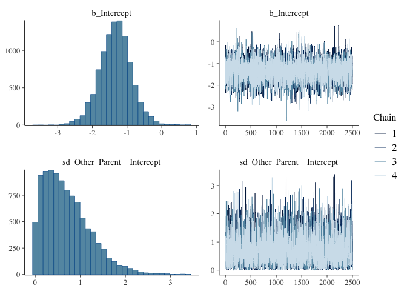
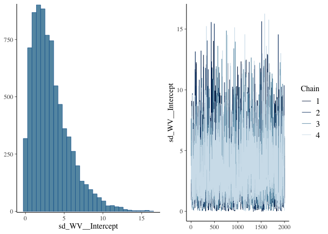
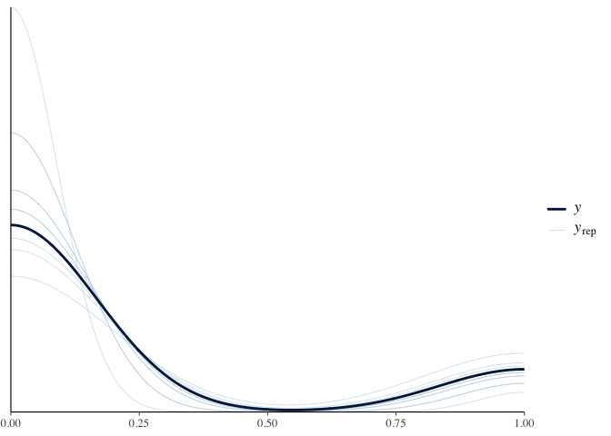
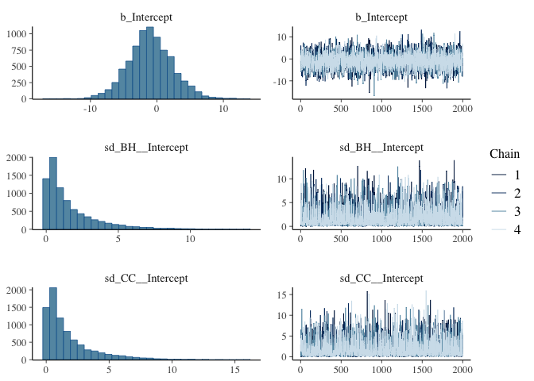
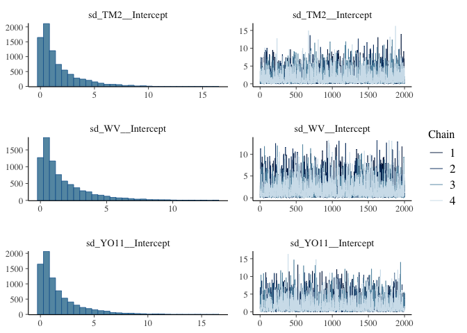
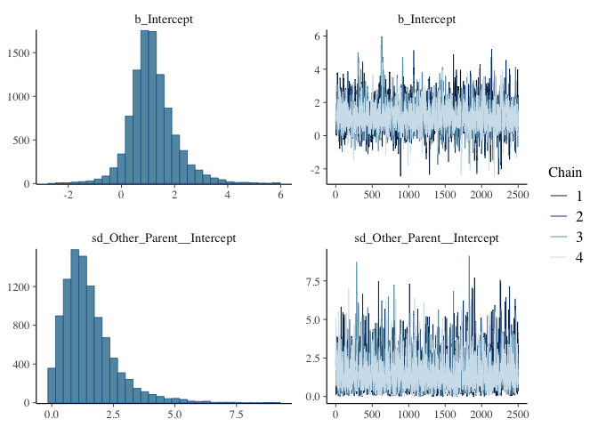
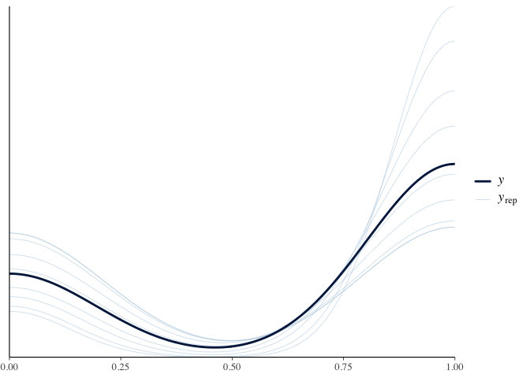
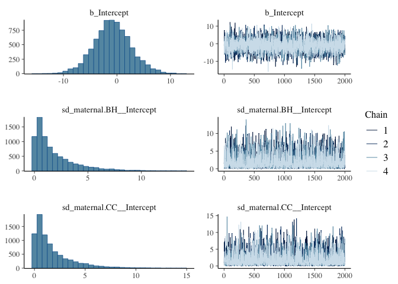
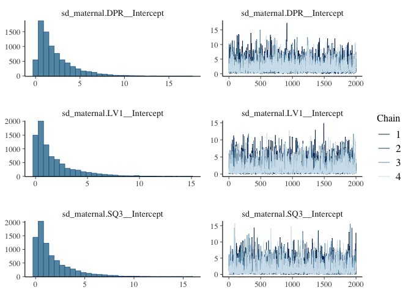

# Analysis of Survival at WL2 2024 Garden to Plant for BC2 crosses

To Do:
-   See Julin's code for poperly calculating sem for surv

## Relevant Libraries and Functions

``` r
library(tidyverse)
```

```
## ── Attaching core tidyverse packages ──────────────────────── tidyverse 2.0.0 ──
## ✔ dplyr     1.1.4     ✔ readr     2.1.5
## ✔ forcats   1.0.0     ✔ stringr   1.5.1
## ✔ ggplot2   3.5.1     ✔ tibble    3.2.1
## ✔ lubridate 1.9.3     ✔ tidyr     1.3.1
## ✔ purrr     1.0.2     
## ── Conflicts ────────────────────────────────────────── tidyverse_conflicts() ──
## ✖ dplyr::filter() masks stats::filter()
## ✖ dplyr::lag()    masks stats::lag()
## ℹ Use the conflicted package (<http://conflicted.r-lib.org/>) to force all conflicts to become errors
```

``` r
#library(tidymodels)
#library(lmerTest) #for mixed effect models
#conflicted::conflicts_prefer(lmerTest::lmer)
#library(broom.mixed) #tidy method for lmerTest
#library(emmeans) #for post-hoc pairwise comparisons 
#library(naniar) #replaces values with NA
#tidymodels_prefer()
library(brms)
```

```
## Loading required package: Rcpp
## Loading 'brms' package (version 2.22.0). Useful instructions
## can be found by typing help('brms'). A more detailed introduction
## to the package is available through vignette('brms_overview').
## 
## Attaching package: 'brms'
## 
## The following object is masked from 'package:stats':
## 
##     ar
```

``` r
elev_three_palette <- c("#0043F0", "#C9727F", "#F5A540") #colors from Gremer et al 2019
elev_order <- c("High", "Mid", "Low") #for proper arrangement in figures 
```

## Load pop and location data

``` r
plant_info <- read_csv("../input/WL2_2024_Data/WL2_Final_2023_2024_Pop_Loc_Info.csv")
```

```
## Rows: 1217 Columns: 15
## ── Column specification ────────────────────────────────────────────────────────
## Delimiter: ","
## chr (8): Pop.Type, status, block, loc, bed, bedcol, pop, unique.ID
## dbl (7): bed.block.order, bed.order, AB.CD.order, column.order, bedrow, mf, rep
## 
## ℹ Use `spec()` to retrieve the full column specification for this data.
## ℹ Specify the column types or set `show_col_types = FALSE` to quiet this message.
```

``` r
head(plant_info)
```

```
## # A tibble: 6 × 15
##   bed.block.order bed.order AB.CD.order column.order Pop.Type status block loc  
##             <dbl>     <dbl>       <dbl>        <dbl> <chr>    <chr>  <chr> <chr>
## 1               1         1           1            1 2023-TM… 2023-… <NA>  A_1_A
## 2              22        12           1            1 2023-su… 2023-… <NA>  A_6_B
## 3              62        32           1            1 2023-su… 2023-… <NA>  A_16…
## 4              65        33           1            1 2023-su… 2023-… <NA>  A_17…
## 5              69        35           1            1 2023-su… 2023-… <NA>  A_18…
## 6              93        47           1            1 2023-su… 2023-… <NA>  A_24…
## # ℹ 7 more variables: bed <chr>, bedrow <dbl>, bedcol <chr>, pop <chr>,
## #   mf <dbl>, rep <dbl>, unique.ID <chr>
```

``` r
unique(plant_info$Pop.Type) #info about whether the plant is from 2023, an F1, F2, or parent 
```

```
## [1] "2023-TM2-fruit" "2023-survivor"  NA               "F2"            
## [5] "Parent"         "F1"
```

``` r
unique(plant_info$status) #status info for planting (i.e. available spot to plant or not)
```

```
## [1] "2023-TM2-fruit" "2023-survivor"  "buffer"         "available"     
## [5] NA
```

``` r
plant_info_to_merge <- plant_info %>% 
  select(Pop.Type, block, parent.pop=pop,mf:unique.ID) %>% 
  filter(!is.na(parent.pop))

pop_loc <- read_csv("../input/Strep_tort_locs.csv")
```

```
## Rows: 54 Columns: 7
## ── Column specification ────────────────────────────────────────────────────────
## Delimiter: ","
## chr (6): Species epithet, Species Code, Site, Site code, Lat, Long
## dbl (1): Elevation (m)
## 
## ℹ Use `spec()` to retrieve the full column specification for this data.
## ℹ Specify the column types or set `show_col_types = FALSE` to quiet this message.
```

``` r
head(pop_loc)
```

```
## # A tibble: 6 × 7
##   `Species epithet` `Species Code` Site  `Site code` Lat   Long  `Elevation (m)`
##   <chr>             <chr>          <chr> <chr>       <chr> <chr>           <dbl>
## 1 Streptanthus tor… STTO           Ben … BH          37.4… -119…            511.
## 2 Streptanthus tor… STTO           Bidw… BB          39.5… -121…            283.
## 3 Streptanthus tor… STTO           Cany… CC          39.5… -121…            313 
## 4 Streptanthus tor… STTO           Cars… CP1         38.6… -120…           2422.
## 5 Streptanthus tor… STTO           Cars… CP2         38.6… -120…           2244.
## 6 Streptanthus tor… STTO           Cars… CP3         38.7… -120…           2266.
```

``` r
unique(pop_loc$`Site code`)
```

```
##  [1] "BH"     "BB"     "CC"     "CP1"    "CP2"    "CP3"    "DP"     "DPR"   
##  [9] "FR"     NA       "HH"     "IH"     "KC1"    "KC2"    "KC3"    "LV1"   
## [17] "LV2"    "LV3"    "LVTR1"  "LVTR2"  "LVTR3"  "SQ1"    "SQ2"    "SQ3"   
## [25] "SHA"    "SC"     "TM1"    "TM2"    "WR"     "WV"     "WL1"    "WL2"   
## [33] "WL3"    "WL4"    "YOSE1"  "YOSE10" "YOSE11" "YOSE12" "YOSE13" "YOSE2" 
## [41] "YOSE3"  "YOSE4"  "YOSE5"  "YOSE6"  "YOSE7"  "YOSE8"  "YOSE9"
```

``` r
unique(plant_info_to_merge$parent.pop)
```

```
##  [1] "TM2"                        "CC"                        
##  [3] "BH"                         "WL2"                       
##  [5] "IH"                         "SC"                        
##  [7] "YO7"                        "SQ1"                       
##  [9] "(WV x WL2) x (WV)"          "(LV1 x WL2) x (TM2 x WL2)" 
## [11] "(TM2 x WL2) x (SQ3 x WL2)"  "(WL2 x BH) x (SQ3 x WL2)"  
## [13] "(TM2 x WL2) x (TM2 x WL2)"  "(LV1 x WL2) x (WL2 x DPR)" 
## [15] "(WL1 x WL2) x (BH x WL2)"   "(TM2 x WL2) x (YO11 x WL2)"
## [17] "(WL1 x WL2) x (WL2 x TM2)"  "(WL2 x TM2) x (CC x TM2)"  
## [19] "WV x TM2"                   "(WL2 x DPR) x (WL2)"       
## [21] "(TM2 x WL2) x (TM2)"        "(SQ3 x WL2) x (YO11 x WL2)"
## [23] "(SQ3 x WL2) x (SQ3 x WL2)"  "(YO11 x WL2) x (SQ3 x WL2)"
## [25] "(WL1 x WL2) x (WL2 x CC)"   "(LV1 x WL2) x (WL2)"       
## [27] "(TM2 x BH) x (TM2 x BH)"    "(LV1 x WL2) x (SQ3 x WL2)" 
## [29] "(DPR x WL2) x (YO11 x WL2)" "WV"                        
## [31] "(DPR x WL2) x (WV x WL2)"   "LV1 x WL2"                 
## [33] "(WV) x (WV x WL2)"          "LV1"                       
## [35] "LV1 x TM2"                  "(YO11 x WL2) x (WL2)"      
## [37] "(TM2 x BH) x (TM2)"         "TM2 x WL2"                 
## [39] "(YO11 x WL2) x (DPR x WL2)" "CC x TM2"                  
## [41] "(DPR) x (WL2 x DPR)"        "(WL2 x DPR) x (TM2 x WL2)" 
## [43] "(SQ3 x WL2) x (TM2 x WL2)"  "(TM2 x WL2) x (WL2)"       
## [45] "(WL2 x BH) x (WL2 x TM2)"   "(WL2 x CC) x (WL2 x TM2)"  
## [47] "(WL2) x (DPR x WL2)"        "WV x WL2"                  
## [49] "SQ3"                        "(SQ3 x WL2) x (WL2)"       
## [51] "(LV1 x WL2) x (YO11 x WL2)" "(BH) x (TM2 x BH)"         
## [53] "(TM2 x BH) x (BH)"          "WL1"                       
## [55] "(WL2) x (WV x WL2)"         "BH x TM2"                  
## [57] "(YO11 x WL2) x (WL2 x TM2)" "(WL2 x CC) x (SQ3 x WL2)"  
## [59] "(DPR) x (DPR x WL2)"        "(SQ3 x WL2) x (LV1 x WL2)" 
## [61] "WL2 x BH"                   "(TM2 x BH) x (TM2 x WL2)"  
## [63] "DPR"                        "(WL1 x TM2) x (WL2 x TM2)" 
## [65] "(YO11 x WL2) x (WV x WL2)"  "(SQ3 x WL2) x (DPR x WL2)" 
## [67] "DPR x WL2"                  "(LV1 x WL2) x (LV1 x WL2)" 
## [69] "BH x WL2"                   "(WV x WL2) x (WL2 x DPR)"  
## [71] "(WL2 x DPR) x (YO11 x WL2)" "YO11"                      
## [73] "(WL2) x (TM2 x WL2)"        "(TM2) x (TM2 x WL2)"       
## [75] "SQ3 x WL2"                  "(CC x TM2) x (WL2 x TM2)"  
## [77] "(TM2 x WL2) x (LV1 x WL2)"  "(DPR x WL2) x (SQ3 x WL2)" 
## [79] "WR"                         "(TM2 x WL2) x (DPR x WL2)" 
## [81] "(WL2 x DPR) x (DPR)"        "Buffer"                    
## [83] "(YO11 x WL2) x (TM2 x WL2)" "(DPR x WL2) x (DPR x WL2)" 
## [85] "(DPR x WL2) x (TM2 x WL2)"  "TM2 x YO11"                
## [87] "buffer"                     "(TM2) x (TM2 x BH)"        
## [89] "(TM2 x WL2) x (TM2 x BH)"   "(WL2 x TM2) x (WL2)"       
## [91] "(TM2 x WL2) x (WV x WL2)"
```

``` r
#need to change YOSE to YO
pop_loc_yo <- pop_loc %>% mutate(parent.pop = str_replace(`Site code`, "YOSE(\\d+)", "YO\\1")) %>% select(Lat, Long, elev_m=`Elevation (m)`, parent.pop)
unique(pop_loc_yo$parent.pop)
```

```
##  [1] "BH"    "BB"    "CC"    "CP1"   "CP2"   "CP3"   "DP"    "DPR"   "FR"   
## [10] NA      "HH"    "IH"    "KC1"   "KC2"   "KC3"   "LV1"   "LV2"   "LV3"  
## [19] "LVTR1" "LVTR2" "LVTR3" "SQ1"   "SQ2"   "SQ3"   "SHA"   "SC"    "TM1"  
## [28] "TM2"   "WR"    "WV"    "WL1"   "WL2"   "WL3"   "WL4"   "YO1"   "YO10" 
## [37] "YO11"  "YO12"  "YO13"  "YO2"   "YO3"   "YO4"   "YO5"   "YO6"   "YO7"  
## [46] "YO8"   "YO9"
```

``` r
pop_elev <- left_join(plant_info_to_merge, pop_loc_yo)
```

```
## Joining with `by = join_by(parent.pop)`
```

``` r
head(pop_elev)
```

```
## # A tibble: 6 × 9
##   Pop.Type       block parent.pop    mf   rep unique.ID Lat      Long     elev_m
##   <chr>          <chr> <chr>      <dbl> <dbl> <chr>     <chr>    <chr>     <dbl>
## 1 2023-TM2-fruit <NA>  TM2            6    11 TM2_6_11  39.59255 -121.55…   379.
## 2 2023-survivor  <NA>  CC             3     3 CC_3_3    39.58597 -121.43…   313 
## 3 2023-survivor  <NA>  BH             3     3 BH_3_3    37.40985 -119.96…   511.
## 4 2023-survivor  <NA>  BH             7     3 BH_7_3    37.40985 -119.96…   511.
## 5 2023-survivor  <NA>  BH             4     3 BH_4_3    37.40985 -119.96…   511.
## 6 2023-survivor  <NA>  WL2            7     9 WL2_7_9   38.8263  -120.25…  2020.
```

## Load the mort/pheno data

``` r
mort_pheno_1023 <- read_csv("../input/WL2_2024_Data/CorrectedCSVs/WL2_mort_pheno_20241023_corrected.csv", 
                            na = c("", "NA", "-", "N/A")) %>% arrange(death.date)
```

```
## Rows: 1217 Columns: 13
## ── Column specification ────────────────────────────────────────────────────────
## Delimiter: ","
## chr (12): block, bed, col, unique.ID, bud.date, flower.date, fruit.date, las...
## dbl  (1): row
## 
## ℹ Use `spec()` to retrieve the full column specification for this data.
## ℹ Specify the column types or set `show_col_types = FALSE` to quiet this message.
```

``` r
head(mort_pheno_1023)
```

```
## # A tibble: 6 × 13
##   block bed     row col   unique.ID bud.date flower.date fruit.date last.FL.date
##   <chr> <chr> <dbl> <chr> <chr>     <chr>    <chr>       <chr>      <chr>       
## 1 <NA>  A        45 B     IH_2_4    7/2/24   7/16/24     7/23/24    9/3/24      
## 2 B     C        28 C     251       <NA>     <NA>        <NA>       <NA>        
## 3 <NA>  C        30 C     BH_4_7    6/25/24  7/9/24      7/16/24    8/27/24     
## 4 E     D        20 B     141       <NA>     <NA>        <NA>       <NA>        
## 5 G     D        48 A     485       <NA>     <NA>        <NA>       <NA>        
## 6 F     D        37 D     312       <NA>     <NA>        <NA>       <NA>        
## # ℹ 4 more variables: last.FR.date <chr>, death.date <chr>, missing.date <chr>,
## #   survey.notes <chr>
```

``` r
names(mort_pheno_1023)
```

```
##  [1] "block"        "bed"          "row"          "col"          "unique.ID"   
##  [6] "bud.date"     "flower.date"  "fruit.date"   "last.FL.date" "last.FR.date"
## [11] "death.date"   "missing.date" "survey.notes"
```

``` r
unique(mort_pheno_1023$bed) #D and "D."
```

```
##  [1] "A"  "C"  "D"  "E"  "H"  "B"  "J"  "G"  "K"  "F"  "I"  "D."
```

``` r
unique(mort_pheno_1023$death.date)  
```

```
##  [1] "10/16/24" "10/2/24"  "10/23/24" "10/9/24"  "6/18/24"  "6/25/24" 
##  [7] "7/16/24"  "7/2/24"   "7/23/24"  "7/30/24"  "7/9/24"   "8/13/24" 
## [13] "8/20/24"  "8/27/24"  "8/6/24"   "9/10/24"  "9/17/24"  "9/24/24" 
## [19] "9/3/24"   NA
```

``` r
#some dates should be checked: 6/24, 6/27 - both were data verifcation errors, corrected on csv. 

mort_pheno_1023_nobuff <- mort_pheno_1023 %>% 
  filter(unique.ID !="buffer") %>% 
  filter(!is.na(unique.ID))
```

## Merge with location info 

``` r
oct_mort_loc <- left_join(mort_pheno_1023_nobuff, pop_elev) 
```

```
## Joining with `by = join_by(block, unique.ID)`
```

``` r
head(oct_mort_loc)
```

```
## # A tibble: 6 × 20
##   block bed     row col   unique.ID bud.date flower.date fruit.date last.FL.date
##   <chr> <chr> <dbl> <chr> <chr>     <chr>    <chr>       <chr>      <chr>       
## 1 <NA>  A        45 B     IH_2_4    7/2/24   7/16/24     7/23/24    9/3/24      
## 2 B     C        28 C     251       <NA>     <NA>        <NA>       <NA>        
## 3 <NA>  C        30 C     BH_4_7    6/25/24  7/9/24      7/16/24    8/27/24     
## 4 E     D        20 B     141       <NA>     <NA>        <NA>       <NA>        
## 5 G     D        48 A     485       <NA>     <NA>        <NA>       <NA>        
## 6 F     D        37 D     312       <NA>     <NA>        <NA>       <NA>        
## # ℹ 11 more variables: last.FR.date <chr>, death.date <chr>,
## #   missing.date <chr>, survey.notes <chr>, Pop.Type <chr>, parent.pop <chr>,
## #   mf <dbl>, rep <dbl>, Lat <chr>, Long <chr>, elev_m <dbl>
```

``` r
names(oct_mort_loc)
```

```
##  [1] "block"        "bed"          "row"          "col"          "unique.ID"   
##  [6] "bud.date"     "flower.date"  "fruit.date"   "last.FL.date" "last.FR.date"
## [11] "death.date"   "missing.date" "survey.notes" "Pop.Type"     "parent.pop"  
## [16] "mf"           "rep"          "Lat"          "Long"         "elev_m"
```

``` r
oct_mort_loc %>% filter(!is.na(missing.date)) #11 2024 plants with a missing date & 1 2023 plant that went missing 
```

```
## # A tibble: 12 × 20
##    block bed     row col   unique.ID bud.date flower.date fruit.date
##    <chr> <chr> <dbl> <chr> <chr>     <chr>    <chr>       <chr>     
##  1 B     C        31 D     853       <NA>     <NA>        <NA>      
##  2 C     C        46 D     429       <NA>     <NA>        <NA>      
##  3 F     D        42 A     1232      <NA>     <NA>        <NA>      
##  4 G     D        56 A     558       <NA>     <NA>        <NA>      
##  5 F     D        38 C     1269      <NA>     <NA>        <NA>      
##  6 I     E        45 A     1025      <NA>     <NA>        <NA>      
##  7 I     E        25 D     637       <NA>     <NA>        <NA>      
##  8 J     F         8 B     729       <NA>     <NA>        <NA>      
##  9 J     F        14 B     1251      <NA>     <NA>        <NA>      
## 10 J     F        18 B     208       <NA>     <NA>        <NA>      
## 11 L     G         4 A     1238      <NA>     <NA>        <NA>      
## 12 <NA>  H        12 B     SC_2_1    <NA>     <NA>        <NA>      
## # ℹ 12 more variables: last.FL.date <chr>, last.FR.date <chr>,
## #   death.date <chr>, missing.date <chr>, survey.notes <chr>, Pop.Type <chr>,
## #   parent.pop <chr>, mf <dbl>, rep <dbl>, Lat <chr>, Long <chr>, elev_m <dbl>
```

``` r
oct_mort_loc %>% filter(Pop.Type=="2023-survivor") # double checked none of these plants were actually alive (no data)
```

```
## # A tibble: 131 × 20
##    block bed     row col   unique.ID bud.date flower.date fruit.date
##    <chr> <chr> <dbl> <chr> <chr>     <chr>    <chr>       <chr>     
##  1 <NA>  A        45 B     IH_2_4    7/2/24   7/16/24     7/23/24   
##  2 <NA>  C        30 C     BH_4_7    6/25/24  7/9/24      7/16/24   
##  3 <NA>  D        51 C     IH_1_8    6/25/24  7/16/24     7/23/24   
##  4 <NA>  E        46 B     IH_3_11   7/2/24   7/30/24     8/6/24    
##  5 <NA>  A        17 A     BH_7_3    6/18/24  7/2/24      7/9/24    
##  6 <NA>  A        24 A     WL2_7_9   6/18/24  6/18/24     7/2/24    
##  7 <NA>  A        32 B     IH_7_4    6/18/24  7/9/24      7/16/24   
##  8 <NA>  A        35 A     SC_8_4    6/18/24  7/2/24      7/16/24   
##  9 <NA>  A        36 A     BH_3_4    6/18/24  7/9/24      7/16/24   
## 10 <NA>  A        39 B     WL2_7_10  6/18/24  6/18/24     7/2/24    
## # ℹ 121 more rows
## # ℹ 12 more variables: last.FL.date <chr>, last.FR.date <chr>,
## #   death.date <chr>, missing.date <chr>, survey.notes <chr>, Pop.Type <chr>,
## #   parent.pop <chr>, mf <dbl>, rep <dbl>, Lat <chr>, Long <chr>, elev_m <dbl>
```

## Survival 

### Add Surv columns 

``` r
wl2_surv <- oct_mort_loc %>% 
  filter(Pop.Type != "2023-TM2-fruit") %>% #take out 2023 fruiting locations 
  filter(is.na(missing.date)) %>% #take out plants that went missing 
  mutate(Surv_to_Oct = if_else(is.na(death.date), 1, 0), #surv to end of 2024 survey season
         Surv_Post_Transplant = if_else(is.na(death.date), 1,
           if_else(death.date=="6/18/24" | death.date=="6/25/24", 0, 1))) %>% #surv 2 weeks post-transplant
  select(Lat:elev_m, Pop.Type:rep, block:unique.ID, death.date, Surv_to_Oct, Surv_Post_Transplant, missing.date, survey.notes)

head(wl2_surv)
```

```
## # A tibble: 6 × 17
##   Lat      Long   elev_m Pop.Type parent.pop    mf   rep block bed     row col  
##   <chr>    <chr>   <dbl> <chr>    <chr>      <dbl> <dbl> <chr> <chr> <dbl> <chr>
## 1 39.09332 -120.…   454. 2023-su… IH             2     4 <NA>  A        45 B    
## 2 <NA>     <NA>      NA  F2       (WL2 x BH…    NA    16 B     C        28 C    
## 3 37.40985 -119.…   511. 2023-su… BH             4     7 <NA>  C        30 C    
## 4 38.8263  -120.…  2020. Parent   WL2           NA    46 E     D        20 B    
## 5 39.59255 -121.…   379. Parent   TM2           NA    15 G     D        48 A    
## 6 <NA>     <NA>      NA  F2       (TM2 x WL…    NA     8 F     D        37 D    
## # ℹ 6 more variables: unique.ID <chr>, death.date <chr>, Surv_to_Oct <dbl>,
## #   Surv_Post_Transplant <dbl>, missing.date <chr>, survey.notes <chr>
```

``` r
tail(wl2_surv)
```

```
## # A tibble: 6 × 17
##   Lat      Long   elev_m Pop.Type parent.pop    mf   rep block bed     row col  
##   <chr>    <chr>   <dbl> <chr>    <chr>      <dbl> <dbl> <chr> <chr> <dbl> <chr>
## 1 <NA>     <NA>      NA  F1       LV1 x TM2     NA    26 P     I        11 A    
## 2 37.40985 -119.…   511. 2023-su… BH             1     1 <NA>  I        18 A    
## 3 39.22846 -120.…  1019. Parent   DPR           NA    15 P     I        10 D    
## 4 37.40985 -119.…   511. 2023-su… BH             4     2 <NA>  J        10 A    
## 5 37.80903 -119.…  2470. 2023-su… YO7            7    11 <NA>  J        15 A    
## 6 37.40985 -119.…   511. 2023-su… BH             6     2 <NA>  J        13 C    
## # ℹ 6 more variables: unique.ID <chr>, death.date <chr>, Surv_to_Oct <dbl>,
## #   Surv_Post_Transplant <dbl>, missing.date <chr>, survey.notes <chr>
```

## F1s


``` r
wl2_surv_F1 <- wl2_surv %>% 
  filter(Pop.Type=="F1") %>% 
  unite(Field_Loc, bed:col, sep="_") %>% 
  select(Pop.Type:parent.pop, Field_Loc, unique.ID:Surv_Post_Transplant, survey.notes) %>% 
  separate_wider_delim(parent.pop, " x ", names = c("maternal.pop", "paternal.pop"), cols_remove = FALSE) %>% 
  mutate(WL2.cross = if_else(maternal.pop=="WL2" | paternal.pop=="WL2", TRUE, FALSE))
wl2_surv_F1
```

```
## # A tibble: 103 × 11
##    Pop.Type maternal.pop paternal.pop parent.pop Field_Loc unique.ID death.date
##    <chr>    <chr>        <chr>        <chr>      <chr>     <chr>     <chr>     
##  1 F1       CC           TM2          CC x TM2   C_38_A    1362      6/18/24   
##  2 F1       BH           TM2          BH x TM2   C_17_D    600       6/18/24   
##  3 F1       LV1          WL2          LV1 x WL2  D_52_C    1271      6/18/24   
##  4 F1       LV1          TM2          LV1 x TM2  H_15_C    1246      6/18/24   
##  5 F1       TM2          WL2          TM2 x WL2  C_32_B    1279      6/25/24   
##  6 F1       WV           TM2          WV x TM2   C_49_B    201       6/25/24   
##  7 F1       LV1          TM2          LV1 x TM2  C_56_B    1241      6/25/24   
##  8 F1       LV1          TM2          LV1 x TM2  C_13_D    1245      6/25/24   
##  9 F1       LV1          TM2          LV1 x TM2  D_23_A    1231      6/25/24   
## 10 F1       TM2          WL2          TM2 x WL2  D_18_C    1281      6/25/24   
## # ℹ 93 more rows
## # ℹ 4 more variables: Surv_to_Oct <dbl>, Surv_Post_Transplant <dbl>,
## #   survey.notes <chr>, WL2.cross <lgl>
```

``` r
xtabs(~Surv_to_Oct+WL2.cross, data=wl2_surv_F1) #slightly higher surv in WL2 crosses 
```

```
##            WL2.cross
## Surv_to_Oct FALSE TRUE
##           0    51   35
##           1     9    8
```

``` r
xtabs(~Surv_Post_Transplant+WL2.cross, data=wl2_surv_F1) #slightly higher surv in TM2 crosses
```

```
##                     WL2.cross
## Surv_Post_Transplant FALSE TRUE
##                    0    10   13
##                    1    50   30
```

### Calculate Yes/No Parents

``` r
wl2_surv_F1_binary <- wl2_surv_F1 %>% 
 # filter(WL2.cross=="TRUE") %>% #if want TM2 F1s just # this out 
  mutate(WL2=if_else(str_detect(parent.pop, "WL2"), 1, 0),
         CC=if_else(str_detect(parent.pop, "CC"), 1, 0),
         BH=if_else(str_detect(parent.pop, "BH"), 1, 0),
         WV=if_else(str_detect(parent.pop, "WV"), 1, 0),
         LV1=if_else(str_detect(parent.pop, "LV1"), 1, 0),
         TM2=if_else(str_detect(parent.pop, "TM2"), 1, 0),
         SQ3=if_else(str_detect(parent.pop, "SQ3"), 1, 0),
         DPR=if_else(str_detect(parent.pop, "DPR"), 1, 0),
         YO11=if_else(str_detect(parent.pop, "YO11"), 1, 0))
head(wl2_surv_F1_binary, 20)
```

```
## # A tibble: 20 × 20
##    Pop.Type maternal.pop paternal.pop parent.pop Field_Loc unique.ID death.date
##    <chr>    <chr>        <chr>        <chr>      <chr>     <chr>     <chr>     
##  1 F1       CC           TM2          CC x TM2   C_38_A    1362      6/18/24   
##  2 F1       BH           TM2          BH x TM2   C_17_D    600       6/18/24   
##  3 F1       LV1          WL2          LV1 x WL2  D_52_C    1271      6/18/24   
##  4 F1       LV1          TM2          LV1 x TM2  H_15_C    1246      6/18/24   
##  5 F1       TM2          WL2          TM2 x WL2  C_32_B    1279      6/25/24   
##  6 F1       WV           TM2          WV x TM2   C_49_B    201       6/25/24   
##  7 F1       LV1          TM2          LV1 x TM2  C_56_B    1241      6/25/24   
##  8 F1       LV1          TM2          LV1 x TM2  C_13_D    1245      6/25/24   
##  9 F1       LV1          TM2          LV1 x TM2  D_23_A    1231      6/25/24   
## 10 F1       TM2          WL2          TM2 x WL2  D_18_C    1281      6/25/24   
## 11 F1       LV1          TM2          LV1 x TM2  D_45_D    1233      6/25/24   
## 12 F1       LV1          WL2          LV1 x WL2  E_43_C    1259      6/25/24   
## 13 F1       BH           TM2          BH x TM2   E_46_C    594       6/25/24   
## 14 F1       LV1          WL2          LV1 x WL2  F_21_A    1270      6/25/24   
## 15 F1       WL2          BH           WL2 x BH   G_18_B    833       6/25/24   
## 16 F1       TM2          WL2          TM2 x WL2  G_24_A    1277      6/25/24   
## 17 F1       LV1          WL2          LV1 x WL2  G_32_A    1254      6/25/24   
## 18 F1       SQ3          WL2          SQ3 x WL2  G_15_D    644       6/25/24   
## 19 F1       LV1          WL2          LV1 x WL2  H_15_B    1263      6/25/24   
## 20 F1       BH           TM2          BH x TM2   H_30_B    587       6/25/24   
## # ℹ 13 more variables: Surv_to_Oct <dbl>, Surv_Post_Transplant <dbl>,
## #   survey.notes <chr>, WL2.cross <lgl>, WL2 <dbl>, CC <dbl>, BH <dbl>,
## #   WV <dbl>, LV1 <dbl>, TM2 <dbl>, SQ3 <dbl>, DPR <dbl>, YO11 <dbl>
```

``` r
summary(wl2_surv_F1_binary)
```

```
##    Pop.Type         maternal.pop       paternal.pop        parent.pop       
##  Length:103         Length:103         Length:103         Length:103        
##  Class :character   Class :character   Class :character   Class :character  
##  Mode  :character   Mode  :character   Mode  :character   Mode  :character  
##                                                                             
##                                                                             
##                                                                             
##   Field_Loc          unique.ID          death.date         Surv_to_Oct   
##  Length:103         Length:103         Length:103         Min.   :0.000  
##  Class :character   Class :character   Class :character   1st Qu.:0.000  
##  Mode  :character   Mode  :character   Mode  :character   Median :0.000  
##                                                           Mean   :0.165  
##                                                           3rd Qu.:0.000  
##                                                           Max.   :1.000  
##  Surv_Post_Transplant survey.notes       WL2.cross            WL2        
##  Min.   :0.0000       Length:103         Mode :logical   Min.   :0.0000  
##  1st Qu.:1.0000       Class :character   FALSE:60        1st Qu.:0.0000  
##  Median :1.0000       Mode  :character   TRUE :43        Median :0.0000  
##  Mean   :0.7767                                          Mean   :0.4175  
##  3rd Qu.:1.0000                                          3rd Qu.:1.0000  
##  Max.   :1.0000                                          Max.   :1.0000  
##        CC                BH               WV              LV1        
##  Min.   :0.00000   Min.   :0.0000   Min.   :0.0000   Min.   :0.0000  
##  1st Qu.:0.00000   1st Qu.:0.0000   1st Qu.:0.0000   1st Qu.:0.0000  
##  Median :0.00000   Median :0.0000   Median :0.0000   Median :0.0000  
##  Mean   :0.01942   Mean   :0.1359   Mean   :0.3301   Mean   :0.3398  
##  3rd Qu.:0.00000   3rd Qu.:0.0000   3rd Qu.:1.0000   3rd Qu.:1.0000  
##  Max.   :1.00000   Max.   :1.0000   Max.   :1.0000   Max.   :1.0000  
##       TM2              SQ3               DPR               YO11         
##  Min.   :0.0000   Min.   :0.00000   Min.   :0.00000   Min.   :0.000000  
##  1st Qu.:0.0000   1st Qu.:0.00000   1st Qu.:0.00000   1st Qu.:0.000000  
##  Median :1.0000   Median :0.00000   Median :0.00000   Median :0.000000  
##  Mean   :0.6699   Mean   :0.03884   Mean   :0.03884   Mean   :0.009709  
##  3rd Qu.:1.0000   3rd Qu.:0.00000   3rd Qu.:0.00000   3rd Qu.:0.000000  
##  Max.   :1.0000   Max.   :1.00000   Max.   :1.00000   Max.   :1.000000
```

``` r
#switch to long format?
#could try switching to character?

xtabs(~Surv_to_Oct+WL2, data=wl2_surv_F1_binary)
```

```
##            WL2
## Surv_to_Oct  0  1
##           0 51 35
##           1  9  8
```

``` r
xtabs(~Surv_to_Oct+CC, data=wl2_surv_F1_binary)
```

```
##            CC
## Surv_to_Oct  0  1
##           0 84  2
##           1 17  0
```

``` r
xtabs(~Surv_to_Oct+BH, data=wl2_surv_F1_binary)
```

```
##            BH
## Surv_to_Oct  0  1
##           0 73 13
##           1 16  1
```

``` r
xtabs(~Surv_to_Oct+WV, data=wl2_surv_F1_binary)
```

```
##            WV
## Surv_to_Oct  0  1
##           0 60 26
##           1  9  8
```

``` r
xtabs(~Surv_to_Oct+LV1, data=wl2_surv_F1_binary)
```

```
##            LV1
## Surv_to_Oct  0  1
##           0 57 29
##           1 11  6
```

``` r
xtabs(~Surv_to_Oct+TM2, data=wl2_surv_F1_binary)
```

```
##            TM2
## Surv_to_Oct  0  1
##           0 28 58
##           1  6 11
```

``` r
xtabs(~Surv_to_Oct+SQ3, data=wl2_surv_F1_binary)
```

```
##            SQ3
## Surv_to_Oct  0  1
##           0 82  4
##           1 17  0
```

``` r
xtabs(~Surv_to_Oct+DPR, data=wl2_surv_F1_binary)
```

```
##            DPR
## Surv_to_Oct  0  1
##           0 82  4
##           1 17  0
```

``` r
xtabs(~Surv_to_Oct+YO11, data=wl2_surv_F1_binary)
```

```
##            YO11
## Surv_to_Oct  0  1
##           0 85  1
##           1 17  0
```

### Plot the data

``` r
wl2_surv_F1_binary_long <- wl2_surv_F1_binary %>% 
  pivot_longer(WL2:YO11, names_to = "pop", values_to = "Presence")
head(wl2_surv_F1_binary_long, 15)
```

```
## # A tibble: 15 × 13
##    Pop.Type maternal.pop paternal.pop parent.pop Field_Loc unique.ID death.date
##    <chr>    <chr>        <chr>        <chr>      <chr>     <chr>     <chr>     
##  1 F1       CC           TM2          CC x TM2   C_38_A    1362      6/18/24   
##  2 F1       CC           TM2          CC x TM2   C_38_A    1362      6/18/24   
##  3 F1       CC           TM2          CC x TM2   C_38_A    1362      6/18/24   
##  4 F1       CC           TM2          CC x TM2   C_38_A    1362      6/18/24   
##  5 F1       CC           TM2          CC x TM2   C_38_A    1362      6/18/24   
##  6 F1       CC           TM2          CC x TM2   C_38_A    1362      6/18/24   
##  7 F1       CC           TM2          CC x TM2   C_38_A    1362      6/18/24   
##  8 F1       CC           TM2          CC x TM2   C_38_A    1362      6/18/24   
##  9 F1       CC           TM2          CC x TM2   C_38_A    1362      6/18/24   
## 10 F1       BH           TM2          BH x TM2   C_17_D    600       6/18/24   
## 11 F1       BH           TM2          BH x TM2   C_17_D    600       6/18/24   
## 12 F1       BH           TM2          BH x TM2   C_17_D    600       6/18/24   
## 13 F1       BH           TM2          BH x TM2   C_17_D    600       6/18/24   
## 14 F1       BH           TM2          BH x TM2   C_17_D    600       6/18/24   
## 15 F1       BH           TM2          BH x TM2   C_17_D    600       6/18/24   
## # ℹ 6 more variables: Surv_to_Oct <dbl>, Surv_Post_Transplant <dbl>,
## #   survey.notes <chr>, WL2.cross <lgl>, pop <chr>, Presence <dbl>
```

``` r
wl2_surv_F1_binary_long_means <- wl2_surv_F1_binary_long %>% 
  group_by(WL2.cross, pop, Presence) %>% 
  summarise(N_Surv = sum(!is.na(Surv_to_Oct)), 
            mean_Surv_to_Oct = mean(Surv_to_Oct,na.rm=(TRUE)), 
            mean_Surv_Post_Transplant = mean(Surv_Post_Transplant,na.rm=(TRUE)))
```

```
## `summarise()` has grouped output by 'WL2.cross', 'pop'. You can override using
## the `.groups` argument.
```

``` r
wl2_surv_F1_binary_long_means
```

```
## # A tibble: 29 × 6
## # Groups:   WL2.cross, pop [18]
##    WL2.cross pop   Presence N_Surv mean_Surv_to_Oct mean_Surv_Post_Transplant
##    <lgl>     <chr>    <dbl>  <int>            <dbl>                     <dbl>
##  1 FALSE     BH           0     52            0.154                     0.865
##  2 FALSE     BH           1      8            0.125                     0.625
##  3 FALSE     CC           0     58            0.155                     0.845
##  4 FALSE     CC           1      2            0                         0.5  
##  5 FALSE     DPR          0     60            0.150                     0.833
##  6 FALSE     LV1          0     36            0.139                     0.861
##  7 FALSE     LV1          1     24            0.167                     0.792
##  8 FALSE     SQ3          0     60            0.150                     0.833
##  9 FALSE     TM2          1     60            0.150                     0.833
## 10 FALSE     WL2          0     60            0.150                     0.833
## # ℹ 19 more rows
```

``` r
wl2_surv_F1_binary_long_means %>% 
  filter(WL2.cross=="TRUE") %>% #if want TM2 F1s just # this out 
  ggplot(aes(x=Presence, y=mean_Surv_to_Oct, fill=Presence)) +
  geom_col(width = 0.7,position = position_dodge(0.75), colour="black") +
  #ylim(-0.05, 0.3) +
  labs(title="Survival to October - WL2 F1s") +
  #theme_classic() +
  facet_wrap(~pop)
```

<!-- -->

``` r
wl2_surv_F1_binary_long_means %>% 
  filter(WL2.cross=="TRUE") %>% #if want TM2 F1s just # this out 
  ggplot(aes(x=Presence, y=mean_Surv_Post_Transplant, fill=Presence)) +
  geom_col(width = 0.7,position = position_dodge(0.75), colour="black") +
  labs(title="Survival to Two Weeks Post-Transplant  - WL2 F1s") +
  #theme_classic() +
  facet_wrap(~pop)
```

<!-- -->


### Bayesian random
Filter to WL2 F1s Only 
Logit scale reminder: logit(x) = ln(x / (1-x));

``` r
wl2_surv_wl2F1s <- wl2_surv_F1_binary %>% filter(WL2.cross=="TRUE")  
summary(wl2_surv_wl2F1s)
```

```
##    Pop.Type         maternal.pop       paternal.pop        parent.pop       
##  Length:43          Length:43          Length:43          Length:43         
##  Class :character   Class :character   Class :character   Class :character  
##  Mode  :character   Mode  :character   Mode  :character   Mode  :character  
##                                                                             
##                                                                             
##                                                                             
##   Field_Loc          unique.ID          death.date         Surv_to_Oct   
##  Length:43          Length:43          Length:43          Min.   :0.000  
##  Class :character   Class :character   Class :character   1st Qu.:0.000  
##  Mode  :character   Mode  :character   Mode  :character   Median :0.000  
##                                                           Mean   :0.186  
##                                                           3rd Qu.:0.000  
##                                                           Max.   :1.000  
##  Surv_Post_Transplant survey.notes       WL2.cross           WL2          CC   
##  Min.   :0.0000       Length:43          Mode:logical   Min.   :1   Min.   :0  
##  1st Qu.:0.0000       Class :character   TRUE:43        1st Qu.:1   1st Qu.:0  
##  Median :1.0000       Mode  :character                  Median :1   Median :0  
##  Mean   :0.6977                                         Mean   :1   Mean   :0  
##  3rd Qu.:1.0000                                         3rd Qu.:1   3rd Qu.:0  
##  Max.   :1.0000                                         Max.   :1   Max.   :0  
##        BH               WV              LV1              TM2        
##  Min.   :0.0000   Min.   :0.0000   Min.   :0.0000   Min.   :0.0000  
##  1st Qu.:0.0000   1st Qu.:0.0000   1st Qu.:0.0000   1st Qu.:0.0000  
##  Median :0.0000   Median :0.0000   Median :0.0000   Median :0.0000  
##  Mean   :0.1395   Mean   :0.2093   Mean   :0.2558   Mean   :0.2093  
##  3rd Qu.:0.0000   3rd Qu.:0.0000   3rd Qu.:0.5000   3rd Qu.:0.0000  
##  Max.   :1.0000   Max.   :1.0000   Max.   :1.0000   Max.   :1.0000  
##       SQ3               DPR               YO11  
##  Min.   :0.00000   Min.   :0.00000   Min.   :0  
##  1st Qu.:0.00000   1st Qu.:0.00000   1st Qu.:0  
##  Median :0.00000   Median :0.00000   Median :0  
##  Mean   :0.09302   Mean   :0.09302   Mean   :0  
##  3rd Qu.:0.00000   3rd Qu.:0.00000   3rd Qu.:0  
##  Max.   :1.00000   Max.   :1.00000   Max.   :0
```

``` r
xtabs(~Surv_to_Oct+CC, data=wl2_surv_wl2F1s) #no CC x WL2 or vice versa 
```

```
##            CC
## Surv_to_Oct  0
##           0 35
##           1  8
```

``` r
xtabs(~Surv_to_Oct+BH, data=wl2_surv_wl2F1s)
```

```
##            BH
## Surv_to_Oct  0  1
##           0 29  6
##           1  8  0
```

``` r
xtabs(~Surv_to_Oct+WV, data=wl2_surv_wl2F1s)
```

```
##            WV
## Surv_to_Oct  0  1
##           0 30  5
##           1  4  4
```

``` r
xtabs(~Surv_to_Oct+LV1, data=wl2_surv_wl2F1s)
```

```
##            LV1
## Surv_to_Oct  0  1
##           0 26  9
##           1  6  2
```

``` r
xtabs(~Surv_to_Oct+TM2, data=wl2_surv_wl2F1s)
```

```
##            TM2
## Surv_to_Oct  0  1
##           0 28  7
##           1  6  2
```

``` r
xtabs(~Surv_to_Oct+SQ3, data=wl2_surv_wl2F1s)
```

```
##            SQ3
## Surv_to_Oct  0  1
##           0 31  4
##           1  8  0
```

``` r
xtabs(~Surv_to_Oct+DPR, data=wl2_surv_wl2F1s)
```

```
##            DPR
## Surv_to_Oct  0  1
##           0 31  4
##           1  8  0
```

``` r
xtabs(~Surv_to_Oct+YO11, data=wl2_surv_wl2F1s) #no YO11 x WL2 or vice versa 
```

```
##            YO11
## Surv_to_Oct  0
##           0 35
##           1  8
```


``` r
surv_parent_binary_bf1 <- brmsformula(Surv_to_Oct ~ (1|BH)+(1|WV)+(1|LV1)+(1|TM2)+(1|SQ3)+(1|DPR))

get_prior(surv_parent_binary_bf1, family = "bernoulli", data = wl2_surv_wl2F1s)
```

```
##                 prior     class      coef group resp dpar nlpar lb ub
##  student_t(3, 0, 2.5) Intercept                                      
##  student_t(3, 0, 2.5)        sd                                  0   
##  student_t(3, 0, 2.5)        sd              BH                  0   
##  student_t(3, 0, 2.5)        sd Intercept    BH                  0   
##  student_t(3, 0, 2.5)        sd             DPR                  0   
##  student_t(3, 0, 2.5)        sd Intercept   DPR                  0   
##  student_t(3, 0, 2.5)        sd             LV1                  0   
##  student_t(3, 0, 2.5)        sd Intercept   LV1                  0   
##  student_t(3, 0, 2.5)        sd             SQ3                  0   
##  student_t(3, 0, 2.5)        sd Intercept   SQ3                  0   
##  student_t(3, 0, 2.5)        sd             TM2                  0   
##  student_t(3, 0, 2.5)        sd Intercept   TM2                  0   
##  student_t(3, 0, 2.5)        sd              WV                  0   
##  student_t(3, 0, 2.5)        sd Intercept    WV                  0   
##        source
##       default
##       default
##  (vectorized)
##  (vectorized)
##  (vectorized)
##  (vectorized)
##  (vectorized)
##  (vectorized)
##  (vectorized)
##  (vectorized)
##  (vectorized)
##  (vectorized)
##  (vectorized)
##  (vectorized)
```

``` r
prior1 <- c(set_prior(prior = 'normal(0, 5)', class='Intercept'),
            set_prior(prior = 'normal(0, 5)', class='sd'))
```


``` r
surv_parent_binary_m1 <- brm(surv_parent_binary_bf1, 
                             family = "bernoulli",
                             data = wl2_surv_wl2F1s,
                             cores=4,
                             iter = 4000, #increased iterations b/c complex model
                             control = list(adapt_delta = 0.9),
                             prior=prior1) #increased adapt_delta to help with divergent transitions
```

```
## Compiling Stan program...
```

```
## Trying to compile a simple C file
```

```
## Running /Library/Frameworks/R.framework/Resources/bin/R CMD SHLIB foo.c
## using C compiler: ‘Apple clang version 16.0.0 (clang-1600.0.26.3)’
## using SDK: ‘MacOSX15.1.sdk’
## clang -arch arm64 -I"/Library/Frameworks/R.framework/Resources/include" -DNDEBUG   -I"/Users/bqc/Library/R/arm64/4.4/library/Rcpp/include/"  -I"/Users/bqc/Library/R/arm64/4.4/library/RcppEigen/include/"  -I"/Users/bqc/Library/R/arm64/4.4/library/RcppEigen/include/unsupported"  -I"/Users/bqc/Library/R/arm64/4.4/library/BH/include" -I"/Users/bqc/Library/R/arm64/4.4/library/StanHeaders/include/src/"  -I"/Users/bqc/Library/R/arm64/4.4/library/StanHeaders/include/"  -I"/Users/bqc/Library/R/arm64/4.4/library/RcppParallel/include/"  -I"/Users/bqc/Library/R/arm64/4.4/library/rstan/include" -DEIGEN_NO_DEBUG  -DBOOST_DISABLE_ASSERTS  -DBOOST_PENDING_INTEGER_LOG2_HPP  -DSTAN_THREADS  -DUSE_STANC3 -DSTRICT_R_HEADERS  -DBOOST_PHOENIX_NO_VARIADIC_EXPRESSION  -D_HAS_AUTO_PTR_ETC=0  -include '/Users/bqc/Library/R/arm64/4.4/library/StanHeaders/include/stan/math/prim/fun/Eigen.hpp'  -D_REENTRANT -DRCPP_PARALLEL_USE_TBB=1   -I/opt/R/arm64/include    -fPIC  -falign-functions=64 -Wall -g -O2  -c foo.c -o foo.o
## In file included from <built-in>:1:
## In file included from /Users/bqc/Library/R/arm64/4.4/library/StanHeaders/include/stan/math/prim/fun/Eigen.hpp:22:
## In file included from /Users/bqc/Library/R/arm64/4.4/library/RcppEigen/include/Eigen/Dense:1:
## In file included from /Users/bqc/Library/R/arm64/4.4/library/RcppEigen/include/Eigen/Core:19:
## /Users/bqc/Library/R/arm64/4.4/library/RcppEigen/include/Eigen/src/Core/util/Macros.h:679:10: fatal error: 'cmath' file not found
##   679 | #include <cmath>
##       |          ^~~~~~~
## 1 error generated.
## make: *** [foo.o] Error 1
```

```
## Start sampling
```


``` r
prior_summary(surv_parent_binary_m1)
```

```
##         prior     class      coef group resp dpar nlpar lb ub       source
##  normal(0, 5) Intercept                                               user
##  normal(0, 5)        sd                                  0            user
##  normal(0, 5)        sd              BH                  0    (vectorized)
##  normal(0, 5)        sd Intercept    BH                  0    (vectorized)
##  normal(0, 5)        sd             DPR                  0    (vectorized)
##  normal(0, 5)        sd Intercept   DPR                  0    (vectorized)
##  normal(0, 5)        sd             LV1                  0    (vectorized)
##  normal(0, 5)        sd Intercept   LV1                  0    (vectorized)
##  normal(0, 5)        sd             SQ3                  0    (vectorized)
##  normal(0, 5)        sd Intercept   SQ3                  0    (vectorized)
##  normal(0, 5)        sd             TM2                  0    (vectorized)
##  normal(0, 5)        sd Intercept   TM2                  0    (vectorized)
##  normal(0, 5)        sd              WV                  0    (vectorized)
##  normal(0, 5)        sd Intercept    WV                  0    (vectorized)
```

``` r
summary(surv_parent_binary_m1)
```

```
##  Family: bernoulli 
##   Links: mu = logit 
## Formula: Surv_to_Oct ~ (1 | BH) + (1 | WV) + (1 | LV1) + (1 | TM2) + (1 | SQ3) + (1 | DPR) 
##    Data: wl2_surv_wl2F1s (Number of observations: 43) 
##   Draws: 4 chains, each with iter = 4000; warmup = 2000; thin = 1;
##          total post-warmup draws = 8000
## 
## Multilevel Hyperparameters:
## ~BH (Number of levels: 2) 
##               Estimate Est.Error l-95% CI u-95% CI Rhat Bulk_ESS Tail_ESS
## sd(Intercept)     3.53      2.75     0.12    10.28 1.00     3782     2657
## 
## ~DPR (Number of levels: 2) 
##               Estimate Est.Error l-95% CI u-95% CI Rhat Bulk_ESS Tail_ESS
## sd(Intercept)     3.44      2.73     0.12    10.21 1.00     4284     3370
## 
## ~LV1 (Number of levels: 2) 
##               Estimate Est.Error l-95% CI u-95% CI Rhat Bulk_ESS Tail_ESS
## sd(Intercept)     2.61      2.28     0.07     8.49 1.00     3516     3652
## 
## ~SQ3 (Number of levels: 2) 
##               Estimate Est.Error l-95% CI u-95% CI Rhat Bulk_ESS Tail_ESS
## sd(Intercept)     3.43      2.80     0.12    10.45 1.00     5213     3720
## 
## ~TM2 (Number of levels: 2) 
##               Estimate Est.Error l-95% CI u-95% CI Rhat Bulk_ESS Tail_ESS
## sd(Intercept)     2.69      2.36     0.09     8.89 1.00     3239     3423
## 
## ~WV (Number of levels: 2) 
##               Estimate Est.Error l-95% CI u-95% CI Rhat Bulk_ESS Tail_ESS
## sd(Intercept)     3.27      2.43     0.17     9.44 1.00     3087     2407
## 
## Regression Coefficients:
##           Estimate Est.Error l-95% CI u-95% CI Rhat Bulk_ESS Tail_ESS
## Intercept    -1.62      4.13    -9.77     6.38 1.00     4905     5434
## 
## Draws were sampled using sampling(NUTS). For each parameter, Bulk_ESS
## and Tail_ESS are effective sample size measures, and Rhat is the potential
## scale reduction factor on split chains (at convergence, Rhat = 1).
```

``` r
#Rhat <1.05 (good!)
#ESS > 1000 (good!)
```


``` r
plot(surv_parent_binary_m1,  nvariables = 3, ask=FALSE) #plots look a little better with prior distribution adjustments 
```

<!-- --><!-- --><!-- -->

``` r
#pairs(surv_parent_binary_m1)

pp_check(surv_parent_binary_m1)  # posterior predictive checks
```

```
## Using 10 posterior draws for ppc type 'dens_overlay' by default.
```

<!-- -->

``` r
#The main use of this function is to check if you model predicts your data accurately (using the estimates). If it does, then you can use that model to generate new data and make accurate predictions.
#light blue = 10 random draws or distributions created by the model
#dark blue = posterior distribution
```

To calcualte the stats we need to extract the posterior samples, and add the Intercept to each pop random effect, and then compute the stats.


``` r
intercept <- as_draws_df(surv_parent_binary_m1, variable = "b_Intercept") %>% as_tibble() %>% select(starts_with("b"))

r_pops <- as_draws_df(surv_parent_binary_m1, variable = "*r_", regex = TRUE) %>% as_tibble() %>% select(starts_with("r"))

r_pops <- r_pops %>% mutate(across(everything(), ~ .x + intercept$b_Intercept))
```


``` r
posterior::summarize_draws(r_pops) %>%
  mutate(across(mean:q95, inv_logit_scaled))
```

```
## # A tibble: 12 × 10
##    variable        mean median    sd   mad      q5   q95  rhat ess_bulk ess_tail
##    <chr>          <dbl>  <dbl> <dbl> <dbl>   <dbl> <dbl> <dbl>    <dbl>    <dbl>
##  1 r_BH[0,Inter… 0.303  0.278  0.988 0.985 4.03e-4 0.998  1.00    5093.    5286.
##  2 r_BH[1,Inter… 0.0188 0.0274 0.997 0.994 8.85e-7 0.990  1.00    4663.    4860.
##  3 r_DPR[0,Inte… 0.274  0.262  0.987 0.984 3.36e-4 0.998  1.00    5042.    5955.
##  4 r_DPR[1,Inte… 0.0225 0.0357 0.997 0.994 1.01e-6 0.991  1.00    5322.    6009.
##  5 r_LV1[0,Inte… 0.0782 0.0816 0.986 0.984 5.83e-5 0.987  1.00    5318.    5677.
##  6 r_LV1[1,Inte… 0.196  0.190  0.991 0.989 1.27e-4 0.998  1.00    4434.    5484.
##  7 r_SQ3[0,Inte… 0.279  0.271  0.988 0.984 3.08e-4 0.998  1.00    4970.    6137.
##  8 r_SQ3[1,Inte… 0.0236 0.0381 0.997 0.994 1.08e-6 0.990  1.00    5057.    5317.
##  9 r_TM2[0,Inte… 0.0747 0.0795 0.986 0.982 6.50e-5 0.987  1.00    5611.    5277.
## 10 r_TM2[1,Inte… 0.223  0.215  0.990 0.989 1.53e-4 0.998  1.00    4630.    5534.
## 11 r_WV[0,Inter… 0.0392 0.0408 0.987 0.983 3.01e-5 0.978  1.00    5502.    5943.
## 12 r_WV[1,Inter… 0.318  0.302  0.991 0.989 2.69e-4 0.999  1.00    4542.    6023.
```

``` r
#estimates seem to be a little off...
```

## F2s


``` r
wl2_surv_F2 <- wl2_surv %>% 
  filter(Pop.Type=="F2") %>% 
  unite(Field_Loc, bed:col, sep="_") %>% 
  mutate(WL2.cross = if_else(str_detect(parent.pop, "WL2"), TRUE, FALSE)) %>% 
  select(WL2.cross, Pop.Type:parent.pop, Field_Loc, unique.ID:Surv_Post_Transplant, survey.notes) %>% 
  separate_wider_delim(parent.pop, ") x (", names = c("maternal.pops", "paternal.pops"), cols_remove = FALSE) %>%
  mutate(maternal.pops=str_remove(maternal.pops, "\\("), paternal.pops=str_remove(paternal.pops, "\\)")) 
wl2_surv_F2
```

```
## # A tibble: 435 × 11
##    WL2.cross Pop.Type maternal.pops paternal.pops parent.pop Field_Loc unique.ID
##    <lgl>     <chr>    <chr>         <chr>         <chr>      <chr>     <chr>    
##  1 TRUE      F2       WL2 x BH      WL2 x TM2     (WL2 x BH… C_28_C    251      
##  2 TRUE      F2       TM2 x WL2     SQ3 x WL2     (TM2 x WL… D_37_D    312      
##  3 TRUE      F2       WL2 x TM2     CC x TM2      (WL2 x TM… H_30_D    263      
##  4 TRUE      F2       WL2 x TM2     CC x TM2      (WL2 x TM… D_55_A    254      
##  5 TRUE      F2       WL1 x TM2     WL2 x TM2     (WL1 x TM… D_52_B    326      
##  6 TRUE      F2       WL1 x TM2     WL2 x TM2     (WL1 x TM… E_48_C    328      
##  7 TRUE      F2       TM2 x WL2     YO11 x WL2    (TM2 x WL… F_17_B    377      
##  8 TRUE      F2       TM2 x WL2     TM2           (TM2 x WL… C_28_B    347      
##  9 TRUE      F2       WL2 x DPR     TM2 x WL2     (WL2 x DP… C_42_A    1314     
## 10 TRUE      F2       WL2 x BH      SQ3 x WL2     (WL2 x BH… C_7_C     1172     
## # ℹ 425 more rows
## # ℹ 4 more variables: death.date <chr>, Surv_to_Oct <dbl>,
## #   Surv_Post_Transplant <dbl>, survey.notes <chr>
```

### Calculate yes/no for each parent 

``` r
wl2_surv_F2_binary <- wl2_surv_F2 %>% 
  filter(WL2.cross=="TRUE") %>% #if want TM2 F1s just # this out 
  mutate(WL2=if_else(str_detect(parent.pop, "WL2"), 1, 0),
         CC=if_else(str_detect(parent.pop, "CC"), 1, 0),
         BH=if_else(str_detect(parent.pop, "BH"), 1, 0),
         WV=if_else(str_detect(parent.pop, "WV"), 1, 0),
         LV1=if_else(str_detect(parent.pop, "LV1"), 1, 0),
         TM2=if_else(str_detect(parent.pop, "TM2"), 1, 0),
         SQ3=if_else(str_detect(parent.pop, "SQ3"), 1, 0),
         DPR=if_else(str_detect(parent.pop, "DPR"), 1, 0),
         YO11=if_else(str_detect(parent.pop, "YO11"), 1, 0),
         maternal.WL2=if_else(str_detect(maternal.pops, "WL2"), 1, 0),
         maternal.CC=if_else(str_detect(maternal.pops, "CC"), 1, 0),
         maternal.BH=if_else(str_detect(maternal.pops, "BH"), 1, 0),
         maternal.WV=if_else(str_detect(maternal.pops, "WV"), 1, 0),
         maternal.LV1=if_else(str_detect(maternal.pops, "LV1"), 1, 0),
         maternal.TM2=if_else(str_detect(maternal.pops, "TM2"), 1, 0),
         maternal.SQ3=if_else(str_detect(maternal.pops, "SQ3"), 1, 0),
         maternal.DPR=if_else(str_detect(maternal.pops, "DPR"), 1, 0),
         maternal.YO11=if_else(str_detect(maternal.pops, "YO11"), 1, 0))
head(wl2_surv_F2_binary, 20)
```

```
## # A tibble: 20 × 29
##    WL2.cross Pop.Type maternal.pops paternal.pops parent.pop Field_Loc unique.ID
##    <lgl>     <chr>    <chr>         <chr>         <chr>      <chr>     <chr>    
##  1 TRUE      F2       WL2 x BH      WL2 x TM2     (WL2 x BH… C_28_C    251      
##  2 TRUE      F2       TM2 x WL2     SQ3 x WL2     (TM2 x WL… D_37_D    312      
##  3 TRUE      F2       WL2 x TM2     CC x TM2      (WL2 x TM… H_30_D    263      
##  4 TRUE      F2       WL2 x TM2     CC x TM2      (WL2 x TM… D_55_A    254      
##  5 TRUE      F2       WL1 x TM2     WL2 x TM2     (WL1 x TM… D_52_B    326      
##  6 TRUE      F2       WL1 x TM2     WL2 x TM2     (WL1 x TM… E_48_C    328      
##  7 TRUE      F2       TM2 x WL2     YO11 x WL2    (TM2 x WL… F_17_B    377      
##  8 TRUE      F2       TM2 x WL2     TM2           (TM2 x WL… C_28_B    347      
##  9 TRUE      F2       WL2 x DPR     TM2 x WL2     (WL2 x DP… C_42_A    1314     
## 10 TRUE      F2       WL2 x BH      SQ3 x WL2     (WL2 x BH… C_7_C     1172     
## 11 TRUE      F2       WL1 x WL2     WL2 x CC      (WL1 x WL… C_7_D     1127     
## 12 TRUE      F2       LV1 x WL2     YO11 x WL2    (LV1 x WL… C_41_D    989      
## 13 TRUE      F2       YO11 x WL2    WV x WL2      (YO11 x W… C_56_C    842      
## 14 TRUE      F2       WV x WL2      WV            (WV x WL2… D_16_A    268      
## 15 TRUE      F2       YO11 x WL2    SQ3 x WL2     (YO11 x W… D_19_D    1005     
## 16 TRUE      F2       DPR x WL2     YO11 x WL2    (DPR x WL… E_29_B    707      
## 17 TRUE      F2       WL2 x DPR     WL2           (WL2 x DP… E_7_C     1103     
## 18 TRUE      F2       DPR x WL2     SQ3 x WL2     (DPR x WL… E_11_C    682      
## 19 TRUE      F2       WL2           DPR x WL2     (WL2) x (… F_27_D    908      
## 20 TRUE      F2       YO11 x WL2    WV x WL2      (YO11 x W… G_42_A    841      
## # ℹ 22 more variables: death.date <chr>, Surv_to_Oct <dbl>,
## #   Surv_Post_Transplant <dbl>, survey.notes <chr>, WL2 <dbl>, CC <dbl>,
## #   BH <dbl>, WV <dbl>, LV1 <dbl>, TM2 <dbl>, SQ3 <dbl>, DPR <dbl>, YO11 <dbl>,
## #   maternal.WL2 <dbl>, maternal.CC <dbl>, maternal.BH <dbl>,
## #   maternal.WV <dbl>, maternal.LV1 <dbl>, maternal.TM2 <dbl>,
## #   maternal.SQ3 <dbl>, maternal.DPR <dbl>, maternal.YO11 <dbl>
```

``` r
summary(wl2_surv_F2_binary)
```

```
##  WL2.cross        Pop.Type         maternal.pops      paternal.pops     
##  Mode:logical   Length:398         Length:398         Length:398        
##  TRUE:398       Class :character   Class :character   Class :character  
##                 Mode  :character   Mode  :character   Mode  :character  
##                                                                         
##                                                                         
##                                                                         
##   parent.pop         Field_Loc          unique.ID          death.date       
##  Length:398         Length:398         Length:398         Length:398        
##  Class :character   Class :character   Class :character   Class :character  
##  Mode  :character   Mode  :character   Mode  :character   Mode  :character  
##                                                                             
##                                                                             
##                                                                             
##   Surv_to_Oct     Surv_Post_Transplant survey.notes            WL2   
##  Min.   :0.0000   Min.   :0.0000       Length:398         Min.   :1  
##  1st Qu.:0.0000   1st Qu.:1.0000       Class :character   1st Qu.:1  
##  Median :0.0000   Median :1.0000       Mode  :character   Median :1  
##  Mean   :0.1583   Mean   :0.8216                          Mean   :1  
##  3rd Qu.:0.0000   3rd Qu.:1.0000                          3rd Qu.:1  
##  Max.   :1.0000   Max.   :1.0000                          Max.   :1  
##        CC               BH                WV              LV1        
##  Min.   :0.0000   Min.   :0.00000   Min.   :0.0000   Min.   :0.0000  
##  1st Qu.:0.0000   1st Qu.:0.00000   1st Qu.:0.0000   1st Qu.:0.0000  
##  Median :0.0000   Median :0.00000   Median :0.0000   Median :0.0000  
##  Mean   :0.1231   Mean   :0.08543   Mean   :0.1307   Mean   :0.1332  
##  3rd Qu.:0.0000   3rd Qu.:0.00000   3rd Qu.:0.0000   3rd Qu.:0.0000  
##  Max.   :1.0000   Max.   :1.00000   Max.   :1.0000   Max.   :1.0000  
##       TM2              SQ3              DPR              YO11       
##  Min.   :0.0000   Min.   :0.0000   Min.   :0.0000   Min.   :0.0000  
##  1st Qu.:0.0000   1st Qu.:0.0000   1st Qu.:0.0000   1st Qu.:0.0000  
##  Median :0.0000   Median :0.0000   Median :0.0000   Median :0.0000  
##  Mean   :0.3869   Mean   :0.1935   Mean   :0.2538   Mean   :0.1658  
##  3rd Qu.:1.0000   3rd Qu.:0.0000   3rd Qu.:1.0000   3rd Qu.:0.0000  
##  Max.   :1.0000   Max.   :1.0000   Max.   :1.0000   Max.   :1.0000  
##   maternal.WL2     maternal.CC       maternal.BH       maternal.WV     
##  Min.   :0.0000   Min.   :0.00000   Min.   :0.00000   Min.   :0.00000  
##  1st Qu.:1.0000   1st Qu.:0.00000   1st Qu.:0.00000   1st Qu.:0.00000  
##  Median :1.0000   Median :0.00000   Median :0.00000   Median :0.00000  
##  Mean   :0.8492   Mean   :0.04774   Mean   :0.06533   Mean   :0.08543  
##  3rd Qu.:1.0000   3rd Qu.:0.00000   3rd Qu.:0.00000   3rd Qu.:0.00000  
##  Max.   :1.0000   Max.   :1.00000   Max.   :1.00000   Max.   :1.00000  
##   maternal.LV1     maternal.TM2     maternal.SQ3      maternal.DPR   
##  Min.   :0.0000   Min.   :0.0000   Min.   :0.00000   Min.   :0.0000  
##  1st Qu.:0.0000   1st Qu.:0.0000   1st Qu.:0.00000   1st Qu.:0.0000  
##  Median :0.0000   Median :0.0000   Median :0.00000   Median :0.0000  
##  Mean   :0.1206   Mean   :0.2136   Mean   :0.09799   Mean   :0.1759  
##  3rd Qu.:0.0000   3rd Qu.:0.0000   3rd Qu.:0.00000   3rd Qu.:0.0000  
##  Max.   :1.0000   Max.   :1.0000   Max.   :1.00000   Max.   :1.0000  
##  maternal.YO11    
##  Min.   :0.00000  
##  1st Qu.:0.00000  
##  Median :0.00000  
##  Mean   :0.07789  
##  3rd Qu.:0.00000  
##  Max.   :1.00000
```

``` r
xtabs(~Surv_to_Oct+WL2, data=wl2_surv_F2_binary)
```

```
##            WL2
## Surv_to_Oct   1
##           0 335
##           1  63
```

``` r
xtabs(~Surv_to_Oct+CC, data=wl2_surv_F2_binary)
```

```
##            CC
## Surv_to_Oct   0   1
##           0 292  43
##           1  57   6
```

``` r
xtabs(~Surv_to_Oct+BH, data=wl2_surv_F2_binary)
```

```
##            BH
## Surv_to_Oct   0   1
##           0 306  29
##           1  58   5
```

``` r
xtabs(~Surv_to_Oct+WV, data=wl2_surv_F2_binary)
```

```
##            WV
## Surv_to_Oct   0   1
##           0 293  42
##           1  53  10
```

``` r
xtabs(~Surv_to_Oct+LV1, data=wl2_surv_F2_binary)
```

```
##            LV1
## Surv_to_Oct   0   1
##           0 289  46
##           1  56   7
```

``` r
xtabs(~Surv_to_Oct+TM2, data=wl2_surv_F2_binary)
```

```
##            TM2
## Surv_to_Oct   0   1
##           0 206 129
##           1  38  25
```

``` r
xtabs(~Surv_to_Oct+SQ3, data=wl2_surv_F2_binary)
```

```
##            SQ3
## Surv_to_Oct   0   1
##           0 266  69
##           1  55   8
```

``` r
xtabs(~Surv_to_Oct+DPR, data=wl2_surv_F2_binary)
```

```
##            DPR
## Surv_to_Oct   0   1
##           0 257  78
##           1  40  23
```

``` r
xtabs(~Surv_to_Oct+YO11, data=wl2_surv_F2_binary)
```

```
##            YO11
## Surv_to_Oct   0   1
##           0 277  58
##           1  55   8
```

``` r
xtabs(~Surv_to_Oct+WL2, data=wl2_surv_F2_binary)
```

```
##            WL2
## Surv_to_Oct   1
##           0 335
##           1  63
```

``` r
xtabs(~Surv_to_Oct+CC, data=wl2_surv_F2_binary)
```

```
##            CC
## Surv_to_Oct   0   1
##           0 292  43
##           1  57   6
```

``` r
xtabs(~Surv_to_Oct+BH, data=wl2_surv_F2_binary)
```

```
##            BH
## Surv_to_Oct   0   1
##           0 306  29
##           1  58   5
```

``` r
xtabs(~Surv_to_Oct+WV, data=wl2_surv_F2_binary)
```

```
##            WV
## Surv_to_Oct   0   1
##           0 293  42
##           1  53  10
```

``` r
xtabs(~Surv_to_Oct+LV1, data=wl2_surv_F2_binary)
```

```
##            LV1
## Surv_to_Oct   0   1
##           0 289  46
##           1  56   7
```

``` r
xtabs(~Surv_to_Oct+TM2, data=wl2_surv_F2_binary)
```

```
##            TM2
## Surv_to_Oct   0   1
##           0 206 129
##           1  38  25
```

``` r
xtabs(~Surv_to_Oct+SQ3, data=wl2_surv_F2_binary)
```

```
##            SQ3
## Surv_to_Oct   0   1
##           0 266  69
##           1  55   8
```

``` r
xtabs(~Surv_to_Oct+DPR, data=wl2_surv_F2_binary)
```

```
##            DPR
## Surv_to_Oct   0   1
##           0 257  78
##           1  40  23
```

``` r
xtabs(~Surv_to_Oct+YO11, data=wl2_surv_F2_binary)
```

```
##            YO11
## Surv_to_Oct   0   1
##           0 277  58
##           1  55   8
```

### Plot the data

``` r
wl2_surv_F2_binary_long <- wl2_surv_F2_binary %>% 
  select(WL2.cross:YO11) %>% 
  pivot_longer(WL2:YO11, names_to = "pop", values_to = "Presence")
  #pivot_longer(maternal.WL2:maternal.YO11, names_to = "maternal_pop", values_to = "Maternal_Presence") 
head(wl2_surv_F2_binary_long, 15)
```

```
## # A tibble: 15 × 13
##    WL2.cross Pop.Type maternal.pops paternal.pops parent.pop Field_Loc unique.ID
##    <lgl>     <chr>    <chr>         <chr>         <chr>      <chr>     <chr>    
##  1 TRUE      F2       WL2 x BH      WL2 x TM2     (WL2 x BH… C_28_C    251      
##  2 TRUE      F2       WL2 x BH      WL2 x TM2     (WL2 x BH… C_28_C    251      
##  3 TRUE      F2       WL2 x BH      WL2 x TM2     (WL2 x BH… C_28_C    251      
##  4 TRUE      F2       WL2 x BH      WL2 x TM2     (WL2 x BH… C_28_C    251      
##  5 TRUE      F2       WL2 x BH      WL2 x TM2     (WL2 x BH… C_28_C    251      
##  6 TRUE      F2       WL2 x BH      WL2 x TM2     (WL2 x BH… C_28_C    251      
##  7 TRUE      F2       WL2 x BH      WL2 x TM2     (WL2 x BH… C_28_C    251      
##  8 TRUE      F2       WL2 x BH      WL2 x TM2     (WL2 x BH… C_28_C    251      
##  9 TRUE      F2       WL2 x BH      WL2 x TM2     (WL2 x BH… C_28_C    251      
## 10 TRUE      F2       TM2 x WL2     SQ3 x WL2     (TM2 x WL… D_37_D    312      
## 11 TRUE      F2       TM2 x WL2     SQ3 x WL2     (TM2 x WL… D_37_D    312      
## 12 TRUE      F2       TM2 x WL2     SQ3 x WL2     (TM2 x WL… D_37_D    312      
## 13 TRUE      F2       TM2 x WL2     SQ3 x WL2     (TM2 x WL… D_37_D    312      
## 14 TRUE      F2       TM2 x WL2     SQ3 x WL2     (TM2 x WL… D_37_D    312      
## 15 TRUE      F2       TM2 x WL2     SQ3 x WL2     (TM2 x WL… D_37_D    312      
## # ℹ 6 more variables: death.date <chr>, Surv_to_Oct <dbl>,
## #   Surv_Post_Transplant <dbl>, survey.notes <chr>, pop <chr>, Presence <dbl>
```

``` r
wl2_surv_F2_binary_long_means <- wl2_surv_F2_binary_long %>% 
  group_by(WL2.cross, pop, Presence) %>% 
  summarise(N_Surv = sum(!is.na(Surv_to_Oct)), 
            mean_Surv_to_Oct = mean(Surv_to_Oct,na.rm=(TRUE)), 
            mean_Surv_Post_Transplant = mean(Surv_Post_Transplant,na.rm=(TRUE)))
```

```
## `summarise()` has grouped output by 'WL2.cross', 'pop'. You can override using
## the `.groups` argument.
```

``` r
wl2_surv_F2_binary_long_means
```

```
## # A tibble: 17 × 6
## # Groups:   WL2.cross, pop [9]
##    WL2.cross pop   Presence N_Surv mean_Surv_to_Oct mean_Surv_Post_Transplant
##    <lgl>     <chr>    <dbl>  <int>            <dbl>                     <dbl>
##  1 TRUE      BH           0    364            0.159                     0.819
##  2 TRUE      BH           1     34            0.147                     0.853
##  3 TRUE      CC           0    349            0.163                     0.834
##  4 TRUE      CC           1     49            0.122                     0.735
##  5 TRUE      DPR          0    297            0.135                     0.818
##  6 TRUE      DPR          1    101            0.228                     0.832
##  7 TRUE      LV1          0    345            0.162                     0.820
##  8 TRUE      LV1          1     53            0.132                     0.830
##  9 TRUE      SQ3          0    321            0.171                     0.822
## 10 TRUE      SQ3          1     77            0.104                     0.818
## 11 TRUE      TM2          0    244            0.156                     0.791
## 12 TRUE      TM2          1    154            0.162                     0.870
## 13 TRUE      WL2          1    398            0.158                     0.822
## 14 TRUE      WV           0    346            0.153                     0.815
## 15 TRUE      WV           1     52            0.192                     0.865
## 16 TRUE      YO11         0    332            0.166                     0.843
## 17 TRUE      YO11         1     66            0.121                     0.712
```

``` r
wl2_surv_F2_binary_long_means %>% 
  filter(WL2.cross=="TRUE") %>% #if want TM2 F1s just # this out 
  ggplot(aes(x=Presence, y=mean_Surv_to_Oct, fill=Presence)) +
  geom_col(width = 0.7,position = position_dodge(0.75), colour="black") +
  #ylim(-0.05, 0.3) +
  labs(title="Survival to October - WL2 F2s") +
  #theme_classic() +
  facet_wrap(~pop)
```

<!-- -->

``` r
wl2_surv_F2_binary_long_means %>% 
  filter(WL2.cross=="TRUE") %>% #if want TM2 F1s just # this out 
  ggplot(aes(x=Presence, y=mean_Surv_Post_Transplant, fill=Presence)) +
  geom_col(width = 0.7,position = position_dodge(0.75), colour="black") +
  labs(title="Survival to Two Weeks Post-Transplant  - WL2 F2s") +
  #theme_classic() +
  facet_wrap(~pop)
```

<!-- -->

### Bayesian random

``` r
surv_parent_binary_bf2 <- brmsformula(Surv_to_Oct ~ (1|BH)+(1|CC)+(1|DPR)+(1|LV1)+(1|SQ3)+(1|TM2)+(1|WV)+(1|YO11))

get_prior(surv_parent_binary_bf2, family = "bernoulli", data = wl2_surv_F2_binary)
```

```
##                 prior     class      coef group resp dpar nlpar lb ub
##  student_t(3, 0, 2.5) Intercept                                      
##  student_t(3, 0, 2.5)        sd                                  0   
##  student_t(3, 0, 2.5)        sd              BH                  0   
##  student_t(3, 0, 2.5)        sd Intercept    BH                  0   
##  student_t(3, 0, 2.5)        sd              CC                  0   
##  student_t(3, 0, 2.5)        sd Intercept    CC                  0   
##  student_t(3, 0, 2.5)        sd             DPR                  0   
##  student_t(3, 0, 2.5)        sd Intercept   DPR                  0   
##  student_t(3, 0, 2.5)        sd             LV1                  0   
##  student_t(3, 0, 2.5)        sd Intercept   LV1                  0   
##  student_t(3, 0, 2.5)        sd             SQ3                  0   
##  student_t(3, 0, 2.5)        sd Intercept   SQ3                  0   
##  student_t(3, 0, 2.5)        sd             TM2                  0   
##  student_t(3, 0, 2.5)        sd Intercept   TM2                  0   
##  student_t(3, 0, 2.5)        sd              WV                  0   
##  student_t(3, 0, 2.5)        sd Intercept    WV                  0   
##  student_t(3, 0, 2.5)        sd            YO11                  0   
##  student_t(3, 0, 2.5)        sd Intercept  YO11                  0   
##        source
##       default
##       default
##  (vectorized)
##  (vectorized)
##  (vectorized)
##  (vectorized)
##  (vectorized)
##  (vectorized)
##  (vectorized)
##  (vectorized)
##  (vectorized)
##  (vectorized)
##  (vectorized)
##  (vectorized)
##  (vectorized)
##  (vectorized)
##  (vectorized)
##  (vectorized)
```


``` r
surv_parent_binary_m2 <- brm(surv_parent_binary_bf2, 
                             family = "bernoulli",
                             data = wl2_surv_F2_binary,
                             cores=4,
                             iter = 4000, #increased iterations b/c complex model
                             control = list(adapt_delta = 0.9),
                             prior=prior1) #increased adapt_delta to help with divergent transitions
```

```
## Compiling Stan program...
```

```
## Trying to compile a simple C file
```

```
## Running /Library/Frameworks/R.framework/Resources/bin/R CMD SHLIB foo.c
## using C compiler: ‘Apple clang version 16.0.0 (clang-1600.0.26.3)’
## using SDK: ‘MacOSX15.1.sdk’
## clang -arch arm64 -I"/Library/Frameworks/R.framework/Resources/include" -DNDEBUG   -I"/Users/bqc/Library/R/arm64/4.4/library/Rcpp/include/"  -I"/Users/bqc/Library/R/arm64/4.4/library/RcppEigen/include/"  -I"/Users/bqc/Library/R/arm64/4.4/library/RcppEigen/include/unsupported"  -I"/Users/bqc/Library/R/arm64/4.4/library/BH/include" -I"/Users/bqc/Library/R/arm64/4.4/library/StanHeaders/include/src/"  -I"/Users/bqc/Library/R/arm64/4.4/library/StanHeaders/include/"  -I"/Users/bqc/Library/R/arm64/4.4/library/RcppParallel/include/"  -I"/Users/bqc/Library/R/arm64/4.4/library/rstan/include" -DEIGEN_NO_DEBUG  -DBOOST_DISABLE_ASSERTS  -DBOOST_PENDING_INTEGER_LOG2_HPP  -DSTAN_THREADS  -DUSE_STANC3 -DSTRICT_R_HEADERS  -DBOOST_PHOENIX_NO_VARIADIC_EXPRESSION  -D_HAS_AUTO_PTR_ETC=0  -include '/Users/bqc/Library/R/arm64/4.4/library/StanHeaders/include/stan/math/prim/fun/Eigen.hpp'  -D_REENTRANT -DRCPP_PARALLEL_USE_TBB=1   -I/opt/R/arm64/include    -fPIC  -falign-functions=64 -Wall -g -O2  -c foo.c -o foo.o
## In file included from <built-in>:1:
## In file included from /Users/bqc/Library/R/arm64/4.4/library/StanHeaders/include/stan/math/prim/fun/Eigen.hpp:22:
## In file included from /Users/bqc/Library/R/arm64/4.4/library/RcppEigen/include/Eigen/Dense:1:
## In file included from /Users/bqc/Library/R/arm64/4.4/library/RcppEigen/include/Eigen/Core:19:
## /Users/bqc/Library/R/arm64/4.4/library/RcppEigen/include/Eigen/src/Core/util/Macros.h:679:10: fatal error: 'cmath' file not found
##   679 | #include <cmath>
##       |          ^~~~~~~
## 1 error generated.
## make: *** [foo.o] Error 1
```

```
## Start sampling
```

```
## Warning: There were 15 divergent transitions after warmup. See
## https://mc-stan.org/misc/warnings.html#divergent-transitions-after-warmup
## to find out why this is a problem and how to eliminate them.
```

```
## Warning: There were 1 transitions after warmup that exceeded the maximum treedepth. Increase max_treedepth above 10. See
## https://mc-stan.org/misc/warnings.html#maximum-treedepth-exceeded
```

```
## Warning: Examine the pairs() plot to diagnose sampling problems
```

``` r
#Warning: There were 28 divergent transitions after warmup.
```


``` r
prior_summary(surv_parent_binary_m2)
```

```
##         prior     class      coef group resp dpar nlpar lb ub       source
##  normal(0, 5) Intercept                                               user
##  normal(0, 5)        sd                                  0            user
##  normal(0, 5)        sd              BH                  0    (vectorized)
##  normal(0, 5)        sd Intercept    BH                  0    (vectorized)
##  normal(0, 5)        sd              CC                  0    (vectorized)
##  normal(0, 5)        sd Intercept    CC                  0    (vectorized)
##  normal(0, 5)        sd             DPR                  0    (vectorized)
##  normal(0, 5)        sd Intercept   DPR                  0    (vectorized)
##  normal(0, 5)        sd             LV1                  0    (vectorized)
##  normal(0, 5)        sd Intercept   LV1                  0    (vectorized)
##  normal(0, 5)        sd             SQ3                  0    (vectorized)
##  normal(0, 5)        sd Intercept   SQ3                  0    (vectorized)
##  normal(0, 5)        sd             TM2                  0    (vectorized)
##  normal(0, 5)        sd Intercept   TM2                  0    (vectorized)
##  normal(0, 5)        sd              WV                  0    (vectorized)
##  normal(0, 5)        sd Intercept    WV                  0    (vectorized)
##  normal(0, 5)        sd            YO11                  0    (vectorized)
##  normal(0, 5)        sd Intercept  YO11                  0    (vectorized)
```

``` r
summary(surv_parent_binary_m2)
```

```
## Warning: There were 15 divergent transitions after warmup. Increasing
## adapt_delta above 0.9 may help. See
## http://mc-stan.org/misc/warnings.html#divergent-transitions-after-warmup
```

```
##  Family: bernoulli 
##   Links: mu = logit 
## Formula: Surv_to_Oct ~ (1 | BH) + (1 | CC) + (1 | DPR) + (1 | LV1) + (1 | SQ3) + (1 | TM2) + (1 | WV) + (1 | YO11) 
##    Data: wl2_surv_F2_binary (Number of observations: 398) 
##   Draws: 4 chains, each with iter = 4000; warmup = 2000; thin = 1;
##          total post-warmup draws = 8000
## 
## Multilevel Hyperparameters:
## ~BH (Number of levels: 2) 
##               Estimate Est.Error l-95% CI u-95% CI Rhat Bulk_ESS Tail_ESS
## sd(Intercept)     1.64      1.86     0.03     6.98 1.00     3114     3572
## 
## ~CC (Number of levels: 2) 
##               Estimate Est.Error l-95% CI u-95% CI Rhat Bulk_ESS Tail_ESS
## sd(Intercept)     1.74      1.99     0.04     7.29 1.00     2972     3453
## 
## ~DPR (Number of levels: 2) 
##               Estimate Est.Error l-95% CI u-95% CI Rhat Bulk_ESS Tail_ESS
## sd(Intercept)     2.02      1.98     0.11     7.57 1.00     3169     3153
## 
## ~LV1 (Number of levels: 2) 
##               Estimate Est.Error l-95% CI u-95% CI Rhat Bulk_ESS Tail_ESS
## sd(Intercept)     1.63      1.90     0.03     7.07 1.00     2736     3294
## 
## ~SQ3 (Number of levels: 2) 
##               Estimate Est.Error l-95% CI u-95% CI Rhat Bulk_ESS Tail_ESS
## sd(Intercept)     1.74      1.90     0.04     7.03 1.00     2716     3071
## 
## ~TM2 (Number of levels: 2) 
##               Estimate Est.Error l-95% CI u-95% CI Rhat Bulk_ESS Tail_ESS
## sd(Intercept)     1.63      1.88     0.03     6.97 1.00     2721     3643
## 
## ~WV (Number of levels: 2) 
##               Estimate Est.Error l-95% CI u-95% CI Rhat Bulk_ESS Tail_ESS
## sd(Intercept)     1.72      1.95     0.03     7.23 1.00     3043     3774
## 
## ~YO11 (Number of levels: 2) 
##               Estimate Est.Error l-95% CI u-95% CI Rhat Bulk_ESS Tail_ESS
## sd(Intercept)     1.69      1.97     0.03     7.26 1.00     2575     3096
## 
## Regression Coefficients:
##           Estimate Est.Error l-95% CI u-95% CI Rhat Bulk_ESS Tail_ESS
## Intercept    -0.96      3.35    -7.49     5.88 1.00     4784     4831
## 
## Draws were sampled using sampling(NUTS). For each parameter, Bulk_ESS
## and Tail_ESS are effective sample size measures, and Rhat is the potential
## scale reduction factor on split chains (at convergence, Rhat = 1).
```

``` r
#Rhat <1.05 (good!)
#ESS > 1000 (good!)
```


``` r
plot(surv_parent_binary_m2,  nvariables = 3, ask=FALSE) #plots don't look good 
```

<!-- --><!-- --><!-- -->

``` r
#pairs(surv_parent_binary_m2)

pp_check(surv_parent_binary_m1)  # posterior predictive checks
```

```
## Using 10 posterior draws for ppc type 'dens_overlay' by default.
```

<!-- -->

``` r
#some draws differ from posterior distribution 
```

To calcualte the stats we need to extract the posterior samples, and add the Intercept to each pop random effect, and then compute the stats.


``` r
intercept <- as_draws_df(surv_parent_binary_m2, variable = "b_Intercept") %>% as_tibble() %>% select(starts_with("b"))

r_pops <- as_draws_df(surv_parent_binary_m2, variable = "*r_", regex = TRUE) %>% as_tibble() %>% select(starts_with("r"))

r_pops <- r_pops %>% mutate(across(everything(), ~ .x + intercept$b_Intercept))
```


``` r
posterior::summarize_draws(r_pops) %>%
  mutate(across(mean:q95, inv_logit_scaled))
```

```
## # A tibble: 16 × 10
##    variable        mean median    sd   mad      q5   q95  rhat ess_bulk ess_tail
##    <chr>          <dbl>  <dbl> <dbl> <dbl>   <dbl> <dbl> <dbl>    <dbl>    <dbl>
##  1 r_BH[0,Interc… 0.258  0.240 0.964 0.951 0.00184 0.989  1.00    4844.    5446.
##  2 r_BH[1,Interc… 0.262  0.247 0.965 0.954 0.00179 0.990  1.00    4874.    5271.
##  3 r_CC[0,Interc… 0.277  0.257 0.965 0.952 0.00210 0.990  1.00    4733.    4600.
##  4 r_CC[1,Interc… 0.233  0.217 0.966 0.954 0.00160 0.988  1.00    4763.    4386.
##  5 r_DPR[0,Inter… 0.201  0.183 0.965 0.954 0.00127 0.986  1.00    5037.    4241.
##  6 r_DPR[1,Inter… 0.318  0.295 0.966 0.954 0.00224 0.993  1.00    5069.    4200.
##  7 r_LV1[0,Inter… 0.268  0.248 0.965 0.955 0.00185 0.990  1.00    4538.    4718.
##  8 r_LV1[1,Inter… 0.246  0.224 0.966 0.958 0.00162 0.989  1.00    4564.    4914.
##  9 r_SQ3[0,Inter… 0.286  0.266 0.965 0.954 0.00219 0.991  1.00    4504.    4615.
## 10 r_SQ3[1,Inter… 0.220  0.207 0.965 0.954 0.00144 0.987  1.00    4476.    4718.
## 11 r_TM2[0,Inter… 0.229  0.214 0.965 0.956 0.00155 0.986  1.00    4691.    4727.
## 12 r_TM2[1,Inter… 0.275  0.259 0.965 0.956 0.00208 0.990  1.00    4676.    4726.
## 13 r_WV[0,Interc… 0.238  0.212 0.964 0.955 0.00165 0.988  1.00    4836.    5140.
## 14 r_WV[1,Interc… 0.290  0.255 0.965 0.956 0.00215 0.991  1.00    4778.    5127.
## 15 r_YO11[0,Inte… 0.281  0.255 0.963 0.953 0.00221 0.991  1.00    4867.    4247.
## 16 r_YO11[1,Inte… 0.231  0.212 0.964 0.955 0.00165 0.989  1.00    4939.    4928.
```

``` r
#estimates seem to be a little off...
```

### MATERNAL POPS - Plot

``` r
wl2_surv_F2_MAT_binary_long <- wl2_surv_F2_binary %>% 
  select(WL2.cross:survey.notes, maternal.WL2:maternal.YO11) %>% 
  pivot_longer(maternal.WL2:maternal.YO11, names_to = "maternal_pop", values_to = "Maternal_Presence") 
head(wl2_surv_F2_MAT_binary_long, 15)
```

```
## # A tibble: 15 × 13
##    WL2.cross Pop.Type maternal.pops paternal.pops parent.pop Field_Loc unique.ID
##    <lgl>     <chr>    <chr>         <chr>         <chr>      <chr>     <chr>    
##  1 TRUE      F2       WL2 x BH      WL2 x TM2     (WL2 x BH… C_28_C    251      
##  2 TRUE      F2       WL2 x BH      WL2 x TM2     (WL2 x BH… C_28_C    251      
##  3 TRUE      F2       WL2 x BH      WL2 x TM2     (WL2 x BH… C_28_C    251      
##  4 TRUE      F2       WL2 x BH      WL2 x TM2     (WL2 x BH… C_28_C    251      
##  5 TRUE      F2       WL2 x BH      WL2 x TM2     (WL2 x BH… C_28_C    251      
##  6 TRUE      F2       WL2 x BH      WL2 x TM2     (WL2 x BH… C_28_C    251      
##  7 TRUE      F2       WL2 x BH      WL2 x TM2     (WL2 x BH… C_28_C    251      
##  8 TRUE      F2       WL2 x BH      WL2 x TM2     (WL2 x BH… C_28_C    251      
##  9 TRUE      F2       WL2 x BH      WL2 x TM2     (WL2 x BH… C_28_C    251      
## 10 TRUE      F2       TM2 x WL2     SQ3 x WL2     (TM2 x WL… D_37_D    312      
## 11 TRUE      F2       TM2 x WL2     SQ3 x WL2     (TM2 x WL… D_37_D    312      
## 12 TRUE      F2       TM2 x WL2     SQ3 x WL2     (TM2 x WL… D_37_D    312      
## 13 TRUE      F2       TM2 x WL2     SQ3 x WL2     (TM2 x WL… D_37_D    312      
## 14 TRUE      F2       TM2 x WL2     SQ3 x WL2     (TM2 x WL… D_37_D    312      
## 15 TRUE      F2       TM2 x WL2     SQ3 x WL2     (TM2 x WL… D_37_D    312      
## # ℹ 6 more variables: death.date <chr>, Surv_to_Oct <dbl>,
## #   Surv_Post_Transplant <dbl>, survey.notes <chr>, maternal_pop <chr>,
## #   Maternal_Presence <dbl>
```

``` r
wl2_surv_F2_MAT_binary_long_means <- wl2_surv_F2_MAT_binary_long %>% 
  group_by(WL2.cross, maternal_pop, Maternal_Presence) %>% 
  summarise(N_Surv = sum(!is.na(Surv_to_Oct)), 
            mean_Surv_to_Oct = mean(Surv_to_Oct,na.rm=(TRUE)), 
            mean_Surv_Post_Transplant = mean(Surv_Post_Transplant,na.rm=(TRUE)))
```

```
## `summarise()` has grouped output by 'WL2.cross', 'maternal_pop'. You can
## override using the `.groups` argument.
```

``` r
wl2_surv_F2_MAT_binary_long_means
```

```
## # A tibble: 18 × 6
## # Groups:   WL2.cross, maternal_pop [9]
##    WL2.cross maternal_pop  Maternal_Presence N_Surv mean_Surv_to_Oct
##    <lgl>     <chr>                     <dbl>  <int>            <dbl>
##  1 TRUE      maternal.BH                   0    372           0.161 
##  2 TRUE      maternal.BH                   1     26           0.115 
##  3 TRUE      maternal.CC                   0    379           0.158 
##  4 TRUE      maternal.CC                   1     19           0.158 
##  5 TRUE      maternal.DPR                  0    328           0.140 
##  6 TRUE      maternal.DPR                  1     70           0.243 
##  7 TRUE      maternal.LV1                  0    350           0.163 
##  8 TRUE      maternal.LV1                  1     48           0.125 
##  9 TRUE      maternal.SQ3                  0    359           0.159 
## 10 TRUE      maternal.SQ3                  1     39           0.154 
## 11 TRUE      maternal.TM2                  0    313           0.147 
## 12 TRUE      maternal.TM2                  1     85           0.200 
## 13 TRUE      maternal.WL2                  0     60           0.183 
## 14 TRUE      maternal.WL2                  1    338           0.154 
## 15 TRUE      maternal.WV                   0    364           0.159 
## 16 TRUE      maternal.WV                   1     34           0.147 
## 17 TRUE      maternal.YO11                 0    367           0.166 
## 18 TRUE      maternal.YO11                 1     31           0.0645
## # ℹ 1 more variable: mean_Surv_Post_Transplant <dbl>
```

``` r
wl2_surv_F2_MAT_binary_long_means %>% 
  filter(WL2.cross=="TRUE") %>% #if want TM2 F1s just # this out 
  ggplot(aes(x=Maternal_Presence, y=mean_Surv_to_Oct, fill=Maternal_Presence)) +
  geom_col(width = 0.7,position = position_dodge(0.75), colour="black") +
  #ylim(-0.05, 0.3) +
  labs(title="Survival to October - WL2 F2ss - Maternal Pops") +
  #theme_classic() +
  facet_wrap(~maternal_pop)
```

<!-- -->

``` r
wl2_surv_F2_MAT_binary_long_means %>% 
  filter(WL2.cross=="TRUE") %>% #if want TM2 F1s just # this out 
  ggplot(aes(x=Maternal_Presence, y=mean_Surv_Post_Transplant, fill=Maternal_Presence)) +
  geom_col(width = 0.7,position = position_dodge(0.75), colour="black") +
  labs(title="Survival to Two Weeks Post-Transplant  - WL2 F2s - Maternal Pops") +
  #theme_classic() +
  facet_wrap(~maternal_pop)
```

<!-- -->

### Bayesian random - MATERNAL POPS

``` r
surv_parent_binary_bf3 <- brmsformula(Surv_to_Oct ~ (1|maternal.BH)+(1|maternal.CC)+(1|maternal.DPR)+(1|maternal.LV1)+(1|maternal.SQ3)+(1|maternal.TM2)+(1|maternal.WV)+(1|maternal.YO11))

get_prior(surv_parent_binary_bf3, family = "bernoulli", data = wl2_surv_F2_binary)
```

```
##                 prior     class      coef         group resp dpar nlpar lb ub
##  student_t(3, 0, 2.5) Intercept                                              
##  student_t(3, 0, 2.5)        sd                                          0   
##  student_t(3, 0, 2.5)        sd             maternal.BH                  0   
##  student_t(3, 0, 2.5)        sd Intercept   maternal.BH                  0   
##  student_t(3, 0, 2.5)        sd             maternal.CC                  0   
##  student_t(3, 0, 2.5)        sd Intercept   maternal.CC                  0   
##  student_t(3, 0, 2.5)        sd            maternal.DPR                  0   
##  student_t(3, 0, 2.5)        sd Intercept  maternal.DPR                  0   
##  student_t(3, 0, 2.5)        sd            maternal.LV1                  0   
##  student_t(3, 0, 2.5)        sd Intercept  maternal.LV1                  0   
##  student_t(3, 0, 2.5)        sd            maternal.SQ3                  0   
##  student_t(3, 0, 2.5)        sd Intercept  maternal.SQ3                  0   
##  student_t(3, 0, 2.5)        sd            maternal.TM2                  0   
##  student_t(3, 0, 2.5)        sd Intercept  maternal.TM2                  0   
##  student_t(3, 0, 2.5)        sd             maternal.WV                  0   
##  student_t(3, 0, 2.5)        sd Intercept   maternal.WV                  0   
##  student_t(3, 0, 2.5)        sd           maternal.YO11                  0   
##  student_t(3, 0, 2.5)        sd Intercept maternal.YO11                  0   
##        source
##       default
##       default
##  (vectorized)
##  (vectorized)
##  (vectorized)
##  (vectorized)
##  (vectorized)
##  (vectorized)
##  (vectorized)
##  (vectorized)
##  (vectorized)
##  (vectorized)
##  (vectorized)
##  (vectorized)
##  (vectorized)
##  (vectorized)
##  (vectorized)
##  (vectorized)
```


``` r
surv_parent_binary_m3 <- brm(surv_parent_binary_bf3, 
                             family = "bernoulli",
                             data = wl2_surv_F2_binary,
                             cores=4,
                             iter = 4000, #increased iterations b/c complex model
                             control = list(adapt_delta = 0.9),
                             prior = prior1) #increased adapt_delta to help with divergent transitions
```

```
## Compiling Stan program...
```

```
## Trying to compile a simple C file
```

```
## Running /Library/Frameworks/R.framework/Resources/bin/R CMD SHLIB foo.c
## using C compiler: ‘Apple clang version 16.0.0 (clang-1600.0.26.3)’
## using SDK: ‘MacOSX15.1.sdk’
## clang -arch arm64 -I"/Library/Frameworks/R.framework/Resources/include" -DNDEBUG   -I"/Users/bqc/Library/R/arm64/4.4/library/Rcpp/include/"  -I"/Users/bqc/Library/R/arm64/4.4/library/RcppEigen/include/"  -I"/Users/bqc/Library/R/arm64/4.4/library/RcppEigen/include/unsupported"  -I"/Users/bqc/Library/R/arm64/4.4/library/BH/include" -I"/Users/bqc/Library/R/arm64/4.4/library/StanHeaders/include/src/"  -I"/Users/bqc/Library/R/arm64/4.4/library/StanHeaders/include/"  -I"/Users/bqc/Library/R/arm64/4.4/library/RcppParallel/include/"  -I"/Users/bqc/Library/R/arm64/4.4/library/rstan/include" -DEIGEN_NO_DEBUG  -DBOOST_DISABLE_ASSERTS  -DBOOST_PENDING_INTEGER_LOG2_HPP  -DSTAN_THREADS  -DUSE_STANC3 -DSTRICT_R_HEADERS  -DBOOST_PHOENIX_NO_VARIADIC_EXPRESSION  -D_HAS_AUTO_PTR_ETC=0  -include '/Users/bqc/Library/R/arm64/4.4/library/StanHeaders/include/stan/math/prim/fun/Eigen.hpp'  -D_REENTRANT -DRCPP_PARALLEL_USE_TBB=1   -I/opt/R/arm64/include    -fPIC  -falign-functions=64 -Wall -g -O2  -c foo.c -o foo.o
## In file included from <built-in>:1:
## In file included from /Users/bqc/Library/R/arm64/4.4/library/StanHeaders/include/stan/math/prim/fun/Eigen.hpp:22:
## In file included from /Users/bqc/Library/R/arm64/4.4/library/RcppEigen/include/Eigen/Dense:1:
## In file included from /Users/bqc/Library/R/arm64/4.4/library/RcppEigen/include/Eigen/Core:19:
## /Users/bqc/Library/R/arm64/4.4/library/RcppEigen/include/Eigen/src/Core/util/Macros.h:679:10: fatal error: 'cmath' file not found
##   679 | #include <cmath>
##       |          ^~~~~~~
## 1 error generated.
## make: *** [foo.o] Error 1
```

```
## Start sampling
```

```
## Warning: There were 66 divergent transitions after warmup. See
## https://mc-stan.org/misc/warnings.html#divergent-transitions-after-warmup
## to find out why this is a problem and how to eliminate them.
```

```
## Warning: Examine the pairs() plot to diagnose sampling problems
```

``` r
#Warning: There were 37 divergent transitions after warmup. 
```


``` r
prior_summary(surv_parent_binary_m3)
```

```
##         prior     class      coef         group resp dpar nlpar lb ub
##  normal(0, 5) Intercept                                              
##  normal(0, 5)        sd                                          0   
##  normal(0, 5)        sd             maternal.BH                  0   
##  normal(0, 5)        sd Intercept   maternal.BH                  0   
##  normal(0, 5)        sd             maternal.CC                  0   
##  normal(0, 5)        sd Intercept   maternal.CC                  0   
##  normal(0, 5)        sd            maternal.DPR                  0   
##  normal(0, 5)        sd Intercept  maternal.DPR                  0   
##  normal(0, 5)        sd            maternal.LV1                  0   
##  normal(0, 5)        sd Intercept  maternal.LV1                  0   
##  normal(0, 5)        sd            maternal.SQ3                  0   
##  normal(0, 5)        sd Intercept  maternal.SQ3                  0   
##  normal(0, 5)        sd            maternal.TM2                  0   
##  normal(0, 5)        sd Intercept  maternal.TM2                  0   
##  normal(0, 5)        sd             maternal.WV                  0   
##  normal(0, 5)        sd Intercept   maternal.WV                  0   
##  normal(0, 5)        sd           maternal.YO11                  0   
##  normal(0, 5)        sd Intercept maternal.YO11                  0   
##        source
##          user
##          user
##  (vectorized)
##  (vectorized)
##  (vectorized)
##  (vectorized)
##  (vectorized)
##  (vectorized)
##  (vectorized)
##  (vectorized)
##  (vectorized)
##  (vectorized)
##  (vectorized)
##  (vectorized)
##  (vectorized)
##  (vectorized)
##  (vectorized)
##  (vectorized)
```

``` r
summary(surv_parent_binary_m3)
```

```
## Warning: There were 66 divergent transitions after warmup. Increasing
## adapt_delta above 0.9 may help. See
## http://mc-stan.org/misc/warnings.html#divergent-transitions-after-warmup
```

```
##  Family: bernoulli 
##   Links: mu = logit 
## Formula: Surv_to_Oct ~ (1 | maternal.BH) + (1 | maternal.CC) + (1 | maternal.DPR) + (1 | maternal.LV1) + (1 | maternal.SQ3) + (1 | maternal.TM2) + (1 | maternal.WV) + (1 | maternal.YO11) 
##    Data: wl2_surv_F2_binary (Number of observations: 398) 
##   Draws: 4 chains, each with iter = 4000; warmup = 2000; thin = 1;
##          total post-warmup draws = 8000
## 
## Multilevel Hyperparameters:
## ~maternal.BH (Number of levels: 2) 
##               Estimate Est.Error l-95% CI u-95% CI Rhat Bulk_ESS Tail_ESS
## sd(Intercept)     1.83      1.97     0.04     7.36 1.00     2882     3958
## 
## ~maternal.CC (Number of levels: 2) 
##               Estimate Est.Error l-95% CI u-95% CI Rhat Bulk_ESS Tail_ESS
## sd(Intercept)     1.77      1.93     0.03     7.19 1.00     2943     3381
## 
## ~maternal.DPR (Number of levels: 2) 
##               Estimate Est.Error l-95% CI u-95% CI Rhat Bulk_ESS Tail_ESS
## sd(Intercept)     2.21      2.04     0.14     7.74 1.00     3102     2930
## 
## ~maternal.LV1 (Number of levels: 2) 
##               Estimate Est.Error l-95% CI u-95% CI Rhat Bulk_ESS Tail_ESS
## sd(Intercept)     1.69      1.92     0.04     7.06 1.00     2941     4056
## 
## ~maternal.SQ3 (Number of levels: 2) 
##               Estimate Est.Error l-95% CI u-95% CI Rhat Bulk_ESS Tail_ESS
## sd(Intercept)     1.72      1.93     0.04     7.07 1.00     2921     4246
## 
## ~maternal.TM2 (Number of levels: 2) 
##               Estimate Est.Error l-95% CI u-95% CI Rhat Bulk_ESS Tail_ESS
## sd(Intercept)     1.93      2.00     0.06     7.48 1.00     2462     3074
## 
## ~maternal.WV (Number of levels: 2) 
##               Estimate Est.Error l-95% CI u-95% CI Rhat Bulk_ESS Tail_ESS
## sd(Intercept)     1.73      1.98     0.04     7.14 1.00     3048     3496
## 
## ~maternal.YO11 (Number of levels: 2) 
##               Estimate Est.Error l-95% CI u-95% CI Rhat Bulk_ESS Tail_ESS
## sd(Intercept)     2.11      2.09     0.06     7.90 1.00     3445     3459
## 
## Regression Coefficients:
##           Estimate Est.Error l-95% CI u-95% CI Rhat Bulk_ESS Tail_ESS
## Intercept    -0.84      3.50    -7.83     6.31 1.00     4547     4236
## 
## Draws were sampled using sampling(NUTS). For each parameter, Bulk_ESS
## and Tail_ESS are effective sample size measures, and Rhat is the potential
## scale reduction factor on split chains (at convergence, Rhat = 1).
```

``` r
#Rhat <1.05 (good!)
#ESS > 1000 (good!)
```


``` r
plot(surv_parent_binary_m3,  nvariables = 3, ask=FALSE) #plots don't look good 
```

<!-- --><!-- --><!-- -->

``` r
#pairs(surv_parent_binary_m3)

pp_check(surv_parent_binary_m1)  # posterior predictive checks
```

```
## Using 10 posterior draws for ppc type 'dens_overlay' by default.
```

<!-- -->

To calcualte the stats we need to extract the posterior samples, and add the Intercept to each pop random effect, and then compute the stats.


``` r
intercept <- as_draws_df(surv_parent_binary_m3, variable = "b_Intercept") %>% as_tibble() %>% select(starts_with("b"))

r_pops <- as_draws_df(surv_parent_binary_m3, variable = "*r_", regex = TRUE) %>% as_tibble() %>% select(starts_with("r"))

r_pops <- r_pops %>% mutate(across(everything(), ~ .x + intercept$b_Intercept))
```


``` r
posterior::summarize_draws(r_pops) %>%
  mutate(across(mean:q95, inv_logit_scaled))
```

```
## # A tibble: 16 × 10
##    variable        mean median    sd   mad      q5   q95  rhat ess_bulk ess_tail
##    <chr>          <dbl>  <dbl> <dbl> <dbl>   <dbl> <dbl> <dbl>    <dbl>    <dbl>
##  1 r_maternal.BH… 0.308  0.297 0.971 0.964 1.58e-3 0.994  1.00    4482.    4574.
##  2 r_maternal.BH… 0.259  0.254 0.972 0.966 1.15e-3 0.993  1.00    4529.    4696.
##  3 r_maternal.CC… 0.277  0.260 0.970 0.962 1.35e-3 0.993  1.00    4506.    3786.
##  4 r_maternal.CC… 0.297  0.287 0.971 0.966 1.46e-3 0.994  1.00    4501.    3508.
##  5 r_maternal.DP… 0.204  0.199 0.968 0.958 1.06e-3 0.987  1.00    4364.    4246.
##  6 r_maternal.DP… 0.359  0.348 0.969 0.960 2.15e-3 0.995  1.00    4422.    4119.
##  7 r_maternal.LV… 0.286  0.273 0.970 0.961 1.33e-3 0.993  1.00    4259.    4116.
##  8 r_maternal.LV… 0.282  0.267 0.971 0.964 1.28e-3 0.993  1.00    4211.    4219.
##  9 r_maternal.SQ… 0.265  0.246 0.969 0.961 1.27e-3 0.992  1.00    4486.    4266.
## 10 r_maternal.SQ… 0.301  0.288 0.970 0.963 1.59e-3 0.994  1.00    4422.    4309.
## 11 r_maternal.TM… 0.228  0.218 0.968 0.961 1.11e-3 0.989  1.00    4679.    4290.
## 12 r_maternal.TM… 0.336  0.327 0.968 0.962 2.03e-3 0.994  1.00    4765.    4339.
## 13 r_maternal.WV… 0.274  0.257 0.969 0.961 1.39e-3 0.992  1.00    4469.    4072.
## 14 r_maternal.WV… 0.300  0.294 0.970 0.964 1.55e-3 0.994  1.00    4448.    4050.
## 15 r_maternal.YO… 0.354  0.332 0.970 0.961 2.27e-3 0.995  1.00    4835.    4057.
## 16 r_maternal.YO… 0.219  0.205 0.972 0.964 9.81e-4 0.992  1.00    4853.    4077.
```

``` r
#estimates seem to be a little off...
```
